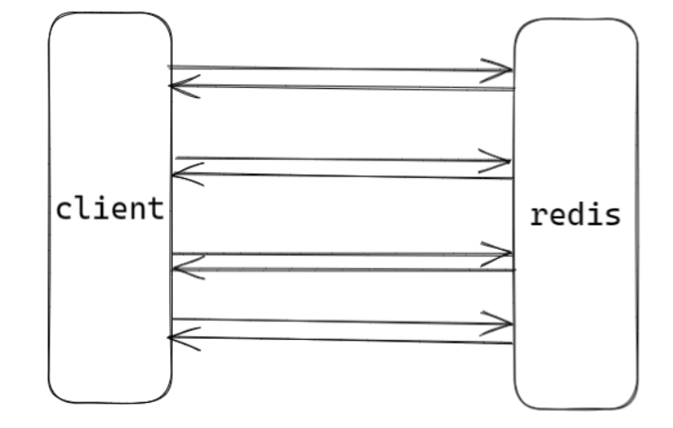
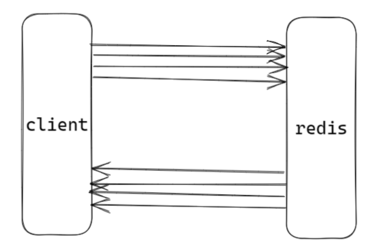
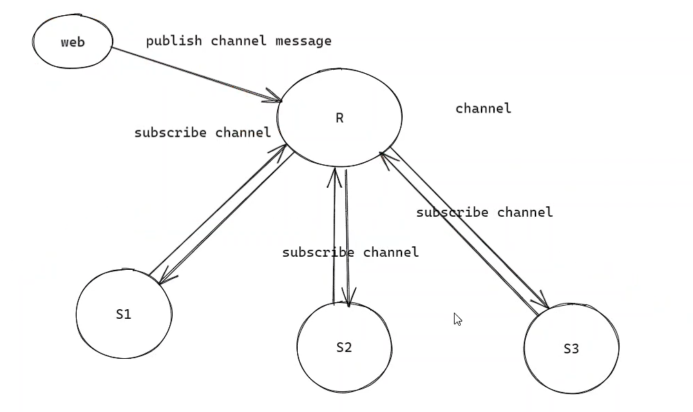
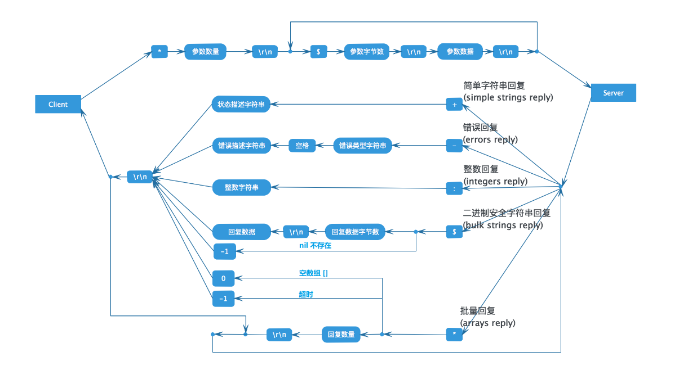

# Redis的事务和异步连接

## Redis pipeline

Redis一个类似事务的机制是pipeline。redis pipeline 是一个客户端提供的机制，而不是服务端提供的，所以pipeline 不具备事务性。



pipeline 是客户端行为，通过一次发送多次请求命令，Redis将按序进行回应，从而减少网络传输的时间，如下所示：

> 与http1.1解决的问题类似。



## Redis 的订阅发布

为了支持消息的多播机制，redis 引入了发布订阅模块。Pub/Sub的消息发布订阅机制消息不一定可达，stream 的方式确保一定可达，通常用于分布式消息队列。

发布订阅功能一般要区别命令连接重新开启一个连接。因为Redis命令连接严格遵循请求回应模式，而 pubsub 能收到 redis 主动推送的内容。所以实际项目中如果支持 pubsub 的话，需要另开一条连接用于处理发布订阅。



PubSub模式发布订阅的生产者传递过来一个消息，redis 会直接找到相应的消费者并传递过去；假如没有消费者，消息直接丢弃。假如开始有2个消费者，一个消费者突然挂掉了，另外一个消费者依然能收到消息，但是如果刚挂掉的消费者重新连上后，在断开连接期间的消息对于该消费者来说彻底丢失了。另外，redis 停机重启，pubsub 的消息是不会持久化的，所有的消息被直接丢弃。

```shell
subscribe 频道 # 订阅频道
psubscribe 频道 # 订阅模式频道,订阅多个匹配的频道
unsubscribe 频道 # 取消订阅频道
punsubscribe 频道 # 取消订阅模式频道
publish 频道 内容 # 发布具体频道或模式频道的内容
message 具体频道 内容 # 客户端收到具体频道内容
pmessage 模式频道 具体频道 内容 # 客户端收到模式频道内容
```

使用例子如下

```shell
subscribe news.it news.showbiz news.car # 订阅3个频道
psubscribe news.* # 订阅所有的 news.* 配备的频道
publish new.showbiz 'yang shuang xin'
```

> 和Redis建立连接时，基本数据结构的操作，只需要一条连接。有阻塞连接的需求（brpop），需要另外建立一个连接，需要监听发布(sub/pub)模式，也需要建立一条连接。

## Redis 的事务

事务是用户定义一系列数据库操作，这些操作视为一个完整的逻辑处理工作单元，要么全部执行，要么全部不执行，是不可分割的工作单元。在有并发连接的时候需要考虑事务。

### 事务的命令

Redis使用MULTI 开启事务，事务执行过程中，单个命令是入队列操作，直到调用 EXEC 才会一起执行。其实现是基于乐观锁，所以失败需要重试，会增加业务逻辑的复杂度。

```shell
MULTI # 开启事务 begin / start transaction
EXEC # 提交事务 commit，若被取消则事务返回 nil
DISCARD # 取消事务 rollback
WATCH # 检测 key 的变动，若在事务执行中，key 变动则取消事务。需要在事务开启前调用，乐观锁实现。
```

使用例子如下

```shell
# 事务实现 zpop
WATCH zset
element = ZRANGE zset 0 0
MULTI
ZREM zset element
EXEC

# 事务实现 加倍操作
WATCH score:10001
val = GET score:10001
MULTI
SET score:10001 val*2
EXEC
```

### lua脚本实现事务

lua 脚本也可以实现原子性。redis 中加载了一个 lua 虚拟机，用来执行 redis lua 脚本。redis的lua 脚本的执行是原子性的，当某个脚本正在执行的时候，不会有其他命令或者脚本被执行。lua 脚本当中的命令会直接修改数据状态。

> lua 脚本 mysql 存储区别：MySQL存储过程不具备事务性，所以也不具备原子性。如果使用了 lua 脚本，不需要使用上面的事务命令。

```shell
EVAL script numkeys key [key ...] arg [arg ...]  # 直接执行脚本，效率低，测试时使用
cat test1.lua | redis-cli script load --pipe # 从文件中读取 lua脚本内容
script load 'local val = KEYS[1]; return val' # 加载 lua脚本字符串 生成 sha1
script exists "b8059ba43af6ffe8bed3db65bac35d452f8115d8" # 检查脚本缓存中，是否有该 sha1 散列值的lua脚本
EVALSHA sha1 numkeys key [key ...] arg [arg ...] # 执行脚本的哈希值，线上使用
script flush # 清除所有脚本缓存
script kill # 如果当前脚本运行时间过长(死循环)杀死当前运行的脚本
```

使用例子如下：

```shell
# 直接执行
eval 'local key = KEYS[1]; local val = redis.call("get", key); redis.call("set", key, val*2); return val*2;' 1 score
# 执行哈希
script load 'local val = KEYS[1]; return val' 
EVALSHA "b8059ba43af6ffe8bed3db65bac35d452f8115d8" 1 score
```

lua脚本实现事务时，一般的步骤如下：

1. 项目启动时，建立redis连接并验证后，先加载所有项目中使用的lua脚本（script load）;
2. 项目中若需要热更新，通过redis-cli script flush清空脚本，然后可以通过订阅发布功能通知所有服务器重新加载lua脚本。
3. 若项目中lua脚本发生阻塞，可通过script kill暂停当前阻塞脚本的执行。

### Redis的事务分析

A 原子性；事务是一个不可分割的工作单位，事务中的操作要么全部成功，要么全部失败。由于redis 不支持回滚，即使事务队列中的某个命令在执行期间出现了错误，整个事务也会继续执行下去，直到将事务队列中的所有命令都执行完毕为止。

C 一致性；事务的前后，所有的数据都保持一个一致的状态，不能违反数据的一致性检测。这里的一致性是指预期的一致性而不是异常后的一致性，所以 redis 也不满足。

> redis 能确保事务执行前后的数据的完整约束，但是并不满足业务功能上的一致性。比如转账功能，一个扣钱一个加钱，可能出现扣钱执行错误，加钱执行正确，那么最终还是会加钱成功，导致系统凭空多了钱。

I 隔离性；各个事务之间互相影响的程度；redis 是单线程执行，天然具备隔离性。

D 持久性；redis 只有在 aof 持久化策略的时候，并且需要在redis.conf 中 appendfsync=always 才具备持久性。但是在实际项目中几乎不会使用 aof 持久化策略。

lua脚本是通过一个命令执行的，lua脚本中所有的命令一起执行，需要自己手动实现回滚逻辑，具备原子性。

lua脚本执行失败的话，已经成功的命令已经作用于数据库了，不具备一致性。

lua脚本执行时，redis是当线程，天然具备隔离性。

lua脚本执行时，需要aof持久化并且appendfsync=always 才具备，否则不具备。

lua 脚本的事务满足原子性和隔离性；一致性和持久性不满足。

## Redis 的异步连接

Redis是使用TCP连接进行数据的传输交互。在客户端和服务端进行发送、接收的数据，需要满足Redis的协议，才可以正确的进行交互。



> 协议实现的第一步需要知道如何界定数据包，使用的方式有长度 +  二进制流、二进制流 + 特殊分隔符 两种。

Redis协议可以自己进行实现和解析，也可以使用已经实现封装的hiredis 进行协议的处理，只需要关注上层的业务逻辑。

在进行Redis 数据的交互时，可以选择同步的方式和异步的方式。

- 同步连接方案。同步接收数据库的返回值。采用阻塞 io 来实现，优点是代码书写是同步的，业务逻辑没有割裂；缺点是阻塞当前线程，直至 redis 返回结果。通常用多个线程来实现线程池来解决效率问题。
- 异步连接方案。异步接收数据库的返回值。采用非阻塞 io 来实现，优点是没有阻塞当前线程，redis 没有返回，依然可以往 redis 发送命令；缺点是代码书写是异步的（回调函数），业务逻辑割裂，可以通过Reactor网络模型/协程解决。配合 redis6.0 以后的 io 多线程、异步连接池，能更好解决应用层的**大量并发请求**数据访问性能。

### 异步Redis连接的实现

有时候，用户除了需要与项目网络层兼容，同时需要考虑与项目中数据结构契合，这个时候可以考虑自己实现 redis 协议，从解析协议开始转换成项目中的数据结构。

大多数时候，可以使用官方提供的hiredis进行Redis协议的解析。hiredis 不仅提供异步连接方式时，还提供可以替换 IO 检测的接口。在使用时关键替换 `addRead`，`delRead` ，`addWrite`，`delWrite`，`cleanup`，`scheduleTimer`，这几个检测接口，而其他 io 操作，比如 `connect`，`read`，`write`，`clos`e等都交由 hiredis 来处理。

用户可以使用当前项目的网络框架来替换相应的操作，提供连接建立成功以及断开连接的回调，从而实现跟项目网络层兼容的异步连接方案。

基于Reactor实现异步连接，有3个步骤：

1. 与Redis建立连接，使用非阻塞IO。
    - 创建socket，设置fd为非阻塞。
    - connect(fd, &addr, &len); 返回-1 且error = EINPROGRESS时，fd注册到epoll的写事件中。
    - 如果建立成功，fd的写事件进行响应，注销写事件。
2. 向Redis发送数据，事件Redis协议组装数据，通过TCP发送出去。
    - int n = write(fd, buf, sz); 如果n < sz && n != -1 或者 n = -1 && errno = EWOULDBLOCK时，说明fd的发送缓冲区已满。
    - 发送缓冲区满，需要注册写事件，当写事件触发，继续write(fd, buf, sz); 发送数据，发送完毕，注销写事件。
    - 注册读事件。
3. 读取Redis的返回值，进行回调函数的处理。
    - 读事件触发，int n = read(fd, buf, sz);
    - 读取到TCP数据后，根据Redis协议，分割数据包。
    - 使用Redis协议解析出最终数据，调用回调函数。

```c++
// Reactor网络模型
struct event_s {
    int fd;
    reactor_t* r;
    buffer_t* in;
    buffer_t* out;
    event_callback_fn read_fn;
    event_callback_fn write_fn;
    error_callback_fn error_fn;
};

typedef struct reactor_s {
    int epfd;
    int listenfd;
    int stop;
    event_t* events;
    int iter;
    struct epoll_event fire[MAX_EVENT_NUM];
} reactor_t;

static reactor_t* R;

char* rtype[] = { "^o^","STRING","ARRAY","INTEGER","NIL", "STATUS","ERROR","DOUBLE","BOOL","MAP", "SET","ATTR", "PUSH", "BIGNUM",  "VERB",};

// 打印Redis返回值的回调函数
void dumpReply(struct redisAsyncContext* c, void* r, void* privdata) {
    redisReply* reply = (redisReply*)r;
    switch (reply->type) {
    case REDIS_REPLY_STATUS:
    case REDIS_REPLY_STRING:
        printf("[req = %s]reply:(%s)%s\n", (char*)privdata, rtype[reply->type], reply->str);
        break;
    case REDIS_REPLY_NIL:
        printf("[req = %s]reply:(%s)nil\n", (char*)privdata, rtype[reply->type]);
        break;
    case REDIS_REPLY_INTEGER:
        printf("[req = %s]reply:(%s)%lld\n", (char*)privdata, rtype[reply->type], reply->integer);
        break;
    case REDIS_REPLY_ARRAY:
        printf("[req = %s]reply(%s):number of elements=%lu\n", (char*)privdata, rtype[reply->type], reply->elements);
        for (size_t i = 0; i < reply->elements; i++) {
            printf("\t %lu : %s\n", i, reply->element[i]->str);
        }
        break;
    case REDIS_REPLY_ERROR:
        printf("[req = %s]reply(%s):err=%s\n", (char*)privdata, rtype[reply->type], reply->str);
        break;
    default:
        printf("[req = %s]reply(%s)\n", (char*)privdata, rtype[reply->type]);
        break;
    }
}
// 异步连接的回调函数
void connectCallback(const redisAsyncContext* c, int status) {
    if (status != REDIS_OK) {
        printf("Error: %s\n", c->errstr);
        stop_eventloop(R);
        return;
    }
    printf("Connected...\n");
    redisAsyncCommand((redisAsyncContext*)c, dumpReply,
        "hmset role:10001",
        "hmset role:10001 name mark age 31 sex male");
    int a = 10;
    redisAsyncCommand((redisAsyncContext*)c, dumpReply, "hgetall role:10001", "hgetall role:10001");
    // ....
}
// 异步断开连接的回调函数
void disconnectCallback(const redisAsyncContext* c, int status) {
    if (status != REDIS_OK) {
        printf("Error: %s\n", c->errstr);
        stop_eventloop(R);
        return;
    }

    printf("Disconnected...\n");
    stop_eventloop(R);
}

int main(int argc, char** argv) {
    R = create_reactor(); // 创建Reactor网络模型
    redisAsyncContext* c = redisAsyncConnect("127.0.0.1", 6379);// 异步连接
    if (c->err) {
        /* Let *c leak for now... */
        printf("Error: %s\n", c->errstr);
        return 1;
    }
    redisAttach(R, c); // 设置IO接口
    // 设置连接和断开的回调函数
    redisAsyncSetConnectCallback(c, connectCallback);
    redisAsyncSetDisconnectCallback(c, disconnectCallback);
    // Reactor的事件循环
    eventloop(R);
    release_reactor(R);
    return 0;
}
```

设置自定义的IO接口

```c++
typedef struct {
    event_t e; // Reactor连接
    int mask;   // 事件类型
    redisAsyncContext* ctx; // Hiredis提供的上下文
} redis_event_t;

static void redisReadHandler(int fd, int events, void* privdata) {
    ((void)fd);
    ((void)events);
    printf("redisReadHandler %d\n", fd);
    event_t* e = (event_t*)privdata;
    redis_event_t* re = (redis_event_t*)(char*)e;
    redisAsyncHandleRead(re->ctx);
}

static void redisWriteHandler(int fd, int events, void* privdata) {
    ((void)fd);
    ((void)events);
    event_t* e = (event_t*)privdata;
    redis_event_t* re = (redis_event_t*)(char*)e;
    redisAsyncHandleWrite(re->ctx);
}

static void redisEventUpdate(void* privdata, int flag, int remove) {
    redis_event_t* re = (redis_event_t*)privdata;
    reactor_t* r = re->e.r;
    int prevMask = re->mask;
    int enable = 0;
    if (remove) {
        if ((re->mask & flag) == 0)
            return;
        re->mask &= ~flag;
        enable = 0;
    } else {
        if (re->mask & flag)
            return;
        re->mask |= flag;
        enable = 1;
    }
    int fd = re->ctx->c.fd;
    if (re->mask == 0) {
        del_event(r, &re->e);
    } else if (prevMask == 0) {
        add_event(r, re->mask, &re->e);
    } else {
        if (flag & EPOLLIN) {
            enable_event(r, &re->e, enable, 0);
        } else if (flag & EPOLLOUT) {
            enable_event(r, &re->e, 0, enable);
        }
    }
}

static void redisAddRead(void* privdata) {
    redis_event_t* re = (redis_event_t*)privdata;
    re->e.read_fn = redisReadHandler;
    redisEventUpdate(privdata, EPOLLIN, 0);
}

static void redisDelRead(void* privdata) {
    redis_event_t* re = (redis_event_t*)privdata;
    re->e.read_fn = 0;
    redisEventUpdate(privdata, EPOLLIN, 1);
}

static void redisAddWrite(void* privdata) {
    redis_event_t* re = (redis_event_t*)privdata;
    re->e.write_fn = redisWriteHandler;
    redisEventUpdate(privdata, EPOLLOUT, 0);
}

static void redisDelWrite(void* privdata) {
    redis_event_t* re = (redis_event_t*)privdata;
    re->e.write_fn = 0;
    redisEventUpdate(privdata, EPOLLOUT, 1);
}

static void redisCleanup(void* privdata) {
    redis_event_t* re = (redis_event_t*)privdata;
    reactor_t* r = re->e.r;
    del_event(r, &re->e);
    hi_free(re);
}
// 设置自定义 IO 接口
static int redisAttach(reactor_t* r, redisAsyncContext* ac) {
    redisContext* c = &(ac->c);
    redis_event_t* re;

    /* Nothing should be attached when something is already attached */
    if (ac->ev.data != NULL)
        return REDIS_ERR;

    /* Create container for ctx and r/w events */
    re = (redis_event_t*)hi_malloc(sizeof(*re));
    if (re == NULL)
        return REDIS_ERR;

    re->ctx = ac;
    re->e.fd = c->fd;
    re->e.r = r;
    // dont use event buffer, using hiredis's buffer
    re->e.in = NULL;
    re->e.out = NULL;
    re->mask = 0;

    ac->ev.addRead = redisAddRead;
    ac->ev.delRead = redisDelRead;
    ac->ev.addWrite = redisAddWrite;
    ac->ev.delWrite = redisDelWrite;
    ac->ev.cleanup = redisCleanup;
    ac->ev.data = re;
    return REDIS_OK;
}
```

## 总结

异步连接时，需要把Redis连接融合入已有的Reactor网络模型进行管理。管理的对象需要有hiredis事件对象、reactor事件对象，复用项目中的Reactor事件循环进行事件的控制。hiredis提供了事件操作接口，我们只需要适配这些事件操作的接口，让IO自己来做。（不同的网络库不同的平台，对事件操作的接口可能并不一致）