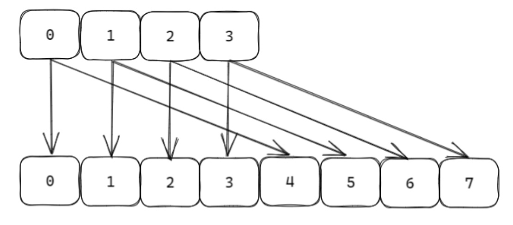

# Redis的线程和数据结构

## Redis 的线程

Redis 并不是单线程的程序，是具有多个线程进行不同的业务处理，主要的线程如下：

- redis-server 用于命令处理、网络事件监听。
- bio_close_file 用于异步关闭大文件。
- bio_aof_fsync 用于aof 数据刷盘。
- bio_lazy_free 用于异步清理大块内存。
- io_thd_* 用于IO多线程处理。
- jemalloc_bg_thd 为jemalloc 后台线程。

常常说到的Redis 的单线程，其实是指Redis的命令处理都在一个线程中。单线程的局限性是不能有**耗时**的操作，比如CPU密集运算、阻塞IO处理等，耗时的操作会极大的影响Redis的响应性能。

Redis面对大量客户端的连接并发的数据处理，是会存在IO密集型和CPU密集型的数据处理的，为了达到单线程的命令处理，Redis进行了一系列的性能优化。优化的手段有：

1. IO密集型，采用多进程/线程处理。
    - 对于磁盘IO使用fork子进程，在子进程进行数据的持久化，进行异步的刷盘。
    - 对于大量客户端造成的网络IO密集，在请求数据或返回数据量比较大时，开启IO多线程处理。
2. CPU密集型，采用分治的方式进行处理。
    - 同一种抽象的数据结构（string/list/hash/set/zset），底层使用不同的数据结构进行存储，数据量从小变大时，会进行数据结构的切换。
    - 渐进式的数据迁移，在扩容缩容时，不会一次性全部拷贝数据，会逐渐的进行数据迁移。

Redis 的命令处理使用单线程，而不使用多线程，有以下的几个原因：

1. 如果使用多线程进行处理，就需要进行加锁，由于抽象对象类型数据结构（string/list/hash/set/zset）底层是由多个不同的数据结构实现，加锁会十分复杂，并且不同的数据结构操作的耗时也有区别，锁的粒度也不好控制。
2. 多线程会面临频繁的CPU上下文切换，会抵消多线程的优势。线程切换需要把线程的数据保存在内核态，才能进行线程的切换，这需要多次的系统调用、内核态和用户态的切换，造成性能的降低。

## Redis 单线程命令处理

Redis是使用单线程的命令处理，但是其处理速度非常快，得益于其优秀的数据结构设计和优化手段。

1. 内存数据库。Redis 的处理速度快，首先是因为它是内存数据库，数据都在内存中，读取、操作数据的速度非常快。
2. hashttable的数据组织方式。Redis的存储的KV键值对是使用hashtable进行数据组织，O(1)的时间复杂度保证了速度。
3. 渐进式rehash。由于使用hashtable进行数据组织，在扩容和缩容时如果一次进行全量的数据拷贝，会造成CPU耗时运算。Redis使用分治的方法，把reflash分摊到每一个操作步骤中，每步操作reflash一个元素到新数组中；并且还有定时器，在CPU空闲时，以100为步长最多reflash 1ms进行数据迁移。
4. 数据结构高效。同一个对象类型按照不同的长度，采用不同的数据结构实现，并且可以进行实时的数据结构切换，保证了执行效率和空间占用之间的平衡。
5. 高效的Reactor网络模型。在IO等耗时阻塞的操作，都由其他IO线程进行处理。

## Resis 多线程的IO处理

Redis采用Reactor的网络模型，对客户端的连接、读取数据、解码数据、编码数据、发送数据都由分发到不同的IO多线程进行处理，仅仅单线程执行命令的计算操作。


客户端的连接，监听listenfd的处理流程如下：

1. 读事件回调:acceptTcpHandler
2. acceptCommonHandler
3. creatClient

客户端的连接，处理流程如下：

1. 读事件回调readQueryFromClient，进行分割数据包并处理processInputBuffer----分割数据包processInIineBuffer/processMultibulkBuffer，处理数据包processCommandAndResetClient。
2. 写数据到bbuffer中addReply。
3. 写数据到socket中writeToClient。
4. 写事件回调sendReplyToClient。只有写缓存满，无法一次性发送数据时，向epoll注册可读事件，触发写回调函数。

完整的客户端命令处理流程如下：

1. readQueryFromClient。
2. 从socket中read数据 connRead。
3. 解码decode数据在networking.c中processInIineBuffer/processMultibulkBuffer。
4. 单线程命令处理计算compute在server.c中 processCommand。
5. 回复客户端数据send在writeToClient。


> 开启IO多线程处理，需要redis.conf中配置io-thrrads number 数量，同时 io-thread-do-reads yes 开启。如果客户端连接较少，在networking.c 中stopThreadedIOIfneeded会自动关闭IO多线程。handleClientsWithPendingReadsUsingThreads(*void*) 函数中的item_id会指定IO任务分发到哪一个IO线程。

## Redis 的数据结构

> 使用vscode查看源码，可以服务器上安装bear、clangd ，然后使用 bear -- make 进行编译，编译后生成数据库，vscode安装clangd插件后读取编译数据库，可以进行精准的代码跳转。

Redis数据库存储最外层的struct redisDb 数据库，有16个数据库，默认KV存储在是0号数据库，可以使用`select nubmer`进行数据库的切换。

```c++
/* Redis database representation. There are multiple databases identified
 * by integers from 0 (the default database) up to the max configured
 * database. The database number is the 'id' field in the structure. */
typedef struct redisDb {
    kvstore *keys;              /* The keyspace for this DB */
    kvstore *expires;           /* Timeout of keys with a timeout set */
    ebuckets hexpires;          /* Hash expiration DS. Single TTL per hash (of next min field to expire) */
    dict *blocking_keys;        /* Keys with clients waiting for data (BLPOP)*/
    dict *blocking_keys_unblock_on_nokey;   /* Keys with clients waiting for
                                             * data, and should be unblocked if key is deleted (XREADEDGROUP).
                                             * This is a subset of blocking_keys*/
    dict *ready_keys;           /* Blocked keys that received a PUSH */
    dict *watched_keys;         /* WATCHED keys for MULTI/EXEC CAS */
    int id;                     /* Database ID */
    long long avg_ttl;          /* Average TTL, just for stats */
    unsigned long expires_cursor; /* Cursor of the active expire cycle. */
    list *defrag_later;         /* List of key names to attempt to defrag one by one, gradually. */
} redisDb;
```

redis 中 KV 组织是通过字典（散列表）来实现的，Value的抽象hash结构当节点超过512 个或者单个字符串长度大于 64 时，hash 结构采用字典实现。字符串key经过 hash 函数运算得到 64 位整数（相同字符串多次通过 hash 函数得到相同的 64 位整数），64位的整数对2^n取余转化为2^n-1的位运算，按照哈希值存入散列表中。

> 散列表一般是 hash函数+链表数组组成，计算出的hash值，如果数组的长度是2^n，意味着hash(key) % size = hash(key) & (size-1)，达到性能优化的效果。


```c++
typedef struct dictEntry {
    void *key;
    void *val;
    struct dictEntry *next;
} dictEntry;

struct dict {
    dictType *type;
    dictEntry **ht_table[2]; // 哈希表存储KV对，两个哈希表目的是扩容缩容时渐进式hash
    unsigned long ht_used[2];
    long rehashidx; /* rehashing not in progress if rehashidx == -1 */
    /* Keep small vars at end for optimal (minimal) struct padding */
    unsigned pauserehash : 15; /* If >0 rehashing is paused */
    unsigned useStoredKeyApi : 1; /* See comment of storedHashFunction above */
    signed char ht_size_exp[2]; /* exponent of size. (size = 1<<exp) */
    int16_t pauseAutoResize;  /* If >0 automatic resizing is disallowed (<0 indicates coding error) 用于安全遍历 */
    void *metadata[];
};
```

按照抽屉原理，64位整数远大于数组的长度，比如数组长度为 4，那么 1、5、9、1+4n 都是映射到1号位数组；当数据量大于数组的长度时，就会大概率会发生哈希冲突.

> 抽屉原理  : n+1个苹果放在 n 个抽屉中，苹果最多的那个抽屉至少有 2 个苹果.

衡量哈希冲突的激烈程度可以使用负载因子，负载因子 = used / size；used 是数组存储元素的个数，size 是数组的长度。负载因子越小，冲突越小；负载因子越大，冲突越大。

### 扩容和缩容

redis 的负载因子是 1，如果负载因子 > 1，则会发生扩容，避免哈希冲突加剧。扩容的规则是翻倍。如果正在 fork （在 rdb、aof 复写以及 rdb-aof 混用情况下）时，会阻止扩容。但是此时若负载因子 > 5，索引效率大大降低， 则马上扩容。



如果负载因子 < 0.1，则会发生缩容，节约内存空间；缩容的规则是恰好包含used 的 2^n 次方。例如此时数组存储元素个数为 9，恰好包含该元素2^4，也就是 16。（最小4个元素）


```c++
/* This method traverses through kvstore dictionaries and triggers a resize.
 * It first tries to shrink if needed, and if it isn't, it tries to expand. */
// 扩容和缩容
void kvstoreTryResizeDicts(kvstore *kvs, int limit) {
    if (limit > kvs->num_dicts)
        limit = kvs->num_dicts;

    for (int i = 0; i < limit; i++) {
        int didx = kvs->resize_cursor;
        dict *d = kvstoreGetDict(kvs, didx);
        if (d && dictShrinkIfNeeded(d) == DICT_ERR) {
            dictExpandIfNeeded(d);
        }
        kvs->resize_cursor = (didx + 1) % kvs->num_dicts;
    }
}
```

### 渐进式哈希

当扩容和缩容造成映射规则的改变，就需要rehash，重新分配散列表中的元素。rehash以数组的槽位为单位进行rehash, 每一个槽位对应着一个链表，链接着多个冲突的元素。

渐进式哈希就是为了因对散列表中存储了大量的元素，rehash带来耗时操作，具体实现为准备两个dict，ht[0]没有发生rehash时直接使用，如果发生rehash,则存储扩容和缩容前是数据。ht[1]没有发生rehash不会使用，如果发生rehash,则存储新数据和从ht[0]迁移过来的数据。

当 hashtable 中的元素过多的时候，不能一次性 rehash 到ht[1]，这样会长期占用 redis，其他命令得不到响应，所以需要使用渐进式 rehash。渐进式哈希的步骤是：

1. 将 ht[0] 中的元素重新经过 hash 函数生成 64 位整数，再对ht[1] 长度进行取余，从而映射到 ht[1]。
2. 分治的思想，将 rehash 分到之后的每步增删改查的操作当中，增删改查过程中携带一次rehash。
3. 在定时器中，最大执行一毫秒 rehash ，每次步长 100 个数组槽位。

所以处于渐进式 rehash 阶段时不会发送扩容和缩容。

![ht_table[2] ](./Redis3.assets/image-20241003141116663.png)

```c++
/* This function performs just a step of rehashing, and only if hashing has
 * not been paused for our hash table. When we have iterators in the
 * middle of a rehashing we can't mess with the two hash tables otherwise
 * some elements can be missed or duplicated.
 *
 * This function is called by common lookup or update operations in the
 * dictionary so that the hash table automatically migrates from H1 to H2
 * while it is actively used. */
// 增删改查渐进式rehash 
static void _dictRehashStep(dict *d) {
    if (d->pauserehash == 0) dictRehash(d,1);
}

/* Our hash table implementation performs rehashing incrementally while
 * we write/read from the hash table. Still if the server is idle, the hash
 * table will use two tables for a long time. So we try to use threshold_us
 * of CPU time at every call of this function to perform some rehashing.
 *
 * The function returns the amount of microsecs spent if some rehashing was
 * performed, otherwise 0 is returned. */
// 定时器 CPU 空闲时进行rehash
uint64_t kvstoreIncrementallyRehash(kvstore *kvs, uint64_t threshold_us) {
    if (listLength(kvs->rehashing) == 0)
        return 0;

    /* Our goal is to rehash as many dictionaries as we can before reaching threshold_us,
     * after each dictionary completes rehashing, it removes itself from the list. */
    listNode *node;
    monotime timer;
    uint64_t elapsed_us = 0;
    elapsedStart(&timer);
    while ((node = listFirst(kvs->rehashing))) {
        dictRehashMicroseconds(listNodeValue(node), threshold_us - elapsed_us);
        elapsed_us = elapsedUs(timer);
        if (elapsed_us >= threshold_us) {
            break;  /* Reached the time limit. */
        }
    }
    return elapsed_us;
}
```

### 大KEY

在 redis 实例中形成了很大的对象，比如一个很大的 hash 或很大的 zset，这样的对象在扩容的时候，会一次性申请更大的一块内存，这也可能会导致卡顿；如果这个大 key 被删除，内存会一次性回收，卡顿现象也会再次产生。如果观察到 redis 的内存大起大落，极有可能因为大 key 导致的。

```shell
# 每隔0.1秒 执行100条scan命令扫描大KEY
redis-cli -h 127.0.0.1 --bigkeys -i 0.1
```

### 数据的遍历

Redis遍历数据使用scan 命令，使用方法如下

```shell
scan cursor [MATCH pattern] [COUNT count] [TYPE]
scan 0 match * count 1 # 散列表数组下标0的元素
scan 2 match * count 1 # 散列表数组下标2的元素
```

scan 要达到的目的是从 scan 开始那刻起 redis 已经存在的数据进行遍历，不会重复和遗漏（例外是scan过程中两次缩容可能造成数据重复）。scan 采用高位进位加法的遍历顺序，由于 rehash 后的槽位在遍历顺序上是相邻的，即使扩容和缩容造成映射算法发生改变，但是使用高位进位累加的算法，可以对scan那刻起已经存在数据的遍历不会出错。


### 数据的删除

Redis可以对key设置过期时间，当时间到时会自动删除。

```shell
# 设置过期时间
expire key seconds
pexpire key milliseconds
# 查看剩余时间
ttl key
pttl key
```

Redis的删除key和rehash一样惰性删除，分布在每一个命令增删改查操作时检查 key 是否过期，若过期删除 key，再进行命令操作，并且也在定时器检查库中指定个数（25）个 key进行删除。

```c++
// expire 删除key
void activeExpireCycle(int type) {
    /* Adjust the running parameters according to the configured expire
     * effort. The default effort is 1, and the maximum configurable effort
     * is 10. */
    unsigned long
    effort = server.active_expire_effort-1, /* Rescale from 0 to 9. */
    config_keys_per_loop = ACTIVE_EXPIRE_CYCLE_KEYS_PER_LOOP +
                           ACTIVE_EXPIRE_CYCLE_KEYS_PER_LOOP/4*effort,
............................
}
/* Helper function for the activeExpireCycle() function.
 * This function will try to expire the key that is stored in the hash table
 * entry 'de' of the 'expires' hash table of a Redis database.
 *
 * If the key is found to be expired, it is removed from the database and
 * 1 is returned. Otherwise no operation is performed and 0 is returned.
 *
 * When a key is expired, server.stat_expiredkeys is incremented.
 *
 * The parameter 'now' is the current time in milliseconds as is passed
 * to the function to avoid too many gettimeofday() syscalls. */
// 定时器删除key
int activeExpireCycleTryExpire(redisDb *db, dictEntry *de, long long now) {
    long long t = dictGetSignedIntegerVal(de);
    if (now > t) {
        enterExecutionUnit(1, 0);
        sds key = dictGetKey(de);
        robj *keyobj = createStringObject(key,sdslen(key));
        deleteExpiredKeyAndPropagate(db,keyobj);
        decrRefCount(keyobj);
        exitExecutionUnit();
        return 1;
    } else {
        return 0;
    }
}
```

### Redis的跳表

 redis 需要实现 zrange 以及 zrevrange 功能，使用跳表（多层级有序链表）结构用来实现有序集合。跳表空间换时间的结构，每隔一个节点生成一个层级节点。跳表模拟二叉树结构，是可以二分查找的数据结构，最底层包含所有的元素。查询时通过O(logN)的时间复杂度快速找到边界，在对底层找到范围内的所有的元素，以此达到搜索时间复杂度为O(logN)。（增删改查时间复杂度都是O(logN)）

从节约内存出发，redis 考虑牺牲一点时间复杂度让跳表结构更加变扁平，就像二叉堆改成四叉堆结构；并且 redis 还限制了跳表的最高层级为 32。

```c++
typedef struct zskiplistNode {
    sds ele;
    double score;
    struct zskiplistNode *backward;
    struct zskiplistLevel {
        struct zskiplistNode *forward;
        unsigned long span;
    } level[];
} zskiplistNode;

typedef struct zskiplist {
    struct zskiplistNode *header, *tail;
    unsigned long length;
    int level;  // 最高层
} zskiplist;

typedef struct zset {
    dict *dict; // 帮助快速索引到节点
    zskiplist *zsl;
} zset;
```


