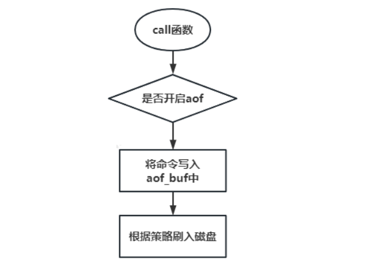
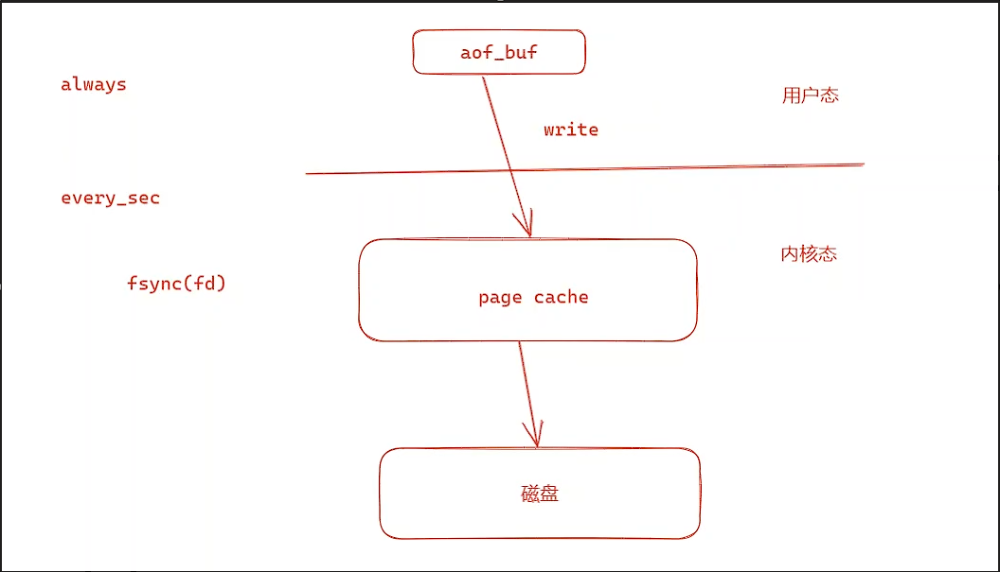
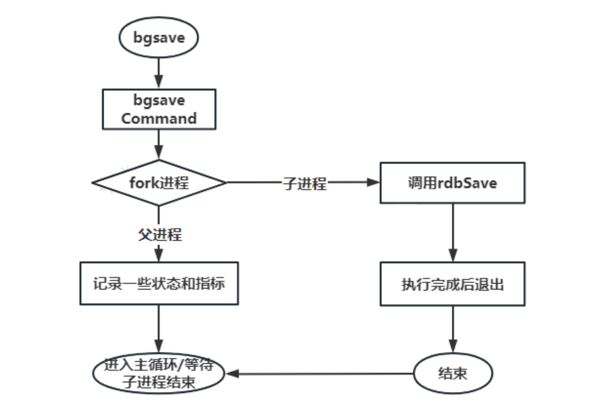
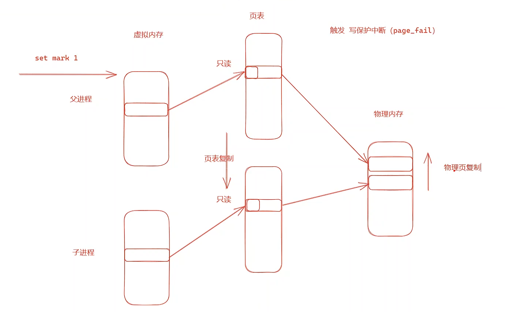
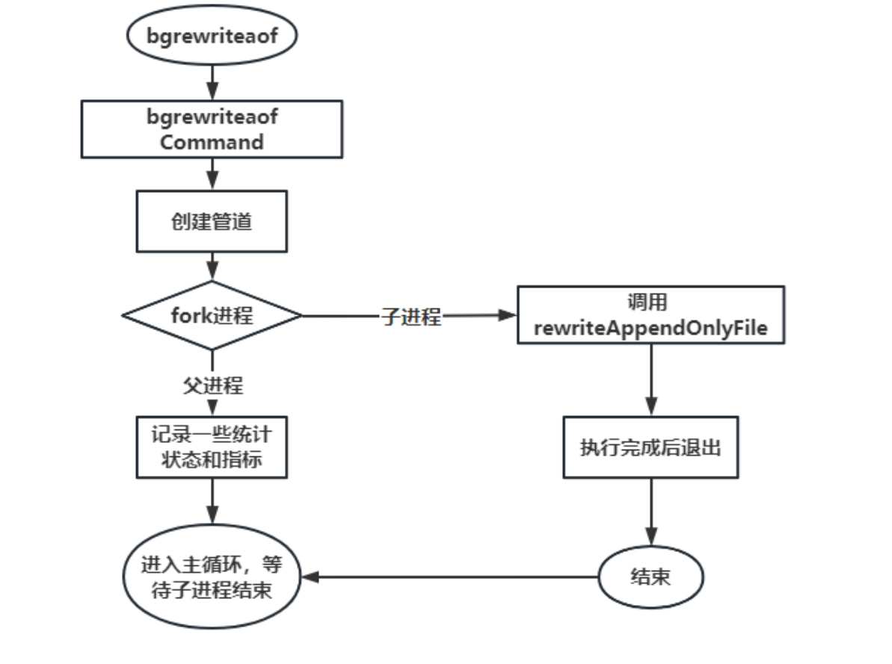
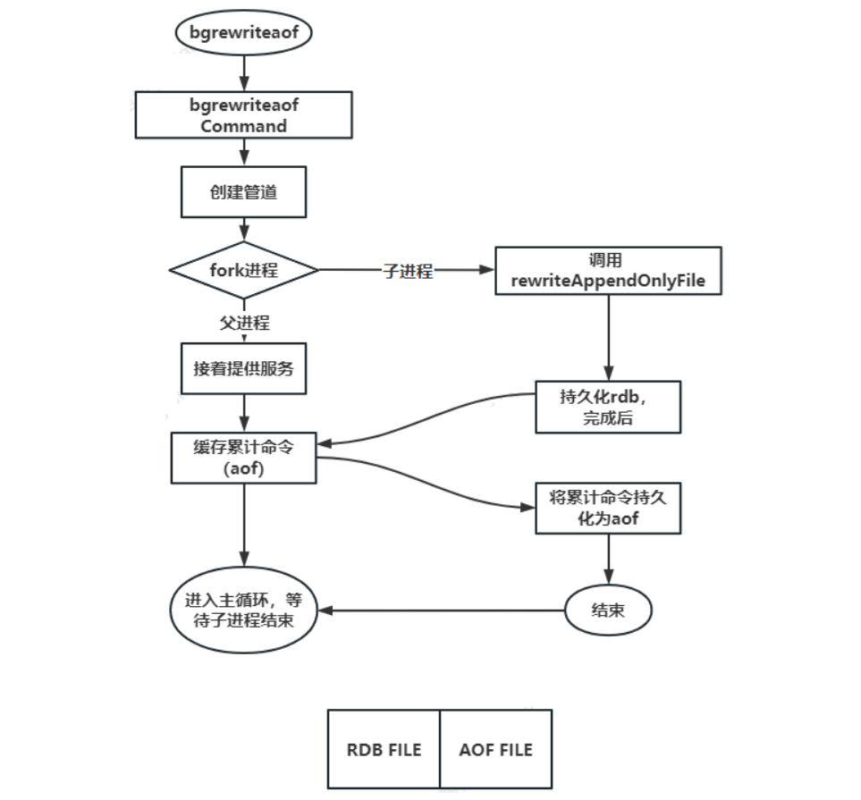

# Redis 的持久化

## 持久化

redis 的数据全部在内存中，如果突然宕机，数据就会全部丢失，因此需要持久化来保证 Redis 的数据不会因为故障而丢失，redis 重启的时候可以重新加载持久化文件来恢复数据。

### 淘汰策略

Redis时内存数据库，内存是十分宝贵的操作系统资源，所以Redis可以使用的内存不能无限增长。在Redis内存达到最大值时，需要内存淘汰策略进行释放内存。`expire/pexpire`命令可以配置每一个KV的失效时间，避免KV不会一致占用Redis的内存。

Redis在`redis.conf`的配置文件中，`maxmemory`配置Redis的最大使用内存，当达到这个内存时，按照`maxmemory-policy`配置淘汰策略进行内存的释放，释放内存时按照`maxmemory-samples`数量进行数据的采样。

Redis的淘汰策略分为以下三种：

1. 在过期key中淘汰。`volatile-lru`最长时间没有使用的KV淘汰；`volatile-lfu` 随机采样一定数量的KV按照最少使用次数进行淘汰；`volatile-ttl`按照最近要过期的KV淘汰；`volatile-random` 进行随机淘汰。
2. 在所有的key中淘汰。`allkeys-lru` 所有的KV最长时间没有使用的被淘汰；`allkeys-lfu`所有的KV最少使用次数进行淘汰；`allkeys-random`所有的KV随机淘汰。
3. 禁止淘汰。`no-eviction`内存到达最大的上限时，不淘汰数据，给客户端返回错误码，是默认的策略。

```c++
struct redisObject {
    unsigned type:4;
    unsigned encoding:4;
    // LRU_BITS 24
    unsigned lru:LRU_BITS; /* LRU time (relative to global lru_clock) or
                            * LFU data (least significant 8 bits frequency
                            * and most significant 16 bits access time). */
    int refcount;
    void *ptr;
};
```

> LFU data (least significant 8 bits frequency and most significant 16 bits access time) 8位记录频率，意味着最大只能记录255次。

### 持久化方案

Redis的数据全部在内存中，如果突然宕机，数据就会全部丢失，因此需要持久化来保证Redis的数据不会因为故障而丢失。在Redis重启的时候可以重新加载持久化文件来回复数据。

#### AOF

append only file，aof 日志存储的是 Redis 服务器的顺序指令序列，aof 日志只记录对内存修改的指令记录。

AOF会把所有的Redis处理的命令按照Redis协议写入到文件中，恢复的时候重通过重放（replay）aof 日志中指令序列来恢复 Redis 当前实例的内存数据结构的状态。



aof 有3个模式，`always` 模式在主线程写数据，并且刷数据 `fsync(fd) `到磁盘里才结束；`eyery_sec`模式另外起一个线程`bio_fsync_aof`进行写数据，并且每一秒才 `fsync(fd) `刷数据到磁盘中；`no`模式不使用aof。



数据写入内核态的page cache，即使Redis异常退出，数据也是安全的，内核层会调用fsync写入磁盘，但是断电无法保证数据安全。

> redis 协议使用\r\n 进行命令分割，$n 标识参数数量。

```shell
# 开启 aof
appendonly yes
# 关闭 aof复写
auto-aof-rewrite-percentage 0
# 关闭 混合持久化
aof-use-rdb-preamble no
# 关闭 rdb
save ""
```

使用AOF随着时间越长，aof 日志会越来越长，如果 redis 重启，重放整个 aof 日志会非常耗时，导致 redis 长时间无法对外提供服务。

#### RDB

基于 aof 或 aof 复写文件大的缺点，rdb 是一种快照持久化。它通过 fork 主进程，在子进程中将内存当中的数据键值对按照存储方式持久化到 rdb 文件中。rdb 存储的是经过压缩的二进制数据。



rdb模式通过fork子进程，基于内存中的所有的数据对象生成二进制文件直接进行持久化。fork进程相当于给父进程的内存做了一个快照，单为了节约内存和提高效率，实际上没有真正的拷贝内存，fork时只对页表进行复制，父子进程共用一块物理内存。

父子进程共用物理内存设置为只读属性，如果这期间父进程对数据进行修改时，触发写保护中断，这才真正的进行物理内存的复制，并重新构建映射关系。

谁修改内存，谁指向新内存。所以子进程的页表指向旧的物理内存，父进程的页表指向新的物理内存。这样做只有在写操作发生时，系统才会复制物理内存，避免了物理内存的复制事件过长导致父进程长时间阻塞。



> 虚拟内存通过页表映射到物理内存。

```shell
# 关闭 aof 同时也关闭了 aof复写
appendonly no
# 关闭 aof复写
auto-aof-rewrite-percentage 0
# 关闭 混合持久化
aof-use-rdb-preamble no
# 开启 rdb 也就是注释 save ""
# 写了多个 save 策略，只需要满足一个则开启rdb持久化, redis 默认策略如下
save 3600 1 # 3600 秒内有以1次修改
save 300 100 # 300 秒内有100次修改
save 60 10000 # # 60 秒内有10000次修改
```

若采用 rdb 持久化，一旦 redis 宕机，redis 将丢失一段时间的数据，RDB 需要经常 fork 子进程来保存数据集到硬盘上，当数据集比较大的时候，fork 的过程是非常耗时的，可能会导致 Redis 在一毫秒级内不能响应客户端的请求。如果数据集巨大并且 CPU性能不是很好的情况下，这种情况会持续1秒。

> 如果kv中的v占用大量空间就是大key，比如v是hash、zset，里面存储大量的元素，大key会导致fsync写磁盘压力大，并且fork时也会导致fork时间长，造成持久化时间过长。

#### 组合方案

aof会把所有执行过的命令保存到文件中，优点是数据可靠，丢失较少，持久化过程代价较低，写命令到文件末尾；缺点是可能有大量的冗余命令，导致数据恢复慢。

rdb的优点是数据文件小，数据恢复快；缺点是fork子进程导致数据丢失较高，并且持久化过程代价高。

##### aof-rewrite 方案

aof 持久化策略会持久化所有修改命令，里面的很多命令其实可以合并或者删除。

aof rewrite 在 aof 的基础上参考了rdb，满足一定策略则 fork 进程，然后根据内存当前内存状态，转换成一系列的 redis 命令，序列化成一个新的aof文件日志文件中。

这样可以避免同一个key历史冗余数据导致的aof文件过大，减少了aof数据恢复过慢的问题。在重写aof期间，如果有对redis的写操作，会记录到重写缓冲区，当重写aof结束后，附加到aof文件末尾，追加完毕后替换旧的 aof 日志文件，以此达到对 aof 日志瘦身的目的。虽然AOF-rewrite 也需要 fork，但是可以调节重写日志文件的频率来提高数据集的耐久度。

> aof rewrite 开启的前提是开启 aof。



```shell
# 开启 aof
appendonly yes
# 开启 aof复写
auto-aof-rewrite-percentage 100
auto-aof-rewrite-min-size 64mb
# 关闭 混合持久化
aof-use-rdb-preamble no
# 关闭 rdb
save ""
# 1. redis 会记录上次aof复写时的size，如果之后累计超过了原来的size，则会发生aof复写；
auto-aof-rewrite-percentage 100
# 2. 为了避免策略1中，小数据量时产生多次发生aof复写，策略2 中在满足策略1的前提下需要超过 64mb 才会发生aof复写；
auto-aof-rewrite-min-size 64mb
```

aof-rewrite 在 aof 基础上实现了瘦身，但是 aof 复写的数据量仍然很大时，加载依然会非常慢。

##### rdb-aof混用方案

rdb 文件小且加载快但丢失多，aof 文件大且加载慢但丢失少；混合持久化是吸取 rdb 和 aof 两者优点的一种持久化方案。

aof-rewrite 的时候实际持久化的内容是 rdb，等持久化后，持久化期间修改的数据以 aof 的形式附加到文件的尾部。

先通过fork子进程，根据内存数据生成rdb文件，在rdb持久化期间，对redis的写操作，也会记录到重写缓冲区，当rdb持久化结束后，写入到aof文件中。

> 混合持久化实际上是在 aof-rewrite 基础上进行优化，所以需要先开启 aof-rewrite。



```shell
# 开启 aof
appendonly yes
# 开启 aof复写
auto-aof-rewrite-percentage 100
auto-aof-rewrite-min-size 64mb
# 开启 混合持久化
aof-use-rdb-preamble yes
# 关闭 rdb
save ""
# save 3600 1
# save 300 100
# save 60 10000
```

## 持久化的应用

1. 数据库缓存的应用中，如MySQL 缓存方案中，redis 不开启持久化，redis 只存储热点数据，数据的依据来源于 MySQL；若某些数据经常访问需要开启持久化，此时可以选择 rdb 持久化方案，也就是允许丢失一段时间数据。
2. 如果对数据可靠性要求高，在机器性能，内存也安全 (fork 写时复制 最差的情况下 96G)的情况下，可以让 redis 同时开启 aof 和 rdb（不是混合持久化）redis 重启优先从aof 加载数据，理论上 aof 包含更多最新数据。
3. 如果只开启一种，那么建议使用混合持久化。

## 数据安全策略

1. 拷贝持久化文件是安全的。持久化文件一旦被创建， 就不会进行任何修改。 当服务器要创建一个新的持久化文件时， 它先将文件的内容保存在一个临时文件里面， 当临时文件写入完毕时， 程序才使用`rename();` 原子地用临时文件替换原来的持久化文件。
2. RDB/AOF文件备份。创建一个定期任务（cron job）， 每小时将一个 RDB/AOF 文件备份到一个文件夹， 并且每天将一个 RDB 文件备份到另一个文件夹。
3. 定时删除。确保快照的备份都带有相应的日期和时间信息， 每次执行定期任务脚本时， 使用 find 命令来删除过期的快照。
4. 多地备份。至少每天一次， 将 RDB/AOF 备份到你的数据中心之外， 或者至少是备份到你运行 Redis 服务器的物理机器之外。
