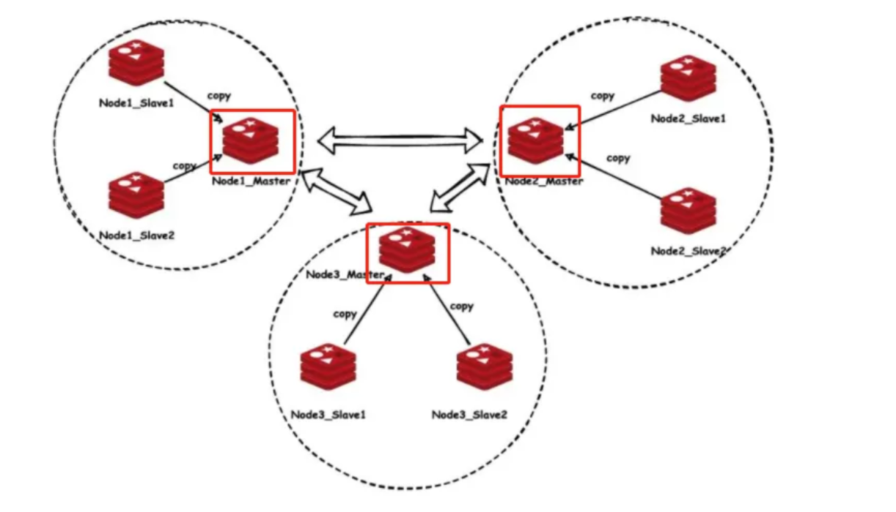

# Redis 的高可靠

高可靠性需要满足服务器对客户端的请求，在合理的时间内，有合理的回复。如果一个服务器的Redis崩溃，就会导致服务器无法处理客户端的请求，也不能及时回复客户端，造成不可用。所以高可靠需要多个节点，即使一个节点突然发生故障，也能及时切换到其他节点进行服务。高可靠的实现就需要两个操作：数据复制和节点切换。

## Redis 的主从复制

数据复制用来实现 redis 数据的可靠性的重要方式，为了防止Redis崩溃后的其他节点继续提供服务或者防止主 redis 所在磁盘损坏造成数据永久丢失，Redis使用异步的主从复制方式进行数据备份。


> 在 redis 5.0 以前使用 slaveof , redis 5.0 之后使用replicaof

```shell
# redis.conf
replicaof 127.0.0.1 7002 # 从节点主动拉取主节点的数据
info replication
```

Redis的异步复制有**全量数据同步**和**增量数据同步**方式，异步复制可能带来数据不一致的问题。

无论主库还是从库都有自己的 RUN ID，RUN ID 在一个Redis进程启动时自动产生，RUN ID 由 40 个随机的十六进制字符组成。当从库对主库初次复制时，主库将自身的 RUN ID 传送给从库，从库会将 RUN ID 保存，当从库断线重连主库时，从库将向主库发送之前保存的 RUN ID。

从库 RUN ID 和主库 RUN ID 一致，说明从库断线前复制的就是当前的主库，主库尝试执行增量同步操作。

若不一致，说明从库断线前复制的主库并不时当前的主库，则主库将对从库执行全量同步操作。

### 增量数据同步和全量同步

增量数据同步依赖**环形缓冲区**和**复制偏移量**。

环形缓冲区的本质就是一个固定长度先进先出队列。当因某些原因（网络抖动或从库宕机）从库与主库断开连接，避免重新连接后开始全量同步，在主库设置了一个环形缓冲区，该缓冲区会在从库失联期间累计主库的写操作。

主从数据库都会维护一个复制偏移量 offset ，主库向从库发送 N 个字节的数据时，将自己的复制偏移量上加 N；从库接收到主库发送的 N 个字节数据时，将自己的复制偏移量加上 N。通过比较主从偏移量得知主从之间数据是否一致，偏移量相同则数据一致，偏移量不同则数据不一致。


当从库重连，会发送自身的**复制偏移量**到主库，主库会比较主从的复制偏移量，若从库 offset 还在复制积压缓冲区中，则进行增量同步，否则，主库将对从库执行全量同步。

```shell
# redis.conf
repl-backlog-size 1mb
# 如果所有从库断开连接 3600 秒后没有从库连接，则释放环形缓冲区
repl-backlog-ttl 3600
# 环形缓冲区大小确定：disconnect_time * write_size_per_second
# disconnect_time ：从库断线后重连主库所需的平均时间（以秒为单位）。
# write_size_per_second ：主库平均每秒产生的写命令数据量。
```

## 集群

高可靠的实现的另一个要求就是节点切换。当一个节点故障，另一个备份节点可以及时进行切换并且继续提供服务，保证业务不中断。Redis提供了两种集群方案，哨兵模式和cluster集群。

### Redis 哨兵模式

哨兵模式是 Redis 可用性的解决方案；它由一个或多个 sentinel(哨兵) 实例构成 sentinel 系统，该系统可以监视任意多个主库以及这些主库所属的从库。

当主库处于下线状态，自动将该主库所属的某个从库升级为新的主库。

客户端来连接集群时，会首先连接 sentinel，通过 sentinel 来查询主节点的地址，并且通过 subscribe 监听主节点切换，然后再连接主节点进行数据交互。

当主节点发生故障时，sentinel 主动推送新的主库地址。通过这样客户端无须重启即可自动完成节点切换。


哨兵模式当中涉及多个选举流程采用的是 Raft 算法的领头选举方法的实现。

#### 哨兵模式的故障检测和转移

主要步骤有主观下线、客观下线、哨兵选举、从库选主、故障转移。

1. **主观下线**。sentinel 会以每秒一次的频率向所有节点（其他sentinel、主节点、以及从节点）发送 ping 消息，然后通过接收返回判断该节点是否下线；如果在配置指定 down-after-milliseconds 时间内则被判断为主观下线。
2. **客观下线**。当一个 sentinel 节点将一个主节点判断为主观下线之后，为了确认这个主节点是否真的下线，它会向其他 sentinel 节点进行询问，如果收到一定数量（半数以上）的已下线回复，sentinel 会将主节点判定为客观下线，并通过领头 sentinel 节点对主节点执行故障转移。
3. **故障转移**。主节点被判定为客观下线后，开始领头 sentinel 选举，需要半数以上的 sentinel 支持，选举领头 sentinel 后，开始执行对主节点故障转移。

故障转移的步骤如下：

1. 从节点中选举一个从节点作为新的主节点。
2. 通知其他从节点复制连接新的主节点。
3. 若故障主节点重新连接，将作为新的主节点的从节点。

```shell
# sentinel.cnf
# sentinel 只需指定检测主节点就行了，通过主节点自动发现从节点
sentinel monitor mymaster 127.0.0.1 6379 2
# 判断主观下线时长
sentinel down-after-milliseconds mymaster 30000
# 指定可以有多少个Redis服务同步新的主机，一般而言，这个数字越小同步时间越长，而越大，则对网络资源要求越高
sentinel parallel-syncs mymaster 1
# 指定故障切换允许的毫秒数，超过这个时间，就认为故障切换失败，默认为3分钟
sentinel failover-timeout mymaster 180000
```

#### 哨兵模式的缺点

1. 部署麻烦。需要额外部署不存储数据的哨兵节点。

2. 没有避免数据丢失问题。redis 采用异步复制的方式，意味着当主节点挂掉时，从节点可能没有收到全部的同步消息，这部分未同步的消息将丢失。如果主从延迟特别大，那么丢失可能会特别多。sentinel 无法保证消息完全不丢失，但是可以通过配置来尽量保证少丢失。
3. 无法扩展。它的致命缺点是没有数据扩展机制，不能进行横向扩展。

```shell
# 主库必须有一个从节点在进行正常复制，否则主库就停止对外写服务，此时丧失了可用性
min-slaves-to-write 1
# 这个参数用来定义什么是正常复制，该参数表示如果在10s内没有收到从库反馈，就意味着从库同步不正常；
min-slaves-max-lag 10
```

### Redis cluster集群 

cluster集群是 Redis 可用性的解决方案之一。Redis cluster 将所有数据划分为 16384（2^14 ）个槽位，每个redis 节点负责其中一部分槽位。cluster 集群是一种**去中心化**的集群方式，主节点都是对等的，并且解决了数据扩容缩容的问题。



上图集群由三个 redis 节点组成，每个节点负责整个集群的一部分数据，每个节点负责的数据多少可能不一样。这三个节点相互连接组成一个对等的集群，它们之间通过一种特殊的二进制协议交互集群信息。

当 redis cluster 的客户端来连接集群任意节点时，集群会返回一份集群的槽位配置信息给客户端，这样当客户端要查找某个 key 时，可以直接定位到目标节点。

客户端连接集群的任意一个节点，可以直接获取数据，如果数据不在该节点，将收到连接切换的命令，继而连接到目标节点。

客户端也可以直接定位（对 key 通过 crc16 进行 hash 再2^14对取余）某个具体的 key 所在节点，需要缓存槽位相关信息这样才可以准确快速地定位到相应的节点。

可能会存在客户端与服务器存储槽位的信息不一致的情况，还需要**纠正机制**，客户端收到后需要立即纠正本地的槽位映射表来实现槽位信息的校验调整。

> redis cluster 的每个节点会将集群的配置信息持久化到配置文件中，这就要求确保配置文件是可写的，而且尽量不要依靠人工修改配置文件。

#### 集群的数据迁移

redis cluster 提供了工具 redis-trib 可以让运维人员手动调整槽位的分配情况，它采用 ruby 语言开发，通过组合原生的 redis cluster 指令来实现。如A 为待迁移的源节点，B 为待迁移的目标节点。


redis 迁移的单位是槽，redis 是一个槽一个槽地进行迁移，当一个槽位正在迁移时，这个槽就处于中间过渡状态。这个槽在源节点的状态为 migrating，在目标节点的状态为importing，表示此时数据正在从源节点流向目标节点。

迁移工具 redis-trib 首先在源节点和目标节点设置好中间过渡状态，然后一次性获取源节点槽位的所有或者部分的 key 列表，再依次将 key 进行迁移。如果迁移过程中源节点出现网络故障，这两个节点依然处于中间状态，重启后，redis-trib 仍可继续迁移。

源节点对当前的 key 执行 dump 指令得到序列化内容，然后向目标节点发送 restore 指令；目标节点将源节点的序列化内容进行反序列化并将内容应用到目标节点然后返回 ok 给源节点，源节点收到后删除该key。按照这些步骤将所有待迁移的 key 进行迁移。

> 迁移过程是同步的，迁移过程中源节点的**主线程处于阻塞状态**，直到 key 被删除；redis-trib 迁移的过程是一个一个 key 来进行，如果这个key 对应 val 内容很大，将会影响到客户端的正常访问。

#### cluster集群的故障检测和转移

cluster 集群中节点分为主节点和从节点，其中主节点用于处理槽，而从节点则用于复制该主节点，并在主节点下线时，代替主节点继续处理命令请求。

故障检测的步骤如下：

1. 集群中每个节点都会定期地向集群中的其他节点发送 ping 消息，如果接收 ping 消息的节点没有在规定时间内回复 pong 消息，那么这个没有回复 pong 消息的节点会被标记为 PFAIL(probable fail)。
2. 如果在一个集群中，半数以上负责处理槽的主节点都将某个主节点 A 报告为疑似下线，那么这个主节点 A将被标记为下线（FAIL)。
3. 标记主节点 A 为下线状态的主节点会广播这条消息，其他节点（包括A节点的从节点）也会将A节点标识为 FAIL。

当从节点发现自己的主节点进入 FAIL 状态，从节点将开始对下线主节点进行故障转移：

1. 从数据最新的从节点中选举为主节点。
2. 该从节点会执行 replica no one 命令，称为新的主节点。
3. 新的主节点会撤销所有对已下线主节点的槽指派，并将这些槽全部指派给自己。
4. 新的主节点向集群广播一条 pong 消息，这条 pong 消息可以让集群中的其他节点立即知道这个节点已经由从节点变成主节点，并且这个主节点已经接管了之前下线的主节点。
5. 新的主节点开始接收和自己负责处理的槽有关的命令请求，故障转移结束。

>  由于主从异步复制在故障转移时依然存在数据丢失的问题。

#### cluster集群的使用和配置

使用cluster 需要安装hiredis-cluster库进行使用

```shell
git clone https://github.com/Nordix/hiredis-cluster.git
cd hiredis-cluster
mkdir build
cd build
cmake -DCMAKE_BUILD_TYPE=RelWithDebInfo -DENABLE_SSL=ON ..
make -j && make install
sudo ldconfig
```

##### 开启集群

可以使用一台机器的不同端口，进行模拟建立 6个Redis服务器集群。

```shell
# 创建 6 个文件夹, 存放Redis的启动配置文件
mkdir -p 7001 7002 7003 7004 7005 7006
cd 7001
vi 7001.conf
# 7001.conf 中的内容如下,端口7001
pidfile "/home/ysx/redis-data/7001/7001.pid"
logfile "/home/ysx/redis-data/7001/7001.log"
dir /home/mark/redis-data/7001/
port 7001
daemonize yes
cluster-enabled yes
cluster-config-file nodes-7001.conf 
cluster-node-timeout 15000

# 复制到其他文件夹
cp 7001/7001.conf 7002/7002.conf
cp 7001/7001.conf 7003/7003.conf
cp 7001/7001.conf 7004/7004.conf
cp 7001/7001.conf 7005/7005.conf
cp 7001/7001.conf 7006/7006.conf

# 修改端口配置
sed -i 's/7001/7002/g' 7002/7002.conf
sed -i 's/7001/7003/g' 7003/7003.conf
sed -i 's/7001/7004/g' 7004/7004.conf
sed -i 's/7001/7005/g' 7005/7005.conf
sed -i 's/7001/7006/g' 7006/7006.conf

# 启动6个Redis服务器
#!/bin/bash
redis-server 7001/7001.conf
redis-server 7002/7002.conf
redis-server 7003/7003.conf
redis-server 7004/7004.conf
redis-server 7005/7005.conf
redis-server 7006/7006.conf
```

##### 手动创建集群

```shell
# 节点会面
cluster meet ip port
# 分配槽位
cluster addslots slot
# 分配主从
cluster replicate node-id
```

##### 智能创建集群

```shell
redis-cli --cluster help
# --cluster-replicas 后面对应的参数 为 一主对应几个从数据库
redis-cli --cluster create host1:port1 ... hostN:portN --cluster-replicas <arg>
# 创建集群，每一个主节点有一个备份节点
redis-cli --cluster create 127.0.0.1:7001 127.0.0.1:7002 127.0.0.1:7003 127.0.0.1:7004 127.0.0.1:7005 127.0.0.1:7006 --cluster-replicas 1
```

进行集群测试时，可以`redis-cli -p 7001 shutdown`模拟主节点宕机，`redis-server 7001/7001.conf`模拟主节点重启。

##### 集群扩容和缩容

先添加节点，再分配槽位；先移动槽位，再删除节点。

```shell
# 启动需要扩容的两个Redis
redis-server 7007/7007.conf
redis-server 7008/7008.conf
redis-cli --cluster add-node 127.0.0.1:7008 127.0.0.1:7001 --cluster-slave --cluster-master-id d8f8470cf1698e67c5958a06b05e04f2197680c3
# 移动槽位
redis-cli --cluster reshard 127.0.0.1:7007
redis-cli --cluster reshard 127.0.0.1:7008 --cluster-from 07617e42f430fe61ce6238fd85fa1a6ff04ab486 --cluster-to 71e81275c71e8021bf080a1010d6f384cdc68e90 --cluster-slots 1000
# 删除节点 7007
redis-cli --cluster del-node 127.0.0.1:7007 71e81275c71e8021bf080a1010d6f384cdc68e90
```

