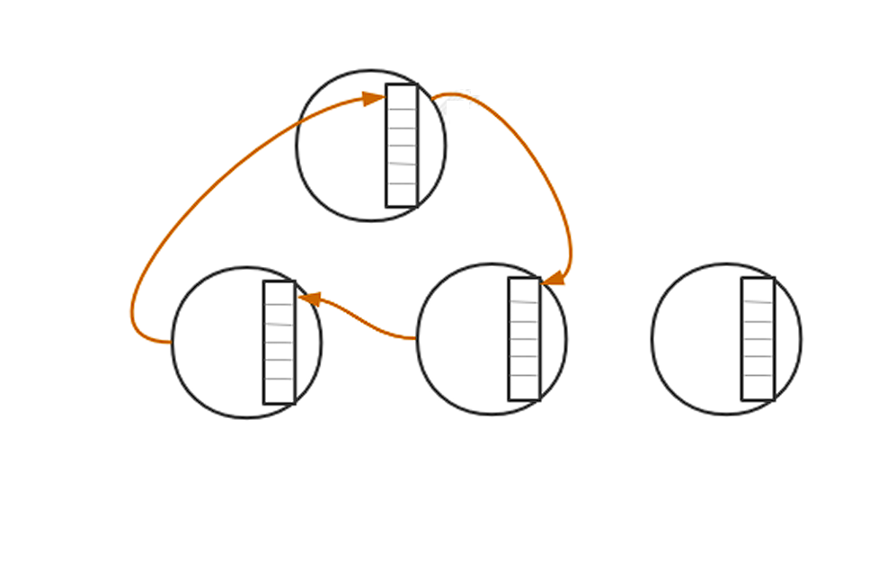
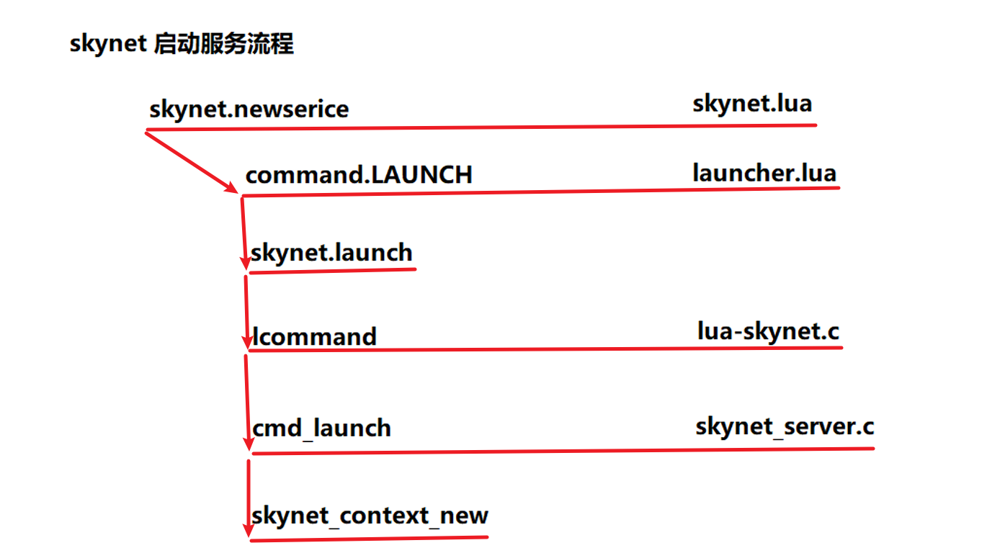
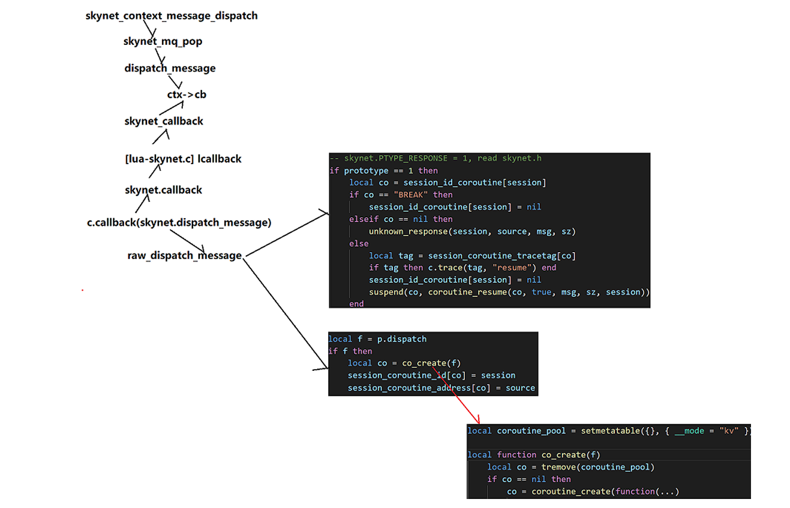
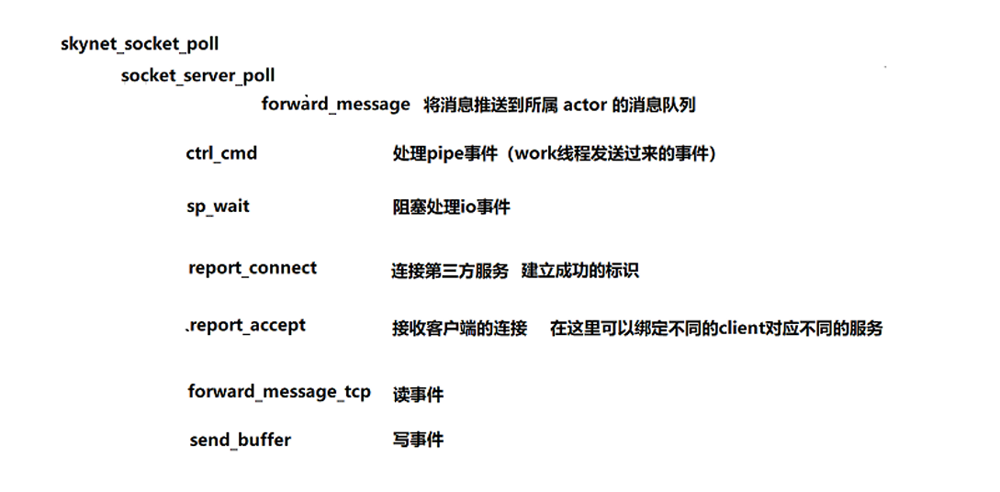
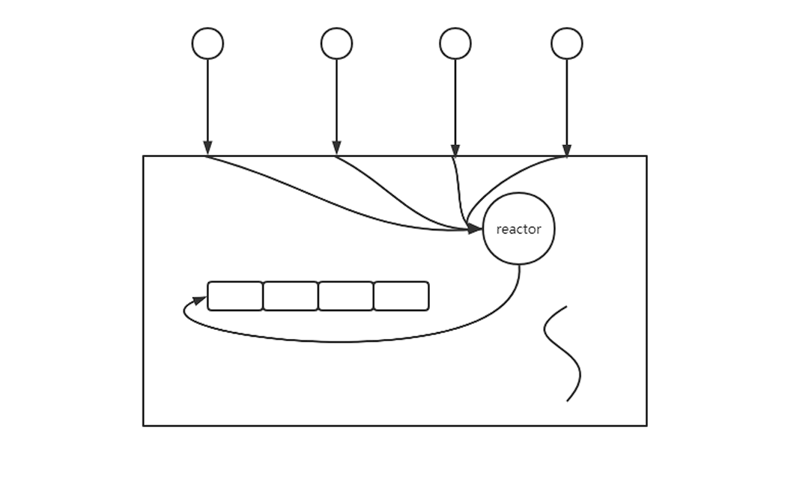
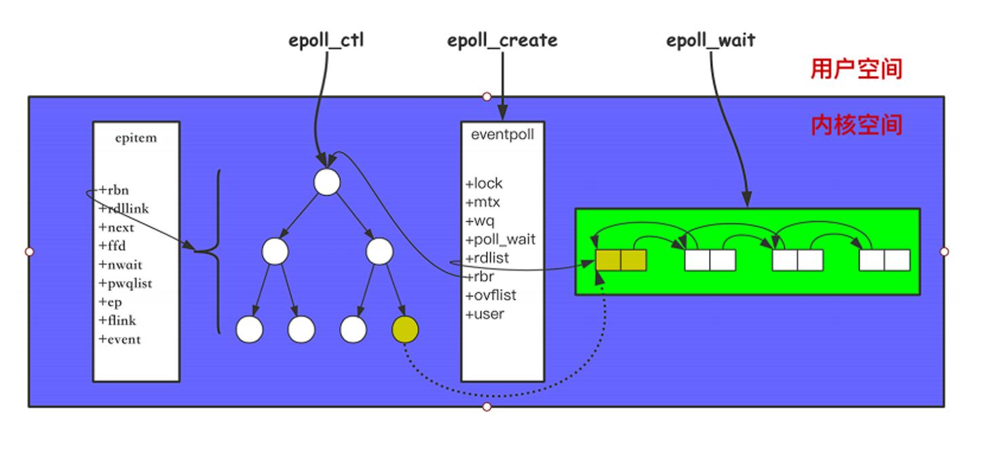
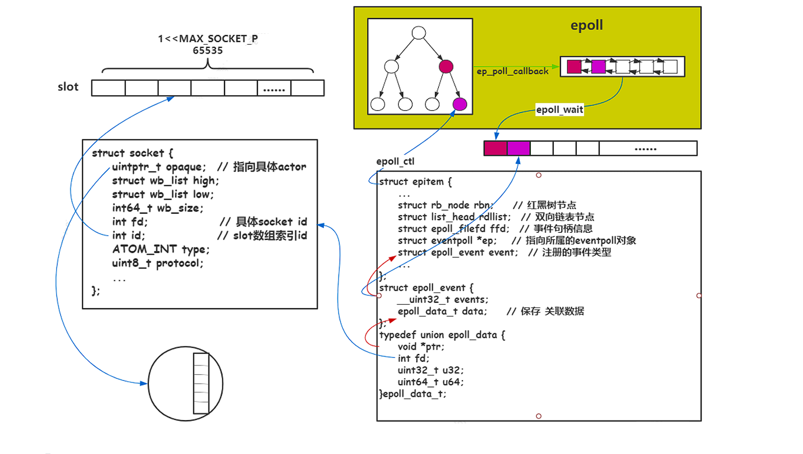
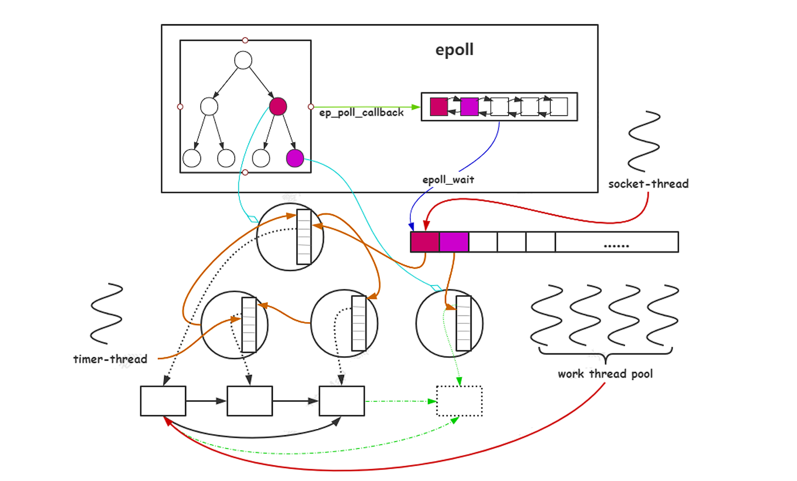

# Skynet的基本原理和使用

## 多核并发编程

在CPU的多核并发编程时，通常有4种方式，分别为多线程、多进程、CSP、Actor。

- 多线程方式。在一个进程中开启多线程，为了充分利用多核，一般设置工作线程的个数为 cpu 的核心数（memcached 就是采用这种方式）多线程在一个进程当中，所以数据共享来自进程当中的虚拟内存，这里会涉及到很多临界资源的访问，所以需要考虑加锁。
- 多进程方式。在一台机器当中，开启多个进程充分利用多核，一般设置工作 进程的个数为 cpu 的核心数（nginx 就是采用这种方式）。nginx 当中的 worker 进程，通过共享内存来进行共享数据，也需要考虑使用锁。
- CSP方式。以 go 语言为代表，并发实体是协程（用户态线程、轻量级线程）。内部也是采用多少个核心开启多少个线程来充分利用多核。
- Actor方式。用户层抽象进程，以erlang语言为代表，erlang 从语言层面支持 actor 并发模型，并发实体是 actor。

多线程、多进程并发都是使用共享内存来通信。CSP 和 Actor 都符合“不要通过共享内存来通信，而应该通过通信来共享内存” 这一哲学。通过通信来共享数据，其实是一种解耦合的过程，并发实体之 间可以分别开发并单独优化，而它们唯一的耦合在于消息。这能让我们快速地进行开发，同时也符合我们开发的思路，将一 个大的问题拆分成若干个小问题。

## skynet介绍和编译

skynet是一个轻量级游戏服务器框架，skynet 采用 c + lua来实现 actor 并发模型。（在skynet 中actor也中称之为服务）其底层也是通过采用多少个核心开启多少个内核线程来充分利用多核。但也不仅仅可以用于游戏。其轻量级体现在：

1. 实现了 actor 模型，以及相关的脚手架（工具集）。例如：actor 间数据共享机制、c 服务扩展机制。
2. 实现了服务器框架的基础组件。例如：实现了 reactor 并发网络库，并提供了大量连接的接入方案、基于自身网络库，实现了常用的数据库驱动（异步连接方案），并融合了 lua 数据结构、实现了网关服务、时间轮用于处理定时消息。

编译安装skynet的方式为：

```shell
# centos
yum install -y git gcc readline-devel autoconf
# ubuntu
apt-get install git build-essential readline-dev autoconf
# mac
brew install git gcc readline autoconf

# 下载编译
git clone https://github.com/cloudwu/skynet.git
cd skynet
# centos or ubuntu
make linux
# mac
make macosx
```

## Skynet的Actor 模型

Actor 是抽象的用户态进程，Actor是Skynet用于并行计算的实体，Actor 是最基本的计算单元。Skynet的Actor使用lua实现，每一个Actor都是一个独立的lua虚拟机，是隔离的运行环境。Actor 基于消息计算，并且通过消息进行沟通。其组成为：

1. 隔离的环境。主要通过 lua 虚拟机来实现。
2. 消息队列。用来存放有序（先后到达）的消息。
3. 回调函数。用来运行 Actor，从 Actor 的消息队列中取出消息，并作为该回调函数的参数来运行 Actor。

有消息的 actor 为活跃的 actor，没有消息为非活跃的 actor，如下所示：



### Actor 创建

skynet的启动服务流程如下：



在最后的skynet_context_new 中会创建一个隔离的环境（lua 虚拟机），一个消息队列，并且需要设置回调函数。

```c++
// Actor创建的底层关键接口
// 用于创建隔离的环境
void * skynet_module_instance_create(struct skynet_module *m);
// 用于设置回调函数
int skynet_module_instance_init(struct skynet_module *m, void * inst, struct skynet_context *ctx, const char * parm);
// 用于释放 actor 对象
void skynet_module_instance_release(struct skynet_module *m, void *inst);
// 用于处理 信号 消息

```

### Actor 运行

消息驱动actor运行，在skynet.start 会设置回调函数，一个消息执行的时候，会获取一个协程执行它。lua 虚拟机有一个限制，同时只有一个协程在运行，内核线程取出消息队列找到 lua 虚拟机 ，然后从协程池中取出一个协程（由session确定协程）来执行消息运行。



### Actor 的消息

Actor 模型基于消息计算，在 skynet 框架中，消息包含 Actor  （之间）消息、网络消息以及定时消息。在 skynet 中，消息处理主要通过设置回调函数，为每一条消息选择一个协程去处理。



#### Actor 之间消息

```lua
-- 直接发送消息
-- addr 对端服务的地址
-- typename 消息类型 actor内部间通常为 lua 类型消息
-- ... 为可变参
skynet.send(addr, typename, ...)

-- 在一个协程当中，可以类似RPC的方式发送消息
-- addr 对端服务的地址
-- typename 消息类型 actor内部间通常为 lua 类型消息
-- ... 为可变参
-- 对端需要显示调用 skynet.ret(...) 回应 skynet.call的请求，或者通过调用 skynet.response() 延迟回应skynet.call 的请求
local ret = skynet.call(addr, typename, ...)
```

#### 网络消息

skynet 当中采用一个 socket 线程来处理网络信息，skynet 基 于 reactor 网络模型。



在 linux 系统中，采用 epoll 来检测管理网络事件。epoll的基本操作为：

```c++
// 创建epoll
int epoll_create(int size);
 // 对红黑树进行增删改操作
int epoll_ctl(int epfd, int op, int fd, struct epoll_event* event);
// 等待事件
int epoll_wait(int epfd, struct epoll_event* events, int maxevents, int timeout);
```

epoll的基本操作原理如下所示：



skynet 在网络当中获取数据，怎么知道传递到哪个服务的消息队列当中去？通过 epoll_ctl 设置  struct epoll_event 中data.ptr = (struct socket *)ud; 来完成 fd 与 actor 绑定， 通过  socket.start(fd, func) 来完成 actor 与 fd 的 绑定。



#### 定时消息

skynet 采用多层级时间轮来解决多线程环境下定时任务的管理，时间复杂度为O(1)。当定时任务被触发，将会向目标 Actor 发送定时消息，从而驱动 Actor 的运行。

### Actor 调度

actor 是抽象的用户态进程，相对于 linux 内核 有进程调度， 那么 skynet 也要实现 actor 调度。actor都是对等的概念，skynet 为了保证每一个actor的调度都是公平的，实现公平调度，其运行调度步骤如下：

1. 找到所有活跃的 actor，actor 当中的消息队列有消息就是活跃的 actor。
2. 将活跃的 actor 通过全局队列组织起来。
3. 线程池去全局队列中取出 actor 的消息队列，取出节点，消费一个消息，调度运行 actor。
4. 消费之后如果还有消息，则append到队列的末尾。

actor 的调度是由线程池的调度来驱动的。线程池是一个生产者和消费者模型，生产者线程发布任务（加锁）到队列中，任务包含了任务的上下文和任务执行函数，由线程池（消费者）取出任务（加锁）后执行任务。

Skynet在启动时会启动一个monitor线程、一个timer线程，一个socket线程和配置文件指定的多个工作线程。

工作线程从全局队列中  pop 出单个 Actor 的消息队列，然后从 Actor  消息队列中按照规则  pop 出一定数量的消息进行执行。若  Actor 消息队列中仍有消息继续放入全局队列队尾；若 Actor 消 息队列中没有消息则不放入全局队列中。全局队列只存活跃的  Actor 消息队列。



该生产者消费者模型中，生产者线程既可以是生产者也可以是消费者，消费者线程既可以是消费者也可以是生产者。队列是解耦的重要媒介，队列可以是多个，使用**二级队列**保证了公平调度。

#### 工作线程权重

虽然skynet 使用**二级队列**实现了actor 的公平调度，但是每一个actor 的队列长度可能差距非常大，由于用户的问题造成消息的不均衡问题，造成应用上不一定是公平的，所以skynet 引入了工作线程的权重。

工作线程数量是按照 cpu 核心数来设置的，工作线程可以按照下面 工作线程权重图来设置每个工作线程的权重：

```c++
 // 工作线程权重图   32个核心
static int weight[] = { -1, -1, -1, -1, 0, 0, 0, 0,
 1, 1, 1, 1, 1, 1, 1, 1,  // 1/2
 2, 2, 2, 2, 2, 2, 2, 2,  // 1/4
 3, 3, 3, 3, 3, 3, 3, 3, }; // 1/8
// 工作线程执行规则
int i,n=1;
for (i=0; i<n; i++) {
 // 注意: skynet_mq_pop pop出消息则返回0，没有pop消息返回1
 if (skynet_mq_pop(q, &msg)) {
 		skynet_context_release(ctx);
 		return skynet_globalmq_pop();
    } else if (i==0 && weight >= 0) {
 		n = skynet_mq_length(q);
 		n >>= weight;   // n >> 1  = n / 8
    }
    ...
 	// 调用 actor 回调函数消费消息
	dispatch_message(ctx, &msg);
}
```

- 当工作线程的权重为 -1 时，该工作线程每次只 pop 一条消息。
- 当工作线程的权重为 0 时，该工作线程 每次消费完所有的消息。
- 当工作线程的权重为 1 时，每次消费消息队列中1/2的消息。
- 当工作线程的权重为 2 时，每次消费消 息队列中1/4的消息。

以此类推，通过这种方式，完成消息队列梯度消费，从而不至于让某些队列过长。

## Skynet的基本使用

### 编译和配置

首先需要在Skynet的同一层目录下写makefile文件，方便进行编译。

```makefile
SKYNET_PATH ?= ./skynet

all :
	cd $(SKYNET_PATH) && $(MAKE) PLAT='linux'

clean :
	cd $(SKYNET_PATH) && $(MAKE) clean
```

编译好的skynet是可执行文件，启动运行`./skynet/skynet config`需要指定配置文件config，config需要包含入口actor 、actor 的路径、工作线程等信息。

```lua
thread=8 -- 工作线程
logger=nil -- 日志打印到控制台
harbor=0 -- 无集群
start="main" -- 入口 actor 
lua_path="./skynet/lualib/?.lua;./skynet/lualib/?/init.lua;"	-- lua的路径
-- lua 抽象的进程actor
luaservice="./skynet/service/?.lua;./app/?.lua;" -- actor 的路径，自定义的actor放在./app路径下
lualoader="./skynet/lualib/loader.lua"
cpath="./skynet/cservice/?.so"
lua_cpath="./skynet/luaclib/?.so"
```

使用vscode进行编译，需要在.vscode文件夹中编写tasks.json：

```json
{
    "tasks": [
        {
            "type": "cppbuild",
            "label": "build-skynet",
            "command": "/usr/bin/make",
            "args": [],
            "options": {
                "cwd": "${workspaceFolder}"
            },
            "problemMatcher": [
                "$gcc"
            ],
            "group": {
                "kind": "build",
                "isDefault": true
            },
            "detail": "..."
        }
    ],
    "version": "2.0.0"
}
```

还需要.vscode文件夹中编写launch.json

```json
{
    "version": "0.2.0",
    "configurations": [
        {
            "name": "启动 app",
            "type": "cppdbg",
            "request": "launch",
            "program": "${workspaceFolder}/skynet/skynet",
            "args": ["config"],
            "stopAtEntry": false,
            "cwd": "${workspaceFolder}",
            "environment": [],
            "externalConsole": false,
            "MIMode": "gdb",
            "setupCommands": [
                {
                    "description": "为 gdb 启用整齐打印",
                    "text": "-enable-pretty-printing",
                    "ignoreFailures": true
                },
                {
                    "description": "将反汇编风格设置为 Intel",
                    "text": "-gdb-set disassembly-flavor intel",
                    "ignoreFailures": true
                }
            ],
            "preLaunchTask": "build-skynet",
            "miDebuggerPath": "/usr/bin/gdb"
        }
    ]
}
```

### 编写简单的抽象进程actor 

在上面的config需要包含入口actor 为main，路线为./app/，所以首先编写`app\main.lua`：

```lua
local skynet = require "skynet"
local socket = require "skynet.socket"

skynet.start(function ()
    -- 网络通信
    local listenfd = socket.listen("0.0.0.0", 8888)
    socket.start(listenfd, function (clientfd, addr)
        print("receive a client:", clientfd, addr)
    end)
    -- 定时器通信
    skynet.timeout(100, function()
        print("after 1s, do here")
    end)
    print("hello skynet")
	-- 不同的actor 之间通信
    local slave = skynet.newservice("slave")
    local response = skynet.call(slave, "lua", "ping")
    --[[
        main  ->     ping    ->  slave    协程挂起了
        slave ->     pong    ->  main     协程唤醒了
        c/c++   异步流程   callback  协程来实现
    ]]
    print("main", response)
end)

```

在不同actor 之间通信，需要编写接收消息的actor 服务`app\slave.lua`

```lua
local skynet = require "skynet"

local CMD = {}

function CMD.ping()
    skynet.retpack("pong")
end

skynet.start(function ()
    skynet.dispatch("lua", function(session, source, cmd, ...)
        local func = assert(CMD[cmd])
        func(...)
    end)
end)
```

