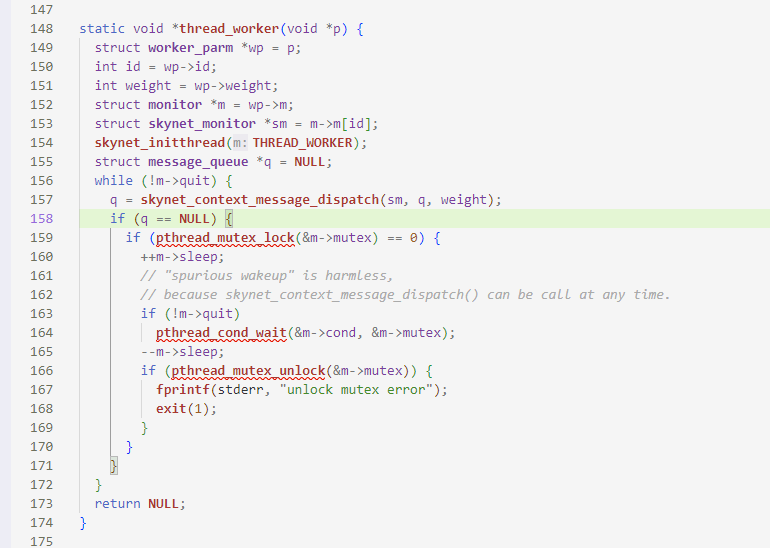
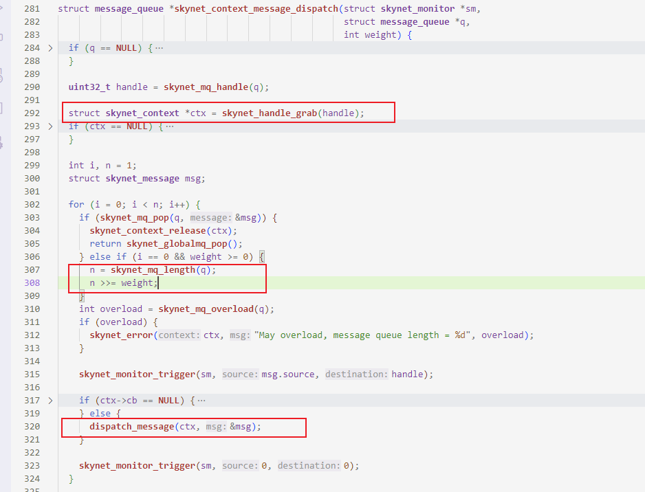
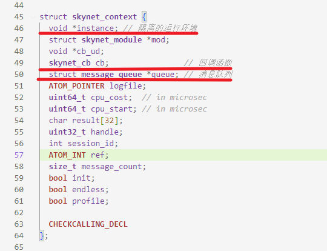
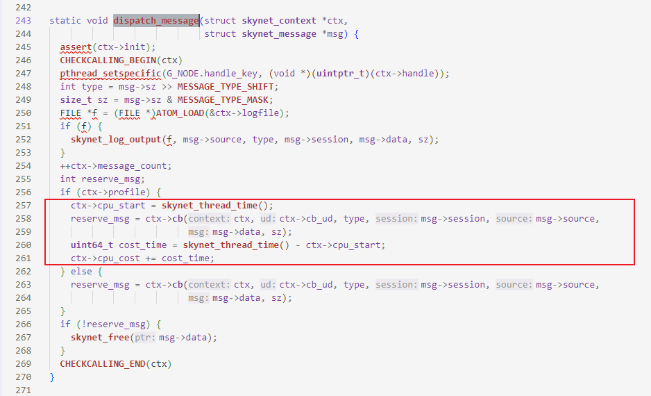
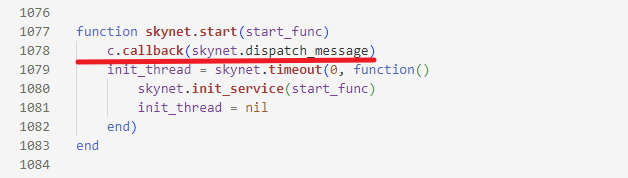
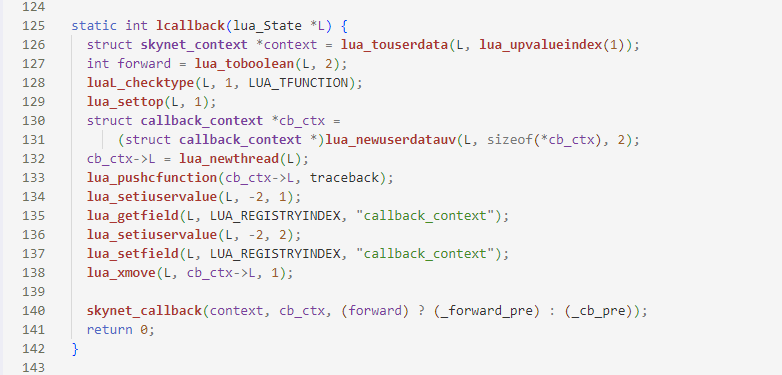
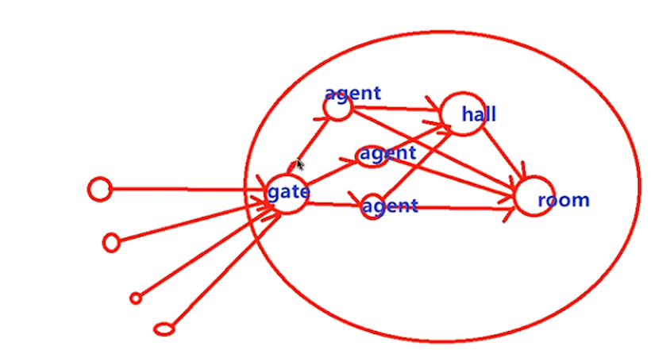

# Skynet 的游戏开发

Skynet是基于actor并发模型开发的框架，其actor是用户层抽象的进程。actor是由消息驱动的，一共有3种消息：网络消息、定时消息、actor之前的消息。每一个actor都有一个专属的消息队列，消息队列将消息的到达先后次序组织消息。每一个actor都有一个入口回调函数，线程池的工作线程将从消息队列中取出消息作为回调函数参数运行actor。

Skynet在用户态抽象actor的原因在于加载lua虚拟机代价小，在同一个进程中多个lua虚拟机可以共享许多lua资源。使用lua虚拟机提供了隔离的运行环境，避免"多线程"资源竞争，并且调用actor回调时选择一个协程运行消息，这样可以用协程消除部分回调，可以让用户直接写"单线程"的逻辑。

由于每一个actor都是对等的，Skynet实现了公平调度。在用户的配置文件中指定了线程池的线程数量（通常cpu核心数一致），由工作线程调度actor对象。Skynet将所有活跃的actor用链表链接起来，线程池从actor中取出相等数量的消息进行执行，实现公平调度。虽然使用二级队列实现了公平调度，但是actor消息队列长度不一致，可能差距特别大的时候部分actor会出现"饿死"的现象，所有skynet会对工作线程赋予不同的权重，解决改问题。

在`skynet-src\skynet_start.c`中**thread_worker**创建工作线程，使用**skynet_context_message_dispatch**进行消息处理，weight是该线程的权重。



在`skynet-src\skynet_server.c`中的**skynet_context_message_dispatch**进行actor的调度，从**skynet_handle_grab**中取到actor，按照该线程的权重weight进行消息处理**dispatch_message**：



C语言结构体 **struct skynet_context**就代表了一个Actor模型，actor模型的三元素：隔离的运行环境、回调函数、消息队列。



最后在`skynet-src\skynet_server.c`中的**dispatch_message**进行真正的Actor消息处理，进行Actor模型的调度：



cb是Actor提供的回调函数，在actor初始化时，在`lualib\skynet.lua`脚本中设置的回调函数，所有的消息处理都需要经过lua虚拟机的dispatch_message函数：



在该lua脚本中调用的**c.callback**是由C语言实现的函数，在`lualib-src\lua-skynet.c`导出给lua脚本调用的**lcallback**：



## lua编程

Skynet使用lua实现actor模型，编写游戏的逻辑需要使用lua语言进行开发。lua是动态语言，在运行时编译，这样当需要修改游戏逻辑时不需要重新编译整个游戏项目，只需要替换lua脚本就可以完成游戏的**热更新**。游戏开发时的需求经常发生变化，使用脚本语言可以提高了游戏开发的效率。

### lua的数据类型

lua的数据类型只有九个，分别为：boolean,  number,  userdata,  string,  nil,  function, table, userdata,lightuserdata,  thread。

boolean 为  true、false。其中false可以解决  table 作为 array 时，元素为 nil 时造成 table  取长度未定义的行为。

number 为  integer 和  double 的总称。

string 常量字符串，无法进行修改，这样 lua 中字符串比较只需要进行地址比较就行了。

nil 通常表示未定义或者不存在两种语义。

function 函数。与其他语言不同的是，lua 中function 为第一类型。lua 文件可视为一个匿名函数，加载 lua 文件，可视为执行该匿名函数。

table 表。lua 中唯一的数据结构，既可以表示 hashtable 也可表示为 array，配合元表可以定制表复杂的功能。（如实现面对对象编程中的类以及相应继承的功能）

userdata 完全用户数据。指向一块内存的指针，通过为userdata 设置元表，lua 层可以使用该userdata提供的功能。userdata 为 lua 补充了数据结构，解决了 lua 数据结构单一的问题，可以在 c 中实现复杂的数据结构，生成库继而导出给 lua 使用。需要注意的是userdata 指向的内存需要由 lua 创建，同时 userdata 的销毁也交由 lua gc 来自动回收。

lightuserdata 轻量用户数据。它也是指向一块内存的指针，但是该内存由 c 创建，同时它的销毁也由 c 来完成，不能为它创建元表。轻量用户数据只有类型元表，通常用于 lua 想使用 c 的 结构，但是不能让 lua 来释放的结构，在游戏客户端中使用的也比较多。

thread 线程。lua 中的协程和虚拟机都是  thread 类型。

### lua脚本的语言特色

#### 元表

元表可以修改一个值在面对一个未知操作时的行为，常用的有`__index`、`__newindex`、`__gc`。

- `__index`: 索引table[key]时，当  table 不是表或是表table 中不存在key 这个键时，这个事件被触发。此时，会读出 table 相应的元方法。
- `__newindex`:索引赋值  table[key] = value 。和索引事件类似，它发生在table 不是表或是表  table 中不存在key 这个键的时候。 此时，会读出  table 相应的元方法。
- `__gc`:元表中用一个以字符串"__gc"为索引的域，那么就标记了这个对象需要触发终结器。

```lua
local tab = {
    ["hello"] = "world",
    [1] = (function() end),
}

setmetatable(tab, {
    __index = function(self, key) 
        return key .. "not exist"
    end,
    __newindex = function(self, key)
        assert(false, "can't add new key")
    end
})

local a = tab["yangshuangxin"]
tab["xin"] = 7
```


只有 table 和  userdata 对象有独自的元表，其他类型只有类型元表。只有 table 可以在 lua 中修改设置元表，userdata 只能在 c 中修改设置元表，lua 中不能修改userdata 元表。

#### 协程

skynet 最小的运行的单元，是一段独立的执行线程。一个 lua 虚拟机中可以有多个协程，但同时只能有一个协程在运行。虽然只有一个线程运行，但是另一个协程可以会修改上一个协程的上下文，也需要对变量进行加锁和使用队列排队访问。

```lua
 -- 主协程
local co = coroutine.create(function (arg1)
    -- 创建的协程
    -- local run, ismain = coroutine.running()
    -- print(run, ismain, arg1)
    local ret1 = arg1+1
    -- 是否满足条件
    local arg2 = coroutine.yield(ret1)  -- 子协程让出  
    local ret2 = arg2+1
    return ret2
end)

local co1 = coroutine.running()
local arg1 = 1
local ok, ret1, ret2
ok, ret1 = coroutine.resume(co, arg1) -- 主协程 让出 唤醒 co
print(co1, ok, ret1)
ok, ret2 = coroutine.resume(co, ret1) -- 主协程 让出 唤醒 co
print(co1, ok, ret2)

```

#### 闭包

其表现为函数内部可以访问函数外部的变量，lua 内部函数可以访问文件中函数体外的变量，lua 文件是一个匿名函数。其实现是C 函数以及绑定在 C 函数上的上值（upvalues）。

```lua
local function iteractor(NUM, START)
    local i = START or 0
    local max = NUM or 16
    return function ()
        i = i % max + 1
        return i
    end
end

local iter = iteractor()

for i = 1, 20 do
    print(iter())
end
```

#### 其他差异

lua没有入口函数，索引从 1 开始，函数可以多返回值，函数是第一类型。

条件表达式： nil 或者  false 为假，非nil为真。

多元运算：A and B or C。其中 A、B、C 均为表达式，类似于c/c++ 中的  A ? B : C；差异在于条件表达式的差异。

非运算符：是 ~ 而不是 !，所以不等于为 ~=。

## 游戏开发

为了熟悉 actor 模型开发思路，开发一个简单的猜数字的游戏。游戏条件是满3人开始游戏，游戏开始后不能退出，直到这个游戏结束。

游戏规则是系统当中会随机 1-100 之间的数字，参与游戏的玩家依 次猜测规定范围内的数字。如果猜测正确那么该玩家就输了，如果猜测错误，游戏继续；直到有玩家猜测成功，游戏结束，该玩家失败。

### 游戏设计

设计原则是简单可用，持续优化，不需要一开始就过度优化。skynet 中，从 actor 底层看是通过消息进行通信；从 actor 应用层看是通过 api 来进行通信。

接口设计原则为不应该强迫客户依赖于他们不用的方法，从安全封装的角度出发，只暴露客户需要的接口，服务间不依赖彼此的实现。

简单设计划分为5个模块，游戏玩家的连接首先进入gate网关模块，处理连接请求，使用redis模块存储登录数据，进入后为每一个玩家分配一个agent模块，代表每一个玩家，玩家进入hall模块等待，当满足3个人时进入到room模块中开始游戏，其流程如下：



#### gate网关模块

gate模块是游戏服务的入口第一个服务，可以直接取名`main.lua`

```lua
local skynet = require "skynet"
local socket = require "skynet.socket"

local function accept(clientfd, addr)
    skynet.newservice("agent", clientfd, addr)
end

skynet.start(function ()
    local listenfd = socket.listen("0.0.0.0", 8888)
    skynet.uniqueservice("redis")
    skynet.uniqueservice("hall")
    socket.start(listenfd, accept)
end)
```

#### redis 模块

redis.lua，登录redis服务器，进行redis命令的透传

```lua
local skynet = require "skynet.manager"
local redis = require "skynet.db.redis"

skynet.start(function ()
	local rds = redis.connect({
		host	= "127.0.0.1",
		port	= 6379,
		db		= 0,
		-- auth	= "123456",
	})
	skynet.dispatch("lua", function (session, address, cmd, ...)
		skynet.retpack( rds[cmd:lower()](rds, ...) )
	end)
end)
```

#### hall 模块

玩家登录后进入大厅模块，实现当满足3个玩家时，把玩家拉入一个room中开始游戏

```lua
local skynet = require "skynet"
local queue = require "skynet.queue"
local socket = require "skynet.socket"

local cs = queue()
local tinsert = table.insert
local tremove = table.remove
-- local tconcat = table.concat
local CMD = {}

local queues = {}

local resps = {}
-- 发送数据给客户端
local function sendto(clientfd, arg)
    -- local ret = tconcat({"fd:", clientfd, arg}, " ")
    -- socket.write(clientfd, ret .. "\n")
    socket.write(clientfd, arg .. "\n")
end

function CMD.ready(client)
    if not client or not client.name then
        return skynet.retpack(false, "准备：非法操作")
    end
    if resps[client.name] then
        return skynet.retpack(false, "重复准备")
    end
    tinsert(queues, 1, client)
    resps[client.name] = skynet.response()
    if #queues >= 3 then
        local roomd = skynet.newservice("room") 
        local members = {tremove(queues), tremove(queues), tremove(queues)}
        for i=1, 3 do
            local cli = members[i]
            resps[cli.name](true, roomd)
            resps[cli.name] = nil
        end
        skynet.send(roomd, "lua", "start", members)
        return
    end
    sendto(client.fd, "等待其他玩家加入")
end

function CMD.offline(name)
    for pos, client in ipairs(queues) do
        if client.name == name then
            tremove(queues, pos)
            break
        end
    end
    if resps[name] then
        resps[name](true, false, "退出")
        resps[name] = nil
    end
    skynet.retpack()
end

skynet.start(function ()
    skynet.dispatch("lua", function(session, address, cmd, ...)
        local func = CMD[cmd]
        if not func then
            skynet.retpack({ok = false, msg = "非法操作"})
            return
        end
        cs(func, ...)
    end)
end)
```

#### agent模块

agent模块代表一个登录的玩家，使用Redis记录玩家的信息。

```lua
local skynet = require "skynet"
local socket = require "skynet.socket"

local tunpack = table.unpack
local tconcat = table.concat
local select = select

local clientfd, addr = ...
clientfd = tonumber(clientfd)

local hall

local function read_table(result)
	local reply = {}
	for i = 1, #result, 2 do reply[result[i]] = result[i + 1] end
	return reply
end

local rds = setmetatable({0}, {
    __index = function (t, k)
        if k == "hgetall" then
            t[k] = function (red, ...)
                return read_table(skynet.call(red[1], "lua", k, ...))
            end
        else
            t[k] = function (red, ...)
                return skynet.call(red[1], "lua", k, ...)
            end
        end
        return t[k]
    end
})

local client = {fd = clientfd}
local CMD = {}

local function client_quit()
    skynet.call(hall, "lua", "offline", client.name)
    if client.isgame and client.isgame > 0 then
        skynet.call(client.isgame, "lua", "offline", client.name)
    end
    skynet.fork(skynet.exit)
end

local function sendto(arg)
    -- local ret = tconcat({"fd:", clientfd, arg}, " ")
    -- socket.write(clientfd, ret .. "\n")
    socket.write(clientfd, arg .. "\n")
end

function CMD.login(name, password)
    if not name and not password then
        sendto("没有设置用户名或者密码")
        client_quit()
        return
    end
    local ok = rds:exists("role:"..name)
    if not ok then
        local score = 1000
        -- 满足条件唤醒协程，不满足条件挂起协程
        rds:hmset("role:"..name, tunpack({
            "name", name,
            "password", password,
            "score", score,
            "isgame", 0,
        }))
        client.name = name
        client.password = password
        client.score = score
        client.isgame = 0
        client.agent = skynet.self()
    else
        local dbs = rds:hgetall("role:"..name)
        if dbs.password ~= password then
            sendto("密码错误，请重新输入密码")
            return
        end
        client = dbs
        client.fd = clientfd
        client.isgame = tonumber(client.isgame) or 0
        client.agent = skynet.self()
    end
    if client.isgame > 0 then
        ok = pcall(skynet.call, client.isgame, "lua", "online", client)
        if not ok then
            client.isgame = 0
            sendto("请准备开始游戏。。。")
        end
    else
        sendto("请准备开始游戏。。。")
    end
end

function CMD.ready()
    if not client.name then
        sendto("请先登陆")
        return
    end
    if client.isgame and client.isgame > 0 then
        sendto("在游戏中，不能准备")
        return
    end
    local ok, msg = skynet.call(hall, "lua", "ready", client)
    if not ok then
        sendto(msg)
        return
    end
    client.isgame = ok
    rds:hset("role:"..client.name, "isgame", ok)
end

function CMD.guess(number)
    if not client.name then
        sendto("错误：请先登陆")
        return
    end
    if not client.isgame or client.isgame == 0 then
        sendto("错误：没有在游戏中，请先准备")
        return
    end
    local numb = math.tointeger(number)
    if not numb then
        sendto("错误：猜测时需要提供一个整数而不是 "..number)
        return
    end

    skynet.send(client.isgame, "lua", "guess", client.name, numb)
end

local function game_over()
    client.isgame = 0
    rds:hset("role:"..client.name, "isgame", 0)
end

function CMD.help()
    local params = tconcat({
        "*规则*:猜数字游戏，由系统随机1-100数字，猜中输，未猜中赢。",
        "help: 显示所有可输入的命令;",
        "login: 登陆，需要输入用户名和密码;",
        "ready: 准备，加入游戏队列，满员自动开始游戏;",
        "guess: 猜数字，只能猜1~100之间的数字;",
        "quit: 退出",
    }, "\n")
    socket.write(clientfd, params .. "\n")
end

function CMD.quit()
    client_quit()
end

local function process_socket_events()
    while true do
        local data = socket.readline(clientfd)-- "\n" read = 0
        if not data then
            print("断开网络 "..clientfd)
            client_quit()
            return
        end
        local pms = {}
        for pm in string.gmatch(data, "%w+") do
            pms[#pms+1] = pm
        end
        if not next(pms) then
            sendto("error[format], recv data")
            goto __continue__
        end
        local cmd = pms[1]
        if not CMD[cmd] then
            sendto(cmd.." 该命令不存在")
            CMD.help()
            goto __continue__
        end
        skynet.fork(CMD[cmd], select(2, tunpack(pms)))
::__continue__::
    end
end

skynet.start(function ()
    print("recv a connection:", clientfd, addr)
    rds[1] = skynet.uniqueservice("redis")
    hall = skynet.uniqueservice("hall")
    socket.start(clientfd) -- 绑定 clientfd agent 网络消息
    skynet.fork(process_socket_events)
    skynet.dispatch("lua", function (_, _, cmd, ...)
        if cmd == "game_over" then
            game_over()
        end
    end)
end)
```

#### root模块

room模块实现游戏规则，判断玩家的输赢。

```lua
local skynet = require "skynet"
local socket = require "skynet.socket"
local CMD = {}
local roles = {}
local redisd

local game = {
    random_value = 0,
    user_turn = 0,
    up_limit = 100,
    down_limit = 1,
    turns = {},
}

local function sendto(clientfd, arg)
    -- local ret = tconcat({"fd:", clientfd, arg}, " ")
    -- socket.write(clientfd, ret .. "\n")
    socket.write(clientfd, arg .. "\n")
end

local function broadcast(msg)
    for _, role in pairs(roles) do
        if role.isonline > 0 then
            sendto(role.fd, msg)
        end
    end
end

function CMD.start(members)
    for _, role in ipairs(members) do
        role.isonline = 1
        roles[role.name] = role
        game.turns[#game.turns+1] = role.name
    end
    game.random_value = math.random(1, 100)
    broadcast(("房间:%d 系统已经随机一个数字"):format(skynet.self()))
    local rv = math.random(1, 1500)
    if rv <= 500 then
        game.user_turn = 1
    elseif rv <= 1000 then
        game.user_turn = 2
    else
        game.user_turn = 3
    end
    local name = game.turns[game.user_turn]
    broadcast(("请玩家%s开始猜数字"):format(name))
end

function CMD.offline(name)
    if roles[name] then
        roles[name].isonline = 0
        broadcast(("%s 玩家已经掉线，请求呼叫他上线"):format(name))
    end
    skynet.retpack()
end

function CMD.online(client)
    local name = client.name
    if roles[name] then
        roles[name] = client
        roles[name].isonline = 1
        broadcast(("%s 玩家已经上线"):format(name))
        sendto(client.fd, ("范围变为 [%d - %d], 接下来由 %s 来操作"):format(game.down_limit, game.up_limit, game.turns[game.user_turn]))
    end
    skynet.retpack()
end

local function game_over()
    for _, role in pairs(roles) do
        if role.isonline == 0 then
            skynet.call(redisd, "hset", "role:"..role.name, "isgame", 0)
        else
            skynet.send(role.agent, "lua", "game_over")
            sendto(role.fd, "离开房间")
        end
    end
    skynet.fork(skynet.exit)
end

function CMD.guess(name, val)
    local role = assert(roles[name])
    if game.turns[game.user_turn] ~= name then
        sendto(role.fd, ("错误：还没轮到你操作，现在由 %s 来操作"):format(game.turns[game.user_turn]))
        return
    end
    if not val or val < game.down_limit or val > game.up_limit then
        sendto(role.fd, ("错误：请输入[%d - %d]之间的数字"):format(game.down_limit, game.up_limit))
        return
    end
    game.user_turn = game.user_turn % 3+1
    local next = game.turns[game.user_turn]
    if val == game.random_value then
        broadcast(("游戏结束，%s猜中了数字%d，输了"):format(name, val))
        game_over()
        return
    end
    if val < game.random_value then
        game.down_limit = val+1
        if game.down_limit == game.up_limit then
            broadcast(("游戏结束，只剩下一个数字%d %s输了"):format(val+1, next))
            game_over()
            return
        end
        broadcast(("%s输入的数字太小，范围变为 [%d - %d], 接下来由 %s 来操作"):format(name, game.down_limit, game.up_limit, next))
        return
    end
    if val > game.random_value then
        game.up_limit = val-1
        if game.down_limit == game.up_limit then
            broadcast(("游戏结束，只剩下一个数字%d %s输了"):format(val-1, next))
            game_over()
            return
        end
        broadcast(("%s输入的数字太大，范围变为 [%d - %d], 接下来由 %s 来操作"):format(name, game.down_limit, game.up_limit, next))
        return
    end
end

skynet.start(function ()
    math.randomseed(math.tointeger(skynet.time()*100), skynet.self())
    redisd = skynet.uniqueservice("redis")
    skynet.dispatch("lua", function (_, _, cmd, ...)
        local func = CMD[cmd]
        if not func then
            return
        end
        func(...)
    end)
end)
```

### 游戏启动和运行

游戏客户端可以使用telent，如下所示：

```shell
telnet 127.0.0.1 8888
```

游戏服务器端需要先启动Redis`redis-server redis.conf`，使用配置文件启动skynet

```shell
thread=8 --工作线程数量 cpu有多少个核心数 线程池的数量就是多少
logger=nil
harbor=0
start="main" -- 启动第一个服务 
lua_path="./skynet/lualib/?.lua;".."./skynet/lualib/?/init.lua;".."./lualib/?.lua;"
luaservice = "./skynet/service/?.lua;".."./game/?.lua;"
lualoader = "./skynet/lualib/loader.lua"
cpath = "./skynet/cservice/?.so;".."cservice/?.so;"
lua_cpath = "./skynet/luaclib/?.so;".."./luaclib/?.so;"
```

启动游戏`./skynet/skynet config`。

### 游戏优化

1. agent 服务不要实时创建，可以采用预先创建；用户验证 通过后再分配 agent 地址，避免无效分配。
2. 创建 gate 服务：登陆验证、流程验证、心跳检测、验证 成功之后再分配⼀个 agent。
3.  如果 agent 功能比较简单，那么可以创建固定数量的  agent，使用agent池。
4.  如果 room 功能比较简单，那么可以创建固定数量的  room，使用room池。
5.  重启服务策略，创建同样数量的 agent 服务组，新进来 的玩家，分配到新的服务组；而旧的玩家在旧的服务组 操作结束后，就淘汰该玩家，直到旧的服务组没有玩 家，这时旧服务组退出；保证旧的服务组只处理旧的任 务，新连接进来的用户在新的服务组进行工作。