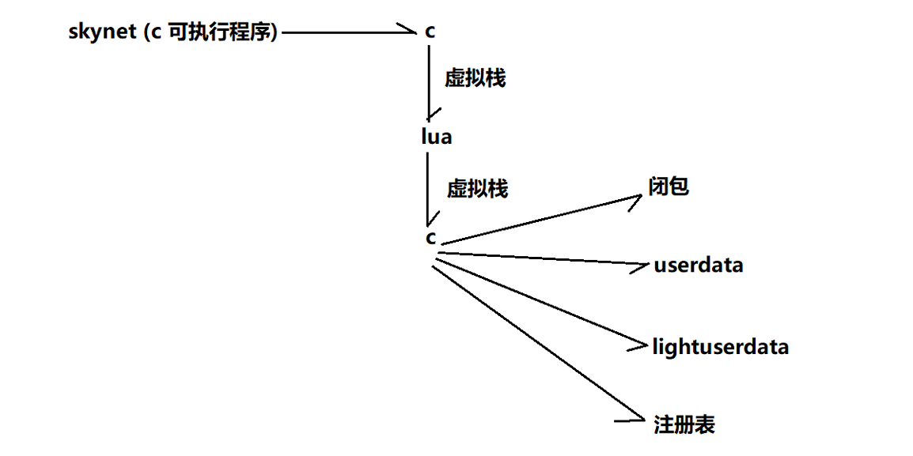
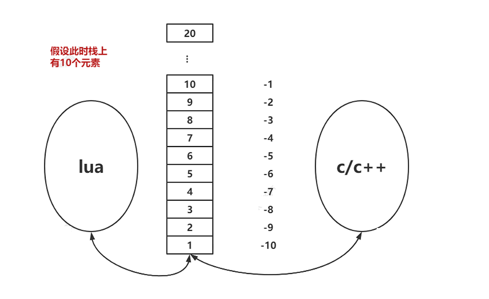

# Skynet的组件开发

## Skynet中的lua调用

skynet是c的可执行程序，基于actor模型进行调度运行。其actor是由lua语言编写的，所以Skynet的组件开发需要C和Lua语言的互相调用。skynet的C程序调用lua使用虚拟栈传递分发消息，在lua中进行消息处理时也常常需要调用skynet的C语言导出的各种算法、网络的函数，这也同样通过虚拟栈进行。

> 使用lua开发虽然只有纯 C 的大约1/6的效率，但是可以提高开发效率，非常容易修改业务逻辑，不需要重新编译全部C的源代码，只需要替换lua脚本即可，非常有利于游戏中的热更新。



### 虚拟栈

栈中只能存放 lua 类型的值，如果想用 c 的类型存储在栈中，需要将 c 类型转换为 lua 类型。**lua 调用 c 的函数都得到一个新的栈，独立于之前的栈**。**C 调用 lua，每一个协程都有一个栈，所以必须维护好这个栈**，弹出不需要的栈空间，否则会出现各种意想不到的错误。

C 创建虚拟机时，伴随创建了一个主协程，默认创建一个虚拟栈。无论何时 Lua 调用 C ， 它都只保证至少有  LUA_MINSTACK 这么多的堆栈空间可以使用。  LUA_MINSTACK 一般被定义为 20 ，只要你不是不断的把数据压栈， 通常你不用关心堆栈大小。



### C 语言调用lua

 编写提供C语言调用的 lua 脚本：

```lua
package.cpath = "luaclib/?.so"
function Init(args)
    print("call [init] function", args)
end

function Loop()
    print("call [loop] function")
end

function Release()
    print("call [release] function")
end
```

使用C语言调用上面的lua脚本：

```c
#include <stdio.h>
#include <stdlib.h>
#include <lauxlib.h>
#include <lua.h>
#include <lualib.h>

static void call_func_0(lua_State *L, const char *funcname) {
  lua_getglobal(L, funcname); // 获取lua中的函数名字
  lua_pushinteger(L, 1);      // 虚拟栈传递参数
  // 调用lua函数，1个参数，0返回值，该函数会把参数自动出栈，如果有返回值放入栈底
  lua_call(L, 1, 0);
}

int main(int argc, char **argv) {
  lua_State *L = luaL_newstate();
  luaL_openlibs(L);
  if (argc > 1) {
    lua_pushboolean(L, 1);
    lua_setfield(L, LUA_REGISTRYINDEX, "LUA_NOENV");
    if (LUA_OK != luaL_dofile(L, argv[1])) { // 加载lua脚本
      const char *err = lua_tostring(L, -1);
      fprintf(stderr, "err:\t%s\n", err);
      return 1;
    }
    // 调用lua中的函数
    call_func_0(L, "Init");
    call_func_0(L, "Loop");
    call_func_0(L, "Release");
    lua_close(L);
  }
  return 0;
}
```

### lua调用C库

复杂的基础算法、复杂的数据结构、网络数据包等处理，通常都是由C语言实现，然后由lua进行调用。在Skynet中调用C的库有4种类型：闭包、组成表、userdata、lightuserdata。lua只能调用动态库中的函数，所以需要把C语言写的算法编译成so、dll文件。lua约定读取动态库中以luaopen_*命名的函数，所以需要在luaopen_*导出C的函数指针提供lua调用。在lua获取模块对象后，通过函数名可以找到C函数地址，从而实现C代码的调用。

首先编写lua脚本调用C库的简单例子：

```lua
package.cpath = "luaclib/?.so" --c库的路径
local so = require "tbl.c" -- 对应的c函数就是tbl_c
so.echo("hello world") -- 新的虚拟栈
so.echo("hello world1")-- 新的虚拟栈
so.echo("hello world2")-- 新的虚拟栈
```

在C的库中导出tbl_c的函数：

```c
#include <lauxlib.h>
#include <lua.h>
#include <lualib.h>
#include <stdio.h>

static int lecho(lua_State *L) {
  const char *str = lua_tostring(L, -1);
  fprintf(stdout, "%s\n", str);
  return 0;
}

static const luaL_Reg l[] = {
    // 导出给lua使用数组
    {"echo", lecho},
    {NULL, NULL},
};
// local tbl = require "tbl.c"
int luaopen_tbl_c(lua_State *L) {
  // 创建一张新的表，并预分配足够保存下数组 l 内容的空间
  // luaL_newlibtable(L, l);
  // luaL_setfuncs(L, l, 0);
  // 上面两行可以使用下面的一行代替
  luaL_newlib(L, l);
  return 1;
}
```


#### C 闭包

可以通过  lua_pushcclosure 用来创建 C 闭包，通过  lua_upvalueindex 伪索引来获取上值（lua 值）。可以为多个导出函数（c 导出函数给 lua 使用）共享上值，这样可以少传递一个参数。

编写lua脚本调用C闭包函数

```lua
package.cpath = "luaclib/?.so"
local so = require "uv.c"
so.echo("hello world1")
so.echo("hello world2")
so.echo("hello world3")
so.echo("hello world4")
so.echo("hello world5")
so.echo("hello world6")
so.echo("hello world7")
so.echo("hello world8")
so.echo("hello world9")
```

C语言导出闭包函数uv_c：

```c
#include <lauxlib.h>
#include <lua.h>
#include <lualib.h>
#include <stdio.h>

// 闭包实现：  函数 + 上值  luaL_setfuncs
// lua_upvalueindex(1)
// lua_upvalueindex(2)
static int lecho(lua_State *L) {
  lua_Integer n = lua_tointeger(L, lua_upvalueindex(1)); // 取出闭包的上值
  n++;
  const char *str = lua_tostring(L, -1);
  fprintf(stdout, "[n=%lld]---%s\n", n, str);
  // 修改闭包的上值
  lua_pushinteger(L, n);
  lua_replace(L, lua_upvalueindex(1));
  return 0;
}

static const luaL_Reg l[] = {
    {"echo", lecho},
    {NULL, NULL},
};

int luaopen_uv_c(lua_State *L) { // local tbl = require "tbl.c"
  luaL_newlibtable(L, l);        // 新建表
  lua_pushinteger(L, 0);         // 上值入队列
  luaL_setfuncs(L, l, 1);        // 1个上值
  return 1;
}
```

#### 注册表

一张预定义的表，用来保存任何 c 代码想保存的 lua 值。可以用来在多个 c 库中共享 lua 数据，包括userdata和lightuserdata。使用  LUA_REGISTRYINDEX 来索引，在skynet中获取 skynet_context就是通过注册表。

编写lua调用C的注册表：

```lua
package.cpath = "luaclib/?.so"
local so1 = require "reg1.c"
so1.echo("hello world")
so1.echo("hello world")
so1.echo("hello world")
```

在reg1_c把eg1.c放入到注册表中：

```c
#include <lauxlib.h>
#include <lua.h>
#include <lualib.h>
#include <stdio.h>

static int lecho(lua_State *L) {
  lua_getfield(L, LUA_REGISTRYINDEX, "reg1.c");
  // 此时栈顶放了一张表如下
  //        {["reg1.c"] = {1000, 2000}}
  lua_rawgeti(L, -1, 1);
  // -1 是读取栈顶的表  1 是指读这个表中索引为1 的field
  // 相当于 取出 1000 放在栈顶
  // 此时 栈上 1 的位置 为 table   2的位置为 1000
  lua_Integer n = lua_tointeger(L, -1);
  // 将栈顶的值转化为整数
  n++;
  lua_pop(L, 1);
  // 将栈顶的值 pop 出
  // 此时栈上只有一个 table
  lua_pushinteger(L, n);
  // 将运算后的 n push 到栈上
  // 此时栈上 1 的位置为 table   2的位置为 1001
  lua_rawseti(L, -2, 1);
  // 将 栈顶的值 设置到 1 位置中table 索引为 1的位置
  // 此时 table = {1001,2000}
  // 此时栈上只有一个 table 因为设置的时候 把栈顶的值丢掉了
  const char *str = lua_tostring(L, 1);
  fprintf(stdout, "reg1[n=%lld]----%s\n", n, str);
  return 0;
}

static const luaL_Reg l[] = {
    {"echo", lecho},
    {NULL, NULL},
};

int luaopen_reg1_c(lua_State *L) { // local tbl = require "reg1.c"
  // 创建一张新的表，并预分配足够保存下数组 l 内容的空间
  if (lua_getfield(L, LUA_REGISTRYINDEX, "reg1.c") == LUA_TNIL) {
    lua_createtable(L, 2, 0); // 1
    lua_pushinteger(L, 1000); // 2
    lua_rawseti(L, -2, 1);    // 1   {1000}
    lua_pushinteger(L, 2000); // 2
    lua_rawseti(L, -2, 2);    // 1  [reg1.c] = {1000,2000}
    lua_setfield(L, LUA_REGISTRYINDEX, "reg1.c");
    fprintf(stdout, "luaopen_reg1_c 注册表 reg1.c\n");
  }
  luaL_newlib(L, l);
  return 1;
}
```

#### userdata

userdata 是指向一块内存的指针，该内存由 lua 来创建，skynet中通过  `void *lua_newuserdatauv(lua_State *L, size_t sz,  int nuvalue) `这个函数来创建。

这块内存大小必须是固定的，不能动态增加，但是这块内存中的指针指向的数据可以 动态增加。  userdata 可以绑定若干个 lua 值（uservalue）。在 lua 5.3 中只能绑定一个 lua 值，lua 5.4 可以绑定多个。

userdata 与 uservalue 的关系是引用关系，也就是 uservalue 的生命周期与  userdata 的生命周期一致，当userdata gc 时，uservalue 也会被释放。通常这个特性可以用来绑定一个 lua  table 结构，因为 c 中没有 hash 结构，可以辅助 lua  table 结构实现复杂的功能。也可以用来实现延迟 gc，如 果某个  userdata 希望晚点 gc，在  userdata 的  生成一个临时的  __gc 元表中 userdata，然后将那个希望晚点 gc 的  userdata 绑定在这个临时  userdata 的  uservalue 上。

`int lua_getiuservalue (lua_State *L, int idx, int  n)`来获取绑定在  userdata 上的 uservalue。

`int lua_setiuservalue (lua_State *L, int idx, int  n)`来设置  userdata 上的 uservalue。

编写调用C的lua脚本：

```lua
package.cpath = "luaclib/?.so"
local so = require "ud.c"
local ud = so.new()
ud:echo("hello world1")
ud:again()
ud:echo("hello world2")
ud:again()
ud:echo("hello world3")
ud:again()
```

编写C的自定义的userdata

```c
#include <lauxlib.h>
#include <lua.h>
#include <lualib.h>
#include <stdio.h>
#include <stdlib.h>
#include <string.h>
// 自定义结构体
struct log {
  int count;
};

static int lagain(lua_State *L) {
  struct log *p = (struct log *)luaL_checkudata(L, 1, "userdata.log");
  lua_getuservalue(L, -1); // 得到设置userdate的关联值
  const char *str = lua_tostring(L, -1);
  fprintf(stdout, "ud[n=%d]----%s\n", p->count, str);
  return 0;
}

static int lecho(lua_State *L) {
  struct log *p = (struct log *)luaL_checkudata(L, 1, "userdata.log");
  const char *str = lua_tostring(L, -1);
  p->count++;
  lua_setuservalue(L, -2); // 修改userdate的关联值，again时再次打印出来
  fprintf(stdout, "ud[n=%d]----%s\n", p->count, str);
  return 0;
}

static int lnew(lua_State *L) {
  struct log *q = (struct log *)lua_newuserdata(L, sizeof(struct log));
  q->count = 0;
  lua_pushstring(L, "yangshuangxin");
  lua_setuservalue(L, -2); // 设置userdata的关联值
  if (luaL_newmetatable(L, "userdata.log")) {
    luaL_Reg m[] = {
        {"echo", lecho},
        {"again", lagain},
        {NULL, NULL},
    };
    luaL_newlib(L, m);
    lua_setfield(L, -2, "__index");
    lua_setmetatable(L, -2);
  }
  return 1;
}

static const luaL_Reg l[] = {
    {"new", lnew},
    {NULL, NULL},
};

int luaopen_ud_c(lua_State *L) {
  luaL_newlib(L, l);
  return 1;
}
```

#### lightuserdata

轻量用户数据也是指向一块内存的指针，但是该内存由 c 来创建和销毁。这块内存的生命周期由 c 宿主语言来控制，可以将  lightuserdata 绑定在注册表中，让多个 lua 库共享该数据。

在 skynet 中， lightuserdata 可以指向同一块数据，在 多个 Actor 中传递这个  lightuserdata，然后分别为这个  lightuserdata 创建一个  userdata，在userdata中的__gc来释放这个lightuserdata。为了避免这块内存多次释放，需要为这块内存加上引用计数，同时 skynet 中 actor 是多线程环境下运行，所以需要为该  lightuserdata 加上锁。

lightuserdata 加锁必须是自旋锁或者原子操作，因为 actor 调度是自旋锁，必须使用比它更小的粒度的锁。如果  lightuserdata 操作粒度过大，应该改成只在一个 actor 中加载，其他 actor 通过消息来共 享数据。

## Skynet的半连接状态

skynst支持对半关闭状态进行处理。半关闭就是只关闭读端或写端，半关闭状态是TCP四次挥手中接收到FIN包并返回ACK包时，到发送FIN包前的状态。大多数场景不解决也不会有影响但有些场景（特别是游戏服务器）还是需要关注这个半关闭状态的。

大多数网络连接程序在read=0时就调用close()关闭TCP连接，但是，在read=0到调用close()之间，可能还有很多数据需要发送（send），如果read=0时就立刻调用close()那么对端就收不到这些数据了。

TCP断开连接做四次挥手的原因的原因在于希望将FIN包控制权交给应用程序去处理，以便处理断开连接的善后工作，即对端可能还有数据要发送。

TCP四次挥手的流程为：

1. 服务器收到FIN包，自动回复ACK包，进入CLOSE_WAIT状态。
2. 此时TCP协议栈会为FIN包插入一个文件描述符EOF到内核态网络读缓冲区，应用程序通过read=0来感知这个FIN包。
3. 如果此时应用程序有数据要发送，则发送数据后调用关闭连接操作（发送FIN包到对端）。
4. 双端关闭都需要一个FIN和一个ACK流程。

主动关闭的一方，在收到对端发送的FIN包后，自动发送ACK进入TIME_WAIT状态，这是因为因为ACK不会重传，防止没有LAST_ACK或LAST_ACK丢失，对端没有收到LAST_ACK而一直重发FIN包。一直重发已经不存在的socket，可能会对新建立的连接造成干扰。

> 如果ACK包丢失了，那么发送端在一定时间内接受不到数据就会重发FIN包，一般三次FIN包都没有收到ACK就会直接进入close。

发送FIN包的场景有：

1. 关闭读端：调用shutdown(fd,SHUT_RD)。
2. 关闭写端：调用shutdown(fd,SHUT_WR)；半关闭连接，仍旧接收数据，继而等待对方关闭。
3. 关闭双端：调用close(fd) 或者shoutdown(fd,SHUT_RDWR)。
4. 关闭进程：在内核的协议栈会自动发送FIN包。

如果主动关闭的一方不想进入TIME_WAIT状态，可以关闭读端，对端就会直接发送RST（Reset By Peer）进入快速关闭流程。