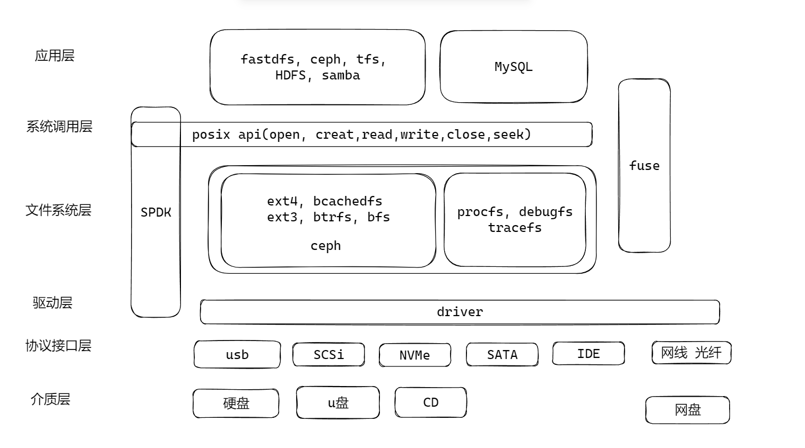
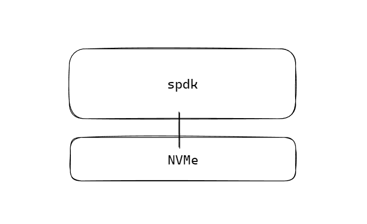
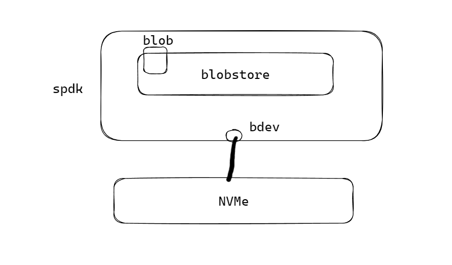

# SPDK的介绍和基本使用

在一个Linux的存储系统中，一般分为6层，分别是存储介质层、协议接口层、驱动层、文件系统层、系统调用层、应用层。

- 介质层包括硬盘、u盘、CD、网盘等，是存储的实体设备。
- 协议接口层有usb、SCSi、NVMe、SATA、IDE、网线光纤等，是和存储设备连接传输数据的协议。
- 驱动层是Linux上兼容和使用各种协议的Linux协议驱动。
- 文件系统层是记录文件在介质层中的位置等文件相关的信息，问题系统组织了文件的管理方式，可以通过驱动层操作文件的读写，例如ext4、bcachedfs、ext3、btrfs、bfs、ceph。也有不操作磁盘只操作内存的文件系统，例如procfs、debugfs、tracefs。
- 系统调用层是统一的文件操作接口，把应用层和底层进行解耦，应用层开发使用posix api提供的open、create、read、write、close、seek的文件操作函数，无需关系底层的具体实现方式。
- 应用层也可以构建自己的文件系统，例如fastdfs、ceph、tfs、HDFS、samba等，数据库例如Mysql的文件系统。应用层的文件系统通常不仅仅有文件存储格式的组织方式，还通常对外提供网络操作等服务。

SPDK与DPDK类似，SPDK是存储的一种旁路处理（bypass），可以绕过Linux的内核、文件系统，直接通过驱动进行存储介质的操作，提高文件写入效率。fuse也是一种类似的旁路处理，可以监控Linux的文件系统。



## Hack系统调用

当不修改应用层的代码时，可以使用hack文件操作的系统调用，在启动应用层程序时，执行`LD_PRELOAD=./syscall.so` 进行hack系统调用，可以从内核替换成SPDK进行操作。

```c++
#define _GNU_SOURCE
#include <dlfcn.h>
#include <stdio.h>
#define DEBUG_ENABLE 1

#if DEBUG_ENABLE 
#define dblog(fmt, ...)   printf(fmt, ##__VA_ARGS__)
#else
#define dblog(fmt, ...)
#endif

typedef int (*open_t)(const char *pathname, int flags);
open_t open_f = NULL;

typedef ssize_t (*read_t)(int fd, void *buf, size_t count);
read_t read_f = NULL;

typedef ssize_t (*write_t)(int fd, const void *buf, size_t count);
write_t write_f = NULL;

typedef int (*close_t)(int fd);
close_t close_f = NULL;

typedef off_t (*lseek_t)(int fd, off_t offset, int whence);
lseek_t lseek_f = NULL;

int open(const char *pathname, int flags) {
	if (!open_f) {
		open_f = dlsym(RTLD_NEXT, "open");
	}
	dblog("open .. %s\n", pathname);
	return open_f(pathname, flags);
}

ssize_t read(int fd, void *buf, size_t count) {
	if (!read_f) {
		read_f = dlsym(RTLD_NEXT, "read");
	}
	dblog("read ..\n");
	return read_f(fd, buf, count);
}


ssize_t write(int fd, const void *buf, size_t count) {
	if (!write_f) {
		write_f = dlsym(RTLD_NEXT, "write");
	}
	dblog("write ..\n");
	return write_f(fd, buf, count);
}


int close(int fd) {
	if (!close_f) {
		close_f = dlsym(RTLD_NEXT, "close");
	}
	dblog("close ..\n");
	return close_f(fd);
}

int lseek(int fd, off_t offset, int whence) {
	if (!lseek_f) {
		lseek_f = dlsym(RTLD_NEXT, "lseek");
	}
	dblog("lseek ..\n");
	return lseek_f(fd, offset, whence);

}
```

## SPDK的基本使用

SPDK使用最好准备一块NVMe的硬盘，或者在虚拟机中增加一块NVMe的硬盘。

```shell
# 源码编译和安装
git clone https://github.com/spdk/spdk
cd spdk
git submodule update --init
./scripts/pkgdep.sh
./configure
make
# 运行SPDK ,从操作系统中劫持硬盘的操作
./scripts/setup.sh
```



编写SPDK的代码，首先准备编译的Makefile文件

```makefile
SPDK_ROOT_DIR := $(abspath $(CURDIR)/../../..)
include $(SPDK_ROOT_DIR)/mk/spdk.common.mk
SO_VER := 1
SO_MINOR := 2
SO_SUFFIX := $(SO_VER).$(SO_MINOR)

LIBNAME = ysxfs
C_SRCS = ysxfs.c

include $(SPDK_ROOT_DIR)/mk/spdk.lib.mk
```

SPDK绑定的硬盘对应一个块设备bdev，spdk对硬盘的各种操作抽象到blobstore中，对硬盘操作可以等价为操作blob。



由json的配置文件进行blobstore的创建参数指定。

```json
{
  "subsystems": [
    {
      "subsystem": "bdev",
      "config": [
        {
          "method": "bdev_malloc_create",
          "params": {
            "name": "Malloc0",
            "num_blocks": 32768,
            "block_size": 512
          }
        }
      ]
    }
  ]
}
```

创建SDPK的基本框架代码：

```c++
#include <stdio.h>
#include <spdk/event.h>
#include <spdk/blob.h>
#include <spdk/bdev.h>
#include <spdk/env.h>
#include <spdk/blob_bdev.h>

typedef struct ysxfs_context_s {
	struct spdk_bs_dev *bsdev;
	struct spdk_blob_store *blobstore;
	spdk_blob_id blobid;
	struct spdk_blob  *blob;
	struct spdk_io_channel *channel;
	uint8_t *write_buffer;
	uint8_t *read_buffer;
	uint64_t io_unit_size;
} ysxfs_context_t;

static void ysxfs_bdev_event_call(enum spdk_bdev_event_type type, struct spdk_bdev *bdev,
				     void *event_ctx) {
	SPDK_NOTICELOG("%s --> enter\n", __func__);
}

static void ysxfs_bs_unload_complete(void *arg, int bserrno) {
	spdk_app_stop(1);
}

static void ysxfs_bs_unload(ysxfs_context_t *ctx) {
	if (ctx->blobstore) {
		if (ctx->channel) {
			spdk_bs_free_io_channel(ctx->channel);
		}
		if (ctx->read_buffer) {
			spdk_free(ctx->read_buffer);
			ctx->read_buffer = NULL;
		}
		if (ctx->write_buffer) {
			spdk_free(ctx->write_buffer);
			ctx->write_buffer = NULL;
		}
		spdk_bs_unload(ctx->blobstore, ysxfs_bs_unload_complete, ctx);
	}
}

static void ysxfs_blob_read_complete(void *arg, int bserrno) {
	ysxfs_context_t *ctx = (ysxfs_context_t*)arg;
	SPDK_NOTICELOG("size: %ld, buffer: %s\n", ctx->io_unit_size, ctx->read_buffer);
}

static void ysxfs_blob_write_complete(void *arg, int bserrno) {
	ysxfs_context_t *ctx = (ysxfs_context_t*)arg;
	SPDK_NOTICELOG("%s --> enter\n", __func__);
	ctx->read_buffer = spdk_malloc(ctx->io_unit_size, 0x1000, NULL, SPDK_ENV_LCORE_ID_ANY, SPDK_MALLOC_DMA);
	if (ctx->read_buffer == NULL) {
		ysxfs_bs_unload(ctx);
		return ;
	}
	memset(ctx->read_buffer, '\0', ctx->io_unit_size);
	spdk_blob_io_read(ctx->blob,ctx->channel, ctx->read_buffer, 0, 1, ysxfs_blob_read_complete, ctx);
}

static void ysxfs_blob_sync_complete(void *arg, int bserrno) {
	ysxfs_context_t *ctx = (ysxfs_context_t*)arg;
	SPDK_NOTICELOG("%s --> enter\n", __func__);
	ctx->write_buffer = spdk_malloc(ctx->io_unit_size, 0x1000, NULL, SPDK_ENV_LCORE_ID_ANY, SPDK_MALLOC_DMA);
	if (ctx->write_buffer == NULL) {
		ysxfs_bs_unload(ctx);
		return ;
	}
	memset(ctx->write_buffer, '\0', ctx->io_unit_size);
	memset(ctx->write_buffer, 'A', ctx->io_unit_size-1);
	struct spdk_io_channel *channel = spdk_bs_alloc_io_channel(ctx->blobstore);
	if (channel == NULL) {
		ysxfs_bs_unload(ctx);
		return ;
	}
	ctx->channel = channel;
	spdk_blob_io_write(ctx->blob,ctx->channel, ctx->write_buffer, 0, 1, ysxfs_blob_write_complete, ctx);
}

static void ysxfs_blob_resize_complete(void *arg, int bserrno) {
	ysxfs_context_t *ctx = (ysxfs_context_t*)arg;
	SPDK_NOTICELOG("%s --> enter\n", __func__);
	spdk_blob_sync_md(ctx->blob, ysxfs_blob_sync_complete, ctx);
}

static void ysxfs_blob_open_complete(void *arg, struct spdk_blob *blob, int bserrno) {
	ysxfs_context_t *ctx = (ysxfs_context_t*)arg;
	ctx->blob = blob;
	SPDK_NOTICELOG("%s --> enter\n", __func__);
	uint64_t freed = spdk_bs_free_cluster_count(ctx->blobstore);
	spdk_blob_resize(blob, freed, ysxfs_blob_resize_complete, ctx);
}

static void ysxfs_bs_create_complete(void *arg, spdk_blob_id blobid, int bserrno) {
	ysxfs_context_t *ctx = (ysxfs_context_t*)arg;
	ctx->blobid = blobid;
	SPDK_NOTICELOG("%s  enter\n", __func__);
	spdk_bs_open_blob(ctx->blobstore, blobid, ysxfs_blob_open_complete, ctx);
}

static void ysxfs_bs_init_complete(void *arg, struct spdk_blob_store *bs,
		int bserrno) {
	ysxfs_context_t *ctx = (ysxfs_context_t*)arg;
	SPDK_NOTICELOG("%s --> enter\n", __func__);
	ctx->blobstore = bs;
	ctx->io_unit_size = spdk_bs_get_io_unit_size(bs);
	spdk_bs_create_blob(bs, ysxfs_bs_create_complete, ctx);
}

static void ysxfs_entry(void *arg) {
	ysxfs_context_t *ctx = (ysxfs_context_t*)arg;
	SPDK_NOTICELOG("%s --> enter\n", __func__);
	const char *bdev_name = "Malloc0";
	int rc = spdk_bdev_create_bs_dev_ext(bdev_name, ysxfs_bdev_event_call, NULL, &ctx->bsdev);
	if (rc != 0) {
		spdk_app_stop(-1);
		return ;
	}
	spdk_bs_init(ctx->bsdev, NULL, ysxfs_bs_init_complete, ctx);
}


int main(int argc, char *argv[]) {
	printf("hello spdk\n");
	struct spdk_app_opts opts = {};
	spdk_app_opts_init(&opts, sizeof(struct spdk_app_opts));
	opts.name = "ysx-fs";
	opts.json_config_file = argv[1];
    ysxfs_context_t *ctx = calloc(1, sizeof(ysxfs_context_t));
	if (ctx == NULL) return -1;
	int res = spdk_app_start(&opts, ysxfs_entry, ctx);
	if (res) {
		SPDK_NOTICELOG("ERROR!\n");
	} else {
		SPDK_NOTICELOG("SUCCESS!\n");
	}
	return 0;
}

```

