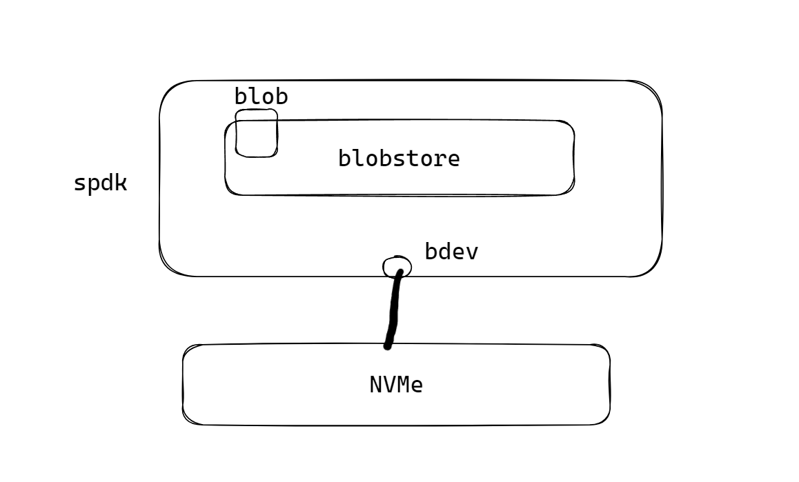

# Spdk的异步和同步

Spdk是存储的旁路处理（Bypass），可以绕过操作系统内核，直接使用驱动进行文件的操作，所以可以达到极高的磁盘操作IOPS（每秒io次数）。可以使用fio进行对比测试同样大小的文件读写操作，在不同的读写方案上的表现。psync是posix默认提供的阻塞接口，libaio是异步io，io_uring是Linux新的异步io，和spdk进行对比测试，结果如下：

| 读写磁盘方案 | read的IOPS | write的IOPS |
| ------------ | ---------- | ----------- |
| psync        | 7441       | 7391        |
| libaio       | 25.1k      | 25.1k       |
| io_uring     | 18.5k      | 18.5k       |
| spdk         | 828k       | 828k        |

> 测试前3种方案时，fio的执行只需要`./fio xxx.fio`，在xxx.fio文件中ioengine指定需要执行的磁盘读写方案。在测试spdk时需要执行`LD_PRELOAD=/spdk/build/fio/spdk_bdev  fio /spdk/examples/fio/bdev_config.fio`



SPDK的操作几乎所有的接口都是异步的，所以每一步操作都由一个完成的回调函数。SPDK的基本操作流程如下：

1. 把传入的json配置文件进行初始化spdk_app_opts_init。
2. spdk业务启动，开始spdk_app_start，需要提供完成后的回调函数ysxfs_entry。
3. ysxfs_entry的回调函数中，spdk_bdev_create_bs_dev_ext创建bdev，提供事件回调函数ysxfs_bdev_event_call。
4. ysxfs_entry的回调函数中，spdk_bs_init进行blobstore的创建和初始化，提供完成后的回调函数ysxfs_bs_init_complete。
5. ysxfs_bs_init_complete回调函数中，使用spdk_bs_get_io_unit_size获取配置文件配置的blob块大小，spdk_bs_create_blob创建blob，提供完成后的回调函数ysxfs_bs_create_complete。
6. ysxfs_bs_create_complete回调函数中，使用spdk_bs_open_blob打开该blob，提供完成后的回调函数ysxfs_blob_open_complete。
7. ysxfs_blob_open_complete回调函数中，使用spdk_bs_free_cluster_count获取blobstore中可用的空间，使用spdk_blob_resize分配blob的大小，提供完成后的回调函数ysxfs_blob_resize_complete。
8. ysxfs_blob_resize_complete回调函数中，使用spdk_blob_sync_md把申请的内存同步到blob中，提供完成后的回调函数ysxfs_blob_sync_complete。
9. ysxfs_blob_sync_complete回调函数中，使用spdk_malloc分配一块内存buffer，使用spdk_bs_alloc_io_channel分配一个读写blob的通道，使用spdk_blob_io_write把buffer的数据写入blob中，提供完成后的回调函数ysxfs_blob_write_complete。
10. ysxfs_blob_write_complete回调函数中，使用spdk_malloc先分配一块读的buffer，然后使用spdk_blob_io_read把数据从blob中读到buffer中，提供读完成后的回调函数ysxfs_blob_read_complete。
11. ysxfs_blob_read_complete回调函数中可以得到读取的错误码、blob里的数据读到buffer中。
12. 当结束后，需要先释放spdk_bs_free_io_channel释放读写的通道、spdk_free释放读写缓冲区、spdk_bs_unload进行blobstore的卸载，提供卸载完成的回调函数ysxfs_bs_unload_complete。
13. ysxfs_bs_unload_complete回调函数中进行去初始化spdk_app_stop(1)。

在整个流程中，通常封装一个结构体，作为每一个回调函数的入参，这样所以的回调函数都使用同一个上下文。

```c++
typedef struct ysxfs_context_s {
	struct spdk_bs_dev *bsdev;
	struct spdk_blob_store *blobstore;
	spdk_blob_id blobid;
	struct spdk_blob  *blob;
	struct spdk_io_channel *channel;
	uint8_t *write_buffer;
	uint8_t *read_buffer;
	uint64_t io_unit_size;
} ysxfs_context_t;
```

## 异步改同步

由于Posix提供的API都是同步阻塞的，不修改上层的业务代码的前提下，仅仅进行SPDK的替换，就需要使用SPDK实现同步阻塞的读写接口进行hack系统Posix函数替换。方式是创建一个线程，把回调函数抛去该线程去执行，而主线程循环等待回调函数完成就行。

```c++
static const int POLLER_MAX_TIME = 100000;
static bool poller(struct spdk_thread *thread, spdk_msg_fn start_fn, void *ctx, bool *finished) {
	spdk_thread_send_msg(thread, start_fn, ctx);
	int poller_count = 0;
	do {
		spdk_thread_poll(thread, 0, 0);
		poller_count ++;
	} while (!(*finished) && poller_count < POLLER_MAX_TIME);

	if (!(*finished) && poller_count >= POLLER_MAX_TIME) {
		return false;
	}
	return true;
}
```

