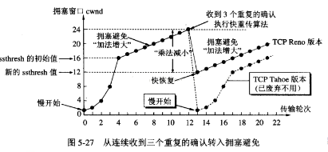

# 可靠的TCP传输

## TCP可靠传输的原因

1. TCP有ACK确认机制。
2. TCP有重传机制。
3. TCP的每一个包都有序号。
4. TCP协议栈会对收到的包进行重新排序。
5. TCP使用滑动窗口进行传输，可以进行流量控制和拥塞控制，利用好有限的带宽。

## TCP和UDP区别

| 选项     | UDP                                                    | TCP                              |
| -------- | ------------------------------------------------------ | -------------------------------- |
| 是否连接 | 无连接                                                 | 面向连接                         |
| 是否可靠 | 不可靠，不使用流量控制和拥塞控制                       | 可靠连接，使用流量控制和拥塞控制 |
| 传输方式 | 面向报文                                               | 面向字节流                       |
| 首部开销 | 首部开销小，只有8个字节                                | 首部最小20个字节，最大60个字节   |
| 适用场景 | 实时应用（电话、视频会议、直播）、游戏行业、物联网行业 | 可靠传输的应用（文件传输）       |

> 报文传输--发送和接受对应的，如：发送sendto(hello); sendto(world); 接受到recvfrom 返回 hello , 再次调用recvfrom 返回 world。
>
> 字节流传输-- 发送和接受不是一一对应，如：发送send(hello); send(world);接收recv一次就可以获取到helloworld。

## TCP可靠的传输的基础ARQ协议

​	网络传输是不可靠的，可靠的数据传输为数据能正常、有序的收到，其协议为ARQ（Automatic Repeat-reQuest）协议，TCP的可靠性基于此。

​	ARQ协议为自动重传请求，是传输层错误纠正协议之一，使用**确认**和**超时**两个机制，在不可靠的网络实现可靠的信息传输。

### ARQ协议的模式

#### 即停等式（stop-and-wait）ARQ

1. 发送方对接收方发送数据包，然后等待接收方回复ACK并且开始计时。
2. 在等待过程中，发送方停止发送新的数据包。
3. 当数据包没有成功被接收方接收，接收方不会发送ACK，这样发送方在等待一定时间后，重新发送数据包。
4. 反复以上步骤直到收到从接收方发送的ACK。

> 缺点为等待时间导致的较低的数据传输速度。

#### 回退n帧（go-back-n,GBN）ARQ

​	为了克服停等协议长时间等待ACK的缺陷，连续ARQ协议会连续发送一组数据包，然后再等待数据包的ACK。

> 滑动窗口：发送方和接收方都会维护一个数据帧的序列，这个序列被称作窗口。**发送方的窗口大小由接收方确定**，目的在于控制发送速度，以免接收方的缓存不够大，而导致溢出，同时控制流量也可以避免网络拥塞。协议中规定，对于窗口内未经确认的分组需要重传。

​	回退N帧协议允许发送方在等待超时的间歇，可以继续发送分组。所有发送的分组，都带有序号。

CBN发送方需响应以下三种事件：

1. 上层的调用。上层调用相应send()时，**发送方首先要检查发送窗口是否已满**。
2. 接收ACK。在该协议中，对序号为n的分组的确认采取累积确认的方式，表明接收方已正确接收到序号n以前(包括n)的所有分组。
3. 超时。若出现超时，发送方将重传所有已发出但还未被确认的分组。

CBN接收方的处理：

1. 若一个序号为n的分组被正确接收，并且按序，则接收方会为该分组返回一个ACK给发送方，并将该分组中的数据交付给上层。

2. 在其他情况下，接收方都会丢弃分组。

    > 若分组n已接收并交付，那么所有序号比n小的分组也已完成了交付，GBN采用累积确认，发送方在发完一个窗口里的所有分组后，会检查最大的有效确认，然后从最大有效确认的后一个分组开始重传。

序号为2的分组丢失，因此**分组2及之后的分组都将被重传**：

> GBN采用的技术包括序号、累积确认、检验和以及计时/重传。

#### 选择性重传（selective repeat,SR）ARQ

​	虽然GBN改善了停等协议中时间等待较长的缺陷，但它依旧存在着性能问题。特别是当窗口长度很大的时候，会使效率大大降低。

​	SR协议通过让发送方仅重传在接收方丢失或损坏了的分组，从而避免了不必要的重传，提高了效率。

SR协议的发送方：

1. 从上层收到数据。当从上层收到数据后，发送方需检查下一个可用于该分组的序号。若序号在窗口中则将数据发送。
2. 接收ACK。若收到ACK，且该分组在窗口内，则发送方将那个被确认的分组标记为已接收。若该分组序号等于基序号，则窗口序号向前移动到具有最小序号的未确认分组处。若窗口移动后并且有序号落在窗口内的未发送分组，则发送这些分组。
3. 超时。若出现超时，发送方将重传已发出但还未确认的分组。与GBN不同的是，SR协议中的每个分组都有**独立的计时器**。

SR协议的接收方：（假设分组长度为4）

1. 序号在[4,7]内的分组被正确接收。该情况下，收到的分组落在接收方的窗口内，一个ACK将发送给发送方。若该分组是以前没收到的分组，则被缓存。

2. 序号在[0,3]内的分组被正确接收。在该情况下，必须产生一个ACK。若接收方不确认该分组，发送方窗口将不能向前移动。若该分组的序号等于基序号，则该分组以及以前缓存的序号连续的分组都交付给上层，然后，接收窗口将向前移动。

3. 其他情况。忽略该分组。

    > 对于接收方来说，若一个分组正确接收而不管其是否按序，则接收方会为该分组返回一个ACK给发送方。失序的分组将被缓存，直到所有丢失的分组都被收到，这时才可以将一批分组按序交付给上层。

## RTT和RTO

​	RTO（Retransmission TimeOut）即重传超时时间。

​	RTT(Round-Trip  Time)： 往返时延。表示从发送端发送数据开始，到发送端收到来自接收端的确认（接收端收到数据后便立即发送确认），总共经历的时延。有三部分组成：

1. 链路的传播时间（propagation delay）
2. 末端系统的处理时间
3. 路由器缓存中的排队和处理时间（queuing delay）

前两个部分的值对于一个TCP连接相对固定，路由器缓存中的排队和处理时间会随着整个网络拥塞程度的变化而变化。 所以RTT的变化在一定程度上**反应网络的拥塞程度**。

## 流量控制

​	双方在通信的时候，发送方的速率与接收方的速率是不一定相等，如果发送方的发送速率太快，会导致接收方处理不过来，这时候接收方只能把处理不过来的数据存在缓存区里（失序的数据包也会被存放在缓存区里）接收缓存。

​	如果缓存区满了发送方还在疯狂着发送数据，接收方只能把收到的数据包丢掉，大量的丢包会极大着浪费网络资源，因此需要控制发送方的发送速率，让接收方与发送方处于一种动态平衡。对发送方发送速率的控制，称之为流量控制。

### 流量控制窗口探测

#### 降低发送速率

​	接收方每次收到数据包，可以在发送确定报文的时候，同时告诉发送方自己的缓存区还剩余多少是空闲的，通常把缓存区的剩余大小称之为接收窗口大小，用变量win来表示接收窗口的大小。

​	发送方收到之后，便会调整自己的发送速率，也就是调整自己发送窗口的大小，当发送方收到接收窗口的大小为0时，发送方就会停止发送数据，防止出现大量丢包情况的发生。

#### 重新开始发送

​	当接收方处理好数据，接受窗口 win > 0 时，**接收方发个通知报文**去通知发送方，告诉他可以继续发送数据了。当发送方收到窗口大于0的报文时，就继续发送数据。

​	当发送方收到接受窗口 win = 0 时，这时发送方停止发送报文，并且同时开启一个定时器，每隔一段时间就发个测试报文去询问接收方，打听是否可以继续发送数据了，如果可以，接收方就告诉他此时接受窗口的大小；如果接受窗口大小还是为0，则发送方再次刷新启动定时器。

----------

### 流量控制总结：

- 通信的双方都拥有两个滑动窗口，一个用于接受数据，称之为接收窗口；一个用于发送数据，称之为拥塞窗口(即发送窗口)。
- 接收窗口的大小是根据某种算法动态调整的。当接收窗口达到某个值的时候，再增大的话也不怎么会减少丢包率的了，而且还会更加消耗内存。所以接收窗口的大小必须根据网络环境以及发送方的拥塞窗口来动态调整。
- 收方在发送确认报文的时候，会告诉发送发自己的接收窗口大小，而发送方的发送窗口会据此来设置自己的发送窗口，但这并不意味着他们就会相等。首先接收方把确认报文发出去的那一刻，就已经在一边处理堆在自己缓存区的数据了，所以一般情况下**接收窗口>= 发送窗口**。

## 拥塞控制

拥塞控制和流量控制虽然采取的动作很相似，但拥塞控制与**网络的拥堵情况**相关联，而流量控制与接**收方的缓存状态**相关联。

