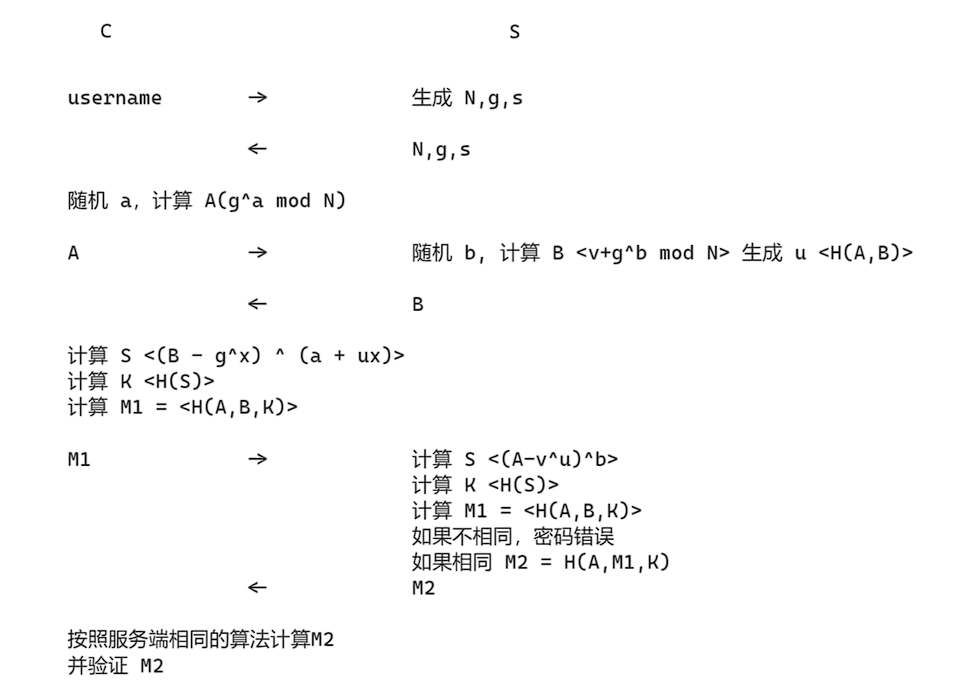
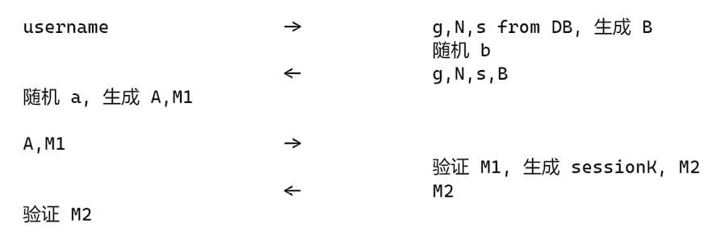
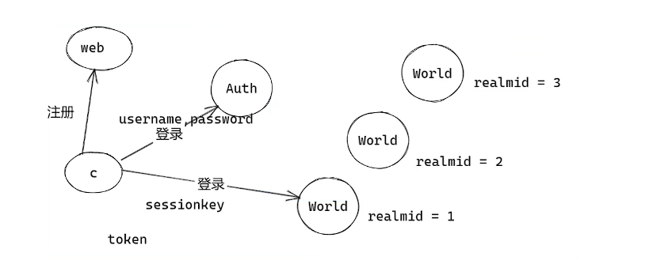

# TrinityCore的用户注册和登录

TrinityCore基于 srp 6 算法，实现了注册、登录流程，实现了客户端无需传输密码，达到安全登录验证的效果。

## SRP 6协议

Secure Remote Password (安全远程密码)。使用 SRP 协议的双端可以在不传送明文密码的情况下安全验证。通过这种做法可以避免密码在传输过程中被劫持。

> 协议描述文档：`http://srp.stanford.edu/design.html`

### SRP 6协议的变量

```shell
  N    A large safe prime (N = 2q+1, where q is prime)
       All arithmetic is done modulo N.(非常大的安全素数)
  g    A generator modulo N (模N的生成数)
  k    Multiplier parameter (k = H(N, g) in SRP-6a, k = 3 for legacy SRP-6)  (乘数参数)
  s    User's salt (盐值，用于混淆)
  I    Username
  p    Cleartext Password
  H()  One-way hash function (单向散列函数)
  ^    (Modular) Exponentiation (指数)
  u    Random scrambling parameter (随机加扰参数)
  a,b  Secret ephemeral values (临时私有随机值)
  A,B  Public ephemeral values (临时公共随机值)
  x    Private key (derived from p and s) (私钥)
  v    Password verifier (密码认证值)
```



SRP-6 的认证流程如上所示，客户端发送username到服务器后，得到服务器端的N、g、s，客户端计算A后发送服务器，得到服务器的返回值B，计算出M1最后发给服务器，得到服务器的M2值，和自己生成的M2值进行对比，如果一致，则认证通过。

## TrinityCore 中实现SRP-6 协议

变量定义如下

```shell
 N: 一个大的质数(N=2q+1) HexStrToByteArray<32>("894B645E89E1535BBDAD5B8B290650530801B18EBFBF5E8FAB3C82872A3E9BB7", true);

s: 32个字节的随机数  salt值
g: 7
v: g^sha1(salt, sha1(username, ":", password))mod N
b: 19个字节的随机数(服务端随机生成)
a: 19个字节的随机数(客户端随机生成)
B: 公钥 B = ((v*3) + g^b) mod N
K: sessionKey 
1. 客户端公钥 A = g^a mod N
2. x = sha1(salt, sha1(username, ":", password))
3. u = sha1(A,B)
4. S = (B-g^x*3)^(b+u*x) 32 字节
5. K 基于 S 的奇数部分和偶数部分分别进行hash，然后奇偶交错组合两个 hash 后的值。
M: 20个字节的数 M = sha1(t3, t4, s, A, B, K)
1. t3 = sha1(N)[i] ^ sha1(g)[i]
2. t4 = sha1(username)
k: 3
```



如上图所示，TrinityCore 实现客户端的登录流程。当客户端发送usernam给TrinityCore 后，服务器端从数据库中查到g、N、s，随机生成b，一同计算出B，然后回复客户端g、N、s、B，客户端收到数据后，随机生成a，计算出A、M1发送给服务器，服务器验证M1，生成sessionKey和M2，把M2发送给客户端，客户端也能验证M2后计算出sessionKey。

> N: 一个大的质数使用openssl里实现的bignum 大数进行使用计算。

登录流程图如下所示：



客户端在web注册用户名和密码后，使用用户名和密码进行认证服务器的登录，计算出sessionKey后，使用sessionKey进入world服务器里开始游戏。登录认证时从数据库中读取到的g、N、s，就是在注册时生成存入数据库中。rinityCore 实现SRP-6 协议时拆分成注册和登录验证两个流程，仅仅注册时需要输入密码，在服务器端生成密码校验器（verifier），后续的登录不需要传输密码到服务器端，密码加密保存在客户端本地，服务器仅仅保存密码校验器。

> TrinityCore 代码中的注册、登录流程在AuthSession.cpp中，在初始化InitHandlers中指定每一个流程的回调函数。
>
> SRP6协议的实现在SPR6.cpp文件中。
>
> 用户登录时在WorldSocket.cpp中进行处理，校验认证成功生成一个WordSession，绑定用户信息，后续的交互在WordSession进行。
