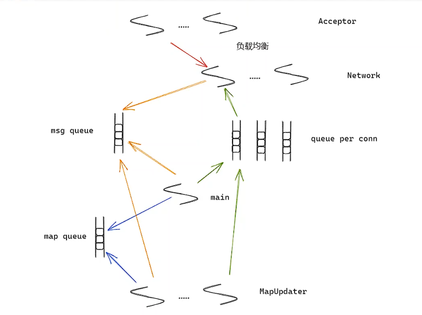

# TrinityCore的线程池

线程池的基本架构为一个主线程进行数据任务的封装，把任务通过负载均衡推送到各个工作线程的队列中，然后线程池中的工作线程从自己的队列中取出任务，然后进行读写数据等逻辑处理，基本线程池的设计如下：


线程池的设计需要考虑数据如何保证线程安全，主要就是main线程和worker线程之间的队列设计。消息队列一般由5个模式：

1. SPSC 单生产者单消费者
2. SPMC 单生产者多消费者
3. MPMC 多生产者多消费者
4. MPSC 多生产者单消费者
5. blocking queue  队列为空时阻塞worker线程，或者队列满时阻塞生产者线程。

前四种队列通常都可以使用lockerQueue队列进行设计，如果需要优化性能，可以考虑使用lork-free进行无锁队列设计。（如boost::lock_free::SPSC）。第五种是否阻塞队列，一定是使用有锁队列，并且需要使用条件变量进行阻塞线程。

在TrinityCore的线程池实现了3种队列：LockedQueue、MPSCQueue 、带阻塞的生产者消费者队列。

```shell
src/common/Threading/ThreadPool.h
src/common/Threading/LockedQueue.h
src/common/Threading/MPSCQueue.h
src/common/Threading/ProducerConsumerQueue.h
```

在TrinityCore中按照不同的业务功能，划分了多个线程池，主要由3个线程池构成了最主要的业务逻辑处理，分别是Acceptor线程池、Network线程池和MapUpdater线程池。



### Acceptor线程池

Acceptor线程池的作用是接受客户端的连接，当客户端进行TCP三次握手完成后，使用accept函数从全连接队列中取到客户端的fd、socket等信息，负载均衡后分发到Network线程池。

```c++
// src/server/worldserver/Main.cpp
// 创建io上下文，相当于创建一个Reacotr
std::shared_ptr<Trinity::Asio::IoContext> ioContext = std::make_shared<Trinity::Asio::IoContext>();
// 读取线程数量
// Start the Boost based thread pool
 int numThreads = sConfigMgr->GetIntDefault("ThreadPool", 1);
if (numThreads < 1)
    numThreads = 1;
// 创建accept线程池
std::shared_ptr<Trinity::ThreadPool> threadPool = std::make_shared<Trinity::ThreadPool>(numThreads);
// 进行线程池的消息循环，处理IO事件（accept事件）
for (int i = 0; i < numThreads; ++i)
    threadPool->PostWork([ioContext]() { ioContext->run(); });
// 开始accept线程池（认证）
// Start the Remote Access port (acceptor) if enabled
std::unique_ptr<AsyncAcceptor> raAcceptor;
if (sConfigMgr->GetBoolDefault("Ra.Enable", false))
	raAcceptor.reset(StartRaSocketAcceptor(*ioContext));

```

### Network 线程池

```c++
// src/server/worldserver/Main.cpp
// 创建Network 的 accept线程池
// Launch the worldserver listener socket
uint16 worldPort = uint16(sWorld->getIntConfig(CONFIG_PORT_WORLD));
std::string worldListener = sConfigMgr->GetStringDefault("BindIP", "0.0.0.0");

int networkThreads = sConfigMgr->GetIntDefault("Network.Threads", 1);

if (networkThreads <= 0) {
    TC_LOG_ERROR("server.worldserver", "Network.Threads must be greater than 0");
    World::StopNow(ERROR_EXIT_CODE);
    return 1;
}
// 开始Network的accept线程池
if (!sWorldSocketMgr.StartWorldNetwork(*ioContext, worldListener, worldPort, networkThreads)) {
    TC_LOG_ERROR("server.worldserver", "Failed to initialize network");
    World::StopNow(ERROR_EXIT_CODE);
    return 1;
}

// src/server/game/Server/WorldSocketMgr.cpp
// 开始Network线程池
bool WorldSocketMgr::StartWorldNetwork(Trinity::Asio::IoContext & ioContext, std::string const& bindIp, uint16 port, int threadCount) {
    _tcpNoDelay = sConfigMgr->GetBoolDefault("Network.TcpNodelay", true);

    int const max_connections = TRINITY_MAX_LISTEN_CONNECTIONS;
    TC_LOG_DEBUG("misc", "Max allowed socket connections {}", max_connections);

    // -1 means use default
    _socketSystemSendBufferSize = sConfigMgr->GetIntDefault("Network.OutKBuff", -1);

    _socketApplicationSendBufferSize = sConfigMgr->GetIntDefault("Network.OutUBuff", 65536);

    if (_socketApplicationSendBufferSize <= 0) {
        TC_LOG_ERROR("misc", "Network.OutUBuff is wrong in your config file");
        return false;
    }

    if (!BaseSocketMgr::StartNetwork(ioContext, bindIp, port, threadCount))
        return false;
    // 设置处理客户端连接socket的线程
    _acceptor->AsyncAcceptWithCallback<&OnSocketAccept>();

    sScriptMgr->OnNetworkStart();
    return true;
}

// src/server/shared/Networking/SocketMgr.h
// 创建network线程池，accept线程池的客户端连接负载均衡到network线程池
virtual bool StartNetwork(Trinity::Asio::IoContext & ioContext, std::string const& bindIp, uint16 port, int threadCount) {
    ASSERT(threadCount > 0);

    AsyncAcceptor* acceptor = nullptr;
    try {
        acceptor = new AsyncAcceptor(ioContext, bindIp, port);
    }
    catch (boost::system::system_error const& err) {
        TC_LOG_ERROR("network", "Exception caught in SocketMgr.StartNetwork ({}:{}): {}", bindIp, port, err.what());
        return false;
    }

    if (!acceptor->Bind()) {
        TC_LOG_ERROR("network", "StartNetwork failed to bind socket acceptor");
        delete acceptor;
        return false;
    }
    // 创建network处理线程池
    _acceptor = acceptor;
    _threadCount = threadCount;
    _threads = CreateThreads();

    ASSERT(_threads);

    for (int32 i = 0; i < _threadCount; ++i)
        _threads[i].Start();
    // 进行负载均衡，分发socket到network线程池
    _acceptor->SetSocketFactory([this]() { return GetSocketForAccept(); });

    return true;
}
// src/server/shared/Networking/SocketMgr.h
// 负载均衡，取到最小处理的线程id
std::pair<tcp::socket*, uint32> GetSocketForAccept() {
    uint32 threadIndex = SelectThreadWithMinConnections();
    return std::make_pair(_threads[threadIndex].GetSocketForAccept(), threadIndex);
}
// src/server/shared/Networking/SocketMgr.h
// 客户端socket加入network处理线程
virtual void OnSocketOpen(tcp::socket&& sock, uint32 threadIndex) {
    try {
        std::shared_ptr<SocketType> newSocket = std::make_shared<SocketType>(std::move(sock));
        newSocket->Start();

        _threads[threadIndex].AddSocket(newSocket);
    }
    catch (boost::system::system_error const& err) {
        TC_LOG_WARN("network", "Failed to retrieve client's remote address {}", err.what());
    }
}
```

> Accept的 ioContext可以多个线程进行处理同一个ioContext，但是客户端的链接ioContext只能绑定一个network线程处理，否则会出现多线程的问题。

Network线程收到客户端的数据后，会把数据放到队列中，由Main或者MapUpdate处理客户端的数据。

```c++
// 解析不同的客户端数据后，封装成packet进行消息队列中
WorldSocket::ReadDataHandlerResult WorldSocket::ReadDataHandler()
{
    ClientPktHeader* header = reinterpret_cast<ClientPktHeader*>(_headerBuffer.GetReadPointer());
    OpcodeClient opcode = static_cast<OpcodeClient>(header->cmd);

    WorldPacket packet(opcode, std::move(_packetBuffer));
    WorldPacket* packetToQueue;

    if (sPacketLog->CanLogPacket())
        sPacketLog->LogPacket(packet, CLIENT_TO_SERVER, GetRemoteIpAddress(), GetRemotePort());

    std::unique_lock<std::mutex> sessionGuard(_worldSessionLock, std::defer_lock);

    switch (opcode)
    {
        case CMSG_PING:
        {
            LogOpcodeText(opcode, sessionGuard);
            try
            {
                return HandlePing(packet) ? ReadDataHandlerResult::Ok : ReadDataHandlerResult::Error;
            }
            catch (ByteBufferException const&)
            {
            }
            TC_LOG_ERROR("network", "WorldSocket::ReadDataHandler(): client {} sent malformed CMSG_PING", GetRemoteIpAddress().to_string());
            return ReadDataHandlerResult::Error;
        }
        case CMSG_AUTH_SESSION:
        {
            LogOpcodeText(opcode, sessionGuard);
            if (_authed)
            {
                // locking just to safely log offending user is probably overkill but we are disconnecting him anyway
                if (sessionGuard.try_lock())
                    TC_LOG_ERROR("network", "WorldSocket::ProcessIncoming: received duplicate CMSG_AUTH_SESSION from {}", _worldSession->GetPlayerInfo());
                return ReadDataHandlerResult::Error;
            }

            try
            {
                HandleAuthSession(packet);
                return ReadDataHandlerResult::WaitingForQuery;
            }
            catch (ByteBufferException const&)
            {
            }
            TC_LOG_ERROR("network", "WorldSocket::ReadDataHandler(): client {} sent malformed CMSG_AUTH_SESSION", GetRemoteIpAddress().to_string());
            return ReadDataHandlerResult::Error;
        }
        case CMSG_KEEP_ALIVE: // todo: handle this packet in the same way of CMSG_TIME_SYNC_RESP
            sessionGuard.lock();
            LogOpcodeText(opcode, sessionGuard);
            if (_worldSession)
            {
                _worldSession->ResetTimeOutTime(true);
                return ReadDataHandlerResult::Ok;
            }
            TC_LOG_ERROR("network", "WorldSocket::ReadDataHandler: client {} sent CMSG_KEEP_ALIVE without being authenticated", GetRemoteIpAddress().to_string());
            return ReadDataHandlerResult::Error;
        case CMSG_TIME_SYNC_RESP:
            packetToQueue = new WorldPacket(std::move(packet), std::chrono::steady_clock::now());
            break;

        default:
            packetToQueue = new WorldPacket(std::move(packet));
            break;
    }

    sessionGuard.lock();

    LogOpcodeText(opcode, sessionGuard);

    if (!_worldSession)
    {
        TC_LOG_ERROR("network.opcode", "ProcessIncoming: Client not authed opcode = {}", uint32(opcode));
        delete packetToQueue;
        return ReadDataHandlerResult::Error;
    }

    OpcodeHandler const* handler = opcodeTable[opcode];
    if (!handler)
    {
        TC_LOG_ERROR("network.opcode", "No defined handler for opcode {} sent by {}", GetOpcodeNameForLogging(static_cast<OpcodeClient>(packet.GetOpcode())), _worldSession->GetPlayerInfo());
        delete packetToQueue;
        return ReadDataHandlerResult::Error;
    }

    // Our Idle timer will reset on any non PING opcodes on login screen, allowing us to catch people idling.
    _worldSession->ResetTimeOutTime(false);
	// 入队列
    // Copy the packet to the heap before enqueuing
    _worldSession->QueuePacket(packetToQueue);

    return ReadDataHandlerResult::Ok;
}
```

### Map线程池处理数据

main函数主线程会从network线程池的msg消息队列中取数据（如心跳包），main线程直接回复数据写入Network线程池的发送队列中，main线程也会处理一些客户端的操作发送到map线程的队列中进行处理。

```c++
// main 函数的主线程进行数据的读取和处理
// src/server/game/World/World.cpp
void World::UpdateSessions(uint32 diff)
{
    {
        TC_METRIC_DETAILED_NO_THRESHOLD_TIMER("world_update_time",
            TC_METRIC_TAG("type", "Add sessions"),
            TC_METRIC_TAG("parent_type", "Update sessions"));
        ///- Add new sessions
        WorldSession* sess = nullptr;
        while (addSessQueue.next(sess))
            AddSession_(sess);
    }

    ///- Then send an update signal to remaining ones
    for (SessionMap::iterator itr = m_sessions.begin(), next; itr != m_sessions.end(); itr = next)
    {
        next = itr;
        ++next;

        ///- and remove not active sessions from the list
        WorldSession* pSession = itr->second;
        WorldSessionFilter updater(pSession);

        [[maybe_unused]] uint32 currentSessionId = itr->first;
        TC_METRIC_DETAILED_TIMER("world_update_sessions_time", TC_METRIC_TAG("account_id", std::to_string(currentSessionId)));
		// 消息出队列，并且进行处理
        if (!pSession->Update(diff, updater))    // As interval = 0
        {
            if (!RemoveQueuedPlayer(itr->second) && itr->second && getIntConfig(CONFIG_INTERVAL_DISCONNECT_TOLERANCE))
                m_disconnects[itr->second->GetAccountId()] = GameTime::GetGameTime();
            RemoveQueuedPlayer(pSession);
            m_sessions.erase(itr);
            delete pSession;

        }
    }
}

// main函数主线程仅仅处理需要过滤处理特定的消息
// src/server/game/Server/WorldSession.cpp
//we should process ALL packets when player is not in world/logged in
//OR packet handler is not thread-safe!
bool WorldSessionFilter::Process(WorldPacket* packet)
{
    ClientOpcodeHandler const* opHandle = opcodeTable[static_cast<OpcodeClient>(packet->GetOpcode())];

    //check if packet handler is supposed to be safe
    if (opHandle->ProcessingPlace == PROCESS_INPLACE)
        return true;

    //thread-unsafe packets should be processed in World::UpdateSessions()
    if (opHandle->ProcessingPlace == PROCESS_THREADUNSAFE)
        return true;

    //no player attached? -> our client! ^^
    Player* player = m_pSession->GetPlayer();
    if (!player)
        return true;

    //lets process all packets for non-in-the-world player
    return (player->IsInWorld() == false);
}
```

一个游戏大地图会被切分为不同的地图，map线程就对应了一块地图，当玩家进入这个地图时，该地图线程才进行数据处理。Map线程池会从Network队列中取出玩家的数据进行地图内的各种操作，也会处理由main线程发送的消息，最后把需要回复的数据也写入Network线程池的发送队列中。

```c++
// 玩家进入，按照地图id，创建地图map
// src/server/game/Maps/MapManager.cpp
Map* MapManager::CreateBaseMap(uint32 id)
{
    Map* map = FindBaseMap(id);
    if (map == nullptr)
    {
        std::lock_guard<std::mutex> lock(_mapsLock);
        MapEntry const* entry = sMapStore.LookupEntry(id);
        ASSERT(entry);

        if (entry->Instanceable())
            map = new MapInstanced(id, i_gridCleanUpDelay);
        else
        {
            map = new Map(id, i_gridCleanUpDelay, 0, REGULAR_DIFFICULTY);
            map->LoadRespawnTimes();
            map->LoadCorpseData();
        }
        Trinity::unique_trackable_ptr<Map>& ptr = i_maps[id];
        ptr.reset(map);
        map->SetWeakPtr(ptr);
        sScriptMgr->OnCreateMap(map);
    }
    ASSERT(map);
    return map;
}

// 发送需要更新map线程的消息，进入map的消息队列
// src/server/game/Maps/MapUpdater.cpp
void MapUpdater::schedule_update(Map& map, uint32 diff)
{
    std::lock_guard<std::mutex> lock(_lock);
    ++pending_requests;
    // 会阻塞的生产者消费者队列
    _queue.Push(new MapUpdateRequest(map, *this, diff));
}

// src/server/game/Maps/MapUpdater.cpp
// map线程池的线程进行数据更新
void MapUpdater::WorkerThread()
{
    LoginDatabase.WarnAboutSyncQueries(true);
    CharacterDatabase.WarnAboutSyncQueries(true);
    WorldDatabase.WarnAboutSyncQueries(true);

    while (true)
    {
        MapUpdateRequest* request = nullptr;
        _queue.WaitAndPop(request);
        if (_cancelationToken)
            return;
        request->call();
        delete request;
    }
}
// map线程池从network队列中取出数据，进行数据更新
// src/server/game/Maps/Map.cpp
// void Map::Update(uint32 t_diff)
_dynamicTree.update(t_diff);
/// update worldsessions for existing players
for (m_mapRefIter = m_mapRefManager.begin(); m_mapRefIter != m_mapRefManager.end(); ++m_mapRefIter) {
    Player* player = m_mapRefIter->GetSource();
    if (player && player->IsInWorld()) {
        //player->Update(t_diff);
        WorldSession* session = player->GetSession();
        // 创建过滤器，从队列中取出数据进行map处理
        MapSessionFilter updater(session);
        session->Update(t_diff, updater);
    }
}
```

在main函数的主线程的游戏**帧更新**，实际上会进行**每一个地图map的的数据更新**，给客户端发送数据是多生产者单消费者的模型，可以使用无锁队列。

## 总结

1. Acceptor线程负责接受客户端连接，将接受到的连接通过负责均衡丢给Network进行客户端的数据处理。
2. Network线程负责异步读取数据，处理客户端的socket，读出数据后生成session数据包，将数据包进入队列中由main线程和Map线程处理。
3. main线程统一调度整个游戏，包括数据初始化、线程池创建等，并且同步协调Map线程的运行。
4. Map线程处理游戏中的运行逻辑，可能多个活跃地图对应一个Map线程，Map线程每次只更新一个游戏zhen