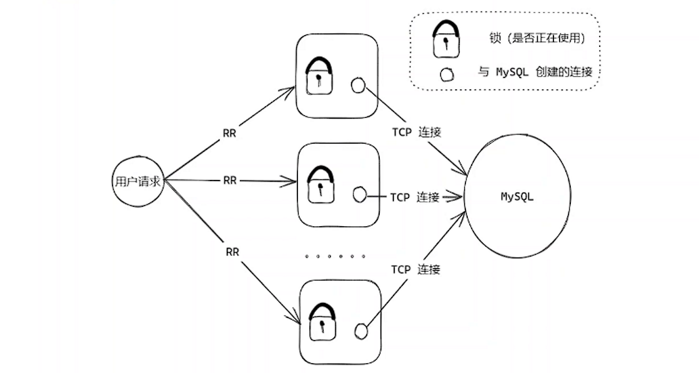
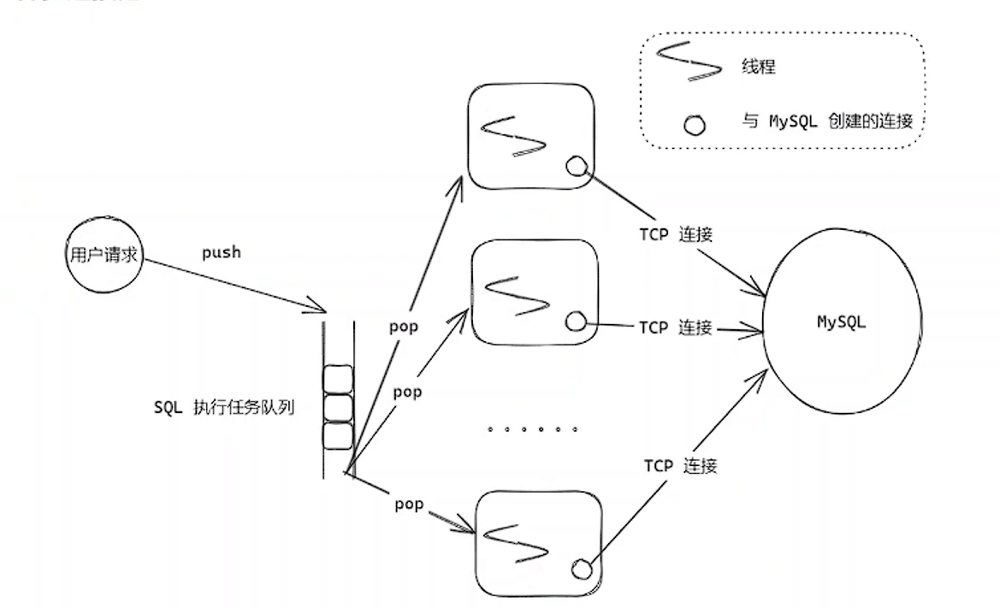

# TrinityCore 的数据库连接池

## 同步连接池

TrinityCore 使用同步连接池，用于服务器端程序启动时，从数据库中读取初始化需要的所有数据，确保所有数据就绪后，开启游戏内容。使用同步连接池目的是开启多个线程，加快服务器端数据初始化过程，而使用同步的原因在于，初始化数据还没有准备好时，是不能开启业务的，所以需要等待所有的数据初始化完成，使用同步连接池。



同步连接池每一个线程都有一把锁标记是否正在使用，保护和数据库的TCP链接，只有同步完成数据库的操作后才解锁。

## 异步连接池

TrinityCore 使用异步连接池，用于游戏内存服务时，不占用当前的逻辑线程，从而可以并发处理更多的客户端请求。



实现异步连接池TrinityCore 抽象了3种数据库请求方式：pipeline、chain、transation模式。

pipeline用于sql之间无关联的场景，把多个SQL回调融合到一个回调当中，从代码层面更加清晰。

```c++
// src/server/game/Handlers/CharacterHandler.cpp
// void WorldSession::HandlePlayerLoginOpcode(WorldPacket& recvData)
// 注册统一的回调函数
AddQueryHolderCallback(CharacterDatabase.DelayQueryHolder(holder)).AfterComplete([this](SQLQueryHolderBase const& holder)
{
    HandlePlayerLogin(static_cast<LoginQueryHolder const&>(holder));
});

// src/server/game/Handlers/CharacterHandler.cpp
// 多个sql语句异步查询
bool LoginQueryHolder::Initialize()
{
    SetSize(MAX_PLAYER_LOGIN_QUERY);

    bool res = true;
    ObjectGuid::LowType lowGuid = m_guid.GetCounter();

    CharacterDatabasePreparedStatement* stmt = CharacterDatabase.GetPreparedStatement(CHAR_SEL_CHARACTER);
    stmt->setUInt32(0, lowGuid);
    res &= SetPreparedQuery(PLAYER_LOGIN_QUERY_LOAD_FROM, stmt);

    stmt = CharacterDatabase.GetPreparedStatement(CHAR_SEL_GROUP_MEMBER);
    stmt->setUInt32(0, lowGuid);
    res &= SetPreparedQuery(PLAYER_LOGIN_QUERY_LOAD_GROUP, stmt);
    .......
}

// 获取查询结果
// src/server/game/Handlers/CharacterHandler.cpp
// void WorldSession::HandlePlayerLogin(LoginQueryHolder const& holder)
// load player specific part before send times
LoadAccountData(holder.GetPreparedResult(PLAYER_LOGIN_QUERY_LOAD_ACCOUNT_DATA), PER_CHARACTER_CACHE_MASK);
//QueryResult* result = CharacterDatabase.PQuery("SELECT guildid, rank FROM guild_member WHERE guid = '{}'", pCurrChar->GetGUID().GetCounter());
PreparedQueryResult resultGuild = holder.GetPreparedResult(PLAYER_LOGIN_QUERY_LOAD_GUILD);
// Place character in world (and load zone) before some object loading
pCurrChar->LoadCorpse(holder.GetPreparedResult(PLAYER_LOGIN_QUERY_LOAD_CORPSE_LOCATION));
    
```


chain 模式用于sql之间有关联的场景，基于责任链模式，把多个离散的回调进行复用上下文，更好的处理sql之间依赖的关系。

```c++
// src/server/game/Handlers/CharacterHandler.cpp
// void WorldSession::HandleCharCreateOpcode(WorldPacket& recvData)
// chain模式异步数据库获取数据
_queryProcessor.AddCallback(CharacterDatabase.AsyncQuery(stmt)
    .WithChainingPreparedCallback([this](QueryCallback& queryCallback, PreparedQueryResult result) {
····················
        })
    .WithChainingPreparedCallback([this](QueryCallback& queryCallback, PreparedQueryResult result) {
····················
        })
    .WithChainingPreparedCallback([this, createInfo](QueryCallback& queryCallback, PreparedQueryResult result) {
        ..............
}));
```

transation模式用于一组sql必须是原子的，基于数据库的事务模式，这组sql语句要么全部执行成功，要么全部执行失败，意味着如果中间有语句执行失败，可以进行回滚。