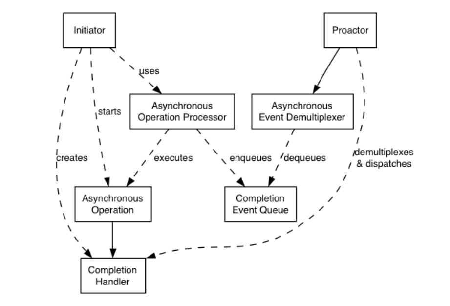

# TrinityCore 的网络模块

在网络编程中，最基础最本质的就是基于Socket进行网络数据的传输，其基本流程如下图所示：


在TrinityCore 中，其网络模块使用的是基于boost.asio 的异步IO操作。

## 同步IO和异步IO

网络编程中，本质是处理4件事情：接受连接、连接断开、数据接收、数据发送。

在Linux上使用posix api都是同步的IO操作，使用同步IO时常常使用的网络模型的reactor网络模型，其组成时检测select、poll、epoll 和 非阻塞 io 接口 accept、send/write、recv/read构成。Reactor模型是把未知的数据接收和发送，转换为不同事件类型，检测IO触发不同的事件，由事件进行驱动操作IO接口。

而异步IO通常使用模型是proactor，具体在不同的操作系统上，在windows上基于iocp（完成端口），在Linux上基于io_uring接口。其原理是用户层只需要下发请求，其他的所有的操作都由操作系统内核完成，完成后通知用户层即可，不需要用户层主动调用操作IO的接口从内核层中拷贝数据到应用层。

Reactor和Proactor的处理流程的差异如下：

1. reactor注册fd句柄的事件后，当事件触发后，再操作IO；proactor 需要进行绑定到内核对象上，之后不断进行事件的投递和触发完成。
2. reactor 注册一次后，可以进行多次响应；proactor投递一次异步请求，只完成一次。
3. reactor 使用同步IO，同步IO需要主动拷贝数据；proactor使用异步IO，内核直接拷贝数据，再完成通知。

## 异步IO----IOCP 完成端口

完成端口不是指物理上的端口，也不是指网络中的端口，而是指操作系统所提供的一种机制。这种机制是操作系统提供一种高效处理 io 操作结果的通知机制。总之，完成端口是一种实现高效异步 io 的机制。其原理图如下：


iocp 使用通常需要与**重叠IO**一同使用。**重叠 io**是无需等待上一个 IO 操作完成就可以提交下一个 IO 操作请求。也就是这些 IO 操作可以堆叠在一起。

> 注意：尽管 IO 操作是按顺序投递的，但是 IO 操作完成通知可以是随机无需的（在多线程等待 IO 完成通知时）。

### IOCP的常用接口

- CreateIoCompletionPort：该接口可以仅创建 IO 完成端口，也可以将现有 IO 完成端口与支持重叠 IO 的任何句柄（TCP 套接字，文件，命名管道等）相关联。

```c++
// 头文件：ioapiset.h
HANDLE CreateIoCompletionPort(
  [in]           HANDLE    FileHandle,
  [in, optional] HANDLE   
 ExistingCompletionPort,
  [in]           ULONG_PTR CompletionKey,
  [in]           DWORD     
NumberOfConcurrentThreads
);
```

- AcceptEx：AcceptEx 函数接受新连接，返回本地和远程地址，并接收客户端应用程序发送的第一个数据块。

```c++
BOOL AcceptEx(
  [in]  SOCKET       sListenSocket,
  [in]  SOCKET       sAcceptSocket,
  [in]  PVOID        lpOutputBuffer,
  [in]  DWORD        dwReceiveDataLength,
  [in]  DWORD        dwLocalAddressLength,
  [in]  DWORD        dwRemoteAddressLength,
  [out] LPDWORD      lpdwBytesReceived,
  [in]  LPOVERLAPPED lpOverlapped
);
```

- ConnectEx：ConnectEx 函数与指定的套接字建立连接，并可以选择在建立连接后发送数据。 仅在面向连接的套接字上支持ConnectEx 函数。

```c++
BOOL ConnectEx(
  [in]           SOCKET s,
  [in]           const sockaddr *name,
  [in]           int namelen,
  [in, optional] PVOID lpSendBuffer,
  [in]           DWORD dwSendDataLength,
  [out]          LPDWORD lpdwBytesSent,
  [in]           LPOVERLAPPED lpOverlapped
)
```

- DisconnectEx：DisconnectEx 函数关闭套接字上的连接，并允许重用套接字句柄。

```c++
BOOL DisconnectEx(
  SOCKET s,
  LPOVERLAPPED lpOverlapped,
  DWORD dwFlags,
  DWORD dwReserved
)
```

- WSARecv：WSARecv 函数从连接的套接字或绑定的无连接套接字接收数据。

```c++
int WSAAPI WSARecv(
  [in]      SOCKET s,
  [in, out] LPWSABUF lpBuffers,
  [in]      DWORD dwBufferCount,
  [out]     LPDWORD lpNumberOfBytesRecvd,
  [in, out] LPDWORD lpFlags,
  [in]      LPWSAOVERLAPPED lpOverlapped,
  [in]      LPWSAOVERLAPPED_COMPLETION_ROUTINE lpCompletionRoutine
);
```

- WSASend：WSASend 函数在连接的套接字上发送数据。

```c++
int WSAAPI WSASend(
  [in]  SOCKET                             s,
  [in]  LPWSABUF lpBuffers,
  [in]  DWORD dwBufferCount,
  [out] LPDWORD lpNumberOfBytesSent,
  [in]  DWORD dwFlags,
  [in]  LPWSAOVERLAPPED lpOverlapped,
  [in]  LPWSAOVERLAPPED_COMPLETION_ROUTINE  lpCompletionRoutine
);
```

- GetQueuedCompletionStatus：尝试从指定的 I/O 完成端口取消对 I/O 完成数据包的排队。如果没有完成数据包排队，函数将等待与完成端口关联的挂起 I/O 操作完成。此函数将线程与指定的完成端口相关联。 一个线程最多可以与一个完成端口相关联。

```c++
BOOL GetQueuedCompletionStatus(
  [in]  HANDLE       CompletionPort,
        LPDWORD      lpNumberOfBytesTransferred,
  [out] PULONG_PTR   lpCompletionKey,
  [out] LPOVERLAPPED *lpOverlapped,
  [in]  DWORD        dwMilliseconds
);
```

使用IOCP的基本流程如下所示：


```c++
#include <WinSock2.h>
#include <MSWSock.h>
#include <cstring>
#include <iostream>

#define BUFFER_SIZE 1024
#define THREAD_COUNT 2
#define START_POST_ACCEPTEX 2
#define PORT 8989

enum class IO_OP_TYPE {
	IO_ACCEPT,  // accept
	IO_SEND,
	IO_RECV,
	IO_CONNECT,
	IO_DISCONNECT,
};

struct ServerParams {
	SOCKET listenSocket;
	HANDLE completionPort;
};
// 扩展OVERLAPPED，后面增加字段，作为标识这个投递的请求
typedef struct OverlappedPerIO {
	OVERLAPPED overlapped;
	SOCKET socket;
	WSABUF wsaBuf;
	IO_OP_TYPE type;
	char buffer[BUFFER_SIZE];
} *LPOverlappedPerIO;
// 投递accept请求
void PostAcceptEx(SOCKET listenSocket) {
	SOCKET sock = WSASocket(AF_INET, SOCK_STREAM, 0, NULL, 0, WSA_FLAG_OVERLAPPED);
	if (sock == INVALID_SOCKET) {
		return;
	}
	OverlappedPerIO* overlp = new OverlappedPerIO;
	if (overlp == nullptr) {
		closesocket(sock);
		return;
	}
	ZeroMemory(overlp, sizeof(OverlappedPerIO));
	overlp->socket = sock;
	overlp->wsaBuf.buf = overlp->buffer;
	overlp->wsaBuf.len = BUFFER_SIZE;
	overlp->type = IO_OP_TYPE::IO_ACCEPT;

	DWORD dwByteRecv = 0;
	while (false == AcceptEx(listenSocket,
		sock,
		overlp->wsaBuf.buf,
		0,
		sizeof(SOCKADDR_IN) + 16,
		sizeof(SOCKADDR_IN) + 16,
		&dwByteRecv,
		(LPOVERLAPPED)overlp)) {
		if (WSAGetLastError() == WSA_IO_PENDING) {
			break;
		}
		std::cout << WSAGetLastError() << std::endl;
	}
}
// 工作线程，处理accept建立连接、recv接收数据，send发送数据
DWORD WINAPI workerThread(LPVOID lpParam) {
	ServerParams* pms = (ServerParams*)lpParam;
	HANDLE completionPort = pms->completionPort;
	SOCKET listenSocket = pms->listenSocket;

	DWORD bytesTrans;
	ULONG_PTR comletionKey;
	LPOverlappedPerIO overlp;
	int ret;
	while (true) {
		// 获取异步结果
		BOOL result = GetQueuedCompletionStatus(
			completionPort,
			&bytesTrans,
			&comletionKey,
			(LPOVERLAPPED*)&overlp,
			INFINITE);
		if (!result) {
			if ((GetLastError() == WAIT_TIMEOUT) || (GetLastError() == ERROR_NETNAME_DELETED)) {
				std::cout << "socket disconnection:" << overlp->socket << std::endl;
				closesocket(overlp->socket);
				delete overlp;
				continue;
			}
			std::cout << "GetQueuedCompletionStatus failed" << std::endl;
			return 0;
		}
		switch (overlp->type) {
		case IO_OP_TYPE::IO_ACCEPT:
		{
			// 再次抛出建立客户端链接请求
			PostAcceptEx(listenSocket);
			std::cout << "happed IO_ACCEPT:" << bytesTrans << std::endl;
			setsockopt(overlp->socket, SOL_SOCKET, SO_UPDATE_ACCEPT_CONTEXT, (char*)&(listenSocket), sizeof(SOCKET));

			ZeroMemory(overlp->buffer, BUFFER_SIZE);
			overlp->type = IO_OP_TYPE::IO_RECV;
			overlp->wsaBuf.buf = overlp->buffer;
			overlp->wsaBuf.len = BUFFER_SIZE;
			CreateIoCompletionPort((HANDLE)overlp->socket, completionPort, NULL, 0);

			DWORD dwRecv = 0, dwFlag = 0;
			// 抛出接收数据请求
			ret = WSARecv(overlp->socket, &overlp->wsaBuf, 1, &dwRecv, &dwFlag, &(overlp->overlapped), 0);
			if (ret == SOCKET_ERROR && WSAGetLastError() != WSA_IO_PENDING) {
				std::cout << "WSARecv failed:" << WSAGetLastError() << std::endl;
			}
		}
		break;
		case IO_OP_TYPE::IO_RECV:
		{
			std::cout << "happed IO_RECV:" << bytesTrans << std::endl;
			if (bytesTrans == 0) {
				std::cout << "socket disconnection:" << overlp->socket << std::endl;
				closesocket(overlp->socket);
				delete overlp;
				continue;
			}

			std::cout << "recved data:" << overlp->buffer << std::endl;

			ZeroMemory(&overlp->overlapped, sizeof(OVERLAPPED));
			overlp->type = IO_OP_TYPE::IO_SEND;
			overlp->wsaBuf.buf = "response from server\n";
			overlp->wsaBuf.len = strlen("response from server\n");

			DWORD dwSend = 0;
			// 抛出发送数据请求
			ret = WSASend(overlp->socket, &overlp->wsaBuf, 1, &dwSend, 0, &(overlp->overlapped), 0);
			if (ret == SOCKET_ERROR && WSAGetLastError() != WSA_IO_PENDING) {
				std::cout << "WSARecv failed:" << WSAGetLastError() << std::endl;
			}
		}
		break;
		case IO_OP_TYPE::IO_SEND:
		{
			std::cout << "happed IO_SEND:" << bytesTrans << std::endl;
			if (bytesTrans == 0) {
				std::cout << "socket disconnection:" << overlp->socket << std::endl;
				closesocket(overlp->socket);
				delete overlp;
				continue;
			}
		}
		break;
		}
	}
	return 0;
}

// 初始化服务器监听
int InitServer(ServerParams& pms) {
	WSADATA wsaData;
	int ret;
    // 网络库2.2版本
	ret = WSAStartup(MAKEWORD(2, 2), &wsaData);
	if (ret == 0) {
		pms.listenSocket = WSASocket(AF_INET, SOCK_STREAM, 0, NULL, 0, WSA_FLAG_OVERLAPPED); // 创建重叠IO
		if (pms.listenSocket != INVALID_SOCKET) {
			// 绑定服务器的ip和端口
			sockaddr_in address;
			address.sin_family = AF_INET;
			address.sin_addr.s_addr = INADDR_ANY;
			address.sin_port = htons(PORT);
			ret = bind(pms.listenSocket, (const sockaddr*)&address, sizeof(address));
			if (ret == 0) {
				ret = listen(pms.listenSocket, SOMAXCONN);
				if (ret == 0) {
					pms.completionPort = CreateIoCompletionPort(INVALID_HANDLE_VALUE, NULL, 0, 0); // 创建IOCP
					if (pms.completionPort != NULL) {
						// listenSocket 设置到IOCP里，将现有 IO 完成端口与支持重叠IO相关联
						if (NULL != CreateIoCompletionPort((HANDLE)pms.listenSocket,
							pms.completionPort,
							NULL,
							0)) {
							return 0;
						}
						CloseHandle(pms.completionPort);
					}
				}
			}
		}
		closesocket(pms.listenSocket);
	}
	WSACleanup();
	if (ret == 0) ret = -1;
	return ret;
}

int main() {
	ServerParams pms;
	int ret;
	// 启动服务器监听
	ret = InitServer(pms);
	if (ret != 0) {
		std::cout << "InitServer Error" << std::endl;
		return 1;
	}

	for (int i = 0; i < THREAD_COUNT; i++) {
		CreateThread(NULL, 0, workerThread, &pms, 0, NULL);
	}

	for (int i = 0; i < START_POST_ACCEPTEX; i++) {
		PostAcceptEx(pms.listenSocket);
	}
	std::cin.get();
	closesocket(pms.listenSocket);
	CloseHandle(pms.completionPort);
	WSACleanup();
	return 0;
}
```

CmakeLists 构建编译，需要连接WS2_32和mswsock的库。

```shell
cmake_minimum_required(VERSION 3.26)
project(iocp-test)
add_executable(iocp iocp.cpp)
target_link_libraries(iocp WS2_32 mswsock)
```

## Boost的asio

boost.asio 是一个跨平台的 C++ 网络库。支持同步 IO 和异步IO。其中异步IO的场景下，再Linux上使用Reactor模型实现，在Windows上使用IOCP实现。

boost.asio最重要的数据结构是io_context，就相当于一个iocp对象或者一个Reactor对象，使用`run`不断的进行事件循环的操作。

```c++
io_context.run();
// 相当于reactor的事件循环
while(true) {
    epoll_wait();
    for(...) {
        // 事件循环处理
    }
}
// 相当于IOCP的等待异步完成事件
while(true) {
    GetQueuedCompletionStatus();
    // 处理完成结果
}

```

其他的数据结构有：

1. ip::tcp::acceptor 进行客户端连接的建立的对象。
2. ip::tcp::endpoint 对象表示端点，某个地址和端口的封装。
3. ip::tcp::socket 是 socket创建时，需要与 io_context 进行绑定。

### boost.asio 的同步IO

同步io的处理流程如下：


```c++
// 创建socket和 io_context
boost::asio::io_context io_context;
boost::asio::ip::tcp::socket socket(io_context);
// 抛出异常版本的接口
socket.connect(server_endpoint);

// 带错误信息，不会抛出异常的接口
boost::system::error_code ec;
socket.connect(server_endpoint, ec);
```

### boost.asio 的异步IO

异步io使用的proactor 模型，Asynchronous Operation Processor 在reactor 模型中 相当于 select、poll、epoll；在IOCP中相当于 AcceptEx、WSARecv、WSASend等。具体操作如下图所示：



boost.asio的基本异步操作接口为：async_accept、async_connect、async_read_some、async_write_some，具体操作如下所示：

1. 抛出异步请求。

    

2. 接收到异步完成消息。

    

## TrinityCore的异步网络接收

在TrinityCore中使用boost.asio 的异步IO进行网络模块的基础，其主要方式在与客户端建立连接时，一个io_context在多个建立acceptor连接线程中进行事件循环，如果当客户端建立连接时，会负载均衡到多个network线程中的一个线程，进行该客户端的通信，其他每一个network线程都绑定了一个自己的io_context进行事件循环。如下图所示：


其具体实现代码为：

- AsncAcceptor.h。封装 tcp::acceptor，并实现负载均衡机制，将接收的socket 转发到 network 线程。
- NetworkThread.h。封装读写操作处理流程以及管理 socket，每1ms更新一次socket。其中使用了两个队列，避免acceptor线程和network 频繁发生碰撞的锁竞争问题。
- Socket.h。封装单个连接，定制读写操作，考虑到跨平台处理的差异，windows上异步iocp，linux上使用同步接口。
- SocketMgr.h。管理整个网络模块的抽象，提供连接打开后的操作。

