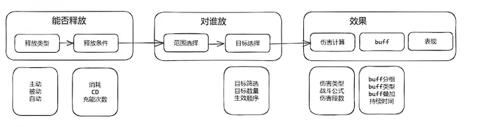

# TrinityCore 的技能实现

 ## 游戏技能设计

游戏技能设计需要满足以下的几个需求：

1. 后期易扩展。在项目的demo阶段就需要搭建战斗系统，起步阶段不能把所有技能效果规划好，需要不断满足战斗策划持续不断的创意。
2. 功能的可用性。其目的是减少开发成本，思路是将一个技能拆分为多个模块，实现每一个小模块，多个模块快速拼装成一个新的技能。
3. 配置时间成本低。技能相关字段多如牛毛，所有字段放到一个表上，会降低阅读、错误排查效率，需要建立多个分表，如主表、伤害表、buff表。

技能一般有4种类型：主动释放、自动释放、被动释放、混合技能。混合技能是前三种类型的结合，例如主动和被动结合，需要主动释放后，还需要满足某个事件才能促发。

游戏的技能的释放条件一般有技能CD(释放后进入冷却时间)、技能消耗、触发范围、目标选择。技能还可以增加一些buff，buff有不同的类型、效果、效果参数、失效时机、持续时间、生效次数、生效间隔等属性。

游戏技能的释放流程如下所示：



## TrinityCore 的技能

在TrinityCore中，技能的相关数据一部分在Mysql数据库中，一部分以二进制的方式保存在dbc中，可以使用`Wow Spell Editor`读取数据库和dbc中的技能数据，方便的查看每一个技能。数据库可以使用Navicat等工具进行查看。

技能的静态信息存储带dbc配置中，动态信息存储在数据库表中，当玩家学习技能`Player::LearnSpell`时，写入玩家的数据库表(`charactor_spell`)中，不会直接写入，为了缓解数据库的压力，定时将变更数据`Player::SaveToDb`写入数据库中。当角色登录时，从玩家列表中拉取技能信息`Player::LoadFromDB`。

技能管理的生命周期有技能创建、技能释放。在技能创建时，`new Spell`绑定到一个对象上，由该对象配置信息触发技能。在技能释放时`spell->prepare`，会`new SpellEvent`创建一个定时任务，技能释放完毕后`return true`，定时器在处理定时任务时执行返回`ture`，会删除定时任务，从而调用`SpellEvent`的析构函数，在析构函数中释放spell技能对象。

```c++
Spell* spell = new Spell(this, spellInfo, TRIGGERED_NONE);
spell->m_fromClient = true;
spell->m_CastItem = item;
spell->m_cast_count = cast_count;                   //set count of casts
spell->SetSpellValue(SPELLVALUE_BASE_POINT0, learning_spell_id);  // 设置技能的属性
spell->prepare(targets);// prepare中创建定时器
```

### 技能代码结构

技能的基础逻辑:

- Spell.h、 Spell.cpp 技能实现。
- SpellDefines.h 技能信息参数枚举。
- SpellEffects.cpp 技能效果实现。
- SpellHistory.h、SpellHistory.cpp 技能CD管理。
- SpellInfo.h、SpellInfo.cpp 技能配置信息再加工。
- SpellMgr.h、SpellMgr.cpp 管理配置信息。
- SpellScript.h、SpellScript.cpp 技能脚本，在技能生命周期中埋点。

技能的buff(Auras光环):

- SpellAuraDefines.h 关环信息参数枚举
- SpellAuraEffects.h、SpellAuraEffects.cpp 光环效果的实现。
- SpellAuras.h、SpellAuras.cpp 光环实现。

技能可以作用到不同的对象上，技能的对象关系如下：

- GameObject 场景的一部分，可以交互。
- DynamicObject 临时产生，可以被看见的效果。
- Unit 战斗属性。
- WorldObject 活跃对象，具备update功能，可以创建定时器。
- GridObject 被地图管理的对象，可以被进入该地图的玩家看见。

### 技能例子

一个技能的生命周期是会进行多个状态转换，具体如下
```c++
enum SpellState
{
    SPELL_STATE_NULL      = 0,
    SPELL_STATE_PREPARING = 1,
    SPELL_STATE_CASTING   = 2,
    SPELL_STATE_FINISHED  = 3,
    SPELL_STATE_IDLE      = 4,
    SPELL_STATE_DELAYED   = 5
};
```

技能是释放如果由多个效果组成，不同的效果需要在不同的阶段处理，如下所示：

```c++
enum SpellEffectHandleMode
{
    SPELL_EFFECT_HANDLE_LAUNCH, // 效果在释放者身上立刻生效
    SPELL_EFFECT_HANDLE_LAUNCH_TARGET, // 效果在目标对象上立刻生效
    SPELL_EFFECT_HANDLE_HIT, // 准备打击时在目标对象上生效
    SPELL_EFFECT_HANDLE_HIT_TARGET // 击中目标时在目标对象上生效
};
```

如果是同类型的技能效果，只需要在最后一个技能效果进行处理，此时一次性处理所有的同类型技能。

#### 暴风雪

暴风雪（id 10）技能在魔兽世界中是一个法师技能，该技能具有两个效果：

1. 效果A: 通过创建DynamicObject，实现一个圆形的区域，该区域携带光环，在DynamicObject对象更新时，找个该区域内的目标对象。
2. 效果B: 实现了一个周期性触发技能`unit::UpdateSpells`，每隔一秒，在技能效果A所收集的范围目标对象作用触发新技能暴风雪（id 42208）造成伤害。

#### 被刺

该技能是潜行者职业的技能，由两个步骤组成，检测技能是否释放、技能释放。

1. 检测技能是否能释放 `CheckCast`
2. 释放技能`Cast`
    - 技能效果初始化。数据准备工作`HandleLaunchPhase` 中进行`SPELL_EFFECT_HANDLE_LAUNCH`、`SPELL_EFFECT_HANDLE_LAUNCH_TARGET`阶段的处理。
    - 立即释放`handle_immediate`。在`_handle_immediate_phase`中进行`SPELL_EFFECT_HANDLE_HIT`阶段的处理。在`DoProcessTargetContainer`中进行`SPELL_EFFECT_HANDLE_HIT_TARGET` 阶段处理。最后`_handle_finish_phase`处理生效逻辑。

#### 造食术

造食术是由法师进行学习和释放，其基本逻辑是使用物品，然后由物品触发技能。

1. m_cattime决定技能是否立即释放，如果大于0，将在定时器中处理该技能。
2. m_cattime会介入技能流程，技能结束后`TakeCastItem`。
3. 数据库表中的`item_teplate`技能配置，每一个item可以允许配置5个关联技能。

#### 基础篝火

技能篝火是召唤Object的技能，通过技能效果参数指定了GameObject id。在数据库表中`GameObject_template`可以关联链式陷阱，同时也可以关联一个技能，具体逻辑如下：

1. 通过技能产生了GameObject。
2. GameObject 关联一个链式陷阱。
3. 通过链式陷阱产生了增强基础属性的技能，由状态机来进行更新技能的效果。

## 总结

在TrinityCore中的技能实现，Spell由4种方式产生技能的效果：

1. 直接产生效果。
2. 创建物品，由物品触发另一个技能来产生效果。
3. 创建光环，由光环关联的最多5个技能产生效果。
4. 召唤GemeObject，由GemeObject的技能产生效果。