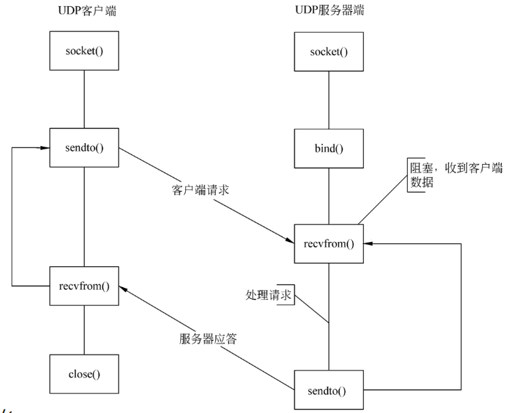
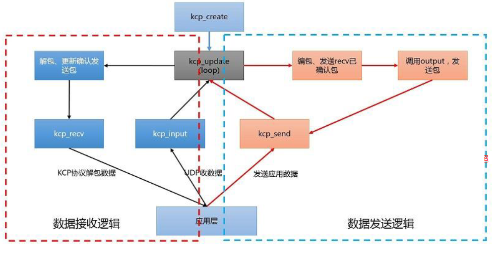
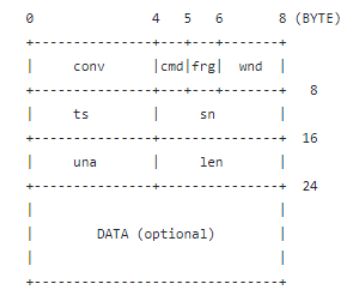
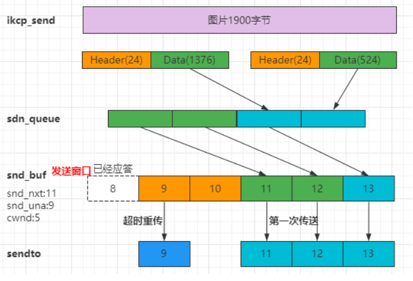
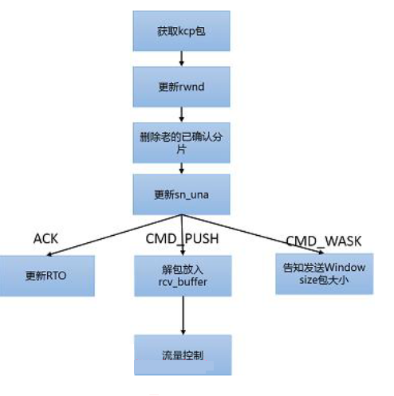
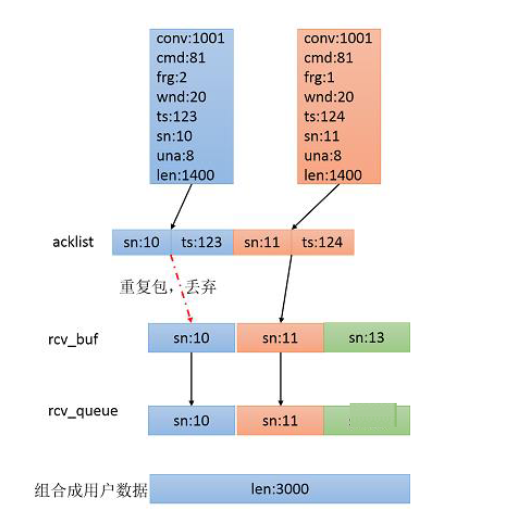

# 可靠的UDP传输--KCP协议

## UDP编程模型

> 如果要同时监听多个端口，可以考虑使用epoll方式管理
>
> 参考代码：https://github.com/wangbojing/udp_server_concurrent

## 基于UDP的可靠协议KCP

​	KCP是应用层协议，参考了TCP协议的实现，在应用层实现了可靠的UDP传输，以10%--20%带宽浪费的代价，实现了比TCP快30%--40%。

> 官网：https://github.com/skywind3000/kcp

### KCP协议对比TCP协议

1. RTO翻倍vs不翻倍

    TCP超时计算是RTOx2，这样连续丢三次包就变成RTOx8了，十分恐怖，而KCP启动快速模式后不x2，只是x1.5（实验证明1.5这个值相对比较好），提高了传输速度。

    | 重传 | 1    | 2    | 3    | 4    |
    | ---- | ---- | ---- | ---- | ---- |
    | TCP  | 200  | 400  | 800  | 1600 |
    | KCP  | 200  | 300  | 450  | 650  |

2. 选择性重传vs 全部重传

    TCP丢包时会全部重传从丢的那个包开始以后的数据，KCP是选择性重传，只重传真正丢失的数据包。

3. 快速重传（跳过多少个包马上重传）

    fastresend =2时，发送端发送了1,2,3,4,5几个包，然后收到远端的ACK:  1, 3, 4, 5，当收到ACK3时，KCP知道2被跳过1次，收到ACK4时，知道2被跳过了2次，此时可以认为2号丢失，不用等超时，直接重传2号包，大大改善了丢包时的传输速度。

4. 延迟ACK vs 非延迟ACK

    TCP为了充分利用带宽，延迟发送ACK，这样超时计算会算出较大RTT时间，延长了丢包时的判断过程。KCP的ACK是否延迟发送可以调节。

5. UNA vs ACK+UNA

    ARQ模型响应有两种，UNA（此编号前所有包已收到，如TCP）和ACK（该编号包已收到），光用UNA将导致全部重传，光用ACK则丢失成本太高，以往协议都是二选其一，而KCP协议中，除去单独的ACK包外，所有包都有UNA信息。

6. 非退让流控

    KCP正常模式同TCP一样使用**公平退让法则**，即发送窗口大小由：发送缓存大小、接收端剩余接收缓存大小、丢包退让及慢启动这四要素决定。但传送及时性要求很高的小数据时，可选择通过配置跳过后两步，**仅用前两项来控制发送频率**。以牺牲部分公平性及带宽利用率之代价，换取了更流畅传输的效果。

    > 常用名词解释：
    >
    > 用户数据：应用层发送的数据，如一张图片100Kb的数据
    >
    > MTU：最大传输单元。即每次发送的最大数据，1500 实际使用1400(前面的字节是协议头)
    >
    > RTO：Retransmission TimeOut，重传超时时间
    >
    > cwnd: congestion window，拥塞窗口，表示发送方可发送多少个KCP数据包。与接收方窗口有关，与网络状况（拥塞控制）有关，与发送窗口大小有关。
    >
    > rwnd: receiver window,接收方窗口大小，表示接收方还可接收多少个KCP数据包
    >
    > snd_queue: 待发送KCP数据包队列
    >
    > snd_buf:待发送KCP数据包buffer
    >
    > snd_nxt:下一个即将发送的kcp数据包序列号
    >
    > snd_una:下一个待确认的序列号，即是之前的包接收端都已经收到。

## KCP使用方式

1. 创建KCP对象：`ikcpcb *kcp = ikcp_create(conv, user);`
2. 设置发送回调函数（如UDP的sendto函数，真正发送数据需要调用sendto）：`kcp->output = udp_output;`
3. 循环调用update：`ikcp_update(kcp, millisec);` 在一个线程、定时器5ms/10m中调
4. 输入一个应用层数据包（如UDP收到的数据包,要使用recvfrom接收，然后扔到kcp里面做解析)：`ikcp_input(kcp,received_udp_packet,received_udp_size);`
5. 用户层接口发送数据：`ikcp_send(kcp1, buffer, 8);`
6. 用户层读取数据接收数据：`hr = ikcp_recv(kcp2, buffer, 10);`
   
   
    > Send的时候分片后的分片数量不能超过 `IKCP_WND_RCV`

## KCP的模式配置

1. 工作模式：`int ikcp_nodelay(ikcpcb *kcp, int nodelay, int interval, int resend, int nc)`
    - nodelay ：是否启用nodelay模式，0不启用；1启用。
    - interval ：协议内部工作的interval，单位毫秒，比如10ms或者20ms
    - resend ：快速重传模式，默认0关闭，可以设置2（2次ACK跨越将会直接重传）
    - nc ：是否关闭流控，默认是0代表不关闭，1代表关闭。
2. 最大窗口：`int ikcp_wndsize(ikcpcb *kcp, int sndwnd, int rcvwnd);`，该调用将会设置协议的最大发送窗口和最大接收窗口大小，默认为32，单位为包。
3. 最大传输单元：`int ikcp_setmtu(ikcpcb *kcp, int mtu);`kcp协议并不负责探测MTU，默认mtu是1400字节
4. 最小RTO：不管是TCP还是KCP计算RTO时都有最小RTO的限制，即便计算出来RTO为40ms，由于默认的RTO是100ms，协议只有在100ms后才能检测到丢包，快速模式下为30ms。（手动修改kcp->rx_minrto = 10;）

## KCP协议头

[0,3] ：conv:连接号。UDP是无连接的，conv用于表示来自于哪个客户端。对连接的一种替代

[4]cmd：命令字。如IKCP_CMD_ACK确认命令，IKCP_CMD_WASK接收窗口大小询问命令，IKCP_CMD_WINS接收窗口大小告知命令

[5]frg：分片，用户数据可能会被分成多个KCP包发送出去

[6,7]wnd：接收窗口大小，发送方的发送窗口不能超过接收方给出的数值

[8,11]ts:：时间序列

[12,15]sn：序列号

[16,19]una:下一个可接收的序列号。就是确认号，收到sn=10的包，una为11。

[20,23]len：数据长度

data:用户数据，这一次发送的数据长度

### 命令字

| cmd           | 作用                 |
| ------------- | -------------------- |
| IKCP_CMD_PUSH | 数据推送命令         |
| IKCP_CMD_ACK  | 确认命令             |
| IKCP_CMD_WASK | 接收窗口大小询问命令 |
| IKCP_CMD_WINS | 接收窗口大小告知命令 |

## KCP发送和接受数据流程

### 发送流程

1. 调用kcp_send，把应用数据加入到send_queue
2. 计算数据可以分为多少frag(如果count超过对方接收窗口返回报错)
3. 将数据全部新建segment插入发送队列尾部，队列计数递增，frag递减
4. ikcp_update调度中，使用ikcp_flust调度发送数据

### 接收流程

1. 接收kcp包
2. 更新可读窗口rwnd，删除老的已确认的分片，更新sn_uma
3. 发送确认包，解析数据

> rev_buf组合解析数据包头，缓存数据，等sn: 12才把12、13包数据插入到rev_queue。接收窗口的控制的就是recv_queue的接收能力。

-------

> 国外类似的协议有 QUIC 协议，也是基于UDP，提高发送效率。

----------

