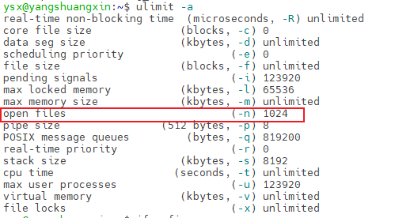
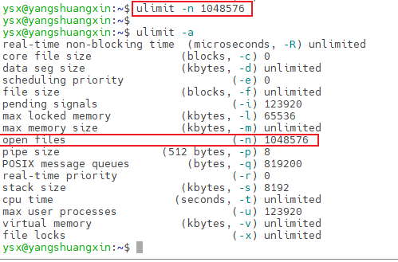

# 服务器处理客户端100w连接（百万并发）

对于服务器来说，如果要同时承载100w个客户端链接，意味着服务器需要打开100w个fd。一个fd是一个文件句柄，Linux总万物皆文件。

1. 需要配置文件打开数量，服务器/客户端 查看当前最大文件打开数量(不配置可能出现`error :Too many open files` 错误)。

   查看命令：`ulimit -a`



​	设置大于100w的文件打开数量：`ulimit -n 1048576`



2. 一个TCP连接，每一个fd都对应一个TCP控制块tcb。tcb由五元组组成：sip、dip、sport、dport、proto。端口是一个unsigned short类型的值，有2个字节，最大是65535。所以一个客户端对于一个服务器的端口最多可以建立65535个连接。如果客户端出现连接错误`Cannot assign requested address` ，需要配置客户端可使用的端口：

   编辑 `vim /etc/sysctl.conf`，加入`net.ipv4.ip_local_port_range 1024 65536`，保存后`sysctl -p`应用配置。

> 五元组中记录了协议，所以tcp和udp可以共用端口。

3. 由于端口数量限制，服务器端需要开多个端口进行监听（如20个，20*6w=120w），并且服务器端需要有100w的客户端连接池，记录客户端的fd、读写buffer、回调函数等信息，连接池大小如果**超过2G**可能导致程序无法编译。

4. 某一个客户端连接服务器的数量达到6w多无法增加，可能是由于客户端的文件数量打开限制，需要编辑 `vim /etc/sysctl.conf`，加入`fs.file-max 1048576`，保存后`sysctl -p`应用配置。

5. 如果服务器端处理同时大量关闭请求比较慢时，服务器的程序可能会被操作系统kill。

6. 客户端每一个TCP连接，内核中的tcb控制块都会分配一个读写的内存，如果全部连接的读写内存超过协议栈缓冲区的内存最大值，会导致客户端的程序被操作系统kill。配置内核中tcp协议栈内存大小：编辑 `vim /etc/sysctl.conf`

   - `net.ipv4.tcp_mem 252144 524288 786432`  数字代表tcp缓存页数量（1页是4k）最低（1G），中间值（2G），最大值（3G）。小于1G无操作，大于1G小于2G会进行内存优化，大于2G小于3G会进行内存回收（可能会kill），大于3G一定会kill。
   - `net.ipv4.tcp_wmem 1024 1024 2048` 协议栈发送缓冲区。代表写内存的最小值，缺省值，最大值。
   - `net.ipv4.tcp_rmem 1024 1024 2048` 协议栈接受缓冲区。代表读内存的最小值，缺省值，最大值。
   - `net.nf_conntrack_max =  1048576` 设置协议栈最大的连接数量。

   存后`sysctl -p`应用配置。

> 如果出现 nf_conntrack_max no such file or directory 错误，需要执行`modprobe ip_conntrack`命令。

## 客户端测试代码

> 使用  ./client ip 端口

```c++
#include <stdio.h>
#include <string.h>
#include <stdlib.h>

#include <sys/types.h>
#include <sys/socket.h>
#include <sys/epoll.h>
#include <errno.h>
#include <netinet/tcp.h>
#include <arpa/inet.h>
#include <netdb.h>
#include <fcntl.h>

#define MAX_BUFFER		128
#define MAX_EPOLLSIZE	(384*1024)
#define MAX_PORT		20

#define TIME_SUB_MS(tv1, tv2)  ((tv1.tv_sec - tv2.tv_sec) * 1000 + (tv1.tv_usec - tv2.tv_usec) / 1000)

int isContinue = 0;

static int ntySetNonblock(int fd) {
	int flags;

	flags = fcntl(fd, F_GETFL, 0);
	if (flags < 0) return flags;
	flags |= O_NONBLOCK;
	if (fcntl(fd, F_SETFL, flags) < 0) return -1;
	return 0;
}

static int ntySetReUseAddr(int fd) {
	int reuse = 1;
	return setsockopt(fd, SOL_SOCKET, SO_REUSEADDR, (char *)&reuse, sizeof(reuse));
}


int main(int argc, char **argv) {
	if (argc <= 2) {
		printf("Usage: %s ip port\n", argv[0]);
		exit(0);
	}

	const char *ip = argv[1];
	int port = atoi(argv[2]);
	int connections = 0;
	char buffer[128] = {0};
	int i = 0, index = 0;

	struct epoll_event events[MAX_EPOLLSIZE];
	
	int epoll_fd = epoll_create(MAX_EPOLLSIZE);
	
	strcpy(buffer, " Data From MulClient\n");
		
	struct sockaddr_in addr;
	memset(&addr, 0, sizeof(struct sockaddr_in));
	
	addr.sin_family = AF_INET;
	addr.sin_addr.s_addr = inet_addr(ip);

	struct timeval tv_begin;
	gettimeofday(&tv_begin, NULL);

	while (1) {
		if (++index >= MAX_PORT) index = 0;
		
		struct epoll_event ev;
		int sockfd = 0;

		if (connections < 340000 && !isContinue) {
			sockfd = socket(AF_INET, SOCK_STREAM, 0);
			if (sockfd == -1) {
				perror("socket");
				goto err;
			}

			//ntySetReUseAddr(sockfd);
			addr.sin_port = htons(port+index);

			if (connect(sockfd, (struct sockaddr*)&addr, sizeof(struct sockaddr_in)) < 0) {
				perror("connect");
				goto err;
			}
			ntySetNonblock(sockfd);
			ntySetReUseAddr(sockfd);

			sprintf(buffer, "Hello Server: client --> %d\n", connections);
			send(sockfd, buffer, strlen(buffer), 0);

			ev.data.fd = sockfd;
			ev.events = EPOLLIN | EPOLLOUT;
			epoll_ctl(epoll_fd, EPOLL_CTL_ADD, sockfd, &ev);
		
			connections ++;
		}
		//connections ++;
		if (connections % 1000 == 999 || connections >= 340000) {
			struct timeval tv_cur;
			memcpy(&tv_cur, &tv_begin, sizeof(struct timeval));
			
			gettimeofday(&tv_begin, NULL);

			int time_used = TIME_SUB_MS(tv_begin, tv_cur);
			printf("connections: %d, sockfd:%d, time_used:%d\n", connections, sockfd, time_used);

			int nfds = epoll_wait(epoll_fd, events, connections, 100);
			for (i = 0;i < nfds;i ++) {
				int clientfd = events[i].data.fd;

				if (events[i].events & EPOLLOUT) {
					sprintf(buffer, "data from %d\n", clientfd);
					send(sockfd, buffer, strlen(buffer), 0);
				} else if (events[i].events & EPOLLIN) {
					char rBuffer[MAX_BUFFER] = {0};				
					ssize_t length = recv(sockfd, rBuffer, MAX_BUFFER, 0);
					if (length > 0) {
						printf(" RecvBuffer:%s\n", rBuffer);

						if (!strcmp(rBuffer, "quit")) {
							isContinue = 0;
						}
						
					} else if (length == 0) {
						printf(" Disconnect clientfd:%d\n", clientfd);
						connections --;
						close(clientfd);
					} else {
						if (errno == EINTR) continue;

						printf(" Error clientfd:%d, errno:%d\n", clientfd, errno);
						close(clientfd);
					}
				} else {
					printf(" clientfd:%d, errno:%d\n", clientfd, errno);
					close(clientfd);
				}
			}
		}

		usleep(500);
	}

	return 0;

err:
	printf("error : %s\n", strerror(errno));
	return 0;
	
}
```

