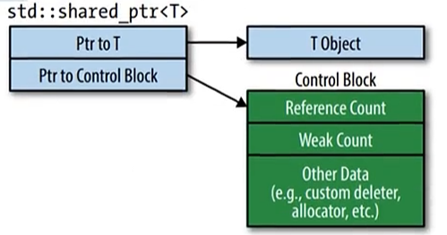
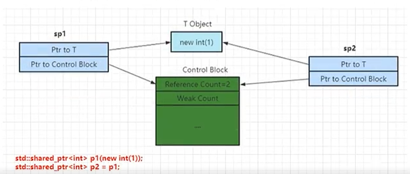

# 现代C++ 新特性之智能指针

## 智能指针

### 介绍

​	智能指针主要解决两个问题：

1. 内存泄漏。C++的内存由程序员自行管理释放，使用智能指针可以自动释放。
2. 共享所有权指针的传播和释放。在多线程使用同一个对象时的析构问题。

​	C++ 里由四个智能指针，auto_ptr、shared_ptr、unique_ptr、 weak_ptr。其中auto_ptr已经在c++11中弃用。其余指针都在c++中支持。

- unique_ptr ：独占对象所有权，由于没有引用计数，所以性能较好。
- shared_ptr：共享对象的所有权，性能略差。
- weak_ptr；配合shared_ptr，解决循环引用问题。

#### shared_ptr共享的智能指针

​	shared_ptr 内部包含两个指针，一个指向了堆上的对象，另一个指向了控制块（control block），控制块包含一个引用计数（Reference Count）、弱引用计数（Weak Count）和其他的一些数据。



​	shared_ptr 是共享的，共享的情况如下：



> 智能指针的 Reference_count 是线程安全的，但是指向的对象不是，如果需要修改，要自己加锁保证数据安全。

​	简单来说，shared_ptr包含了两部分：

- 一个堆上创建的对象的裸指针（raw_ptr）。
- 一个指向了内部隐藏的、**共享的**管理对象（share_count_object）。其中Reference Count 是应用计数，代表这个对象被多少次引用。

#### shared_ptr 的用法

​	`ptr.get();`  ：返回shared_ptr 中保存的裸指针。

​	谨慎使用p.get()的返回值，如果不是非常有必要，则不要调用该函数。因为p.get() 的返回值是裸指针，就容易会出现  free(ptr) 或者 delete ptr 的重复释放内存的错误。如果必须使用该函数，需要有以下要求：

- 不要保存p.get() 的返回值，无论保存为裸指针还是shared_ptr 都是错误的。
- 保存为裸指针会出现不知道什么时候会变成空悬指针，保存为shared_ptr则产生了另一个独立指针。
- 不要free 或 delete ptr.get()的放回值，会导致对一块内存重复释放的错误。

​	`ptr.reset(...)` ：重置shared_ptr。

- reset() 不带参数时，如果智能指针ptr是唯一指向该对象的指针，则会释放该对象并置空。否则，则应用计数减1，同时ptr置空。
- reset() 带参数时，行为在不带参数的基础上，置空后指向新的对象。

```c++
auto ptr = make_shared_ptr<int>(99);
ptr.reset(new int(77)); // 释放原来的对象并且指向新对象
```

​	`ptr.use_count();` ：返回shared_ptr 的强引用计数。

​	 `ptr.unique();` : 如果use_count() 为1 返回true，否则返回 false 。


​	**shared_ptr指定删除器**：

​	如果使用shared_ptr 管理的非new的对象，或者没有析构函数的类时，可以传入合适的删除器。

```c++
void DelIntPtr(int *p) {
    delete p;
}
std::shared_ptr<int> p (new int(77), DelIntPtr);
std::shared_ptr<int> p (new int(77), [](int *p) { 
    delete p;
});
```

​	使用shared_ptr 管理动态数组时，需要指定删除器，**shared_ptr 的默认删除器不支持数组对象**，如下所示：

```c++
shared_ptr<int> p(new int[10], [](int *p) { delete[]p; });
```

​	**shared_ptr使用注意**：

1. 不要使用一个原始指针初始化多个shared_ptr 。否则会出现重复释放内存。

   ```c++
   int *ptr = new int;
   shared_ptr<int> p1(ptr);
   shared_ptr<int> p2(ptr);
   ```

   

2. 不要在函数的实参中场景shared_ptr。`function(shared_ptr<int>(new int), g()); `， 如果先new int，后调用g()发生了异常，而shared_ptr<int>还没有创建，会发生内存泄漏。

3. 通过`shared_from_this();` 返回this指针。

   ​	不要将this指针作为shared_ptr 返回出来。因为this指针是一个裸指针，这样会导致重复析构，内存重复释放。

   ```c++
   class A {
   public:
       shared_ptr<A> GetSelf() {
           return shared_ptr<A>(this); // 错误做法！！
       }
   };
   shared_ptr<A> p1(new A);
   shared_ptr<A> p2 = p1->GetSelf();
   ```

   ​	上述代码同一个指针this构造了两个智能指针p1和p2，它们之间没有任何关系，在离开作用域后this将会被两个智能指针各自析构，导致重复释放内存。

   

   ​	正确获取this指针的做法是让目标类继承std::enable_shaerd_from_this<T> 类，然后使用基类的成员函数shared_from_this(); 来解决this的指针问题。

   ```c++
   class A : public std::enable_shared_from_this<A>{
   public:
       shared_ptr<A> GetSelf() {
           return shared_from_this(); // 正确做法
       }
   };
   shared_ptr<A> p1(new A);
   shared_ptr<A> p2 = p1->GetSelf();
   ```

4. 类与类之间循环引用会导致内存泄漏。

   ```c++
   class A {
   public:
       std::stared_ptr<B> bptr;
   };
   
   class B {
   public:
       std::stared_ptr<A> aptr;
   };
   std::shared_ptr<A> pa= make_shared<A>();
   std::shared_ptr<B> pb= make_shared<B>();
   pa->bptr = pb;
   pb->aptr = pa;
   ```

   ​	上面的代码会导致pa、pb的引用计数为2，即使离开作用域后，计数减少为1，并不会到0，导致不会调用析构函数，造成内存泄漏。

   ​	解决方法为把A和B中任何一个**成员变量改为weak_ptr**。

#### unique_ptr独占的智能指针

- unique_ptr 是一个独占的智能指针，它不允许其他的智能指针共享其内部的指针，不允许通过赋值将一个unique_ptr赋值给另一个unique_ptr。

```c++
unique_ptr<T> p1 (new T);
unique_ptr<T> p2 = p1; // 编译报错。
```

- 虽然不允许复制，但可以通过函数std::move来转移到其他的unique_ptr，这样它本身就不在拥有原来指针的所有权了。

```c++
unique_ptr<T> p1 (new T);
unique_ptr<T> p2 = std::move(p1);
```

- std::make_shared是c++11的一部分，但是std::make_unique不是。它在C++14中才引入标准库。代码实践中尽量使用make_shared和make_unique。

```c++
unique_ptr<T> p1 (new T);
unique_ptr<T> p1 = std::make_unique<T>();
```

- unique_ptr 可以指向数组，shared_ptr不可以。

  ```c++
  std::unique<int []> ptr (new [10]);
  ptr[0] = 99;
  std::unique<int[]> ptr(new int[10]); // 不合法的！！
  ```

- unique_ptr 指定删除器与shared_ptr不同，需要确定删除器的类型。

  ```c++
  std::shared_ptr<int> ptr1(new int(1), [](int *p) {delete p;}); // 正确。
  
  std::unique_ptr<int> ptr2(new int(1), [](int *p) {delete p;}); // 错误。
  
  std::unique_ptr<int, void(*)(int*)> ptr3(new int(1), [](int *p) {delete p;}); // 正确。
  ```

  ​	

​	如果希望只有一个智能指针管理资源，就使用unique_ptr，如果希望多个智能指针管理同一个资源就使用shared_ptr。


#### weak_ptr 弱引用指针

​	share_ptr虽然很好用了，但是会有内存泄漏的情况出现。当连个对象互相使用shared_ptr 成员变量指向对方，造成了循环引用，使引用计数失效，从而导致内存泄漏。

​	weak_ptr 是一种**不控制对象生命周期**的智能指针，它指向了一个shared_ptr管理的对象，对该对象的内存进行管理的是原shared_ptr，weak_ptr只提供了管理对象的一种访问手段。

​	weak_ptr 设计的目的就是为了配合shared_ptr 而引入的，用来协助shared_ptr工作。它可以从一个shared_ptr 或另一个 weak_ptr 对象构造，它的构造和析构都不会引起引用计数的增加和减少。

​	**weak_ptr的用法**：

- 通过use_count() 方法可以获取当前观察资源的引用计数。

  ```c++
  shared_ptr<int> sp(new int(10));
  weak_ptr<int> wp(sp);
  cout<< wp.use_count() << endl; // 输出 1
  ```

- 通过lock()方法获取监视的shared_ptr。

- 通过expired() 方法判断观察的资源释放释放。

  ```c++
  auto sp = std::make_shared<int>(10);
  std::weak_ptr<int> wp = sp;
  // 先锁定，然后在检测资源是否释放 ！
  auto spt = wp.lock();
  if (wp.expired()) {
      std::cout << "资源已经释放" << endl;
  } else {
      std::cout << "合法的资源" << *spt << endl;
  }
  ```

> 上面的shared_ptr中不能直接把this指针返回，需要派生std::enable_shared_from_this类，并通过其方法shared_from_this来返回指针，其原因就是std::enable_shared_from_this类中有一个weak_ptr，使用这个weak_ptr观察this；调用shared_from_this()方法时，会调用weak_ptr的lock()方法，将所观察的shared_ptr放回。

​	

​	使用shared_from_this() 获取自身的智能指针的函数，需要在shared_ptr<T>的**构造函数被调用**后才能使用，因为enable_shared_from_this内部的weak_ptr只有通过shared_ptr才能构造。

​	解决智能指针的循环引用导致的内存泄漏问题，只需要把双方的任意一个成员变量改为weak_ptr。

### 智能指针的安全性问题

​	引用计数本身是安全的，但是智能指针是否是线程安全的，需要结合实际情况进行讨论：

1. 情况1，多线程代码操作的是同一个shared_ptr的对象，此时是不安全的。

   比如std::thread的回调函数，是一个lambda表达式，其中引捕获了一个shared_ptr，又或者通过回调函数传入的shared_ptr对象，参数类型是引用。

   ```c++
   std::shared_ptr<int> sp = make_shared<int> (10);
   
   std::thread td1([&sp](){ sp = make_shared<int> (11); });
   
   void func(shared_ptr<int> &sp) {
       sp = make_shared<int> (11);
       return;
   }
   
   std::thread td2(func, sp);
   ```

   

2. 情况2，多线程代码操作的不是同一个shared_ptr对象，是安全的。

   （这里指管理的数据是同一份，而shared_ptr不是同一个对象）

   ```c++
   std::shared_ptr<int> sp = make_shared<int> (10);
   
   std::thread td1([sp](){ sp = make_shared<int> (11); });
   
   void func(shared_ptr<int> sp) {
       sp = make_shared<int> (11);
       return;
   }
   
   std::thread td2(func, sp);
   ```

   每一个线程看到的sp，虽然管理的是同一份数据，使用同一个引用计数，但是各自是不同的对象，当发生多线程修改sp指向的操作的时候，是不会出现非预期的异常行为的，也就是说是线程安全的。

3. 情况3，智能指针所**管理数据的线程安全问题** 是显而易见必然是线程不安全的，虽然智能指针都是指向同一个对象，加入多个线程同时操作对象A，对象的数据安全比如需要对象A自己保证。