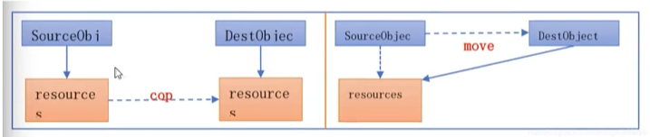

# 现代C++新特性之右值和左值

## 右值

> C++11 中引入了右值引用和移动语义，可以避免无谓的复制，提高了性能

### 左值和右值的区别：

​	可以从2个角度判断：

1. 左值可以**取地址**，位于等号的**左边**。
2. 右值没法**取地址**，位于等号的**右边**。

```c++
int a = 10;
// a 可以通过& 取地址，位于等号的左边，所以a是左值。
// 10 无法通过& 取地址，位于等号的右边，所以是右值。
```

```c++
struct A {
  A(int a = 0) {
      a_ = a;
  }
  int a_;
};

A a = A();
// a 可以取地址，位于等号的左边，a是左值。
// A() 是个临时值，没法取地址，位于等号的右边，A()是右值。
```

​	有地址的变量就是左值，没有地址的字面值、临时值就是右值。


### 左值引用和右值引用

> 引用的本质是别名，可以通过引用修改变量的值，传参时可以避免拷贝。

​	**左值引用**就是指向左值的引用，使用一个`&`，不能指向右值。引用是变量的别名，由于右值没有地址，没法修改，所以左值引用是无法指向右值。但是**const 修饰的左值引用是可以指向右值的**。

```c++
int a = 10;
int &ref_a1 = a; // 左值引用指向左值
int &ref_a2 = 10; // 左值引用指向右值，报错 ！
const &ref_a3 = 10; // 编译通过
```

​	**const左值引用不会修改指向值**，因此可以指向右值。所以一般需要使用`const & `作为函数参数的原因之一，如STL中的`std::vector`的`push_back`。

```c++
void push1(int& val) {
    return;
}

push1(10); // 报错

void push2(const int& val) {
    return;
}

push2(10); //编译通过
```

​	**右值引用**的标志是 `&&` , 专门指向右值，不能指向左值。右值引用可以修改右值。

```c++
int &&ref = 10; // 可以编译
ref = 6; //右值引用可以修改右值

int a = 9;
int &&ref_a = a; // 编译报错
```

#### 左值和左值的转换

​	可以使用`std::move();` 把左值转换为右值，可以被右值引用。

```c++
int a = 10;
int &ref_left = a; // 左值引用
int &&ref_right = std::move(a); // 转换为右值，赋值给右值引用
```

​	虽然使用了a通过`std::move(a);`移动到了ref_right， 但是a 里面的值没有改变，仍然是10。

​	`std::move` 是一个具有**迷惑性**的函数：

- 不理解左值和右值概念时，就认为它能把一个变量里的内容移动到另一个变量。
- 但事实上**std::move移动不了**什么，唯一的功能就是把**左值强制转换为右值**，让右值引用可以指向左值，其实现等同于另一个类型转换`static_cast<T&&>(value)`。 所以单纯的std::move(value)不会提升性能。

​	右值引用能指向右值，本质上也是把右值提升为一个左值，并定义一个右值引用指向该左值。

```c++
int &&ref = 10;
ref = 5;

// 等同于

int tmp = 10;
int &&ref = std::move(tmp);
ref = 5;
```

> 被声明出来的左、右值引用都是左值。被声明出来的左右值引用都是**有地址的**。

```c++
void change(int && rightVal) {
    rightVal = 7;
}
int a = 10;
int &ref_left = a;
int &&ref_right = std::move(a);

change(a);			// 无法编译
change(ref_left);	// 无法编译
change(ref_right);	// 无法编译

change(std::move(a)); // 可以编译
change(std::move(ref_left)); // 可以编译
change(std::move(ref_right)); // 可以编译
```

​	**std::move 总结**：

1. 从性能上讲，左右值引用没有区别，传参使用左右值都可以避免拷贝。
2. 左值引用只能指向左值（加入const的左值引用可以指向右值），右值引用可以指向右值，可以使用std::move() 指向左值。
3. 作为函数传参时，右值引用可以更灵活。虽然const 左值引用也可以左右值都接受，但是无法修改，有局限性。

```c++
void fun1(const int &n) {
    n += 1;	// 编译报错
}

void fun2(int &&n) {
    n += 1;	//可以编译
}

fun1(10);
fun2(10);
```

```c++
template <typename T>
void func(int &&t) {// 模板参数可以接受左值或者右值
    std::cout<<t<< std::endl;
}

func(10);//ok
int a = 20;
func(a);//ok
```


### 右值引用和std::move的使用场景

> std::move只是类型转换工具，不会对性能有好处。

​	move可以将对象的状态或者所有权从一个对象转移到另一个对象。对象转移没有内存拷贝，所以想要move语义起作用，核心在于对象的构造函数的支持。

```c++
A a;
A b = a; // 拷贝构造函数
A c = std::move(a); // 移动构造函数，移动后 a为空。
```




​	move的语义想要生效，需要使用的对象支持**移动构造函数和移动赋值构造函数**。如智能指针 `std::unique_ptr`。


#### 完美转发std::forward

​	forward完美转发实现了参数传递过程中保持其属性的功能。如果是左值，转发后仍是左值，如果是右值，转发后仍然是右值。

```c++
int &&a = 10;
int &&b = a; //错误，a本身是一个左值
int &&c = std::forward<int>(a); // 正确，a是左值，完美转发会按照参数原来的类型进行转发。
```

```c++
template <typename T>
void Print(T &t) {
    cout<<"Left" << t << endl;
}
template <typename T>
void Print(T &&t) {
    cout << "Right" << t << endl;
}
// T &&value是未定的引用类型，可以初始化为左值引用或者右值引用。
template <typename T>
void func (T &&t) {
    Print(t);
    Print(std::move(t));
    Print(std::forward<T>(t));
}

func(1); // Left -> Right -> Right
int a = 10;
func(a); // Left -> Right -> Left
// std::forward<int> 会转为右值，与 std::forward<int&&> 一致 
func(std::forward<int>(a)); // Left -> Right -> Right
func(std::forward<int&>(a));// Left -> Right -> Left
```

#### emplace_back 减少内存拷贝和移动

​	对于STL容器，C++11后引入emplace_back 接口，该接口是就地构造，不用构造后再次复制到容器中，因此效率更高。

```c++
vector<string> testVec;
testVec.push_back(string(16, 'a'));
```

上面的语句将一个string对象增加到testVec中，有以下三步：

1. string(16, 'a')会创建一个string类型的临时对象，这是string的第一次构造。
2. vector 内部会创建一个新的string对象，这是第二次构造。
3. 在push_back时会拷贝临时string对象的内容到vector 内部string对象内。然后临时对象会进行析构。

​	加在一起，有两次构造和一次析构。emplace_back代替push_back，emplace_back可以直接在vector中创建一个对象，而非创建一个临时对象，拷贝内容后再销毁。emplace_bak可以省略一次构建、一次析构、一次复制，从而达到优化性能的目的。


```c++
std::vector<std::string> vec;
std::string temp("hello world");

// 左值引用，调用拷贝构造函数，非常耗时。
vec.push_back(temp);

//右值引用，调用移动构造函数，耗时比拷贝小，不需要重新分配空间
vec.push_back(std::move(temp));

//右值引用，调用移动构造函数，耗时比拷贝小，不需要重新分配空间
vec.push_back(std::string("hello world"));

//右值引用，调用移动构造函数，耗时比拷贝小，不需要重新分配空间
vec.push_back("hello world");

//只有一次构造函数，没有移动构造函数，没有拷贝构造函数
vec.emplace_back("hello world");
```

## 总结

现代C++在性能上做了很大的改进，最大程度的减少了内存的移动和复制，通过右值引用、完美转发forward、emplace和一些无序的容器，可以大幅度改进程序的性能。

- 右值引用解决通过改变资源的所有者来避免内存的拷贝，可以大幅度提高性能。
- forward可以根据参数的实际类型转发给正确的函数。
- emplace 系列函数可以通过直接构造对象的方式避免了内存的拷贝和移动。