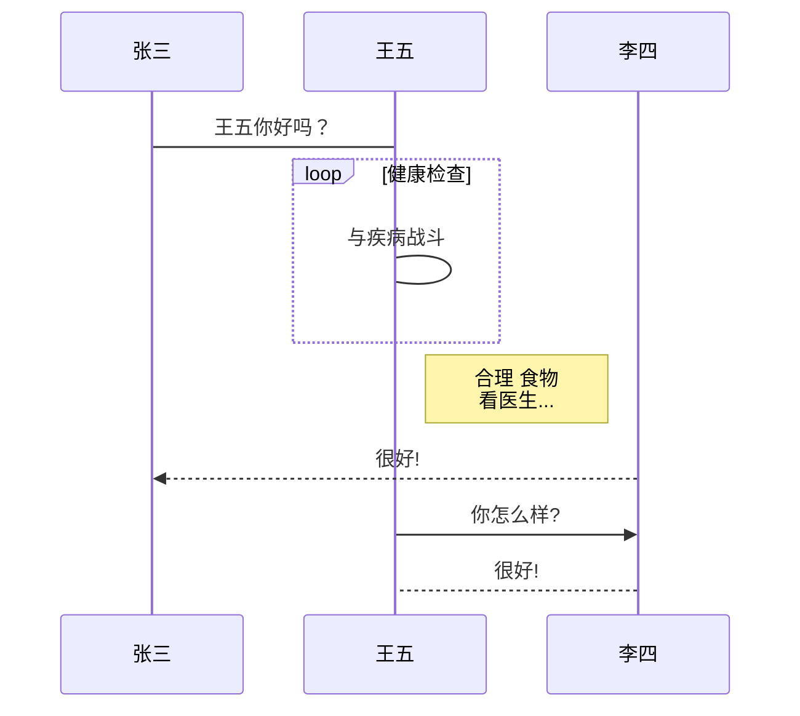

# cpp开发的必备知识体系

1. cpp 业务方向
   - 量化交易
   - 信息安全
   - 高性能计算
   - CDN
   - 游戏服务器
   - 自动驾驶
   - 基础架构，开发框架
   - 虚拟化
   - 网络开发
   - 存储业务
   - 推荐算法开发
   - 流媒体服务器开发
   - 金融业务开发
2. C/CPP 语言开发的基础基本素养
   - 数据机构和算法
     1. hash 哈希表
     2. rbtree 红黑树
     3. b/b+ tree b和b+树
     4. list 链表
   - 设计模式
     1. 单例
     2. 策略
     3. 观察者
     4. 工厂
     5. 迭代器模式
     6. 过滤器
   - 库
     1. STL 标准库
     2. 现代C++ 特性
   - Linux工程相关
     1. Makefile/cmake
     2. git/svn
     3. htop/top
     4. netstat
     5. tcpdump
     6. iperf
3. 网络相关知识
   - 网络编程
     1. select/poll/epoll
     2. 多线程、多进程
     3. 阻塞、非阻塞
     4. 同步、异步
     5. 网络数据包解析的业务逻辑
     6. 网络框架的实现
   - 网络原理
     1. ech
     2. ip
     3. tcp/udp 协议栈
     4. http
4. 开发中常用的基础组件
   - 内存池
   - 线程池
   - 数据库连接池
   - 请求池
   - 原子操作
   - ringbuffer 循环缓冲区
   - 无锁队列
   - 定时器方案
   - 死锁检测
   - 内存泄漏检测
   - 日志系统
   - 网络模块
   - 共享内存
   - protobuf
5. 开发中常用的中间件
   - MySQL 等结构化数据库
   - Redis 等非结构化数据库
   - Nginx
   - grpc
   - mq 消息队列
6. Cpp开发框架
   - skynet (游戏)
   - openresty (cnd/waf)
   - dpdk (网络)
   - cuda (gpu)
   - workflow (网络编程范式)
7. 环境部署
   - docker
   - k8s
8. 性能分析
   - kernel
     1. 磁盘
     2. 网络
     3. 内存
   - bfp/ebpf
   - 火焰图
   - 中间件
   - gtest测试用例
9. 分布式
   - 分布式数据库TiDB
   - 分布式文件系统ceph
   - 分布式协同 etcd
10. 最后是软实力
    - 组织能力
    - 沟通能力
    - 协调能力




```sequence
Title: 标题：复杂使用
对象A->对象B: 对象B你好吗?（请求）
Note right of 对象B: 对象B的描述
Note left of 对象A: 对象A的描述(提示)
对象B-->对象A: 我很好(响应)
对象B->小三: 你好吗
小三-->对象A: 对象B找我了
对象A->对象B: 你真的好吗？
Note over 小三,对象B: 我们是朋友
participant C
Note right of C: 没人陪我玩
```


```sequence
Title: 标题：复杂使用
Note left of 对象A: 对象A的描述(提示)
对象A->对象B: 对象B你好吗?（请求）
Note right of 对象B: 对象B的描述
Note left of 对象A: 对象A的描述(提示)
对象B-->对象A: 我很好(响应)
对象B->小三: 你好吗
小三-->对象A: 对象B找我了
对象A->对象B: 你真的好吗？
Note over 小三,对象B: 我们是朋友
participant C
Note right of C: 没人陪我玩
```

