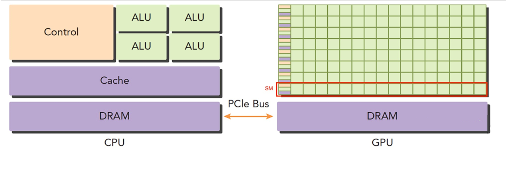
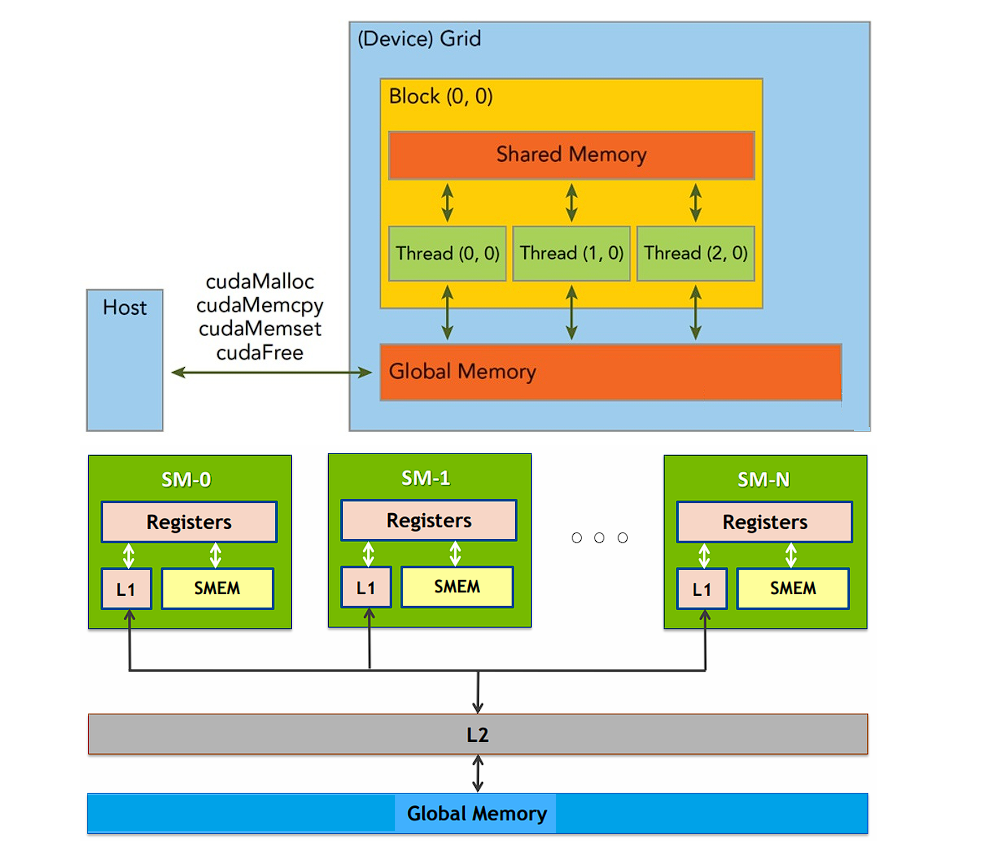
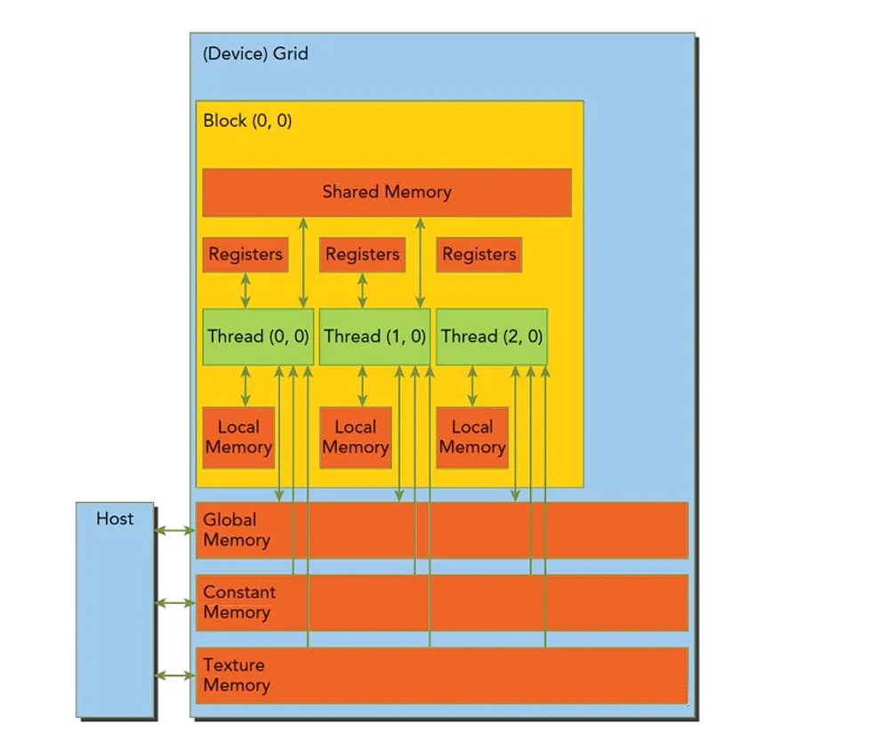
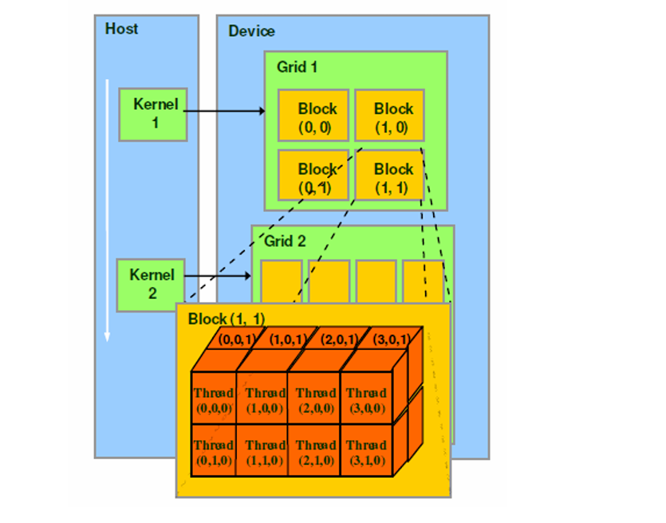
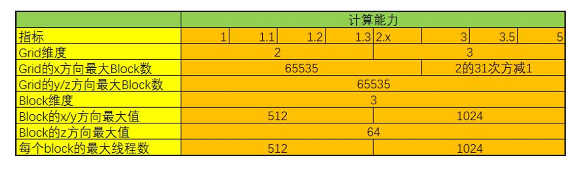
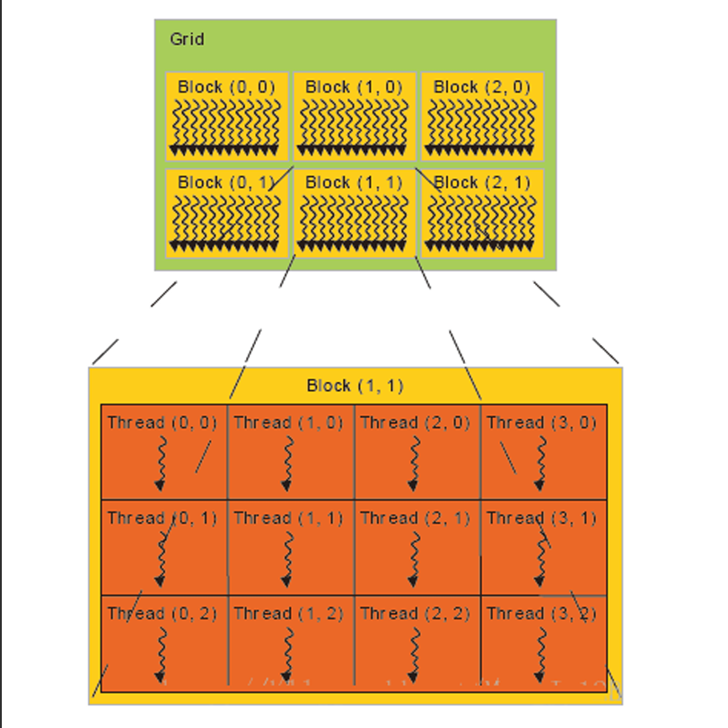

# GPU和CUDA编程模型

## GPU介绍

GPU（Graphic Processing Unit）图形处理器，显卡的处理核心。电脑显示器上显示的图像，在显示在显示器上之 前，要经过一些列处理，这个过程有个专有的名词叫“渲染"。以前的计算机上没有GPU，渲染就是CPU负责的。渲染就是一系列图形的计算，但这些计算往往非常耗时，占用了CPU的一大部分时间。而CPU还要处理计算机器许多其他任务。因此就专门针对图形处理的这些操作设计了一种处理器，也就是GPU。这样CPU就可以从繁 重的图形计算中解脱出来。

NVIDIA公司在1999年发布Geforce 256图形处理芯片时首先提出GPU的概念。最早的GPU是专门为了渲染设计的，那么他也就只能做渲染的那些事情。渲染这个过程具体来说就是几何点、位置和颜色的计算，这些计算在数学上都是用四维向量和变换矩阵的乘法，因此GPU也 就被设计为专门适合做类似运算的专用处理器了。但随着GPU的发展，GPU的功能也越来越多， 比如现在很多GPU还支持了硬件编解码。

现代的GPU不仅仅是渲染、游戏，还适用于深度学习训练和推理，图像识别、语音识别等；计算金融学、地震分析、分子建模、基 因组学、计算流体动力学等；高清视频转码、安防视频监控、大型视频会议等；三维设计与渲染、 影音动画制作、工程建模与仿真（CAD/CAE）、医学成像、游戏测试等等。

GPU算力单位是TOPs。 OPS是Tera Operations Per Second的缩写，1TOPS代表处理器每秒钟可进行 一万亿次（10^12）操作。

### GPU的工作原理

GPU采用流式并行计算模式，可对每个数据行独立的并行计算。有以下的区别：

1. CPU基于低延时设计，由运算器（ALU，Arithmetic and Logic Unit 算术逻辑单元）和控制器 （CU,Control Unit），以及若干个寄存器和高速缓冲存储器组成，功能模块较多，擅长逻辑控制，串行运算。
2. GPU基于大吞吐量设计，拥有更多的ALU用于数据处理，适合对密集数据进行并行处理，擅长 大规模并发计算，因此GPU也被应用于AI训练等需要大规模并发计算场景。



GPU为图形图像专门设计，在矩阵运算，数值计算方面具有独特优势，特别是浮点和并行计算上能 优于CPU的数十数百倍的性能。（GPU的优势在于快，而不是效果好）比如用美图软件给一张图要加上模糊效果，CPU处理的时候从左到右从上到下进行处理。可以考虑开多核，但是核数毕竟有限制，比如4核、8核 分块处理。使用GPU进行处理，因为分块之前没有相互的关联关系，可以通过GPU并行处理，就不单只是4、 8分块了，可以切换更多的块，比如16、64等。

### 异构计算

异构计算从常见的搭配有CPU+GPU、CPU+FPGA、CPU+DSP(多指令，矩阵乘法算子)，CPU +  ASIC(专用集成电路，比GPU更专业 )等。

CPU的核心少但每一个核心的控制和计算能力都不弱，因此常作为主机。而GPU的计算核心很多， 所以当遇到大数据量且逻辑简单的任务，CPU就会交给GPU来进行计算，同时CPU的核心虽少但也是有多个线程的，多线程可以调度并同时控制多张GPU同时完成多个任务，这本身也是一种并行思想，并且GPU也可以在接收到任务后让CPU的线程先去处理别的事情完成异步控制来进一步提高效率（这本质上也是一种时域上的并行）。

## GPU编程模型cuda

CUDA（Compute Unified Device Architecture），是显卡厂商NVIDIA推出的运算平台。 CUDA™是通用并行计算架构，该架构使GPU能够解决复杂的计算问题。 它包含了CUDA指令集架构（ISA）以及GPU内部的并行计算引擎。 开发人员可以使用C语言来为CUDA™架构编写程序，所编写出的程序可以在支持CUDA™的处理器上以超高 性能运行。CUDA3.0已经开始支持C++和FORTRAN。

软件层面上不管什么计算设备，大部分异构计算都会分成主机代码和设备代码。整体思考过程就是应用分析、内存资源分配、线程资源分配再到具体核函数的实现。CUDA中线程也可以分成三个层次：线程、线程块和线程网络：

1. 线程是CUDA中基本执行单元，由硬件支持、开销很小，每个线程执行相同代码。
2. 线程块（Block）是若干线程的分组，Block内一个块至多512个线程、或1024个线程（根据不同的GPU规格），线程块可以是**一维、二维或者三维**的。
3. 线程网络（Grid）是若干线程块的网格，Grid是**一维和二维**的。

线程用ID索引，线程块内用局部ID标记threadID，配合blockDim和blockID可以计算出全局ID，用 于SIMT（Single Instruction Multiple Thread 单指令多线程）分配任务。



首先需要关注的是具体线程数量的划分，在并行计算部分里也提到数据划分和指令划分的概念， GPU有很多线程，在CUDA里被称为thread，同时我们会把一组thread归为一个block，而多个 block又会被组织成一个grid。

假如我们要对一个长度为1024的数组做reduce_sum（减少和求和），恰好有1024个 thread，此时直接一一对应就行，但如果是一张很大的图片呢？如果有很多核函数要处理不同的数据呢？GPU上有很多thread，但要完全和实际应用中需要处理的**数据大小完全匹配**是不可能的。

事实上在满足规定的情况下可以给一个block内部分配很多thread，对于到硬件上也真的是相应数量的thread会自动归为一组直接在一个SM上实行吗？答案当然不是，此时就要关注硬件，引入了wrap概念，GPU上有很多计算核心也就是Streaming Multiprocessor (SM)，在具体的硬件执行中，一个SM会同时执行一组线程，在CUDA里叫warp。不用拘泥于称呼，直接可以理解这组硬件线程会在这个SM上同时执行一部分指令，这一组的数量一般为32或者64个线程。

一个block会被绑定到一个SM上，即使这个block内部可能有1024 个线程，但这些线程组会被相应的调度器来进行调度，在逻辑层面上我们可以认为1024个线程同 时执行，但实际上在硬件上是一组线程同时执行，这一点其实就和操作系统的线程调度一样。 意思就是假如一个SM同时能执行64个线程，但一个block有1024个线程，那这1024个线程是分 1024/64=16次执行。

一个block不光要绑定在一个SM上，同时一 个block内的thread是共享一块share memory（一般就是SM的一级缓存，越靠近SM的内存就越快 ）。GPU和CPU也一样有着多级cache还有寄存器的架构，把全局内存的数据加载到共享内存上再 去处理可以有效的加速。所以结合具体的硬件具体的参数（SM和寄存器数量、缓存大小等）做出合适的划分，确保最大化的利用各种资源（计算、内存、带宽）是做异构计算的核心。



### GUDA模型和硬件的对应关系

GPU在管理线程(thread)的时候是以block(线程块)为单元调度到SM上执行。每个block中以warp(一般32个线程或64线 程)作为一次执行的单位(真正的同时执行)。

- 一个 GPU 包含多个 Streaming Multiprocessor ，而每个 Streaming Multiprocessor 又包含多个 core 。  Streaming Multiprocessors 支持并发执行多达几百的 thread 。
- 一个 thread block 只能调度到一个 Streaming Multiprocessor 上运行，直到 thread block 运行完毕。一个  Streaming Multiprocessor 可以同时运行多个thread block （因为有多个core）。

stream multiprocessor(SM)是一块硬件，包含了固定数量的运算单元，寄存器和缓存。写cuda kernel的时候，跟SM对应的概念是block，每一个block会被调度到某个SM执行，一个SM可以执行多个block。cuda程序就是很多的blocks(一般来说越多越好)均匀的喂给这80个SM来调度执行。具体每个block喂给哪个SM你没 法控制。

不同的GPU规格参数也不一样，比如 Fermi 架构：

1. 每一个SM上最多同时执行8个block。(不管block大小)
2. 每一个SM上最多同时执行48个warp。
3. 每一个SM上最多同时执行48*32=1,536个线程。

当warp访问内存的时候，processor(处理器)会做context switch(上下文切换)，让其他warp使用硬件资源。因为是硬件 来做，所以速度非常快。

### CUDA线程索引计算

CUDA的软件架构由网格（Grid）、线程块（Block）和线程（Thread）组成，相当于把GPU上的计算单元分为若干 （2~3）个网格，每个网格内包含若干（65535）个线程块，每个线程块包含若干（512/1024）个线程，三者的关系如 下图：



Thread，block，grid是CUDA编程上的概念，为了方便程序员软件设计，组织线程：

1. thread：一个CUDA的并行程序会被以许多个threads来执行。
2. block：数个threads会被群组成一个block，同一个block中的threads可以同步，也可以通过shared memory通信。
3. grid：多个blocks则会再构成grid。

CUDA中可以创建的网格数量跟GPU的计算能力有关，可创建的Grid、Block和Thread的最大数量参看以下表格：



在单一维度上，程序的执行可以由多达3 * 65535 * 512=100661760（一亿）个线程并行执行，这对在CPU上创建并行线 程来说是不可想象的。

一个Grid可以包含多个Blocks，Blocks的组织方式可以是一维的，二维或者三维的。block包含多个Threads，这些 Threads的组织方式也可以是一维，二维或者三维的。CUDA中每一个线程都有一个**唯一的标识ID**  —  ThreadIdx，这个ID随着Grid和Block的划分方式的不同而变化，这里给出 Grid和Block不同划分方式下线程索引ID的计算公式：

1. threadIdx是一个uint3类型，表示一个线程的索引。
2. blockIdx是一个uint3类型，表示一个线程块的索引，一个线程块中通常有多个线程。
3. blockDim是一个dim3类型，表示线程块的大小。
4. gridDim是一个dim3类型，表示网格的大小，一个网格中通常有多个线程块。



```c
// grid划分成1维，block划分为1维
int threadId = blockIdx.x *blockDim.x + threadIdx.x;

// grid划分成1维，block划分为2维
int threadId = blockIdx.x * blockDim.x * blockDim.y + threadIdx.y * blockDim.x + threadIdx.x;

// grid划分成1维，block划分为3维
int threadId = blockIdx.x * blockDim.x * blockDim.y * blockDim.z + threadIdx.z * blockDim.y * blockDim.x + threadIdx.y * blockDim.x + threadIdx.x;

//  grid划分成2维，block划分为1维
int blockId = blockIdx.y * gridDim.x + blockIdx.x;
int threadId = blockId * blockDim.x + threadIdx.x;

// grid划分成2维，block划分为2维
int blockId = blockIdx.x + blockIdx.y * gridDim.x;
int threadId = blockId * (blockDim.x * blockDim.y) + (threadIdx.y * blockDim.x) + threadIdx.x;

// grid划分成2维，block划分为3维
int blockId = blockIdx.x + blockIdx.y * gridDim.x;
int threadId = blockId * (blockDim.x * blockDim.y * blockDim.z) + (threadIdx.z * (blockDim.x * blockDim.y)) + (threadIdx.y * blockDim.x) + threadIdx.x;

// grid划分成3维，block划分为1维
int blockId = blockIdx.x + blockIdx.y * gridDim.x + gridDim.x * gridDim.y * blockIdx.z;
int threadId = blockId * blockDim.x + threadIdx.x;

// grid划分成3维，block划分为2维
int blockId = blockIdx.x + blockIdx.y * gridDim.x  + gridDim.x * gridDim.y * blockIdx.z;
int threadId = blockId * (blockDim.x * blockDim.y) + (threadIdx.y * blockDim.x) + threadIdx.x;

// grid划分成3维，block划分为3维
int blockId = blockIdx.x + blockIdx.y * gridDim.x + gridDim.x * gridDim.y * blockIdx.z;
int threadId = blockId * (blockDim.x * blockDim.y * blockDim.z)  + (threadIdx.z * (blockDim.x * blockDim.y)) + (threadIdx.y * blockDim.x) + threadIdx.x;
```

