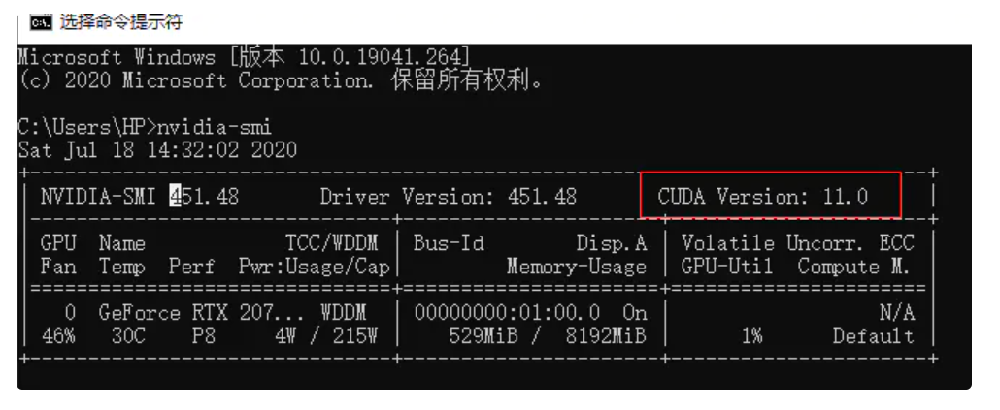
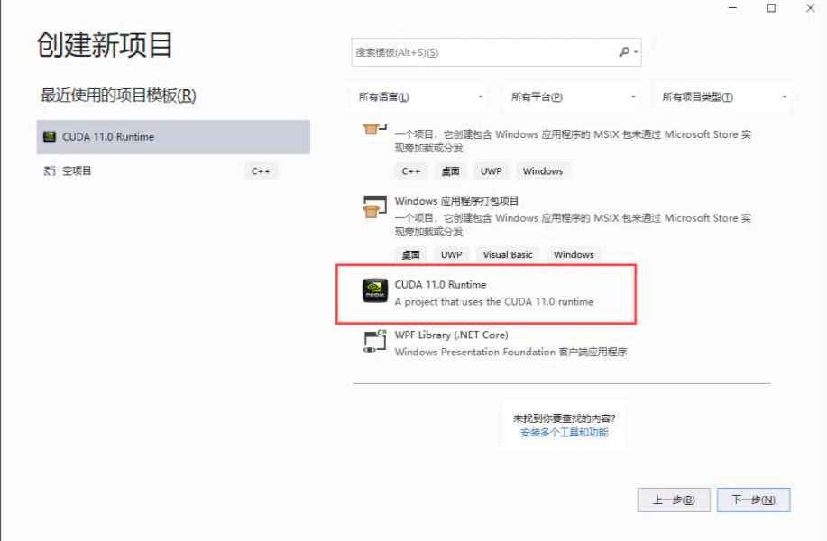
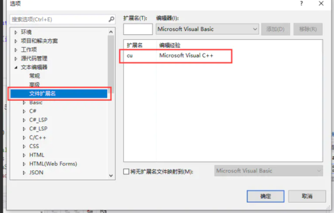
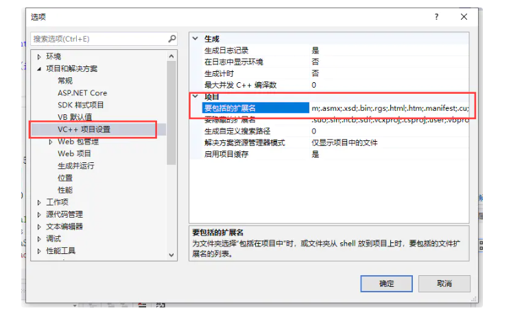
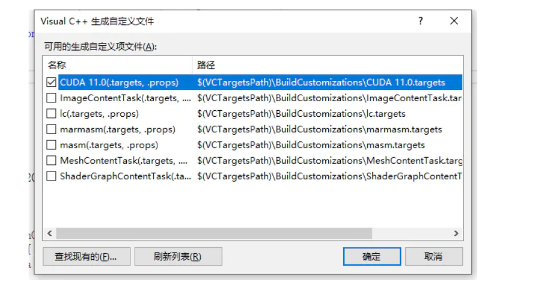
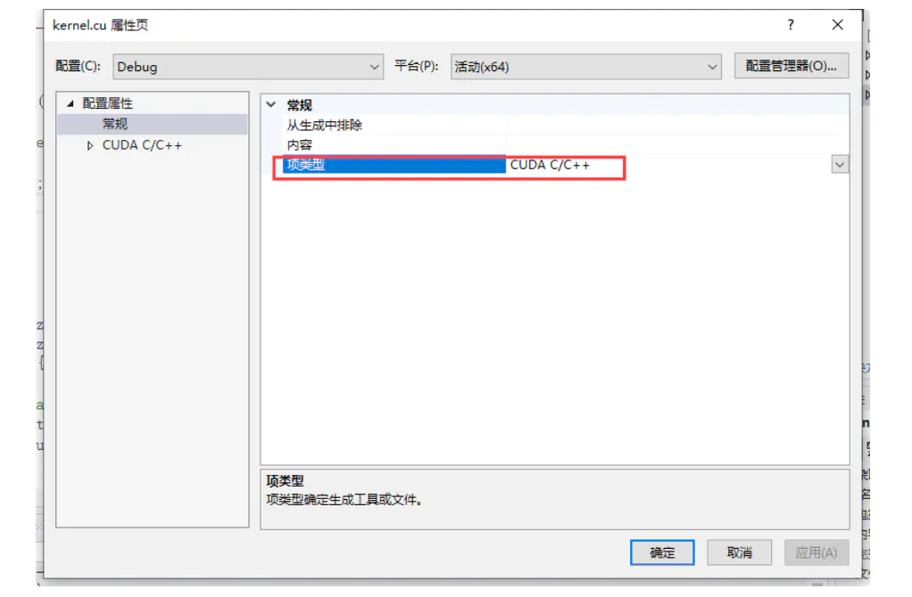
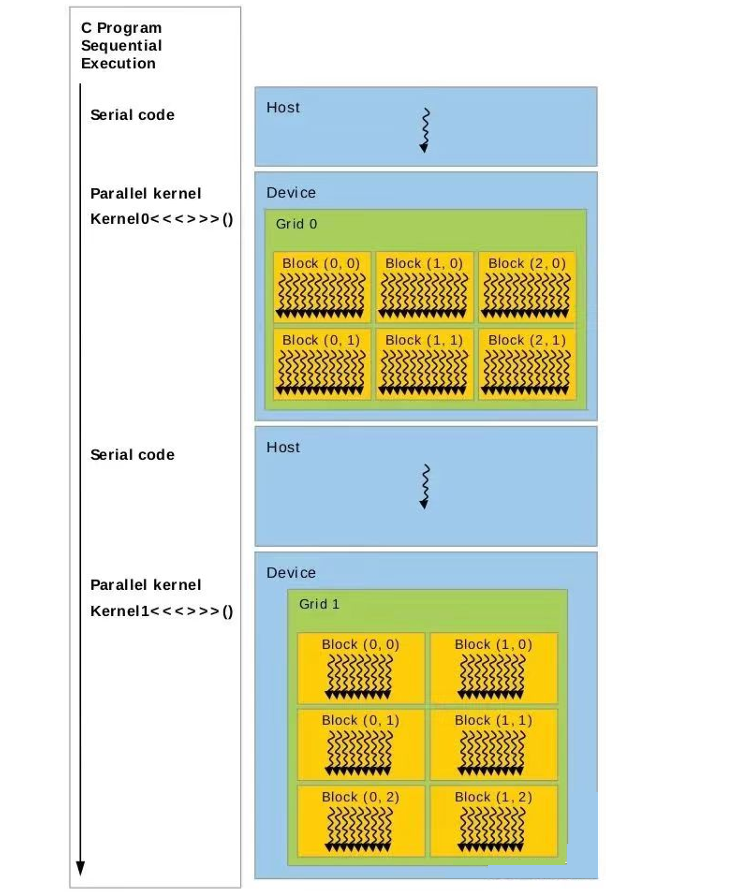
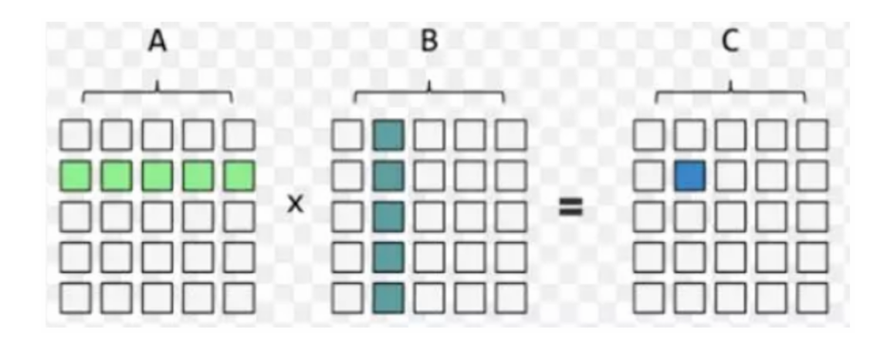
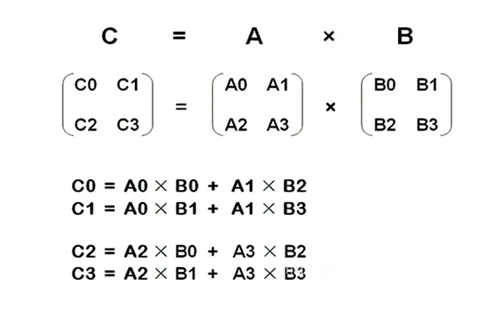
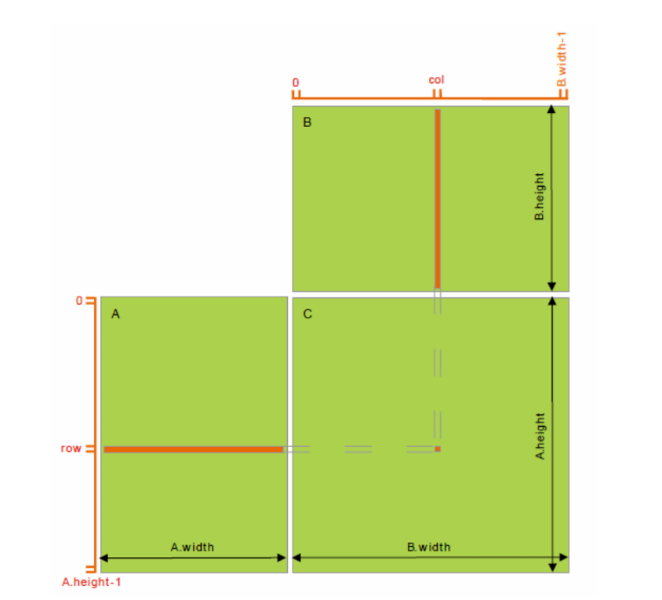

# CUDA的安装和基本语法

## CUDA的安装

第一步，检查显卡支持的cuda版本。win+R打开cmd，输入nvidia-smi，查看cuda版本号。



第二步，安装vs2019，vs在官网下载**community**版本，**插件选择使用c++桌面程序**。

第三步，在nvidia官网下载对应版本的cuda进行安装。

第四步，安装后查看环境变量，已经有CUDA_PATH的环境变量，还需要在系统用户变量中增加以下的路径：

```shell
CUDA_BIN_PATH: %CUDA_PATH%\bin
CUDA_LIB_PATH: %CUDA_PATH%\lib\x64
CUDA_SDK_PATH: C:\ProgramData\NVIDIA Corporation\CUDA Samples\v11.0
CUDA_SDK_BIN_PATH: %CUDA_SDK_PATH%\bin\win64
CUDA_SDK_LIB_PATH: %CUDA_SDK_PATH%\common\lib\x64
```

第五步，在系统环境变量把上面的路径加入环境变量。

```shell
%CUDA_BIN_PATH%
%CUDA_LIB_PATH%
%CUDA_SDK_BIN_PATH%
%CUDA_SDK_LIB_PATH%
```

第六步，打开cmd，执行cuda安装目录下的deviceQuery.exe 和 bandwidthTest.exe，result=pass则安装成功，否则就重新安装。

第七步，打开vs2019，创建新项目，下拉找到cuda项目。填写项目名和选择项目路径。



第八步，打开项目后，找到工具–>选项–>文本编辑器–>文件拓展名, 新增扩展名 .cu 并将编辑器设置为：Microsoft Visual C++。然后工具–>选项–>项目和解决方案–>VC++项目设置，添加要包括的扩展名".cu"。





第九步，右键打开的项目–>生成依赖项–>生成自定义–>勾选CUDA v11.0。



第十步，右键.cu文件–>文件属性设置为 CUDA c/c++，重新生成解决方案，点击运行即可得出结果。安装完成。



## CUDA的基本语法

CUDA程序的结构大体是：{主机串行->GPU并行}+ -> 主机串行，这样的串并交叉结构。主机串 行过渡到GPU并行时需要将数据从主机内存上拷贝到GPU设备内存上，GPU执行完毕时也需要把 数据拷贝回来。



主机调用设备代码的唯一接口就是Kernel函数，使用限定符:\_\_global\_\_。调用内核函数需要在内核函数名后添加<<<>>>指定内核函数配置，<<<>>>运算符完整的执行配置参数形式是<<<Dg, Db, Ns, S>>>。

1. 参数Dg用于定义整个grid的维度和尺寸，即一个grid有多少个block。为dim3类型。Dim3 Dg(Dg.x, Dg.y, 1)表示grid 中每行有Dg.x个block，每列有Dg.y个block，第三维恒为1(目前一个核函数只有一个grid)。整个grid中共有Dg.x \* Dg. y个block，其中Dg.x和Dg.y最大值为65535。
2. 参数Db用于定义一个block的维度和尺寸，即一个block有多少个thread。为dim3类型。Dim3 Db(Db.x, Db.y, Db.z) 表示整个block中每行有Db.x个thread，每列有Db.y个thread，高度为Db.z。Db.x和Db.y最大值为512，Db.z最大值 为62。 一个block中共有Db.x  \* Db.y \* Db.z个thread。计算能力为1.0,1.1的硬件该乘积的最大值为768，计算能力为 1.2,1.3的硬件支持的最大值为1024。
3. 参数Ns是一个可选参数，用于设置每个block除了静态分配的shared Memory以外，最多能动态分配的shared  memory大小，单位为byte。不需要动态分配时该值为0或省略不写。
4. 参数S是一个cudaStream_t类型的可选参数，初始值为零，表示该核函数处在哪个流之中。

如<<<DimGrid, DimBlock>>>指定线程网络和线程块维度。若当前硬件无法满足用户配置，则内 核函数不会被执行，直接返回错误。

 CUDA有3种函数限定符，默认host，global异步调用、主机不能调device，设备上执行的函数参数数目固定、不 能声明静态变量且不支持递归调用。

| 函数限定符     | 何处执行 | 何处调用 | 特性                   |
| -------------- | -------- | -------- | ---------------------- |
| \_\_device\_\_ | GPU设备  | GPU设备  | 函数的地址无法获取     |
| \_\_global\_\_ | GPU设备  | CPU主机  | 返回类型必须为空       |
| \_\_host\_\_   | CPU主机  | CPU主机  | 等同于不使用任何限定符 |

申明变量时可以使用变量限定符（shared共享一致性必须由显式线程同步保证）

| 限定符           | 位于何处   | 可以访问的线程       | 主机访问         |
| ---------------- | ---------- | -------------------- | ---------------- |
| \_\_device\_\_   | 全局存储器 | 线程网格内的所有线程 | 通过运行时库访问 |
| \_\_constant\_\_ | 固定存储器 | 线程网格内的所有线程 | 通过运行时库访问 |
| \_\_shared\_\_   | 共享存储器 | 线程网格内的所有线程 | 不可从主机访问   |

- CPU启动kernel函数是异步的，它并不会阻塞等到GPU执行完kernel函数才执行后面的CPU部 分，因此如果后续程序立即需要用到上一个kernel函数的结果我们需要显式设置同步障来阻塞 CPU程序。
- 一个线程块内需要同步共享存储器的共享变量（\_\_shared\_\_）时，需要在使用前显式调用 __syncthreads()同步块内所有线程。
- 同一个Grid中不同Block之间无法设置同步。

```c++
// cudaMemcpy用于在主机和设备之间拷贝数据, 其中cudaMemcpyKind枚举类型常用有cudaMemcpyHostToDevice表示把主机数据拷贝到内存以及逆向的cudaMemcpyDeviceToHost
 __host__ cudaError_t cudaMemcpy( void* dst, const void* src, size_t count, cudaMemcpyKind kind);

// cudaMalloc 在设备上分配动态内存，两个限定符表示可以在主机或设备上调用
 __host__ __device__ cudaError_t cudaMalloc( void** devPtr, size_t size );

// cudaFree释放回收在设备上分配动态内存，两个限定符表示可以在主机或设备上调用
__host__ __device__ cudaError_t cudaFree( void* devPtr )
```

## CUDA的基本编程

### CUDA加法

用cuda计算向量加法A+B=C，其基本流程如下：

1. 申请主机内存。向量A，向量B，计算结果C
2. 初始化数据。用0-1之间的随机数初始化向量A，B，C
3. .GPU内存申请。申请A，B，C需要的GPU内存空间
4. 数据拷贝。把数据从主机内存拷贝至GPU内存。
5. 计算需要的线程数和线程块数。
6. 调用GPU加法函数。
7. 数据拷贝。把结果从GPU内存拷贝至主机内存。
8. 可以在CPU上重新运行一遍，与GPU结果进行对照。
9. 释放GPU内存、释放主机内存、重置GPU状态。

```c++
#include <cuda_runtime.h>
#include <stdio.h>
#define LOOP_NUM 1
// CPU 加法
void sumArraysCPU(float *a, float *b, float *res, const int size, int loop) {
  for (int j = 0; j < loop; j++) {
    int i = 0;
    for (i = 0; i < size; i += 1) {
      res[i] = a[i] + b[i];
    }
    // printf("CPU res[%d] = %f\n", i - 1, res[i-1]);
  }
}
// GPU 加法
__global__ void sumArraysGPU(float *a, float *b, float *res, int N, int loop) {
  for (int j = 0; j < loop; j++) {
    int i = blockIdx.x * blockDim.x + threadIdx.x;
    if (i < N)
      res[i] = a[i] + b[i];
    printf("GPU res[%d] = %f\n", i, res[i]);
  }
}

void initialData(float *ip, int size) {
  time_t t;
  srand((unsigned)time(&t));
  for (int i = 0; i < size; i++) {
    ip[i] = (float)(rand() & 0xffff) / 1000.0f;
  }
}

void initDevice(int devNum) {
  int dev = devNum;
  cudaDeviceProp deviceProp;
  CHECK(cudaGetDeviceProperties(&deviceProp, dev));
  printf("Using device %d: %s\n", dev, deviceProp.name);
  CHECK(cudaSetDevice(dev));
}

void checkResult(float *hostRef, float *gpuRef, const int N) {
  double epsilon = 1.0E-8;
  for (int i = 0; i < N; i++) {
    if (abs(hostRef[i] - gpuRef[i]) > epsilon) {
      printf("Results don\'t match!\n");
      printf("%f(hostRef[%d] )!= %f(gpuRef[%d])\n", hostRef[i], i, gpuRef[i],
             i);
      return;
    }
  }
  printf("Check result success!\n");
}

// 测试多个循环，更容易分析gpu的性能影响
int main(int argc, char **argv) {
  // set up device  选择设备
  initDevice(0);
  // 初始化向量维度
  int nElem = 2048 * 2048; // 4,194,304
  printf("Vector addition of %d elements\n", nElem);
  // 内存数据申请空间
  int nByte = sizeof(float) * nElem;
  printf("CPU nedd all memory size: %d\n", nByte * 4);
  // 对主机的a, b, res申请内存空间
  float *a_h = (float *)malloc(nByte);
  float *b_h = (float *)malloc(nByte);
  float *res_h = (float *)malloc(nByte);
  // 申请从gpu拷贝vector回主机的内存空间
  float *res_from_gpu_h = (float *)malloc(nByte);
  // 初始化为0
  memset(res_h, 0, nByte);
  memset(res_from_gpu_h, 0, nByte);
  // 内存数据随机初始化 向量a和b的数据
  initialData(a_h, nElem);
  initialData(b_h, nElem);
  // GPU显存申请空间
  printf("GPU nedd all memory size: %d\n", nByte * 3);
  float *a_d = NULL;
  float *b_d = NULL;
  float *res_d = NULL;
  CHECK(cudaMalloc((float **)&a_d, nByte));
  CHECK(cudaMalloc((float **)&b_d, nByte));
  CHECK(cudaMalloc((float **)&res_d, nByte));
  // 内存到显存数据拷贝
  double iStart = 0;
  double iElaps = 0;
  iStart = cpuSecond();
  CHECK(cudaMemcpy(a_d, a_h, nByte, cudaMemcpyHostToDevice));
  CHECK(cudaMemcpy(b_d, b_h, nByte, cudaMemcpyHostToDevice));
  iElaps = cpuSecond() - iStart;
  printf("内存数据拷贝到GPU时间消耗\t%lf sec\n", iElaps);
  // dim3 block(512);
  // dim3 grid((nElem - 1) / block.x + 1);
  // 计算线程块与线程
  // 每线程块线程数
  int threadsPerBlock = 16;
  // 每网格线程块数
  int blocksPerGrid = (nElem + threadsPerBlock - 1) / threadsPerBlock;

  printf("% Loop, CUDA kernel launch with %d blocks of %d threads\n", LOOP_NUM,
         blocksPerGrid, threadsPerBlock);
  // GPU 加法
  iStart = cpuSecond();
  //  sumArraysGPU << <grid, block >> > (a_d, b_d, res_d, nElem, LOOP_NUM);
  sumArraysGPU<<<blocksPerGrid, threadsPerBlock>>>(a_d, b_d, res_d, nElem,
                                                   LOOP_NUM);
  iElaps = cpuSecond() - iStart;
  printf("GPU计算时间 \t\t\t\t %lf sec\n", iElaps);
  // 显存到内存数据拷贝
  iStart = cpuSecond();
  CHECK(cudaMemcpy(res_from_gpu_h, res_d, nByte, cudaMemcpyDeviceToHost));
  iElaps = cpuSecond() - iStart;
  printf("结果从显存拷贝到内存时间消耗   %lf sec\n", iElaps);
  // CPU 加法
  iStart = cpuSecond();
  sumArraysCPU(a_h, b_h, res_h, nElem, LOOP_NUM);
  iElaps = cpuSecond() - iStart;
  printf("CPU 计算时间\t\t\t\t %lf sec\n", iElaps);
  // 检测GPU和CPU的计算结果
  printf("检测GPU和CPU的计算结果是否相同\n");
  checkResult(res_h, res_from_gpu_h, nElem);
  cudaFree(a_d);
  cudaFree(b_d);
  cudaFree(res_d);
  free(a_h);
  free(b_h);
  free(res_h);
  free(res_from_gpu_h);
  return 0;
}
```

### CUDA乘法

两个矩阵要是想相乘需要满足， 第一个矩阵的列数等于第二个矩阵的行数.



其计算方式是先计算相乘，后相加，如下所示：



使用CPU矩阵乘法串行的算法如下:

```c++
void matrixMulCpu(float* A, float* B, float* C, int width){
    float sum = 0.0f;
    for(int i = 0; i < width; i++){
        for(int j = 0; j < width; j++){
            for(int l = 0; l < width; l++){
                sum += A[i * width + l] * B[l * width + j];
            }
            C[i * width + j] = sum;
            sum = 0.0f;
        }
    }
}
```

CPU代码可以看出，总共的计算次数为：m *n * k，时间复杂度为：O(N^3 )。

矩阵乘法GPU实现获得 C 矩阵的计算方法都是相同的，只不过使用的是矩阵 A、B 不同的元素来进行计算，即不同数据的大量相同计算操作，这种计算是特别适合使用GPU来计算，因为GPU拥有大量简单重复的计算单元，通过并行就能极大的提高计算效率。

在 GPU 中执行矩阵乘法运算操作如下：

1. 在 Global Memory 中分别为矩阵 A、B、C 分配存储空间
2. 由于矩阵 C 中每个元素的计算均相互独立，NVIDIA GPU 采用的 SIMT (单指令多线程)的体系 结构来实现并行计算的, 因此在并行度映射中，让每个 thread 对应矩阵 C 中1个元素的计算。
3. 执行配置 (execution configuration)中 gridSize 和 blockSize 均有 x(列向)、y(行向)两个维度。



每一个thread 需要执行的 workflow 为：

1. 从矩阵 A 中读取一行向量 (长度为width) ==> A[row * width + i]
2. 从矩阵 B 中读取一列向量 (长度为width（图中为height）) ==> B[i * width + col]
3. 对这两个向量做点积运算 (单层 width 次循环的乘累加)==> A[row * width + i] * B[i * width  + col]
4. 最后将结果写回矩阵 C。==> C[row * width + col] = Pervalue

```c++
 __global__ void multiply(int* A, int* B, int* C, int width) {
    int bx = blockIdx.x;
    int by = blockIdx.y;
    int tx = threadIdx.x;
    int ty = threadIdx.y;
    int col = bx * blockDim.x + tx;
    int row = by * blockDim.y + ty;
    int perValue = 0;
    if (row < width && col < width) {
        for (int i = 0; i < width; i++) {
            perValue += A[row * width + i] * B[i * width + col];
        }
        C[row * width + col] = perValue;
    }
}
```

