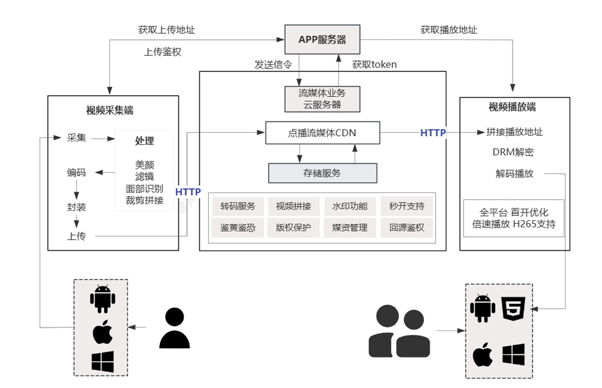
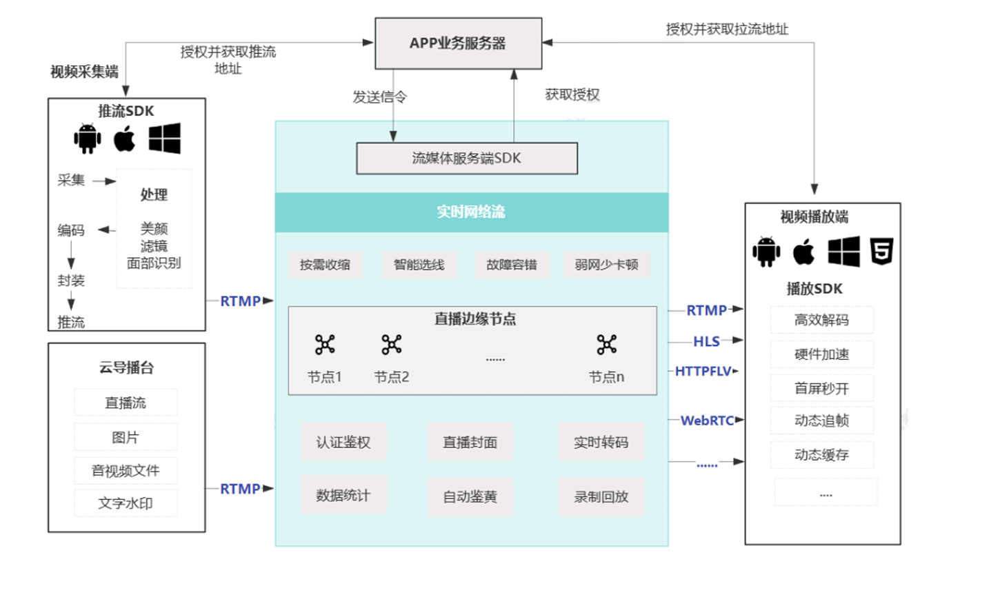
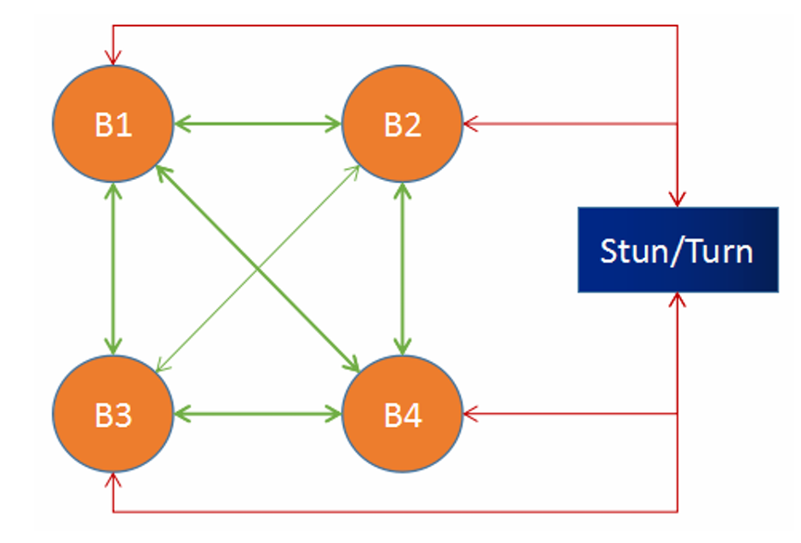
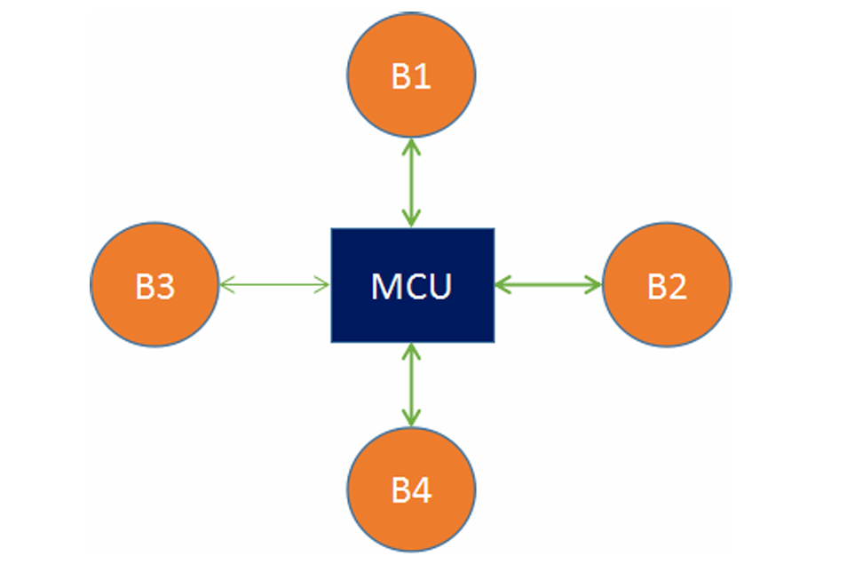
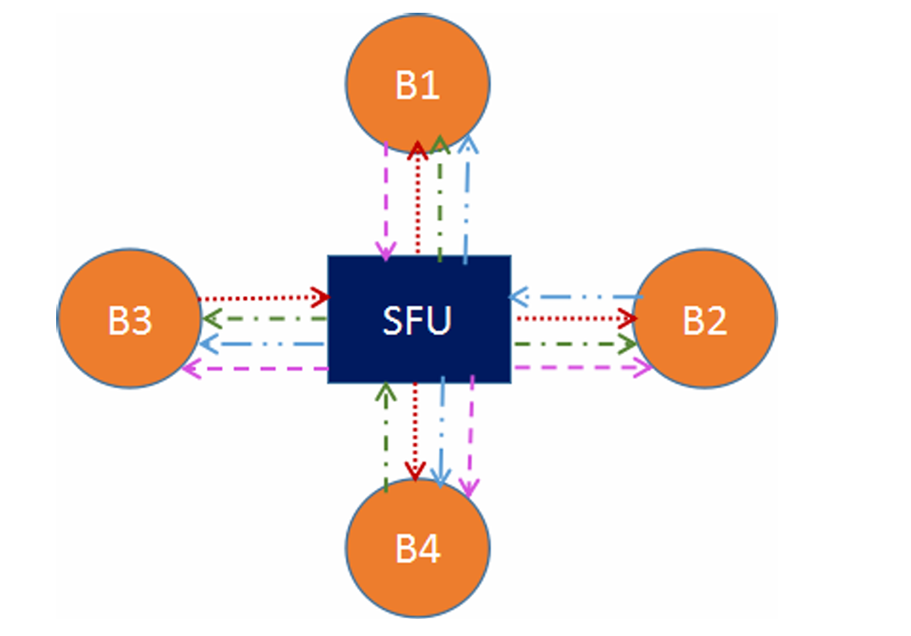
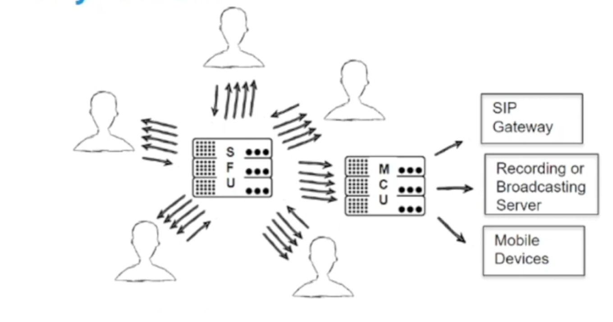
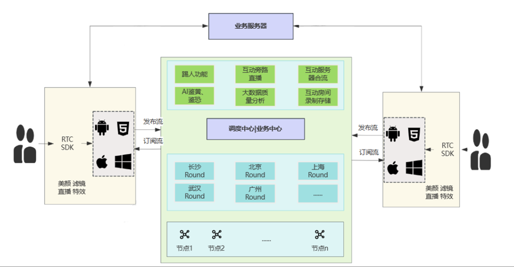

# 音视频架构

## 音视频短视频点播框架

在音视频的短视频等点播框架中，主要分为视频采集端、流媒体服务器端和视频播放端。视频采集端把音视频数据进行采集、特效处理、编码，然后上传到流媒体服务器端，视频播放器端通过获取播放地址，进行点播短视频。

视频采集端需要获取上传地址，该地址需要进行授权才能上传到流媒体服务器。授权需要使用AccessKey&SecretKey机制，AccessKey（开发者标识，确保唯一）和SecretKey（用于接口加密，确保不易被穷举，生成算法不易被猜测）。

短视频是通过HTTP上传到流媒体服务器，然后通过HTTP进行点播。流媒体服务器处理存储和转发，通常还提供其他的服务，例如：DRM英文全称Digital Rights Management: 数字版权管理，目前泛指所有与数字产品版权保护相关的所有技术手段，常见的手段有防盗链、视频加密(AES)；转码服务，比如转成不同清晰度的视频，方便不同网络状况选择；鉴黄、鉴恐，主要是大公司提供对应的业务服务，需要专业的算法对视频进行抽帧分析。

## 音视频直播框架

音视频进行直播不同于视频，直播需要实时的转发到不同的播放客户端。在视频采集端同样进行编码后的视频，通常通过推流SDK使用RTMP协议推送到流媒体服务器，流媒体服务器通过许多的树状结构的边缘节点转发，才能保证多人同时观看直播。（转发层次越高，延迟越大）在客户端可以使用RTMP、HLS、HTTPFLV、WebRTC等协议进行直播的播放。

- RTMP是Real Time Messaging Protocol（实时消息传输协议），该协议基于TCP来进行实时数据通信的网络协议， 主要用来在Flash/AIR平台和支持RTMP协议的流媒体/交互服务器之间进行音视频和数据通信。
- HLS (HTTP Live Streaming)是Apple的动态码率自适应技术。主要用于PC和Apple终端的音视频服务。包括一个 m3u(8)的索引文件，TS媒体分片文件和key加密串文件。
- HTTPFLV， 即通过HTTP方式拉取FLV(Flash Live Video)媒体流。
- WebRTC (Web Real-Time Communications) 是一项实时通讯技术，它允许网络应用或者站点，在不借助中间媒介的情况下，建立浏览器之间点对点（Peer-to-Peer）的连接，实现视频流和音频流或者其他任意数据的传输。WebRTC 包含的这些标准使用户在无需安装任何插件或者第三方的软件的情况下，创建点对点（Peer-to-Peer）的数据分享和电话会议成为可能。 大部分场景基于UDP传输。

## 音视频通话常见框架

基于 WebRTC 的多对多实时通信的开源项目有很多，多方通信架构主要有以下三种方案，Mesh 方案、MCU（Multipoint Conferencing Unit）方案和SFU（Selective Forwarding Unit）方案。

### Mesh 方案

Mesh 方案，即多个终端之间两两进行连接，形成一个 网状结构。比如 A、B、C 三个终端进行多对多通信，当 A 想 要共享媒体（比如音频、视频）时，它需要分别向 B 和 C 发送数据。同样的道理，B 想要共享媒体，就需要分别向  A、C 发送数据，依次类推。这种方案 对各终端的带宽要求比较高。

其优点有：

1. 不需要服务器中转数据，STUN/TUTN 只是负责 NAT 穿越，这样利用现有 WebRTC 通信模型就可以实现，而不需 要开发媒体服务器。
2. 充分利用了客户端的带宽资源。
3. 节省了服务器资源，因为服务器带宽往往是专线，价格昂贵，所以这种方案可以很好地控制成本。

其缺点有：

1. 共享端共享媒体流的时候，需要给每一个参与人都转发一份媒体流，这样对上行带宽的占用很大。参与人越多，占用 的带宽就越大。除此之外，对 CPU、Memory 等资源也是极大的考验。一般来说，客户端的机器资源、带宽资源往 往是有限的，资源占用和参与人数是线性相关的。这样导致多人通信的规模非常有限，通过实践来看，这种方案在超 过 4 个人时，就会有非常大的问题。
2. ，在多人通信时，如果有部分人不能实现 NAT 穿越，但还想让这些人与其他人互通，就显得很麻烦，需要 做出更多的可靠性设计（此时还是得通过服务器转发音视频数据）。

### MCU 方案

MCU（Multipoint Conferencing Unit）方案，该方案由一个服务器和多个终端组成一个 星形结构。各终端将自己要共享的音视频流发送给服务器，服务器端会将在同一个房间中的所有终端的音视频流进行混合，最终生成一个混合后 的音视频流再发给各个终端，这样各终端就可以看到 / 听到其他终端的音视频了。实际上服务器端就是一个音视频混合器，这种方案 服务器的压力会非常大。

MCU 主要的处理逻辑是接收每个共享端的音视频流，经过解码、与其他解码后的音视频进行混流、重新编码，之后再 将混好的音视频流发送给房间里的所有人。其优点有：

1. 技术非常成熟，在硬件视频会议中应用非常广泛。
2. 作为音视频网关，通过解码、再编码可以屏蔽不同编解码设备的差异化，满足更多客户的集成需求，提升用户体验和 产品竞争力。
3. 将多路视频混合成一路，所有参与人看到的是相同的画面，客户体验非常好。

其缺点有：

1. 重新解码、编码、混流，需要大量的运算，对CPU 资源的消耗很大。
2. 重新解码、编码、混流还会带来延迟。
3. 由于机器资源耗费很大，所以 MCU 所提供的容量有限，一般十几路视频就是上限了。

###  SFU 方案

SFU（Selective Forwarding Unit）方案，该方案也是由一个服务器和多个终端组成，但与 MCU 不同的是，SFU 不 对音视频进行混流，收到某个终端共享的音视频流后，就直接将该音视频流转发给房间内的其他终端。它实际上就是 一个音视频路由转发器。

SFU 像是一个 媒体流路由器，接收终端的音视频流，根据需要转发给其他终端。SFU 在音视频会议中应用非常广泛，尤 其是 WebRTC 普及以后。支持 WebRTC 多方通信的媒体服务器基本都是 SFU 结构。

其优点有：

1. 由于是数据包直接转发，不需要编码、解码，对 CPU 资源消耗很小。
2. 直接转发也极大地降低了延迟，提高了实时性。
3. 有更好的的灵活性，能够更好地适应不同的网络状况和终端类型（通过 SVC 模式和 Simulcast 模式，用于适配WiFi、4G 等不同网络状况，以及 Phone、Pad、PC 等不同终端设备，实际是使用不同码率的拉流）。

其缺点有：

1. 由于是数据包直接转发，参与人观看多路视频的时候可能会出现不同步；相同的视频流，不同的参与人看到的画面也可能不一致。
2. 参与人同时观看多路视频，在多路视频窗口显示、渲染等会带来很多麻烦，尤其对多人实时通信进行录制，多路流也 会带来很多回放的困难。总之，整体在通用性、一致性方面比较差。

### 音视频通话方案总结

通过上面的分析和比较，综合它们各自的优劣情况，可以得出 SFU 是三种架构方案中优势最明显而劣势又相对较少的一 种架构方案。无论是从灵活性上，还是音视频的服务质量、负载情况等方面上，相较其他两种方案，SFU 都有明显的优势，因此这种 方案也被大多数厂商广泛采用。

在一些特别的场景下，例如，在一个典型的视频会议应用程序，部分参与者可以以 SFU 的方式参与会议，但为了提供更 多的功能，参与者可以通过 MCU，使用网络 SIP 语音呼叫通过移动设备加入会议。在类似的情形下，同时使用这两种选 择是一个非常有效的。

所以一个完整的实时音视频业务框架如下所示：

## 音视频流媒体服务器的应用

常用的开源流媒体服务器有以下几种：

- SRS （协程的方案）。：SRS(Simple Realtime Server)是一个简单高效的实时视频服务器，支持RTMP、WebRTC、HLS、 HTTP-FLV、SRT等多种实时流媒体协议。
- ZLMediaKit（ZLTookKit C++11）。一个基于C++11的高性能运营级流媒体服务框架，支持多种协议(RTSP/RTMP/HLS/HTTP-FLV /WebSocket-FLV/GB28181/HTTP-TS/WebSocket-TS/HTTP-fMP4/WebSocket-fMP4/MP4 /WebRTC),支持协议互转。
- WebRTC开源服务器：Kurento、Janus、jitsi、MediaSoup、PION等等。

常见的应用有：

1. 远程桌面控制，通过WebRTC回传远端设备屏幕画面，捕获本地设备的点击事件，然后发送给远端设备，远端设备收到点击事件后则做相应的处理。
2. 云游戏，使用WebRTC推送游戏源，在Web也基于WebRTC拉流，在Web界面捕获事件发送给游戏源端。目前鼎鼎大名的unity 云游戏底层用的也是WebRTC技术。
3. Web音视频通话，如基于 SRS+WebRTC的音视频会议等等方案。

