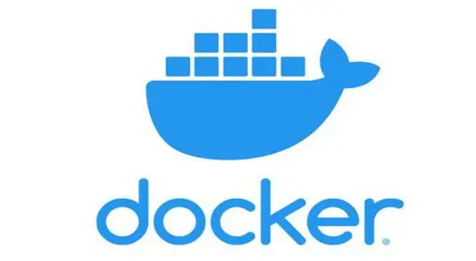
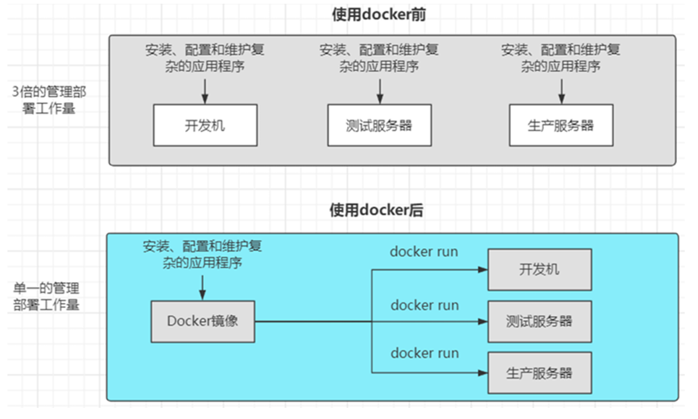
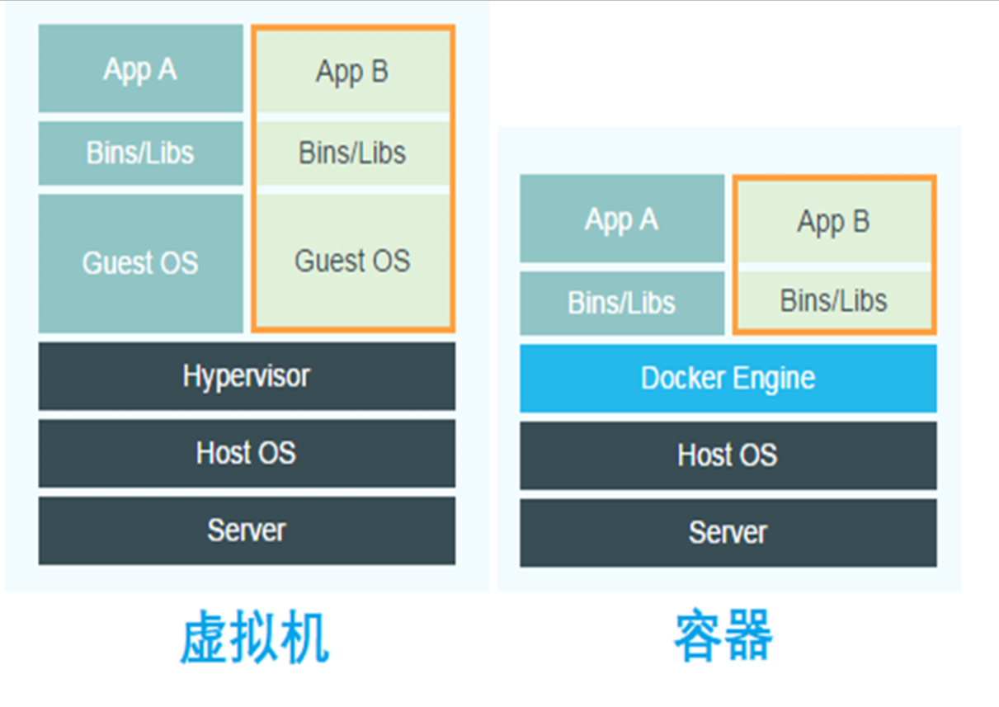
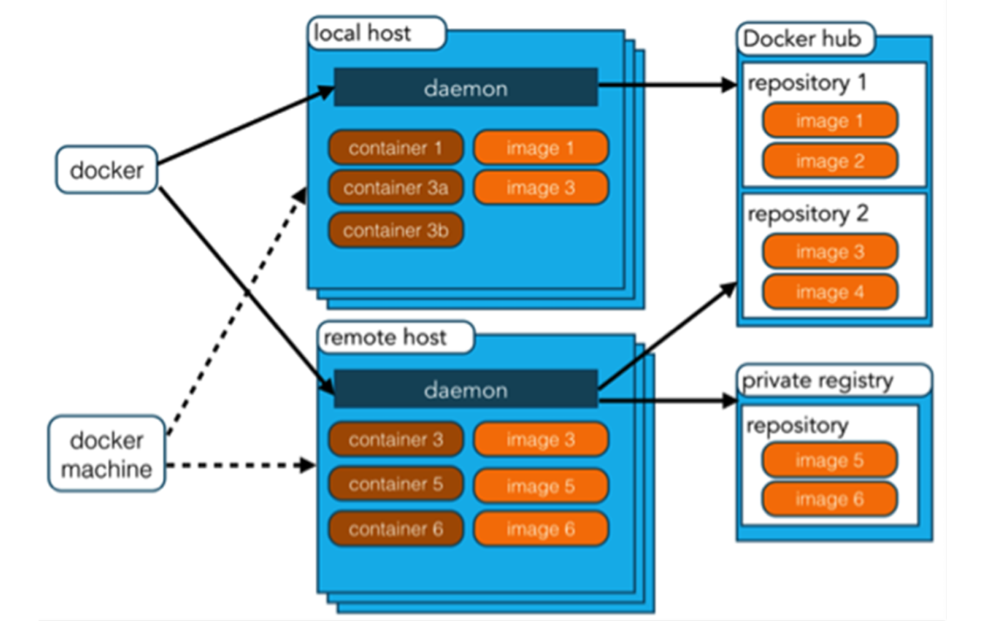

# Docker的介绍和安装

Docker是以Docker容器为资源分割和调度的基本单位，封装整个软件运行时环境，为 开发者和系统管理员设计的，用于构建、发布和运行分布式应用的平台。



docker的出现是为了解决以下的问题：

- 解决了应用程序本地运行环境与生产运行环境不一致的问题
-  解决了应用程序资源使用的问题，docker会一开始就为每个程序指定内存分配和CPU分配
- 让快速扩展、弹性伸缩变得简单

## Docker技术边界

docker是容器化技术，针对的是应用及应用所依赖的环境做容器化。

docker遵循单一原则，一个容器只运行一 个主进程。多个进程都部署在一个容器中，弊端很多。比如更新某个进程的镜像时，其他进程也会被迫 重启，如果一个进程出问题导致容器挂了，所有进程都将无法访问。再根据官网的提倡的原则而言，容器 = 应用 + 依赖的执行环境而不是像虚拟机一样，把一堆进程都部署在一起。

docker带来的哪些改变：



1. 软件交付方式发生了变化
2. 部分功能替代了虚拟机
3. 改变了体验软件的模式
4. 降低了企业成本
5. 促进了持续集成、持续部署的发展
6. 促进了微服务的发展

## docker和虚拟机的区别

vm（虚拟机）与docker（容器）框架，直观上来讲vm多了一层guest OS，同时Hypervisor会对硬 件资源进行虚拟化，docker直接使用硬件资源，所以资源利用率相对docker低。

服务器虚拟化解决的核心问题是资源调配，而容器解决的核心问题是应用开发、测试和部署。

容器技术严格来说并不是虚拟化，没有客户机操作系统，是共享内核的。



## Docker的基本架构

docker的基本架构图如下：



- 镜像（Image）：Docker 镜像是用于创建 Docker 容器的模板，比如 Ubuntu 系统。
- 容器（Container）：容器是独立运行的一个或一组应用，是镜像运行时的实体。
-  客户端（client）：Docker 客户端通过命令行或者其他工具使用 Docker SDK与 Docker 的守护进程通信。
- 注册中心（Registry）：Docker 仓库用来保存镜像，可以理解为代码控制中的代码仓库。Docker  Hub提供了庞大的镜像集合供使用。
- Docker Machine：Docker Machine是一个简化Docker安装的命令行工具，通过一个简单的命令 行即可在相应的平台上安装Docker。

docker的client 通过http协议访问 host，可以使用socat进行抓包查看数据。socat的 -v 用于提高输出的可读性，带有数据流的指示。UNIX-LISTEN 部分是让socat 在一个Unix  套接字上进行监听，而UNIX-CONNECT 是让socat 连接到Docker 的Unix套接字。

```shell
sudo apt install socat
socat -v UNIX-LISTEN:/tmp/dockerapi.sock UNIX-CONNECT:/var/run/docker.sock &
docker -H unix:///tmp/dockerapi.sock ps
```

## Docker的安装

### 基于apt包管理器安装

```shell
# 安装
sudo apt  install docker.io

# 卸载
sudo apt-get purge docker.io
sudo rm -rf /var/lib/docker
sudo rm -rf /var/lib/containerd
```

除了使用apt包管理器安装，还可以 基于官方存储库安装、下载软件包安装、 基于官方给出的快捷脚本安装。

安装完成后设置自定义镜像库：

```shell
vim /etc/docker/daemon.json

{
 "registry-mirrors":[
 "https://hub-mirror.c.163.com",
 "https://docker.mirrors.ustc.edu.cn",
 "https://registry.docker-cn.com"
 	]
 }
 
 sudo systemctl daemon-reload
 sudo systemctl restart docker
```

最后把将用户添加到docker用户组后，不需要每次都输入sudo来执行docker命令。

```shell
#将用户从docker用户组中移除 gpasswd -d <username> docker
# 将用户添加到docker 用户组
sudo addgroup -a ysx docker
sudo service docker restart
# 查看用户信息
id ysx
```

