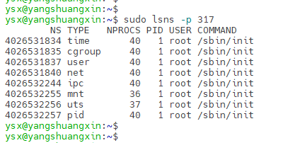
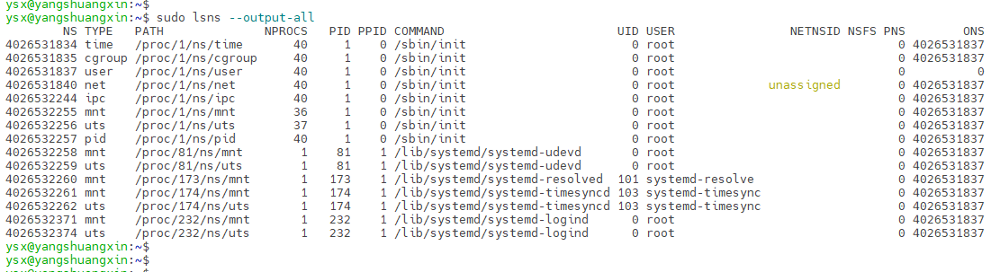
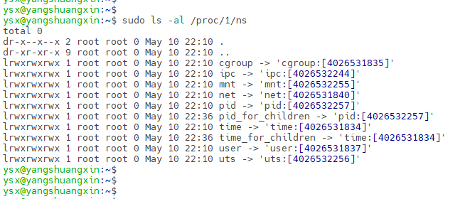
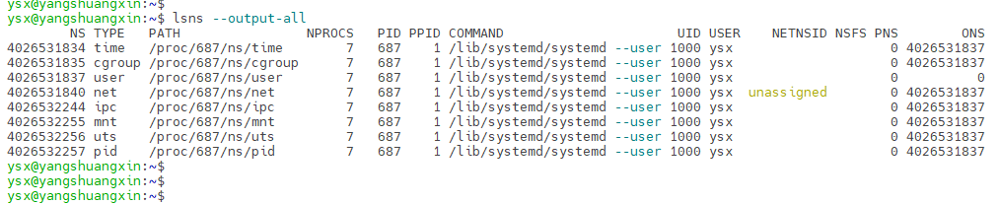
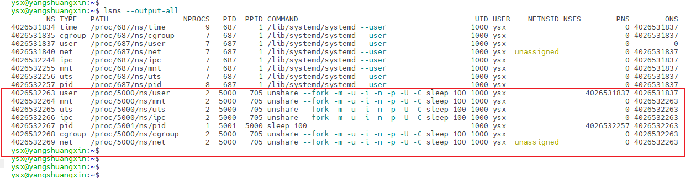
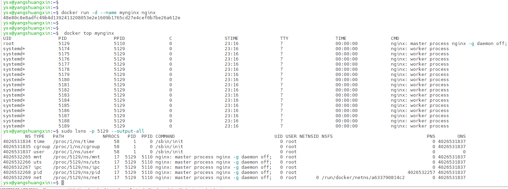
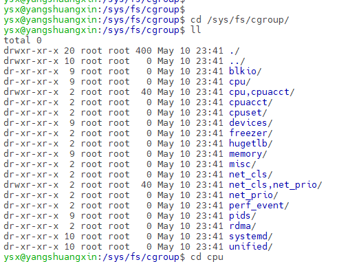
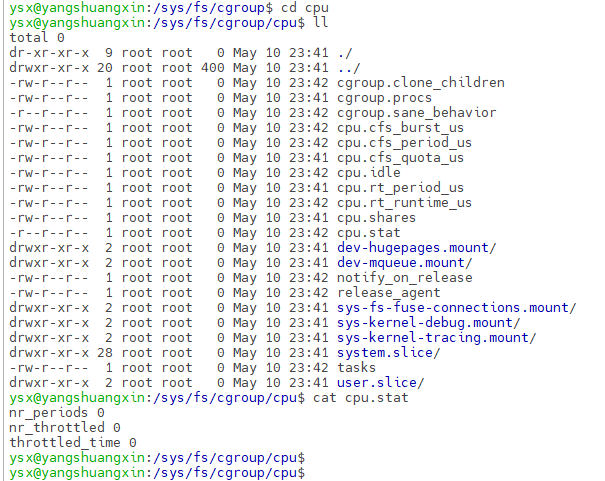
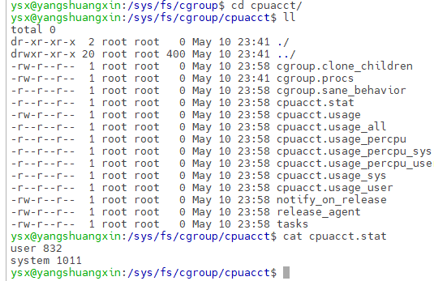

# Docker的Linux内核隔离

## RootFs

rootfs 是Docker 容器在启动时内部进程可见的文件系统，即Docker容器的根目录。

rootfs通常包含一个操作系统运行所需的文件系统，例如可能包含经典的类Unix操作系统中的目录系统， 如/dev、/proc、/bin、/etc、/lib、/usr、/tmp及运行Docker容器所需的配置文件、工具等。

## Linux Namespace

Namespace是 Linux 内核用来隔离内核资源的方式。Linux实现了六种不同类型的命名空间。

每个命名 空间的用途是将特定的全局系统资源包装在抽象中，使命名空间中的进程看起来它们具有自己的全局资源独立实例。命名空间的总体目标之一是支持容器的实现。

| Namespace | 隔离内容                                            |
| --------- | --------------------------------------------------- |
| Mount     | 文件系统挂载点                                      |
| IPC       | 进程间通信资源，即系统VIPC对象和POSIX消息队列       |
| PID       | 进程ID                                              |
| Network   | 网络设备、IP 地址、IP 路由表、/proc/net目录、端口号 |
| UTS       | 主机名与网络信息服务域名                            |
| User      | 用户和用户组                                        |
| Cgroup    | Cgroup根目录                                        |

lsns 命令可以列出系统命名空间，一般的用法是`sudo lsns -p、 --task ＜pid＞` 打印进程命名空间。



```shell
# 列出系统所有命名空间
sudo lsns --output-all
```



-  NS：命名空间标识符（索引节点号）
- TYPE：命名空间类型
- PATH：命名空间的PATH路径
- NPROCS：命名空间中的进程数
-  PID：命名空间中的最小PID
- PPID：PID的父级PID
- COMMAND：PID的命令行
- UID：PID的UID
- USER：PID的User
- NETNSID：网络子系统使用的命名空间ID
- NSFS：nsfs 文件系统挂载点（通常用于网络子系统）

命名空间所属进程ID为1，表示元祖进程的命名空间，即系统默认命名空间。进程没有特殊指定需要创建新的命名空间的情况下，命名空间将与父进程保持一致。

```shell
# 通过文件查看元祖进程命名空间
sudo ls -al /proc/1/ns
```



### 不共享父进程命名空间

```shell
# 查看当前用户进程命名空间列表
lsns --output-all
```



```shell
# fork一个新的进程，并且不共享父进程命名空间
# 创建新的进程, 若没有指定-U则需要超级权限
unshare --fork -m -u -i -n -p -U -C  sleep 100
# 查看所有命名空间
lsns --output-all
```



新fork出来的进程，在指定新命名空间后，其命名空间字段的值与系统默认命名空间不一致，说明进程 创建了新的命名空间。

### 容器进程命名空间

```shell
# 查看容器进程命名空间列表
 # 启动nginx 容器
docker run -d --name mynginx nginx
 # 获取nginx主进程ID
 docker top mynginx 
# 查看进程命名空间
sudo lsns -p <pid> --output-all
```



nginx容器默认使用了mnt、uts、ipc、pid、net 命名空间隔离，而user与cgroup则继承系统默认命名空间。网络命名空间指定了文件系统挂载点。

```shell
# 运行容器，指定私有cgroupns,指定user，就可以不继承系统默认命名空间
docker run -d --cgroupns private --user root  --name mynginx1 nginx
# 查看容器在宿主机上的进程信息，UID显示并不是root
docker top mynginx1
# 与容器交互,查看当前用户信息，显示为root,也可通过id查看用户信息
docker exec -it mynginx1 bash
# 查看进程命名空间，进程拥有独立的命名空间
sudo lsns -p <pid> --output-all
```

mount命名空间：容器内部执行mount 与宿主机内执行mount命令对比，即可看出各自拥有不同的 mounts。mounts文件位于：/proc/mounts 和 /proc/{PID}/mounts。

PID命名空间：容器内部进程ID为1，宿主机内进程ID不为1。

NetWork命名空间：通过ifconfig工具，查看网络信息。容器与宿主机网络完全是两个独立的网络栈。

## cgroups

cgroup全称是control groups，被整合在了linux内核当中，把进程（tasks）放到组里面，对组设置权 限，对进程进行控制。可以理解为用户和组的概念，用户会继承它所在组的权限。`cd /sys/fs/cgroup/cpu`



### cpu子系统：

调度 cgroup 对 CPU 的获取量，可用以下两个调度程序来管理对 CPU 资源的获取：

1. 完全公平调度程序（CFS） ：一个比例分配调度程序，可根据任务优先级 ⁄ 权重或 cgroup 分得的 份额，在任务群组（cgroups）间按比例分配 CPU 时间（CPU 带宽）
2. 实时调度程序（RT） ： 一个任务调度程序，可对实时任务使用 CPU 的时间进行限定。RT 调度程序与 CFS 类似，但只限制实时任务对 CPU 的存取。



- cpu.cfs_period_us：此参数可以设定重新分配 cgroup 可用 CPU 资源的时间间隔，单位为微秒， 上限1秒，下限1000微秒。即设置单个CPU重新分配周期。
- cpu.cfs_quota_us：此参数可以设定在某一阶段（由 cpu.cfs_period_us 规定）某个 cgroup 中所 有任务可运行的时间总量，单位为微秒。即每个周期时间内，可以使用多长时间的CPU（单个）， 该值可以大于cfs_period_us的值，表示可以利用多个CPU来满足CPU使用时长。
- cpu.shares：用一个整数来设定cgroup中任务CPU可用时间的相对比例。该参数是对系统所有CPU 做分配，不是单个CPU。
- cpu.stat：报告 CPU 时间统计。nr_periods ： 经过的周期间隔数；nr_throttled ： cgroup 中任务被节流的次数（即耗尽所有按配额分得的可用时间后，被禁止运行）；throttled_time ： cgroup 中任务被节流的时间总计（以纳秒为单位）。
- cpu.rt_period_us：此参数可以设定在某个时间段中 ，每隔多久，cgroup 对 CPU 资源的存取就要 重新分配，单位为微秒（µs，这里以“us”表示），只可用于实时调度任务。
- cpu.rt_runtime_us：此参数可以指定在某个时间段中， cgroup 中的任务对 CPU 资源的最长连续 访问时间，单位为微秒（µs，这里以“us”表示），只可用于实时调度任务。

### cpuacct子系统

自动生成报告来显示 cgroup 任务所使用的 CPU 资源，其中包括子群组任务

- cpuacct.stat：报告此 cgroup 的所有任务（包括层级中的低端任务）使用的用户和系统 CPU 时间。user： 用户模式中任务使用的 CPU 时间 ；system： 系统（kernel）模式中任务使用的 CPU 时间。
- cpuacct.usage：报告此 cgroup 中所有任务（包括层级中的低端任务）使用 CPU 的总时间（纳秒）。
- cpuacct.usage_percpu：报告 cgroup 中所有任务（包括层级中的低端任务）在每个 CPU 中使用 的 CPU 时间（纳秒）。



### memory子系统

自动生成 cgroup 任务使用内存资源的报告，并限定这些任务所用内存的大小。

- memory.failcnt：报告内存达到 memory.limit_in_bytes 设定的限制值的次数。
-  memory.force_empty：当设定为 0 时，该 cgroup 中任务所用的所有页面内存都将被清空。这个 接口只可在 cgroup 没有任务时使用。如果无法清空内存，请在可能的情况下将其移动到父 cgroup  中。移除 cgroup 前请使用 memory.force_empty 参数以免将废弃的页面缓存移动到它的父  cgroup 中。
- memory.limit_in_bytes：设定用户内存（包括文件缓存）的最大用量。如果没有指定单位，则该 数值将被解读为字节。但是可以使用后缀代表更大的单位 —— k 或者 K 代表千字节，m 或者 M 代 表兆字节 ，g 或者 G 代表千兆字节。在 memory.limit_in_bytes 中写入 -1 可以移除全部已有限 制。
- memory.max_usage_in_bytes：报告 cgroup 中进程所用的最大内存量（以字节为单位）。
- move_charge_at_immigrate：当将一个task移动到另一个cgroup中时，此task的内存页可能会被 重新统计到新的cgroup中，这取决于是否设置了move_charge_at_immigrate。
- numa_stat： 每个numa节点的内存使用数量。
-  memory.oom_control：设置or查看内存超限控制信息(OOM killer)
- memory.pressure_level：设置内存压力通知。
- memory.soft_limit_in_bytes：内存软限制。
- memory.stat：报告大范围内存统计。
- memory.swappiness：将 kernel 倾向设定为换出该 cgroup 中任务所使用的进程内存，而不是从 页高速缓冲中再生页面。
-  memory.usage_in_bytes：报告 cgroup 中进程当前所用的内存总量（以字节为单位）。
- memory.use_hierarchy：包含标签（0 或者 1），它可以设定是否将内存用量计入 cgroup 层级的吞吐量中。如果启用（1），内存子系统会从超过其内存限制的子进程中再生内存。默认情况下 （0），子系统不从任务的子进程中再生内存。

> 内核内存：专用于Linux内核系统服务使用，是不可swap的

- memory.kmem.failcnt：报告内核内存达到 memory.kmem.limit_in_bytes 设定的限制值的次数
- memory.kmem.limit_in_bytes：设定内核内存（包括文件缓存）的最大用量。如果没有指定单 位，则该数值将被解读为字节
-  memory.kmem.max_usage_in_bytes：报告 cgroup 中进程所用的最大内核内存量（以字节为单位）
- memory.kmem.slabinfo：查看内核内存分配情况
- memory.kmem.usage_in_bytes：报告 cgroup 中进程当前所用的内核内存总量（以字节为单位）
- memory.kmem.tcp.failcnt：报告tcp缓存内存达到memory.kmem.tcp.limit_in_bytes设定限制值 的次数
- memory.kmem.tcp.limit_in_bytes：设置或查看TCP缓冲区的内存使用限制
- memory.kmem.tcp.max_usage_in_bytes：报告cgroup中进程所用的最大tcp缓存内存量
- memory.kmem.tcp.usage_in_bytes：报告cgroup中进程当前所用TCP缓冲区的内存使用量

### blkio子系统

控制并监控 cgroup 中的任务对块设备 I/O 的存取。对一些伪文件写入值可以限制存取次数或带宽，从 伪文件中读取值可以获得关于 I/O 操作的信息。

- blkio.reset_stats：此参数用于重设其它伪文件记录的统计数据。请在此文件中写入整数来为  cgroup 重设统计数据.
- blkio.throttle.io_service_bytes：此参数用于报告 cgroup 传送到具体设备或者由具体设备中传送 出的字节数。
- blkio.throttle.io_serviced：此参数用于报告 cgroup 根据节流方式在具体设备中执行的 I/O 操作数。
- blkio.throttle.read_bps_device：此参数用于设定设备执行“读”操作字节的上限。“读”的操作率以 每秒的字节数来限定。
- blkio.throttle.read_iops_device：此参数用于设定设备执行“读”操作次数的上限。“读”的操作率以 每秒的操作次数来表示。
- blkio.throttle.write_bps_device：此参数用于设定设备执行“写”操作次数的上限。“写”的操作率用 “字节/秒”来表示
- blkio.throttle.write_iops_device：此参数用于设定设备执行 “写” 操作次数的上限。“写”的操作率 以每秒的操作次数来表示。

###  其他子系统

- cpuset子系统可以为 cgroup 分配独立 CPU 和内存节点；
- devices子系统允许或者拒绝 cgroup 任务存取设备；
- freezer子系统暂停或者恢复 cgroup 中的任务
- net_cls子系统使用等级识别符（classid）标记网络数据包，这让 Linux 流量管控器（tc）可以识别从特定 cgroup 中 生成的数据包。可配置流量管控器，让其为不同 cgroup 中的数据包设定不同的优先级。
- net_prio子系统可以为各个 cgroup 中的应用程序动态配置每个网络接口的流量优先级。网络优先级是一个分配给网络 流量的数值，可在系统内部和网络设备间使用。网络优先级用来区分发送、排队以及丢失的数据包。
- perf_event子系统，允许使用perf工具来监控cgroup。
- hugetlb子系统，允许使用大篇幅的虚拟内存页，并且给这些内存页强制设定可用资源量。

