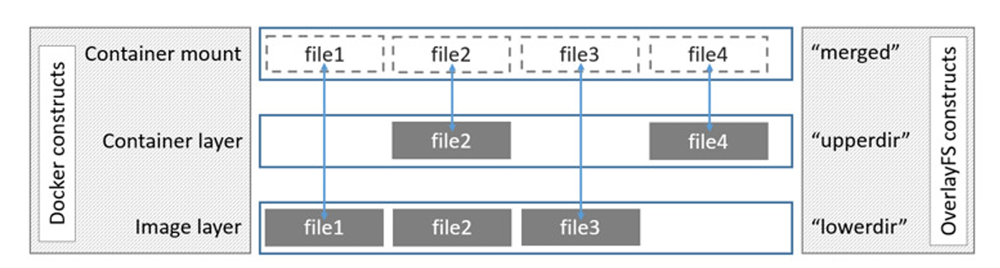

# Docker的原理与镜像

## Docker的镜像

容器解决应用开发、测试和部署的问题，而镜像解决应用部署环境问题。镜像是一个只读的容器模板， 打包了应用程序和应用程序所依赖的文件系统以及启动容器的配置文件，是启动容器的基础。

镜像所打包的文件内容就是容器的系统运行环境——rootfs(根文件系统或根目录)。容器与镜像类似对象与类的关系。

Docker镜像关键概念有：

-  registry：注册中心，用来保存docker镜像，其中包括镜像的层次结构和关于镜像的元数据。
- repository：仓库，即由具有某个功能的Docker镜像的所有迭代版本构成的镜像组。
- manifest：Docker镜像元数据文件，在pull、push、save和load中作为镜像结构和基础信息的描述文件。在镜像被pull或者load到Docker宿主机时，manifest被转化为本地的镜像配置文件config。
-  image：镜像，用来存储一组相关的元数据信息，主要包括镜像的架构（如amd64）、镜像默认配置信息、构建镜像的容器配置信息、包含所有镜像层的rootfs。
-  layer：镜像层，是docker用来管理镜像的中间概念，镜像是由镜像层组成的，单个镜像层可以被 多个镜像和容器共享。

## 镜像的原理

### 分层

 Docker镜像采用分层的方式构建，每一个镜像都由一组镜像组合而成。每一个镜像层都可以被需要的镜像所引用，实现了镜像之间共享镜像层的效果。

这样的分层设计在镜像的上传与下载过程当中有效的减少了镜像传输的大小，在传输过程当中本地或注册中心只需要存在一份底层的基 础镜像层即可，真正被保存和下载的内容是用户构建的镜像层。而在构建过程中镜像层通常会被缓 存以缩短构建过程。

### 写时复制

底层镜像层在多个容器间共享，每个容器启动时不需要复制一份镜像文件，而是将所有 需要的镜像层以只读的方式挂载到一个挂载点，在只读层上再覆盖一层读写层。

在容器运行过程中 产生的新文件将会写入到读写层，被修改过的底层文件会被复制到读写层并且进行修改，而老文件 则被隐藏。

### 联合挂载

docker采用联合挂载技术，在同一个挂载点同时挂载多个文件系统，从而使得容器的根目录看上去包含了各个镜像层的所有文件。如下图：



- LowerDir：被引用的镜像层，该层所有内容均为只读
- UpperDir：容器启动之后，创建的读写层 
- Merged：容器启动后，会将LowerDir的所有条目的所有文件连同UpperDir的内容，一起挂载到Merged，从而形成一个完成的根目录

### 内容寻址

根据镜像层内容计算校验和，生成一个内容哈希值，并使用该值来充当镜像层ID、索引 镜像层。

内容寻址提高了镜像的安全性，在pull、push和load、save操作后检测数据的完整性。另外基于内容哈希来索引镜像层，对于来自不同构建的镜像层，只要拥有相同的内容哈希值，就能被不同的镜像所引用。

## commit构建镜像

```shell
# 运行一个nginx容器
docker run -d -p 81:80 nginx
 # 语法
docker commit [OPTIONS] CONTAINER [REPOSITORY[:TAG]]
 # 案例
docker commit b415cdd95dfc mynginx:v1
```

提交一个容器只会保存在提交的那个时刻容器的文件系统的状态，而不是进程状态。docker容器不是虚拟机。如果环境的状态依赖于一些正在运行的进程状态，而这些进程不能通过标准文件恢复的话，docker commit 将无法帮助用户保存所需要的状态。 

使用commit从容器构建镜像的使用场景为：

1. 构建临时的测试镜像
2. 容器被入侵后，使用docker commit，基于被入侵的容器构建镜像，从而保留现场，方便以后追溯。

除了这两种场景，不建议你使用docker commit来构建生产现网环境的镜像。 因为使用docker commit构建的镜像包含了编译构建、安装软件，以及程序运行产生的大量无用文件，这会 导致镜像体积很大，非常臃肿。

## 镜像分享

首先可以使用tag命令进行本地镜像管理，可以用版本号来指定镜像的tag，方便镜像管理。可以用来修改本地镜像名和tag 或者指定目标远程仓库镜像和tag。

```shell
docker tag SOURCE_IMAGE[:TAG] TARGET_IMAGE[:TAG]
docker tag IMAGE_ID TARGET_IMAGE[:TAG]
```

### 公共仓库分享

1. 登录  https://hub.docker.com/ 创建公有的 repository，注意此处的repository具体到了镜像名 例如创建的的repository 为：yangshuangxin/mynginx 表示 yangshuangxin 这个账户下mynginx镜像。
2. 登录远程仓库，推送进行到远程。
3. 镜像推送成功之后，即可通过docker pull 拉取到镜像。

```shell
# docker login [OPTIONS] [SERVER]
 docker login 
# 打tag
 docker tag mynginx:v1 yangshuangxin/mynginx:v1
 # 推送镜像
docker push yangshuangxin/mynginx:v1
```

### 本地分享

通过docker save 保存一个或多个镜像包到.tar文件，通过docker load 加载tar文件中的镜像。

```shell
docker save # 将指定镜像保存成 tar 归档文件。
docker save -o images.tar mynginx:v1 mysql:5.7.30
docker load # 导入使用 docker save 命令导出的镜像。
docker load -i images.tar
```

## Docker私有注册中心搭建

下载和测试运行私有的注册中心容器：

```shell
docker run -d -p 5000:5000 --name registry --restart=always registry:2
docker ps -a
# curl http://localhost:5000/v2/_catalog
# {"repositories":""}
```

创建镜像存放的位置。htpasswd 是开源 http 服务器 apache httpd 的一个命令工具，使用htpasswd 生成 http 基本认证的密码文件：

```shell
mkdir -p $HOME/registry/
mkdir -p $HOME/registry/auth
mkdir -p $HOME/registry/data
sudo apt install apache2-utils
htpasswd  -Bbn yangshuangxin super123 > /home/yangshuangxin/registry/auth/htpasswd
# 若启用了user命名空间隔离，需要修改目录registry的owner和组
```

运行私有注册中心的镜像：

```shell
docker run -d -p 5000:5000 --name registry --restart=always -v $HOME/registry/data:/var/lib/registry -v $HOME/registry/auth:/auth -e "REGISTRY_AUTH=htpasswd" -e "REGISTRY_AUTH_HTPASSWD_REALM=Registry Realm"  -e REGISTRY_AUTH_HTPASSWD_PATH=/auth/htpasswd registry:2

# 修改安全选项：--insecure-registry 指定一个受信任的注册中心，IP:Port 或 Domain:Port
vim /lib/systemd/system/docker.service
--insecure-registry localhost:5000 

# 重启docker
sudo systemctl daemon-reload
sudo systemctl restart docker
```

推送进行到本地中心：

```shell
 docker login http://localhost:5000
 docker tag mynginxtest:1.1 localhost:5000/mynginx:1.0.0
 docker push localhost:5000/mynginx:1.0.0
```

