# Docker的网络管理

Docker的网络可以自定义多种选项，其目的是解决这些问题：

1. 容器与外界通信
2. 容器间通讯，跨主机容器间通讯
3. 网络隔离（容器网络命名空间、子网隔离）
4. 提供网络自定义能力
5. 提供容器间发现功能
6. 提供负载均衡能力

使用Dockerfile构建一个有最基本网络功能的镜像：

```dockerfile
From alpine:3.18
run apk add ethtool
run apk add ipvsadm
run apk add iptables
```

然后进行构建镜像：

```shell
docker build -t myalpine .
```

## docker相关网络命令

```shell
# 连接一个容器到一个网络
docker network connect     
# 创建一个网络
docker network create      
 # 将容器从一个网络中断开
docker network disconnect  
# 查看网络的详细信息
docker network inspect     
# 查看网络列表
docker network ls          
# 移除所有未使用的网络
docker network prune       
# 移除一个或多个网络
docker network rm
```

在运行`docker run`运行容器时，可以使用-p指定端口相关操作：

```shell
# 将容器中tcp端口80映射到主机8080端口
-p 8080:80
# 将容器中tcp端口80映射到地址192.168.239.154:8080
-p 192.168.239.154:8080:80
# 将容器中的udp端口80映射到主机8080端口
-p 8080:80/udp
# 将容器中的udp端口80映射到主机的udp端口8080
-p 8080:80/tcp
# 将容器中的tcp端口80映射到主机的tcp端口8080
-p 8080:80/udp

docker run -d --rm --name mynginx -p 8080:80 nginx:1.23.4 
```

可以修改容器的hostname：

```shell
#  --hostname 选项可以修改容器/etc/hosts文件下的映射
docker run -d --rm --name mynginx1 -p 8081:80 --hostname mynginx1.yangshuangxin.com nginx:1.23.4
# 查看容器的/etc/hosts文件
docker exec mynginx1 cat /etc/hosts
# 访问
docker exec -it mynginx1 bash
curl http://mynginx1.yangshuangxin.com 
```

## 网络驱动

### bridge（网桥网络）

bridge是docker默认的网络驱动程序。如果没有指定驱动程序，那么创建的容器就是该网络类型。当应用程序在需要与同一主机上的其他容器通信时，通常会使用桥接网络。

就联网而言，桥接网络是在网段之间转发流量的链路层设备，链路层设备Mac地址进行通信。桥接器可以是在主机内核运行的硬件设备或者软件设备。 就docker而言，网桥网络为软件网桥。允许连接到同一网桥的容器进行通讯，同时提供与未连接到该网桥的容器的隔离。不同网桥上的容器无法直接通讯。

 启动docker时，会自动创建一个名为docker0的网桥网络，并且新启动的容器会默认连接到该网络。默认桥接网络不提供dns解析，容器之间可以通过ip地址相互访问，但不能通过容器名称相互访问。

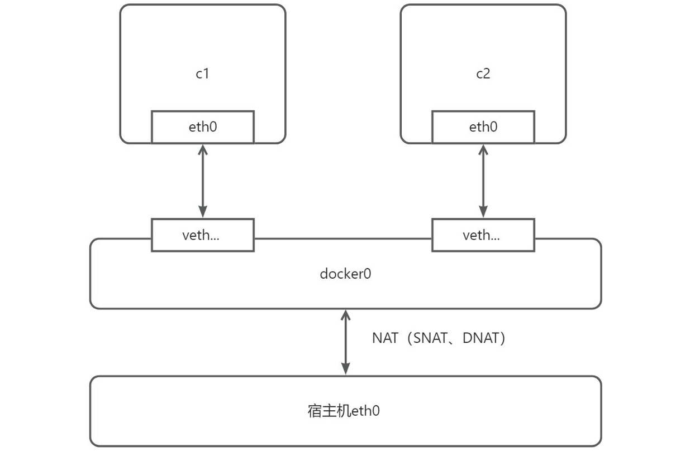

如果是用户进行自定义网桥时，和默认的网桥的区别如下：

- 自定义网桥提供容器之间的自动DNS解析，可通过容器名称或别名互相访问，默认网桥网络上的容器只能通过IP地址互相访问。
-  自定义网桥提供更好的网络隔离，因为所有未指定网络的容器都将连接到默认网桥，而自定义网桥 则必须显示指定容器网络后，方可加入该网络。
- 如果使用默认网桥，对其配置将使得所有容器都使用相同的设置，此外配置默认网桥发生在docker本身之外，需要重新启动docker。
- 每个自定义网络都会创建一个可配置的网桥，使用docker网络创建和配置自定义网桥网络，可以在创建时分别对不同的网桥做不同的配置。

在使用网桥驱动创建网络时传递给--option的特定选项功能有如下：

| 选项                                           | 默认值     | 描述                                                         |
| ---------------------------------------------- | ---------- | ------------------------------------------------------------ |
| com.docker.network.bridge.name                 |            | 创建Linux网桥时要使用的 接口名称                             |
| com.docker.network.bridge.enable_ip_masquerade | true       | 是否启用IP伪装，即将容器 的IP地址转换成宿主机的ip 地址进行网络访问，从而实 现容器访问外部网络的功 能，即容器对外部网络访问 的权限等同宿主机 |
| com.docker.network.bridge.enable_icc           | true       | 启用或禁用容器间连接（不 是dns解析）                         |
| com.docker.network.bridge.host_binding_ipv4    | 0.0.0.0    | 绑定容器端口时的默认IP                                       |
| com.docker.network.driver.mtu                  | 0(不限 制) | 设置容器最大传输单元                                         |
| com.docker.network.container_iface_prefix      | eth        | 为容器接口设置自定义前缀                                     |

#### Docker 默认网络使用

使用`docker network ls`查看网络，安装docker后，会默认创建bridge、host、none 三个网络

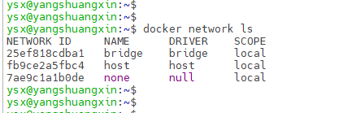

使用`docker network inspect bridge`查看默认桥接网络，默认桥接网络子网为：172.17.0.0/16，网桥名称为docker0：

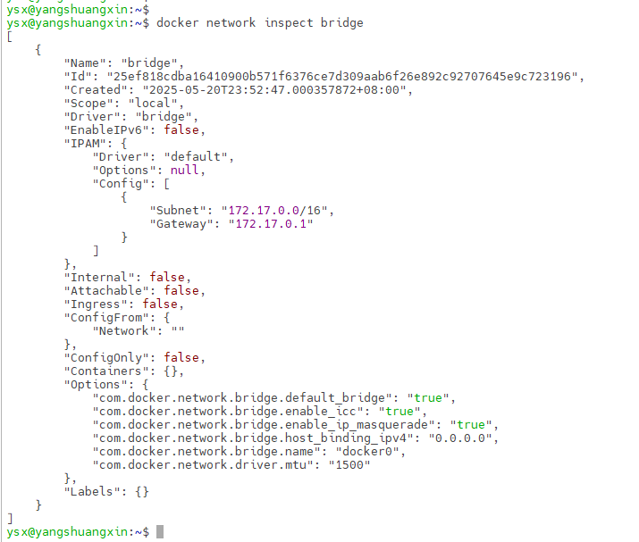

使用`ip addr`查看本机网卡信息，多了docker0网卡

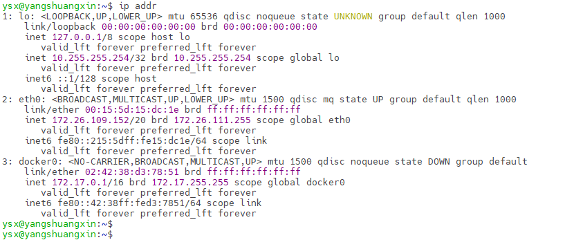

使用`route -n`查看 linux内核路由表，所有以172.17开头并且子网掩码为255.255.0.0的IP地址的数据包都会被发送到docker0网桥：

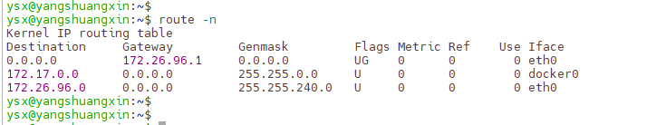

docker安装后会自动配置iptables规则来管理网络流量，使用`iptables -L`查看

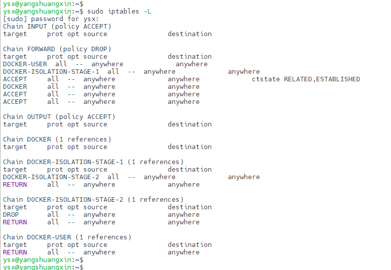

-  Chain INPUT (policy ACCEPT) ：Chain INPUT 是一个默认的过滤链，它决定了进入本地系统的数 据包如何处理。policy ACCEPT 表示该链的默认策略是接受（allow）所有进入的数据包。
-  Chain OUTPUT (policy ACCEPT)：OUTPUT链用于处理从本地系统发出的数据包。它决定了本地系 统发往外部网络的流量如何进行过滤和处理。默认情况下，OUTPUT链的策略是ACCEPT，意味着 所有从本地系统发出的数据包都会被允许通过。
-  Chain FORWARD (policy DROP)：FORWARD链用于处理转发（Forwarding）数据包，即通过本地系统进行转发的数据包。它决定了经过本地系统的数据包如何进行过滤和处理。默认情况下， FORWARD链的策略是DROP，意味着所有经过本地系统的转发数据包都会被丢弃。这样可以确保只有经过明确允许的规则才能进行转发。
- Chain DOCKER：DOCKER链用于处理与Docker容器相关的网络流量。它是由Docker自动创建的一 个用户定义链（user-defined chain），用于进行NAT(Network Address Translation)和过滤规则。
-  Chain DOCKER-USER：DOCKER-USER链是Docker自动创建的另一个用户定义链（user-defined  chain），用于处理与Docker容器相关的用户定义规则。
-  Chain DOCKER-ISOLATION-STAGE：DOCKER-ISOLATION-STAGE链是Docker自动创建的用户定义链（user-defined chain），用于实现容器网络隔离。

使用`iptables -t nat -vnL`查看iptables nat表规则列表：

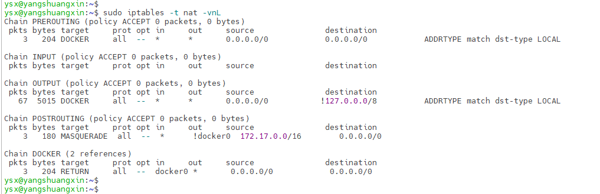

- -t nat: 指定使用nat表，即网络地址转换表
- -v: 显示详细信息，包括数据包和字节计数
-  n: 不进行域名解析，直接显示IP地址
-  -L: 列出规则列表
- Chain PREROUTING：（预路由链）是iptables中的一个网络地址转换表（nat表）的链。它用于在 数据包到达主机之前进行处理和转发。
- Chain POSTROUTING：（后路由链）是iptables中的一个网络地址转换表（nat表）的链。它用于 在数据包离开主机之前进行处理和转发。

在后路由链中可以看到，对于从不在docker0接口上的网络流量（即输出流量），如果源IP地址属于172.17.0.0/16网段，则 进行伪装（MASQUERADE），将源IP地址替换为本机的外部IP地址，以实现网络地址转换（NAT）功能。这样可以确保来自172.17.0.0/16网段的数据包能够正确地回应到发起请求的主机。

#### bridge驱动使用案例

启动容器，运行容器，在未指定任何网络的情况下，容器将连接到默认的bridge网络

```shell
docker run -dit --rm --name alpine1 myalpine ash
docker run -dit --rm --name alpine2 myalpine ash
```

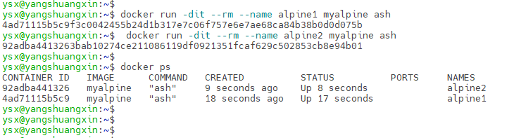

使用`docker network inspect bridge`查看桥接网络，容器以及桥接上：

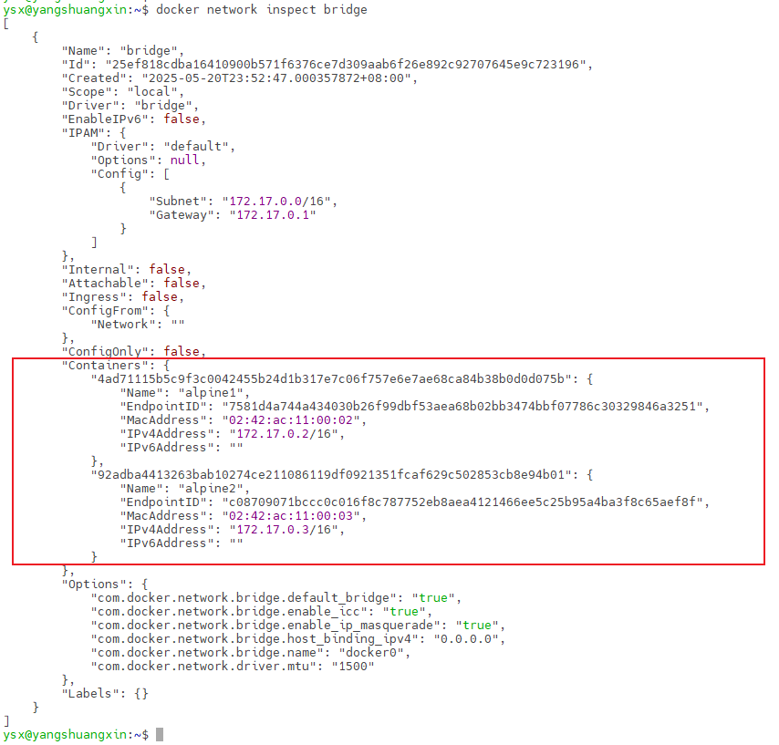

通过`ip addr `查看系统网络接口，多出两个新的接口

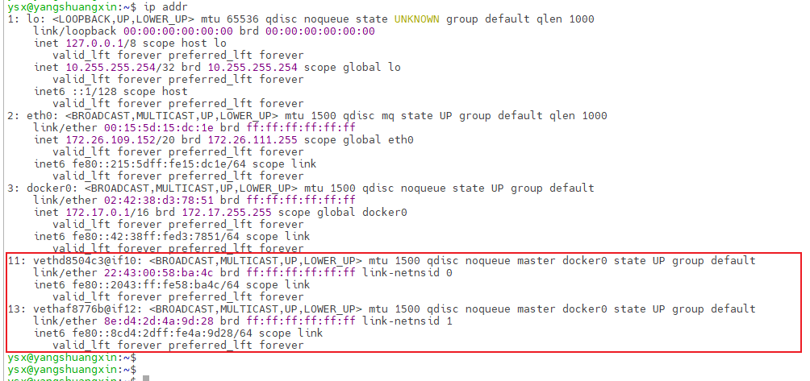

使用`brctl show`查看网桥信息：

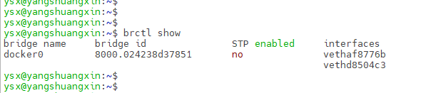

使用`ethtool -S vethd8504c3`可以看到容器连接到网桥的虚拟设备对（veth pair），host主机索引为11的接口，其配对的接口索引是10。

使用`docker exec -it alpine1 ash`进入容器内部，执行`ethtool -S eth0`可以看到容器内部索引为10，其配对的索引接口为11。

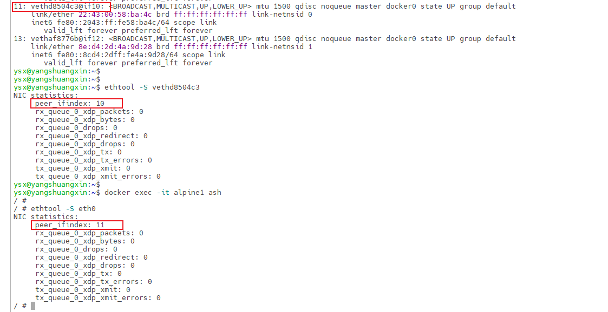

#### Docker自定义bridge网络使用

- 自定义网络

```shell
docker network create --driver bridge alpine-net
docker network inspect alpine-net
```

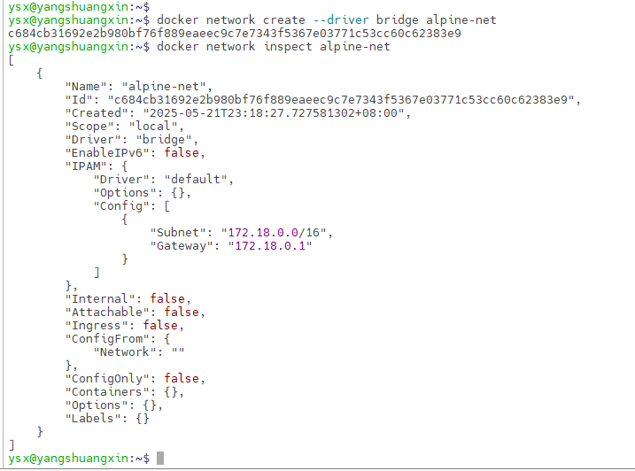

- 运行两个新的容器，指定网络为自定义的alpine-net，查看alpine-net网络详情

```shell
docker run -dit --rm --name alpine3 --network alpine-net myalpine ash
docker run -dit --rm --name alpine4 --network alpine-net myalpine ash
docker network inspect alpine-net
```

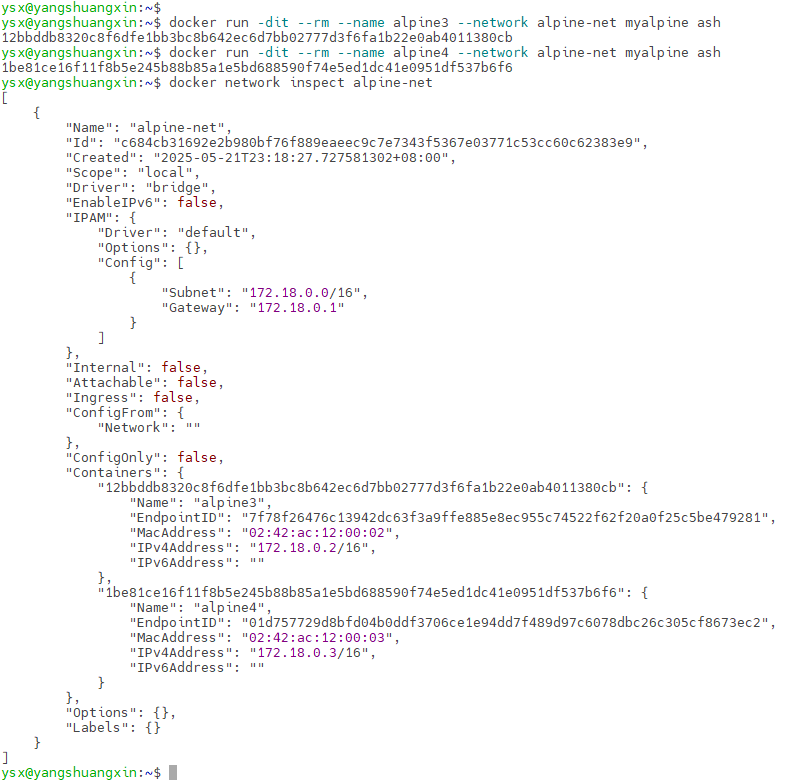

- 自定义网络容器之间自动dns解析

```shell
docker exec -it alpine3 ash
ping alpine4
```

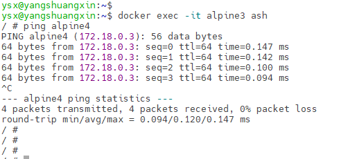

- 将已有容器加入到新的网络

```shell
# 将容器 alpine1 加入网络 alpine-net
 docker network connect alpine-net alpine1
 # 将容器 alpine2 加入网络 alpine-net
 docker network connect alpine-net alpine2
 # 查看网络详情
docker network inspect alpine-net
```

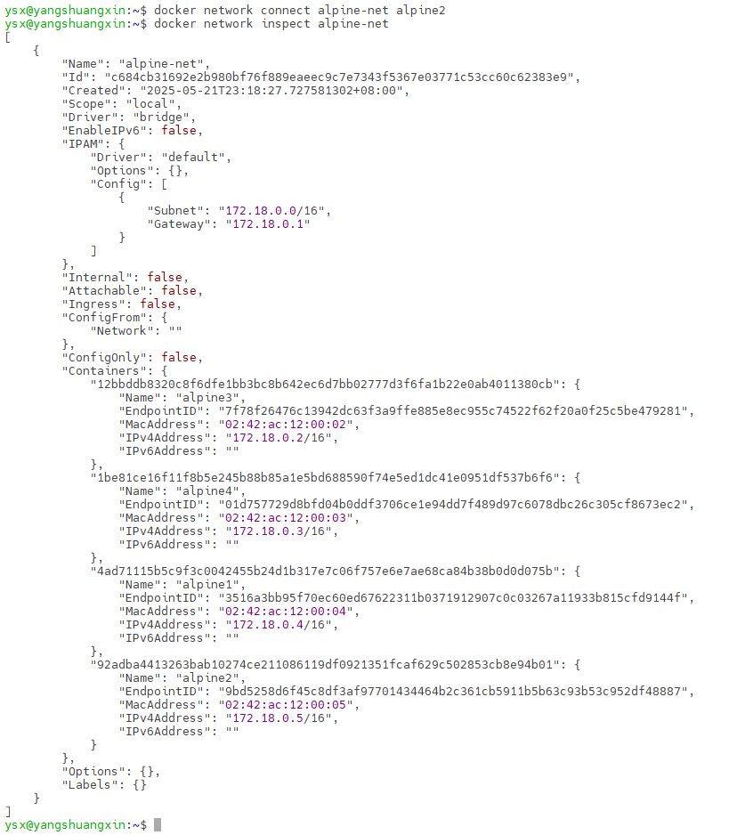

- 新加入网络的容器间相互访问

```shell
docker exec -it alpine1 ash
ping alpine2
ping alpine3
ping alpine4
```

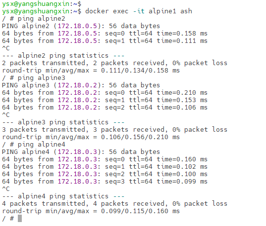

- 从自定义网络中移除所有容器，需要注意的是加入默认网络中的容器无法再不停服的情况下与docker0网桥断开

```shell
docker network disconnect alpine-net alpine1
docker network disconnect alpine-net alpine2
docker network disconnect alpine-net alpine3
docker network disconnect alpine-net alpine4
 # 查看网络详情
docker network inspect alpine-net
# 移除网络
docker network ls
docker network rm alpine-net
docker network ls
```

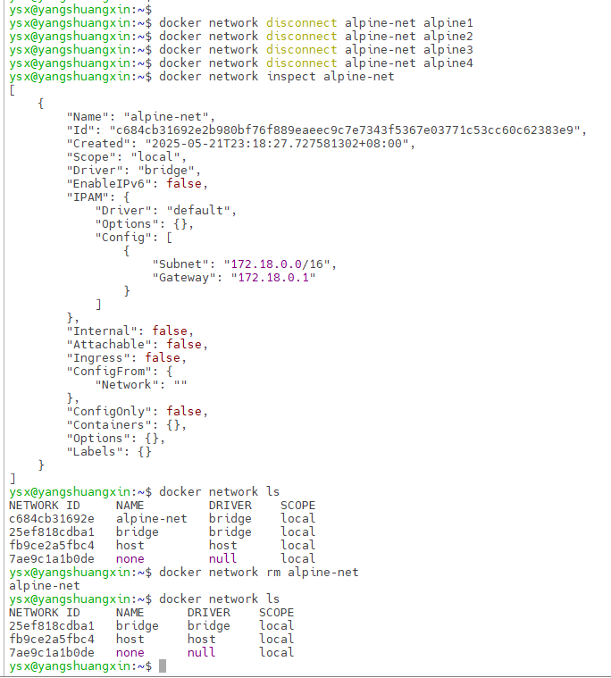

- 创建指定网关，子网，ip范围以及特定选项的自定义网络

```shell
docker network create \
--driver=bridge \
--subnet=172.28.0.0/16 \
--ip-range=172.28.5.0/24 \
--gateway=172.28.5.254 \--opt com.docker.network.bridge.name=alpine-net1 \
--opt com.docker.network.bridge.enable_ip_masquerade=false \
--opt com.docker.network.bridge.enable_icc=false \
--opt com.docker.network.container_iface_prefix=ethYSX \
alpine-net1
```

### Overlay（覆盖网络）

 Overlay网络驱动程序是在多个Docker守护进程主机之间创建分布式网络。该网络位于（覆盖）特定于主机的网络之上，允许连接到该网络的容器（包括群集服务容器）在启用加密时安全通信。Docker透明地处理每个数据包往返于正确的Docker守护进程主机和正确的目标容器的路由。

初始化一个swarm集群或将Docker主机加入现有swarm集群时，会在该Docker主机上创建两个新网络：

- 名为ingress的overlay网络，处理与swarm service相关的控制和数据流量。创建一个service 没有指定自定义网络时，默认将连接到ingress网络。ingress网络提供对容器化应用程序的负载均衡和路由功能。它允许外部流量通过单一入口点访问多个容器，并根据定义的规则将请求转发到适当的后端容器。
- 名为docker-gwbridge的bridge网络，用于将覆盖网络（包括ingress网络）连接到单个 Docker守护程序的物理网络。通过这个网络，容器可以连接到宿主机。

可以使用docker network create创建自定义的overlay网络，方法与创建自定义bridge网络相同。 服务或容器一次可以连接到多个网络。服务或容器只能通过各自连接的网络进行通信。

```shell
# 初始化swarm集群，会默认创建ingress 网络和docker_gwbridge网络
docker swarm init
# 添加两个worker节点到集群,获取加入集群的命令
docker swarm join-token worker
# 创建service，将加入默认ingress网络
docker service create -p 8080:80 --replicas 3 --name nginx-svc nginx:latest
# 查看ingress 网络明细
docker network inspect ingress
# 查看docker_gwbridge网络详情
docker network inspect docker_gwbridge
# 查看iptables网络转发
sudo iptables -nvL -t nat
# 所有发送到本机8080端口的数据被转发到172.18.0.2:8080，172.18.0.2 为docker_gwbridge 网络上ingress_sbox容器的地址，ingress_sbox实为网络命名空间并非容器，通过ingress_sbox网络命名空间连接ingress与docker_gwbridge两个设备。宿主机网络命名空间所在目录：/var/run/docker/netns
# 通过nsenter命令在ingress_sbox命名空间下运行ash 终端（nsenter是一个可以在指定进程的命令空间下运行指定程序的命令）
# 以超级权限启动容器，并在容器中以指定的命名空间运行程序
docker run -dit --rm -v /var/run/docker/netns:/netns --privileged=true \
--name alpine5 myalpine nsenter --net=/netns/ingress_sbox ash
docker exec -it alpine5 ash
ip addr
# 通过ipvsadm查看虚拟ip,通过虚拟ip实现负载均衡
ipvsadm
```

###  Host（主机网络）

Host模式，即容器网络不会与宿主机产生网络隔离，而是使用主机的网络栈，容器不会分配自己的 IP地址。运行容器时所有端口映射的选项都将失效，并且在使用时产生警告信息。

主机模式可以用 于性能优化，因为主机模式下无需网络地址转换（NAT），并且不会为每个端口创建userland-proxy（在默认情况下，Docker使用Userland Proxy作为默认的端口转发机制。Userland Proxy基于iptables规则进行转发，将容器内部的网络流量通过宿主机上的特定端口进行转发）

Host模式，仅适用于linux主机，Mac和windows主机不支持。docker run 或docker service create 通过指定--network host 来使用主机网络。该模式下集群节点上运行容器将受到限制（例如：容器端口为80端口，由于使用主机网络，则每个集群节点仅能运行 一个80端口的容器）

```shell
docker run -d --rm --name mynginx --network host  nginx:latest
curl http://localhost
# 以host模式创建service，host 模式下使用主机的IP和端口，因此swarm不提供负载均衡
# 由于host 驱动共享主机网络，因此部署的服务在每个节点只能出现一个，否则将因为端口冲突导致容器启动失败
```

### IPvlan

IPvlan驱动程序为用户提供了对IPv4和IPv6寻址的完全控制。VLAN驱动程序在此基础上构建，使运营商能够完全控制第2层VLAN标记，甚至为对底层网络集成感兴趣的用户提供IPvlan L3路由。

ipvlan网络驱动程序可以用于创建IPVLAN网络，它允许将容器连接到现有的物理网络接口，并通过 共享主机内核栈来实现高性能和低延迟。内核要求linux 内核版本 v4.2+。

创建ipvlan驱动网络，--option选项有：

- ipvlan_mode：设置IPvlan模式默认值为 l2，可选值为：l2（容器和主机共享相同的MAC地址，但拥有不同的IP地址）、l3、l3s。
- ipvlan_flag：设置IPvlan模式flag，默认值为 bridge，可选值为：bridge，private，vepa（Virtual Ethernet Port Aggregator）
- parent：指定需要使用的父级网卡

