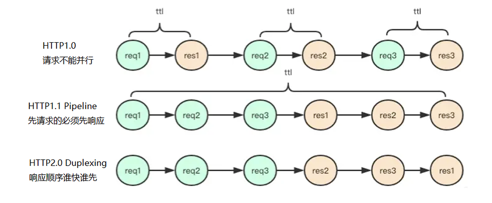
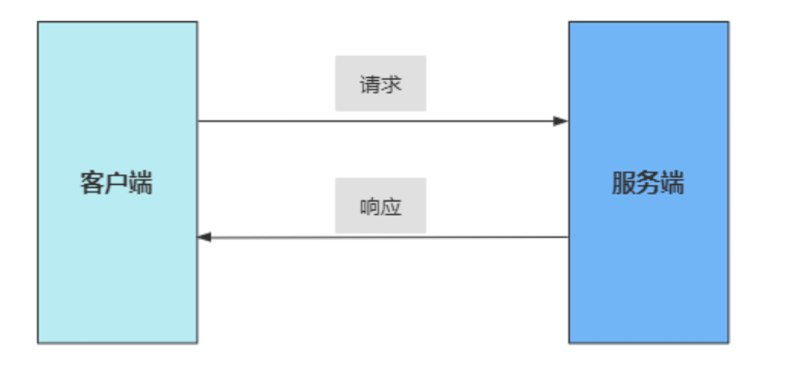
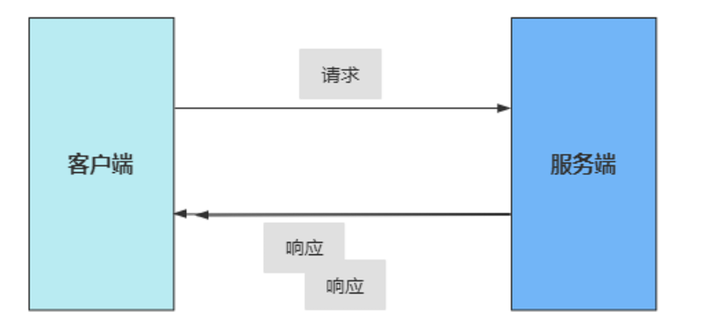
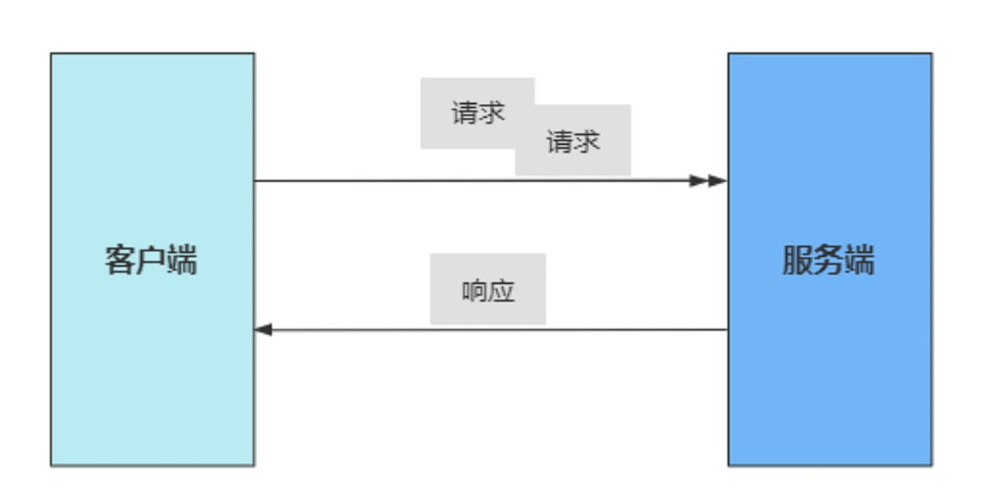
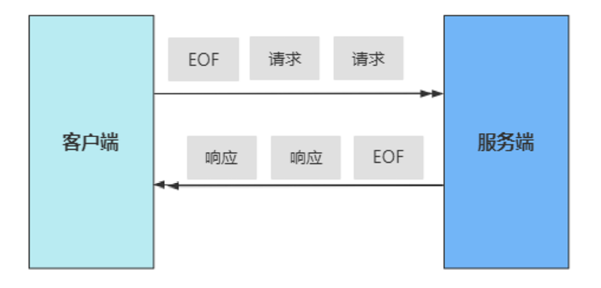

# gRPC的数据传输和使用模式

## gRPC传输的内容

早期的RPC是使用JSON的方式，目前的RPC基本上都采用类似Protobuf的二进制序列化方式。

Json的优点是在body中用JSON对内容进行编码，极易跨语言，不需要约定特定的复杂编码格式和Stub文件。在版本兼容性上非常友好，扩展也很容易。缺点是JSON难以表达复杂的参数类型，如结构体等。数据冗余和低压缩率使得传输性能差。

微服务之间的服务器调用，所以一般采用二进制的序列化方式，比如protobuf。gRPC对此的解决方案是丢弃json、xml这种传统策略，使用 Protocol Buffer--Google开发的一种跨 语言、跨平台、可扩展的用于序列化数据协议。

gRPC使用样例如下，包含方法定义、入参、出参：

```protobuf
// XXXX.proto
// rpc服务的类 service关键字， Test服务类名
service Test {
 // rpc 关键字，rpc的接口
	rpc HowRpcDefine (Request) returns (Response) ; // 定义一个RPC方法
}
 // message类, 类似于 c++ class
 message Request {
 //类型 | 字段名字|  标号
	int64   user_id  = 1;
	string  name   = 2;
 }
message Response {
	repeated int64 ids = 1; // repeated 表示数组
	Value info = 2;  // 可嵌套对象
	map<int, Value> values = 3;   // 可输出map映射
}
 message Value {
	bool is_man = 1;
 	int age = 2;
}
```

可以看出其特点如下：

1. 有明确的类型，支持的类型有多种。
2. 每个field会有名字。
3. 每个field有一个数字标号，一般按顺序排列。(编解码会用到这个点)
4. 能表达数组、map映射等类型。
5. 通过嵌套message可以表达复杂的对象。
6. 方法、参数的定义落到一个.proto 文件中，依赖双方需要同时持有这个文件，并依此进行编解码。

protobuf作为一个以跨语言为目标的序列化方案，protobuf能做到多种语言以同一份proto文件作为约定，不用A语言写一份，B语言写一份，各个依赖的服务将proto文件原样拷贝一份即可。但.proto文件并不是代码，不能执行，要想直接跨语言是不行的，必须得有对应语言的中间代码才行，中间代码要有以下能力：

1. 将message转成对象，例如C++里是class，golang里是struct，需要各自表达后，才能被理解。
2. 需要有进行编解码的代码，能解码内容为自己语言的对象、能将对象编码为对应的数据。

## gPRC的网络传输

grpc采用HTTP2.0，相对于HTTP1.0 在 **更快的传输**和**更低的成本** 两个目标上做了改进。改进如下：

1. HTTP2 未改变HTTP的语义(如GET/POST等)，只是在传输上做了优化。
2. 引入帧、流的概念，在TCP连接中，可以区分出多个request/response。
3. 一个域名只会有一个TCP连接，借助帧、流可以实现多路复用，降低资源消耗。
4. 引入二进制编码，降低header带来的空间占用。

HTTP 1.1核心问题在于：在同一个TCP连接中，没办法区分response是属于哪个请求，一旦多个请求返回的文本内容混在一起，则没法区分数据归属于哪个请求，所以请求只能一个个串行排队发送。这直接导致了TCP资源的闲置。

HTTP2为了解决这个问题，提出了**流**的概念，每一次请求对应一个流，有一个唯一ID，用来区分不同的请求。基于流的概念，进一步提出了**帧**，一个请求的数据会被分成多个帧，方便进行数据分割传输，每个帧都唯一属于某一个流ID，将帧按照流ID进行分组，即可分离出不同的请求。

这样在HTTP2中在同一个TCP连接中就可以同时并发多个请求，不同请求的帧数据可穿插在一起，根据流ID分组即可。HTTP2.0基于这种二 进制协议的乱序模式 (Duplexing)，直接解决了HTTP1.1的核心痛点，通过这种复用TCP连接的方式，不 用再同时建多个连接，提升了TCP的利用效率。



## gRPC的四种模式

可以按照 Client 和 Server 一次发送/返回的是单个消息还是多个消息，将 gRPC 分为：Unary RPC (一元)、Server streaming RPC、Client streaming RPC、Bidirectional streaming RPC 。(参考demo路径：grpc/examples/cpp/route_guide)

### 一元RPC模式

一元 RPC 模式也被称为简单 RPC 模式。在该模式中，当客户端调用服务器端的远程方法时，客户端发送请求至服务器端并获得一个响应，与响应一起发送的还有状态细节以及 trailer 元数据。



### 服务器端流RPC模式

在一元 RPC 模式中，gRPC 服务器端和 gRPC 客户端在通信时始终只有一个请求和一个响应。在服务器 端流 RPC 模式中，服务器端在接收到客户端的请求消息后，会发回一个响应的序列。这种多个响应所组 成的序列也被称为“流”。

在将所有的服务器端响应发送完毕之后，服务器端会以 trailer 元数据的形式将 其状态发送给客户端，从而标记流的结束。



### 客户端流RPC模式

在客户端流 RPC 模式中，客户端会发送多个请求给服务器端，而不再是单个请求。服务器端则会发送一 个响应给客户端。但是，服务器端不一定要等到从客户端接收到所有消息后才发送响应。基于这样的逻 辑，就可以在接收到流中的一条消息或几条消息之后就发送响应，也可以在读取完流中的所有消息之 后再发送响应。



### 双向流RPC模式

在双向流 RPC 模式中，客户端以消息流的形式发送请求到服务器端，服务器端也以消息流的形式进行响 应。调用必须由客户端发起，但在此之后，通信完全基于 gRPC 客户端和服务器端的应用程序逻辑。

