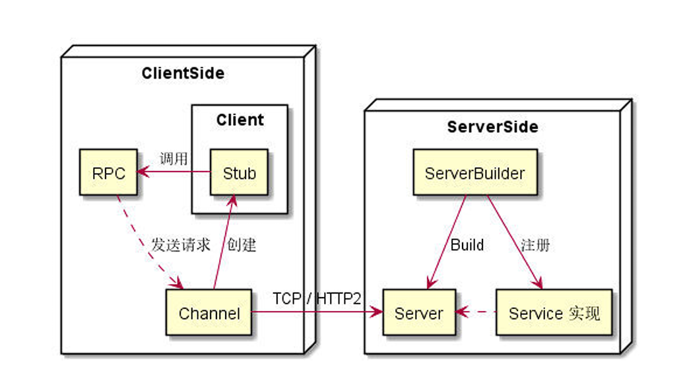
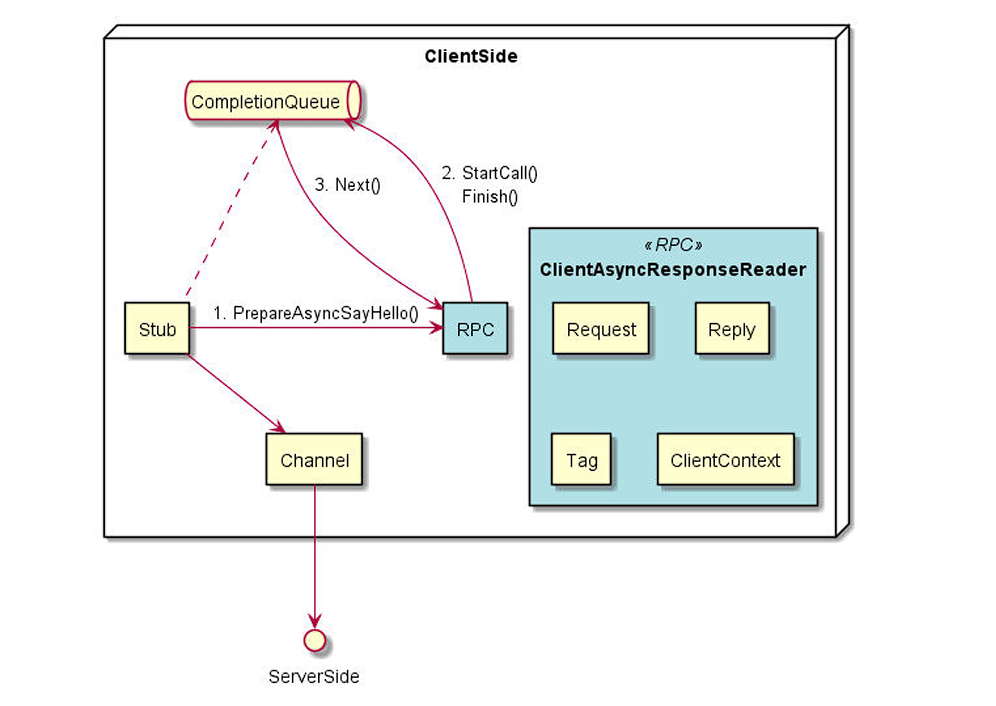
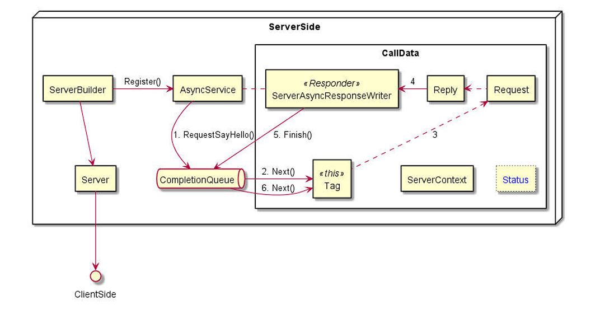

# gPRC的基本使用流程

gRPC 基本流程如下图所示，其中包括：Service(定义)、RPC、API、Client、Stub、 Channel、Server、Service(实现)、ServiceBuilder 等。



参考官方提供的example/helloworld ，定义的proto文件如下：

```protobuf
syntax = "proto3";
 option java_multiple_files = true;
 option java_package = "io.grpc.examples.helloworld";
 option java_outer_classname = "HelloWorldProto";
 option objc_class_prefix = "HLW";
 package helloworld;
 // The greeting service definition.
 service Greeter {
 // Sends a greeting
 	rpc SayHello (HelloRequest) returns (HelloReply) {}
 }
 // The request message containing the user's name.
 message HelloRequest {
 	string name = 1;
 }
 // The response message containing the greetings
 message HelloReply {
 	string message = 1;
 }
```

## server端开发

Server 需要实现 proto 中定义的 RPC，每种 RPC 的实现都需要将 ServerContext 作为参数输入，所有的 RPC 组成了 Service。如果是一元 (Unary) RPC 调用，则像调用普通函数一样。将 Request 和 Reply 的对象地址作为参数传 入，函数中将根据 Request 的内容，在 Reply 的地址上写上对应的返回内容。

```c++
class GreeterServiceImpl final : public Greeter::Service {
  Status SayHello(ServerContext *context, const HelloRequest *request,
                  HelloReply *reply) override {
    std::string prefix("Hello ");
    reply->set_message(prefix + request->name());
    return Status::OK;
  }
};
```

 Server 的创建需要一个 Builder，添加上监听的地址和端口，注册上该端口上绑定的服务，最后构建出  Server 并启动：

```c++
ServerBuilder builder;
builder.AddListeningPort(server_address, grpc::InsecureServerCredentials());
builder.RegisterService(&service);
std::unique_ptr<Server> server(builder.BuildAndStart());
```

RPC 和 API 的区别：RPC (Remote Procedure Call) 是一次远程过程调用的整个动作，而 API(Application Programming Interface) 是不同语言在实现 RPC 中的具体接口。一个 RPC 可能对应多种  API，比如同步的、异步的、回调的。不管是哪种类型 RPC，都是由 Client 发起请求。

如果涉及到流，则会用 Reader 或/和 Writer 作为参数，读取流内容。如 ServerStream 模式下，只有  Server 端产生流，这时对应的 Server 返回内容，需要使用作为参数传入的  ServerWriter 。这类似于 以 'w' 打开一个文件，持续的往里写内容，直到没有内容可写关闭。

```c++
// rpc ListFeatures(Rectangle) returns (stream Feature) {}
 Status ListFeatures(ServerContext* context,
 const routeguide::Rectangle* rectangle,
 ServerWriter<Feature>* writer);
```

另一方面，Client 来的流，Server 需要使用一个 ServerReader 来接收。这类似于打开一个文件，读其中的内容，直到读到  EOF 为止类似。

```c++
// rpc RecordRoute(stream Point) returns (RouteSummary) {}
 Status RecordRoute(ServerContext* context, ServerReader<Point>* reader,RouteSummary* summary);
```

如果 Client 和 Server 都使用流，也就是 Bidirectional-Stream 模式下，输入参数除了 ServerContext  之外，只有一个  ServerReaderWriter 指针。通过该指针，既能读 Client 来的流，又能写 Server 产生的流。

```c++
// rpc RouteChat(stream RouteNote) returns (stream RouteNote) {}
// 该例子中，Server 不断地从 stream 中读，读到了就将对应的数据写到 stream 中，直到客户端告知结束；Server 处理完所有数据之后，直接返回状态码即可。
 Status RouteChat(ServerContext* context, ServerReaderWriter<RouteNote, RouteNote>* stream);
```

## client端开发

client端通常需要对 Stub 封装，通过 Stub 可以真正的调用 RPC 请求。

```c++
class GreeterClient {
public:
  GreeterClient(std::shared_ptr<Channel> channel)
      : stub_(Greeter::NewStub(channel)) {}
  std::string SayHello(const std::string &user) {
    //... RPC调用
  }
private:
  std::unique_ptr<Greeter::Stub> stub_;
};
```

Channel 提供一个与特定 gRPC server 的主机和端口建立的连接，Stub 就是在 Channel 的基础上创建而成的。

```c++
target_str = "localhost:50051";
auto channel = grpc::CreateChannel(target_str, grpc::InsecureChannelCredentials());
GreeterClient greeter(channel);
std::string user("world");
std::string reply = greeter.SayHello(user);
```

如果 Client 在调用一元 (Unary) RPC 时，像调用普通函数一样，除了传入 ClientContext 之外，将 Request  和 Response 的地址，返回的是 RPC 状态：

```c++
// rpc GetFeature(Point) returns (Feature) {}
 Status GetFeature(ClientContext* context, const Point& request, Feature* response);
```

如果是服务器端是流，Client 在调用 ServerStream RPC 时，不会得到状态，而是返回一个 ClientReader 的指针。Reader 通过不断的 Read() 来不断的读取流，结束时  Read() 会返回false，通过调用Finish()来读取返回状态。

```c++
// rpc ListFeatures(Rectangle) returns (stream Feature) {}
unique_ptr<ClientReader<Feature>> ListFeatures(ClientContext *context, const Rectangle &request);
```

如果调用 ClientStream RPC 时，则会返回一个 ClientWriter 指针，Writer 会不断的调用  Write() 函数将流中的消息发出；发送完成后调用  WriteDone() 来说明发送完毕；调用  Finish() 来等待对端发送状态。

```c++
// rpc RecordRoute(stream Point) returns (RouteSummary) {}
 unique_ptr<ClientWriter<Point>> RecordRoute(ClientContext* context, Route Summary* response);
```

如果是双向流的 RPC 时，会返回 ClientReaderWriter，因为 RPC 都是 Client 请求而后 Server 响应，双向流也是要 Client 先发送完自己流，才有 Server 才可能结束 RPC。所以对于双向流的结束过程是：

1. stream->WriteDone()
2. stream->Finish()

可以单独的一个线程去发送请求流，在主线程中读返回流，实现了一定程度上的并发。

```c++
// rpc RouteChat(stream RouteNote) returns (stream RouteNote) {}
 unique_ptr<ClientReaderWriter<RouteNote, RouteNote>> RouteChat(ClientContext* context);
```

## 流结束

RPC的流并不是长连接，建立上之后就一直保持，而是需要有有结束的流程，具体如下：

1. Client 发送流，是通过  Writer->WritesDone() 函数结束流。
2. Server 发送流，是通过结束 RPC 函数并返回状态码的方式来结束流。
3. 流接受者，都是通过  Reader->Read() 返回的 bool 型状态，来判断流是否结束。
4. Server 发送流并没有像 Client 一样调用  WriteDone() ，而是在消息之后，将 status code、可选的 status message、可选的 trailing metadata 追加进行发送，这就意味着流结束了。

## 异步操作

不管是 Client 还是 Server，异步 gRPC 都是利用CompletionQueue 的API 进行异步操作。基本的流程为：

1. 绑定一个CompletionQueue 到一个 RPC 调用。
2. 利用唯一的  void* Tag 进行读写。
3. 调用  CompletionQueue::Next() 等待操作完成，完成后通过唯一的 Tag 来判断对应什么请求/返回进行后续操作。

可以参考官方greeter_async_client.cc 和  greeter_async_server.cc 两个文件。

### 异步 Client

在greeter_async_client.cc 中是异步 Client 的 Demo，其中只有一次请求，逻辑简单：

1. 创建 CompletionQueue
2. 创建 RPC (既  ClientAsyncResponseReader )，这里有两种方式：stub_->PrepareAsyncSayHello() + rpc->StartCall() 、stub_->AsyncSayHello()
3. 调用 rpc->Finish() 设置请求消息 reply 和唯一的 tag 关联，将请求发送出去
4. 使用 c q.Next() 等待 Completion Queue 返回响应消息体，通过 tag 关联对应的请求

###  异步 Server

RequestSayHello() 这个函数中，异步处理的流程为：

1. 创建一个 CallData，初始构造列表中将状态设置为 CREATE
2. 构造函数中，调用 Process()成员函数，调用  service_->RequestSayHello() 后，状态变更为PROCESS
3. 传入  ServerContext ctx_ 、HelloRequest request_、ServerAsyncResponseWriter responder_、ServerCompletionQueue* cq_，并且将将对象自身的地址作为  tag 传入，该动作能**将事件加入事件循环**，可以在 CompletionQueue 中等待
4. 收到请求， cq->Next() 的阻塞结束并返回，得到 tag，既上次传入的 CallData 对象地址
5. 调用 tag 对应 CallData 对象的  Proceed() ，此时状态为 PROCESS
6. 创建新的 CallData 对象以接收新请求，处理消息体并设置  reply_，将状态设置为 FINISH，调用  responder_.Finish() 将返回发送给客户端，该动作能将事件加入到事件循环，可以在 CompletionQueue 中等待
7. 发送完毕， cq->Next() 的阻塞结束并返回，得到 tag。（如果发送有异常应当有其他相关 的处理）
8. 调用 tag 对应 CallData 对象的  Proceed() ，此时状态为 FINISH，delete this 清理自己，一条消息处理完成。

### 异步关系图

将异步 Client 和异步 Server 的逻辑通过关系图进行如下梳理展示，右侧 RPC 为创建的对象中的内容：



CallData 并非 gRPC 中的概念，而是异步 Server 在实现过程中为了方便进行的封装，其中的Status 也是在异步调用过程中自定义的、用于转移的状态：



无论是 Client 还是 Server，在以异步方式进行处理时，都要预先分配好一定的内存/对象，以存储异步的请求或返回。