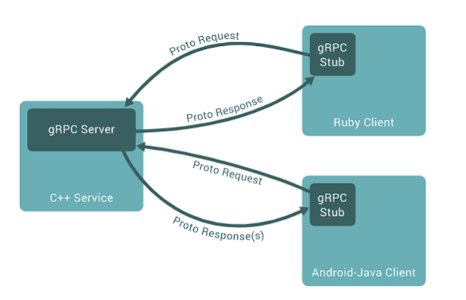
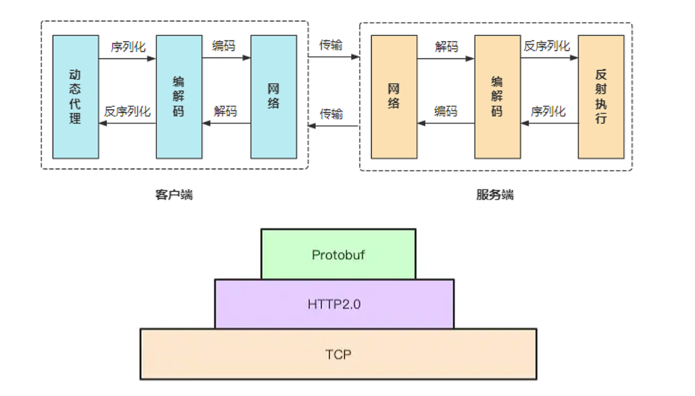

# gRPC的介绍和安装

## RPC和gRPC

RPC 即远程过程调用协议（Remote Procedure Call Protocol），可以像调用本地对象一样发起远程调用。RPC 凭借其强大的治理功能，成为解决分布式系统通信问题的一大利器。

gRPC是一个现代的、高性能、开源的和语言无关的通用 RPC 框架，基于 HTTP2 协议设计，序列化使用  PB(Protocol Buffer)，PB 是一种语言无关的高性能序列化框架，基于 HTTP2+PB 保证了的高性能。



gRPC的基本流程如下：



RPC框架除了gRPC外，还有tars、brpc。tars 兼容grpc，brpc也兼容grpc， 但是grpc不能兼容tars以及brpc。

## gRPC的特性

 gRPC基于服务的思想：定义一个服务，描述这个服务的方法以及入参出参，服务器端有这个服务的具体实现，客户端保有一个存根，提供与服务端相同的服务。

gRPC默认采用protocol buffer作为IDL(Interface Description Lanage)接口描述语言，服务之间通信 的数据序列化和反序列化也是基于protocol buffer的。因为protocol buffer的特殊性，所以gRPC 框架是跨语言的通信框架(与编程语言无关性)，也就是说用Java、C++ 开发的基于gRPC的服务，可以用 GoLang编程语言调用。

gRPC同时支持**同步调用**和**异步调用**，同步RPC调用时会一直阻塞直到服务端处理完成返回结果，  异步RPC是客户端调用服务端时不等待服务段处理完成返回，而是服务端处理完成后主动回调客户端告诉客户端处理完成。

gRPC是基于http2协议实现的，http2协议提供了很多新的特性，并且在性能上也比http1提搞了许 多，所以gRPC的性能是非常好的。gRPC并**没有直接实现负载均衡和服务发现**的功能，但是已经提供了自己的设计思路。已经为命名解析和负载均衡提供了接口。

基于http2协议的特性，gRPC允许定义如下四类服务方法：

1. 一元RPC：客户端发送一次请求，等待服务端响应结构，会话结束，就像一次普通的函数调用这样简单。
2. 服务端流式RPC：客户端发起一起请求，服务端会返回一个流，客户端会从流中读取一系列消息，直到没有结果为止。
3.  客户端流式RPC：客户端提供一个数据流并写入消息发给服务端，一旦客户端发送完毕，就等待服务器读取这些消息并返回应答。
4. 双向流式RPC：客户端和服务端都一个数据流，都可以通过各自的流进行读写数据，这两个流是相互独立的，客户端和服务端都可以按其希望的任意顺序独写。

## gRPC的使用场景

gRPC支持的编程语言有C ++，Java(包括对Android的支持)，Objective-C(对于iOS)，Python，Ruby，Go，C＃，Node.js都在GA中，并遵循语义版本控制。

gRPC通常需要使用在低延迟，高度可扩展的分布式系统中，例如开发与云服务器通信的客户端、设计一个准确，高效，且与语言无关的新协议时。

谷歌长期以来一直在gRPC中使用很多基础技术和概念。目前正在谷歌的几个云产品和谷歌面向外部的 API中使用。Square，Netflix，CoreOS，Docker，CockroachDB，Cisco，Juniper Networks以及许多 其他组织和个人也在使用它。

## gRPC的优点及设计原则

-  自由，开放：让所有人，所有平台都能使用，其实就是开源，跨平台，跨语言。
- 协议可插拔：不同的服务可能需要使用不同的消息通信类型和编码机制，例如，JSON、XML和Thirft。所以协议应允许可插拔机制，还有负载均衡，服务发现，日志，监控等都支持可插拔机制。
-  阻塞和非阻塞：支持客户端和服务器交换的消息序列的异步和同步处理。这对于在某些平台上扩展 和处理至关重要。
- 取消和超时：一次RPC操作可能是持久并且昂贵的，应该允许客户端设置取消RPC通信和对这次通 信加上一个超时时间。
- 拒绝：必须允许服务器通过在继续处理请求的同时拒绝新请求的到来并优雅地关闭。
- 流处理：存储系统依靠流和流控制来表达大型数据集，其他服务，如语音到文本或股票行情，依赖 于流来表示与时间相关的消息序列。
-  流控制：计算能力和网络容量在客户端和服务器之间通常是不平衡的。流控制允许更好的缓冲区管理，以及过度活跃的对等体提供对DOS的保护。
- 元数据交换：认证或跟踪等常见的跨领域问题依赖于不属于服务声明接口的数据交换。依赖于他们将这些特性演进到服务，暴露API来提供能力。
- 标准化状态码：客户端通常以有限的方式响应API调用返回的错误。应约束状态码名称空间，以使 这些错误处理决策更加清晰。如果需要更丰富的特定领域的状态，则可以使用元数据交换机制来提 供该状态。
-  互通性：报文协议(Wire Protocol)必须遵循普通互联网基础框架。

## gPRC的安装

安装必要的依赖工具

```shell
# cmake 需要版本不低于 3.15 gcc/g++版本不低于 7.0
sudo apt-get install autoconf automake libtool cmake g++
```

推荐使用cmake的方式进行编译。 grpc安装过程比较依赖网络的通畅性，因为它不仅是grpc源码本身，还依赖了很多第三方库，比如protobufer。

```shell
git clone  https://github.com/grpc/grpc
# 查看版本并选择合适的版本，这里选择v1.45.2的版本
git tag
git checkout v1.45.2
# 下载第三方依赖库
git submodule update --init
# 编译和安装
mkdir -p cmake/build
cd cmake/build
cmake ../..
make
sudo make install
```

**不用手动安装protobuf，不然版本可能和grcp不匹配**，必须在 grpc 执行 git submodule update --init 命令之后生成的 **third_party/protobuf** 里面编译安装对应的 protobuf。

```shell
cd third_party/protobuf/
./autogen.sh 
./configure --prefix=/usr/local
make
sudo make install
sudo ldconfig  # 使得新安装的动态库能被加载
protoc --version
# 显示3.19.4
```

编译demo代码helloworld

```shell
cd grpc/examples/cpp/helloworld/
mkdir build
cd build/
cmake ..
make
```

启动服务和客户端

```shell
# 启动服务端，监听在50051端口
./greeter_server
Server listening on 0.0.0.0:50051
# 启动客户端，服务端返回Hello world
./greeter_client 
Greeter received: Hello world
```

