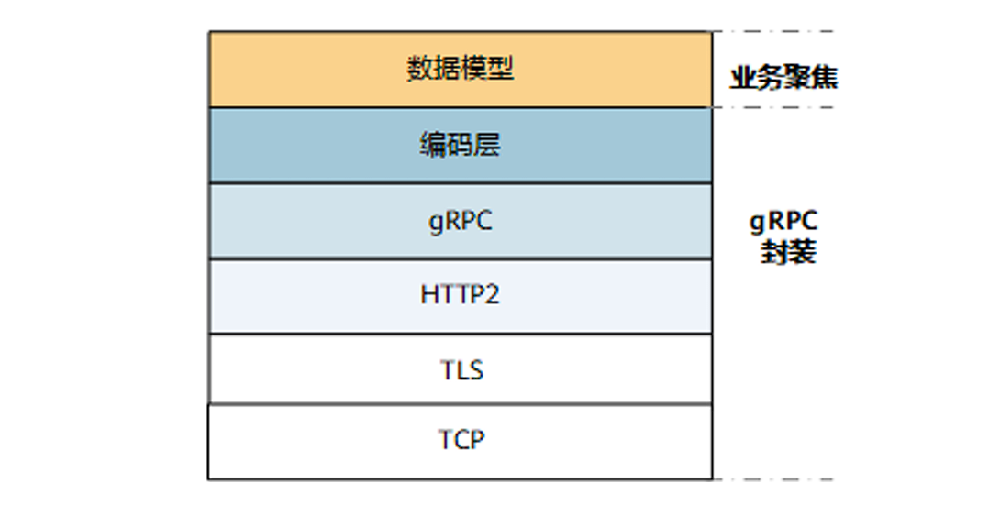
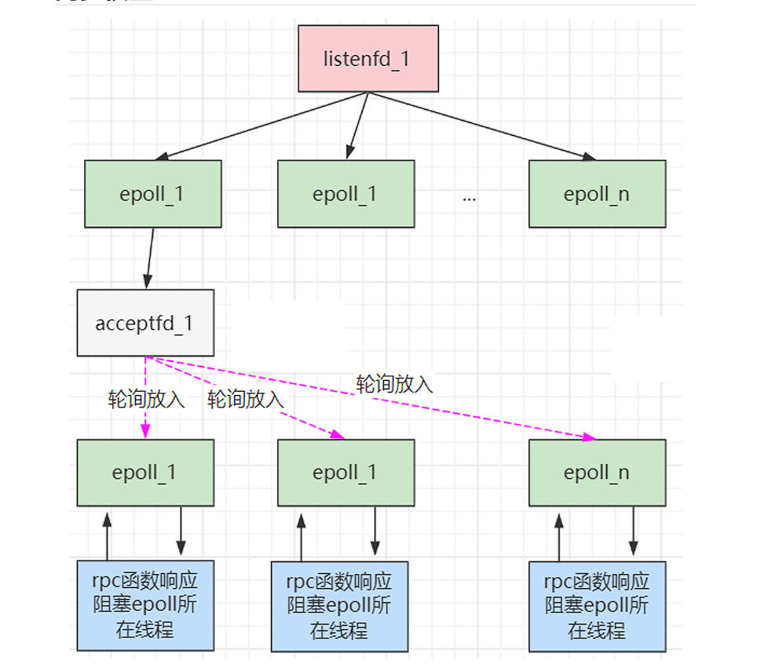
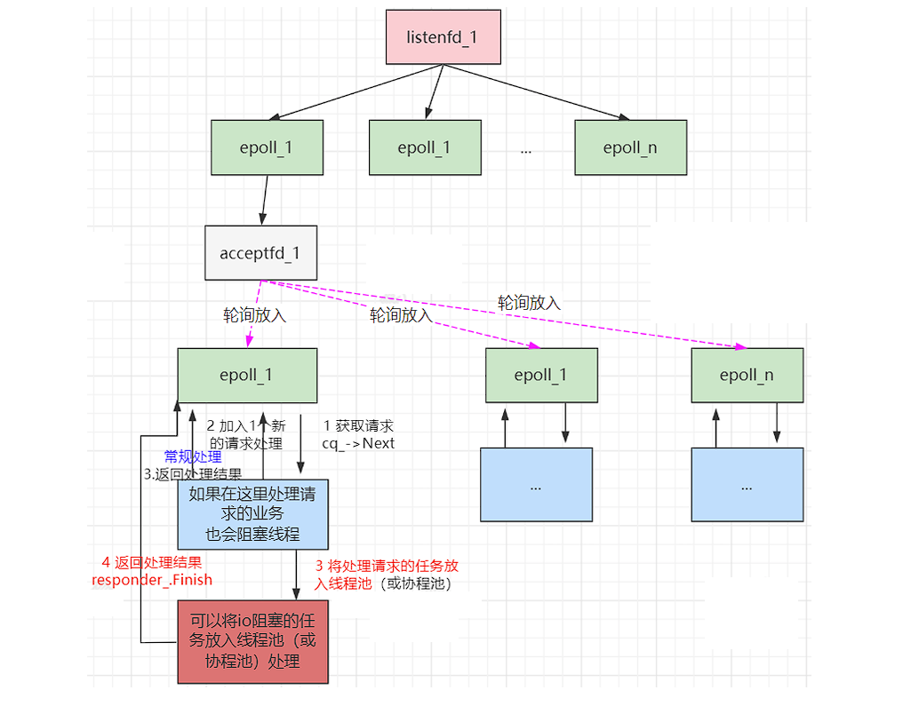

# gRPC的网络模型

gRPC协议框架的协议栈分层如下所示：



| 层次       | 说明                                                         |
| ---------- | ------------------------------------------------------------ |
| TCP层      | 底层通信协议，基于TCP连接。                                  |
| TLS层      | 该层是可选的，基于TLS加密通道。                              |
| HTTP2 层   | gRPC承载在HTTP2协议上，利用了HTTP2的双向流、流控、头部压缩、单连接上的多路复用请求等特性。 |
| gRPC层     | 远程过程调用，定义了远程过程调用的协议交互格式。             |
| 编码层     | gRPC通过编码格式承载数据，包括GPB（Google Protocol Buffer）编码格式。 |
| 数据模型层 | 业务模块的数据。通信双方需要了解彼此的数据模型，才能正确调用信息。当前设备提 供了订阅、配置、查询业务模块。 （proto文件） |

> 如果需要加密在创建channel的时候需要引入tls。

##  网络模型

grpc会启动多个线程的epoll来处理描述符，不管异步还是同步，每个epoll都对应一个线程。

### 同步网络模型

同步网络模型如下所示：



在同步网络模型中，设置socket的配置为SO_REUSEPORT参数，同一个listenfd可以被放到多个epoll中进行监听，当一个链接成功建立后会生成acceptfd，这个acceptfd会被随机的分配到现有的epoll中，目前grpc 的分配策略是轮询（round-robin）。

可以配置min poller， max poller， 自动根据调用的请求的频次进行自动伸缩poller。（设置不同的epoll线程数量）

```c++
grpc::EnableDefaultHealthCheckService(true);
grpc::reflection::InitProtoReflectionServerBuilderPlugin();
ServerBuilder builder;
builder.SetSyncServerOption(ServerBuilder::MIN_POLLERS, 2);
builder.SetSyncServerOption(ServerBuilder::MAX_POLLERS, 4);
```

### 异步网络模型

在异步处理的epoll方式和同步是类似的，但对于rpc函数的响应提供了更灵活的处理机制，可以将一些耗 时的处理逻辑放到外部的线程池进行处理。



在异步的处理中，需要手动创建和分配每一个epoll的线程，同时进行请求处理时，如果在上图的第3步中，没有把任务分配到进行线程池中处理，那么异步就会退步到同步的效率。所以异步处理时通常需要把耗时的计算、耗时的IO任务分配到线程池、协程池中进行处理。

在第3步的线程池处理，为了达到最大的效率，如果是cpu密集的计算任务，建议线程池的线程和CPU的核心数相等；如果是IO密集的，建议线程池的线程数量是CPU核心数的2倍。