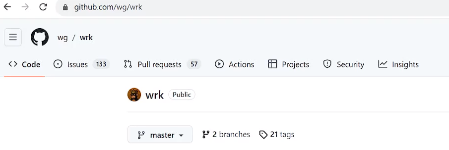
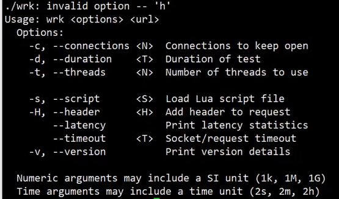

# 基于Reactor的http 服务器

​	Reactor是基于事件驱动的，对于不同的事件使用不同的回调函数处理。网络IO的事件通常有两类：读事件和写事件。使用事件驱动Reactor实现http服务器，对客户端返回网页。

1. 程序框架：监听端口，对于不同的事件，调用不同的回调函数：

   ```c++
   #include <sys/socket.h>
   #include <errno.h>
   #include <netinet/in.h>
   #include <stdio.h>
   #include <string.h>
   #include <unistd.h>
   #include <pthread.h>
   #include <sys/poll.h>
   #include <sys/epoll.h>
   #include <sys/types.h>
   #include <sys/stat.h>
   #include <fcntl.h>
   static int epfd = 0;
   int main() {
   	int sockfd = socket(AF_INET, SOCK_STREAM, 0);
   	struct sockaddr_in serveraddr;
   	memset(&serveraddr, 0, sizeof(struct sockaddr_in));
   	serveraddr.sin_family = AF_INET;
   	serveraddr.sin_addr.s_addr = htonl(INADDR_ANY);
   	serveraddr.sin_port = htons(2048);
   
   	if (-1 == bind(sockfd, (struct sockaddr*)&serveraddr, sizeof(struct sockaddr))) {
   		perror("bind");
   		return -1;
   	}
   
   	listen(sockfd, 10);
       
   	connlist[sockfd].fd = sockfd;
   	connlist[sockfd].recv_t.accept_callback = accept_cb;
   
   	epfd = epoll_create(1); // int size
   	
   	set_event(sockfd, EPOLLIN, 1);
   
   	struct epoll_event events[1024] = {0};
   	
   	while (1) { // 主循环
   
   		int nready = epoll_wait(epfd, events, 1024, -1); // 就绪事件
   
   		int i = 0;
   		for (i = 0;i < nready;i ++) {
   
   			int connfd = events[i].data.fd;
   			if (events[i].events & EPOLLIN) { // 读事件
   
   				int count = connlist[connfd].recv_t.recv_callback(connfd);
   				printf("recv count: %d <-- buffer: %s\n", count, connlist[connfd].rbuffer);
   			} else if (events[i].events & EPOLLOUT) {  // 写事件
   				printf("send --> buffer: %s\n",  connlist[connfd].wbuffer);
   				int count = connlist[connfd].send_callback(connfd);
   			}
   		}
   	}
   	close(clientfd);
   }
   ```

2.  定义Reactor的不同事件回调函数，定义连接池。

   ```c++
   #define BUFFER_LENGTH		1024
   
   typedef int (*RCALLBACK)(int fd);
   
   // listenfd
   // EPOLLIN --> 
   int accept_cb(int fd);
   // clientfd
   int recv_cb(int fd);
   int send_cb(int fd);
   
   // conn, fd, buffer, callback
   struct conn_item {
   	int fd;
   	// 读写buffer
   	char rbuffer[BUFFER_LENGTH];
   	int rlen;
   	char wbuffer[BUFFER_LENGTH];
   	int wlen;
   
   	char resource[BUFFER_LENGTH]; // /abc.html
   
   	union {
   		RCALLBACK accept_callback;
   		RCALLBACK recv_callback;
   	} recv_t;
   	RCALLBACK send_callback;
   };
   typedef struct conn_item connection_t;
   struct conn_item connlist[1024] = {0};
   ```

3.  设置不同epoll事件的函数。

   ```c++
   int set_event(int fd, int event, int flag) {
   	if (flag) { // 1 add, 0 mod
   		struct epoll_event ev;
   		ev.events = event ;
   		ev.data.fd = fd;
   		epoll_ctl(epfd, EPOLL_CTL_ADD, fd, &ev);
   	} else {
   		struct epoll_event ev;
   		ev.events = event;
   		ev.data.fd = fd;
   		epoll_ctl(epfd, EPOLL_CTL_MOD, fd, &ev);
   	}
   }
   ```

4.  读事件的回调函数：

   ```c++
   
   int accept_cb(int fd) {
   	struct sockaddr_in clientaddr;
   	socklen_t len = sizeof(clientaddr);
   	
   	int clientfd = accept(fd, (struct sockaddr*)&clientaddr, &len);
   	if (clientfd < 0) {
   		return -1;
   	}
   
   	set_event(clientfd, EPOLLIN, 1);
   	// 初始化读写缓冲区
   	connlist[clientfd].fd = clientfd;
   	memset(connlist[clientfd].rbuffer, 0, BUFFER_LENGTH);
   	connlist[clientfd].rlen = 0;
   	memset(connlist[clientfd].wbuffer, 0, BUFFER_LENGTH);
   	connlist[clientfd].wlen = 0;
   	// 设置读写回调函数
   	connlist[clientfd].recv_t.recv_callback = recv_cb;
   	connlist[clientfd].send_callback = send_cb;
   
   	return clientfd;
   }
   
   int recv_cb(int fd) { // fd --> EPOLLIN
   	char *buffer = connlist[fd].rbuffer;
   	int idx = connlist[fd].rlen;
   	int count = recv(fd, buffer+idx, BUFFER_LENGTH-idx, 0);
   	if (count == 0) {
   		printf("disconnect\n");
   		epoll_ctl(epfd, EPOLL_CTL_DEL, fd, NULL);		
   		close(fd);
   		return -1;
   	}
   	connlist[fd].rlen += count;
   
   #if 0 //echo
   	memcpy(connlist[fd].wbuffer, connlist[fd].rbuffer, connlist[fd].rlen);
   	connlist[fd].wlen = connlist[fd].rlen;
   #else// 处理http请求
   	http_request(&connlist[fd]);
   	http_response(&connlist[fd]);
   #endif
       //设置可写事件
   	set_event(fd, EPOLLOUT, 0);
   	return count;
   }
   ```

5. 写事件回调函数。

   ```c++
   int send_cb(int fd) {
   	char *buffer = connlist[fd].wbuffer;
   	int idx = connlist[fd].wlen;
   	int count = send(fd, buffer, idx, 0);
   	set_event(fd, EPOLLIN, 0);
   	return count;
   }
   ```

6. http请求处理函数。

   ```c++
   int http_request(connection_t *conn) {
   	// 发送http请求
   	return 0;
   }
   
   int http_response(connection_t *conn) {
   #if 1
       // 对http请求回复固定的html
   	conn->wlen = sprintf(conn->wbuffer, 
   		"HTTP/1.1 200 OK\r\n"
   		"Accept-Ranges: bytes\r\n"
   		"Content-Length: 83\r\n"
   		"Content-Type: text/html\r\n"
   		"Date: Mon, 04 Apr 2024 22:13:33 GMT\r\n\r\n"
   		"<html><head><title>yangshuangxin</title></head><body><h1>xin</h1></body></html>\r\n\r\n");
   #else
       // 读取文件htmp
   	int filefd = open("index.html", O_RDONLY);
   	// 获取文件大小
   	struct stat stat_buf;
   	fstat(filefd, &stat_buf);
   
   	conn->wlen = sprintf(conn->wbuffer, 
   		"HTTP/1.1 200 OK\r\n"
   		"Accept-Ranges: bytes\r\n"
   		"Content-Length: %ld\r\n"
   		"Content-Type: text/html\r\n"
   		"Date: Mon, 04 Apr 2024 22:13:33 GMT\r\n\r\n", stat_buf.st_size);
   
   	int count = read(filefd, conn->wbuffer + conn->wlen, BUFFER_LENGTH-conn->wlen);
   	conn->wlen += count;
   	close(filefd);
   #endif
   	return conn->wlen;
   }
   ```


测试服务器并发性能工具wrk:





> 参考命令：`./wrk -c 100 -d10s -t 50 http://172.26.109.152:2048`

