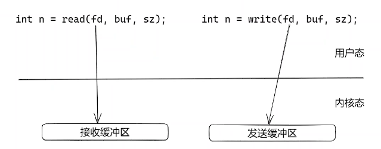
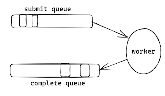

# IO_URING 的原理和TCP服务器的实现

​	异步的操作，可以提升系统的处理能力，从而提高性能。比如协程，协程使用同步的编程方式，获得异步的性能。异步的关系，是描述两者之间的关系。在服务器端处理客户端的连接、数据时，异步的操作常常使用在检测IO、读写IO、读写数据、解析数据之中。而io_uring就是使用异步实现的读写IO。

​	读写IO有4个系统调用：读写文件IO的read(fd, buffer, length)、write(fd, buffer, length) 和 读写网络的IO recv(fd, buffer, length, 0)、send(fd, buffer, length,  0)。这四个IO都是同步的接口，会把数据从用户空间和内核空间进行拷贝。比如读请求，需要把数据拷贝到用户空间才进行返回。



​	异步的IO读写，本质是把读写请求和真正的读写数据进行分离，io_uring做的就是这样一件事，从而实现异步IO操作。异步IO分离了读写请求和数据操作，具体做法是读写请求需要放入一个队列中，等待数据处理完成后，用户可以从完成队列中获取结果。



​	异步的读写IO的io_uring需要面临两个实现上的问题，其一：频繁的读写请求提交，如果直接打包任务复制到提交队列中，会面临频繁的拷贝问题；其二：提交队列如何做到线程安全？io_uring 实现时使用mmap解决可能出现的频繁拷贝问题，直接从内核空间申请的内存**mmap映射**的用户空间，用户空间可以直接读写该内存，从而避免频繁拷贝；使用**无锁循环队列**解决线程安全问题。

​	io_uring是Linux的内核5.1以上版本新增加的特性，内核为其新增3个系统调用：io_uring_setup、io_uring_enter、io_uring_register。但是直接使用起来较为复杂，所以一般使用对其进行的封装l**iburing库**进行io_uring的使用。liburing库封装的接口十分接近原来的同步IO的系统调用，所以使用起来较为容易。

## io_uring实现TCP服务器

- 程序框架和监听端口

```c++
#include <stdio.h>
#include <liburing.h>
#include <netinet/in.h>
#include <string.h>
#include <unistd.h>
int init_server(unsigned short port) {	
	int sockfd = socket(AF_INET, SOCK_STREAM, 0);	
	struct sockaddr_in serveraddr;	
	memset(&serveraddr, 0, sizeof(struct sockaddr_in));	
	serveraddr.sin_family = AF_INET;	
	serveraddr.sin_addr.s_addr = htonl(INADDR_ANY);	
	serveraddr.sin_port = htons(port);	

	if (-1 == bind(sockfd, (struct sockaddr*)&serveraddr, sizeof(struct sockaddr))) {		
		perror("bind");		
		return -1;	
	}	

	listen(sockfd, 10);
	
	return sockfd;
}

int main(int argc, char *argv[]) {
	unsigned short port = 9999;
	int sockfd = init_server(port);
    return 0;
}
```

- io_uring的队列初始化

```c++
#define ENTRIES_LENGTH		1024
struct io_uring_params params;
memset(&params, 0, sizeof(params));
struct io_uring ring;
io_uring_queue_init_params(ENTRIES_LENGTH, &ring, &params);
```

- io_uring不同于epoll，需要自己定义fd的事件，定义accept事件，准备accept请求

```c++
#define EVENT_ACCEPT   	0
// io_uring队列中的节点用户数据是64位，所以可以定义8个字节的连接信息的数据，也可能直接使用回调函数的指针
struct conn_info {
	int32_t fd;
	int32_t event;
};
int set_event_accept(struct io_uring *ring, int sockfd, struct sockaddr *addr,
					socklen_t *addrlen, int flags) {
    // 从提交队列获取一个节点
	struct io_uring_sqe *sqe = io_uring_get_sqe(ring);
	struct conn_info accept_info = {
		.fd = sockfd,
		.event = EVENT_ACCEPT,
	};
	// accept请求提交到队列中，并且设置用户数据
	io_uring_prep_accept(sqe, sockfd, (struct sockaddr*)addr, addrlen, flags);
	memcpy(&sqe->user_data, &accept_info, sizeof(struct conn_info));
}
// listen fd 设置 accept事件
struct sockaddr_in clientaddr;
socklen_t len = sizeof(clientaddr);
set_event_accept(&ring, sockfd, (struct sockaddr*)&clientaddr, &len, 0);
```

> 同步accepet 的写法为：
>
> ```c++
> struct sockaddr_in clientaddr;
> socklen_t len = sizeof(clientaddr);
> accept(sockfd, (struct sockaddr*)&clientaddr, &len);
> ```

- 定义读写事件，准备读写请求

```c++
#define EVENT_READ		1
#define EVENT_WRITE		2
int set_event_recv(struct io_uring *ring, int sockfd,
				      void *buf, size_t len, int flags) {
	struct io_uring_sqe *sqe = io_uring_get_sqe(ring);
	struct conn_info accept_info = {
		.fd = sockfd,
		.event = EVENT_READ,
	};
	
	io_uring_prep_recv(sqe, sockfd, buf, len, flags);
	memcpy(&sqe->user_data, &accept_info, sizeof(struct conn_info));
}

int set_event_send(struct io_uring *ring, int sockfd,
				      void *buf, size_t len, int flags) {
	struct io_uring_sqe *sqe = io_uring_get_sqe(ring);
	struct conn_info accept_info = {
		.fd = sockfd,
		.event = EVENT_WRITE,
	};
	io_uring_prep_send(sqe, sockfd, buf, len, flags);
	memcpy(&sqe->user_data, &accept_info, sizeof(struct conn_info));

}
```

- 提交请求，处理读写事件

```c++
// 定义读写的缓冲区（仅仅实现echo）
char buffer[BUFFER_LENGTH] = {0};
// 循环处理请求
while (true) {
    // 提交请求
    io_uring_submit(&ring);
    // 等待完成队列中有数据
    struct io_uring_cqe *cqe;
    io_uring_wait_cqe(&ring, &cqe);
    // 从完成队列中取数据，每次最大区128个
    struct io_uring_cqe *cqes[128];
    int nready = io_uring_peek_batch_cqe(&ring, cqes, 128);// 类似epoll_wait
    // 处理数据
    int i = 0;
    for (i = 0;i < nready;i ++) {
        struct io_uring_cqe *entries = cqes[i];
        // 获取自定义的事件类型
        struct conn_info result;
        memcpy(&result, &entries->user_data, sizeof(struct conn_info));
        
        // 处理不同事件
        if (result.event == EVENT_ACCEPT) {// accept事件
            // listen的fd需要重新设置accept事件
            set_event_accept(&ring, sockfd, (struct sockaddr*)&clientaddr, &len, 0);
            // 取得客户端的fd
            int connfd = entries->res;
			// 设置读事件
            set_event_recv(&ring, connfd, buffer, BUFFER_LENGTH, 0);
    } else if (result.event == EVENT_READ) { // 读事件
            int ret = entries->res;
            if (ret == 0) {
                close(result.fd);
            } else if (ret > 0) {
                // 设置写事件（进行数据的echo）
                set_event_send(&ring, result.fd, buffer, ret, 0);
            } else if (result.event == EVENT_WRITE) { //写事件
                int ret = entries->res;
                // 重新设置读事件，进行读取数据
                set_event_recv(&ring, result.fd, buffer, BUFFER_LENGTH, 0);
            }
            // 把处理完成的请求从完成队列中移除（提交队列和完成队列使用的节点是同一些节点，无内存拷贝）
            io_uring_cq_advance(&ring, nready);
}
```

## 总结

io_uring与epoll最大的不同在于，epoll收到读写事件时，仅仅表示数据可以读，需要用户自行调用读写接口进行数据的读写，才能处理数据；io_uring在收到数据时，数据已经存在buffer中了，数据已经读出来了，从而提高了性能。