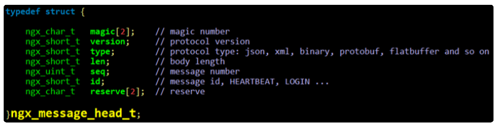
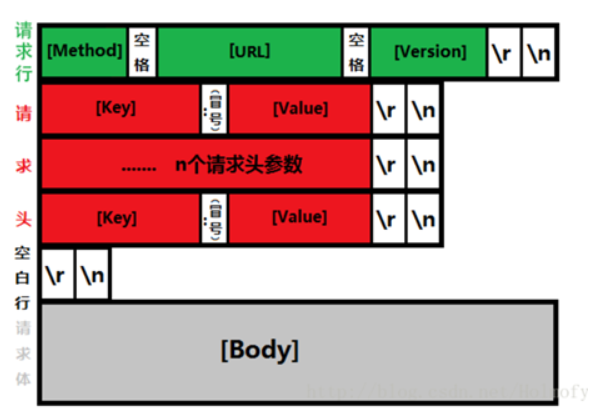
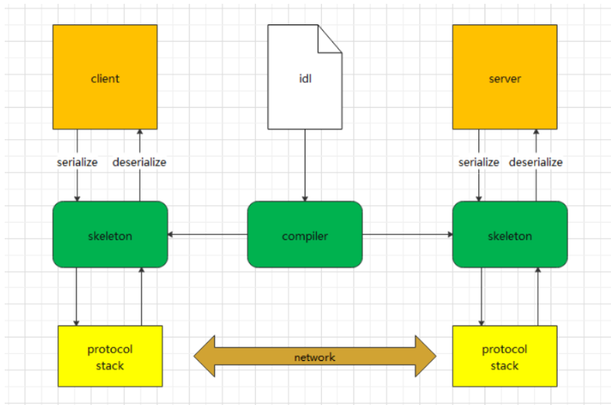

# 协议设计和最佳协议格式protobuf

## 协议设计

### 协议介绍

协议是一种约定，通过约定，不同的进程可以对一段数据产生相同的理解，从而可以相互协作，存在进程间通信的程序就一定需要协议。如果我们两端进行通信没有约定好协议，那彼此是不知道对方发送的数据是什么意义。

协议设计的目标：

1. 解析效率：互联网业务具有高并发的特点，解析效率决定了使用协议的CPU成本。
2. 编码⻓度：信息编码出来的⻓度，编码⻓度决定了使用协议的网络带宽及存储成本。
3. 易于实现：互联网业务需要一个轻量级的协议，而不是大而全的。
4. 可读性：编码后的数据的可读性决定了使用协议的调试及维护成本（不同的序列化协议是有不同的应用的场景）例如 json、xml的协议等 文本格式的协议可以打印出来。
5. 兼容性: 互联网的需求具有灵活多变的特点，协议会经常升级，使用协议的双方是否可以独立升级协议、增减协议中的字段是非常重要的。
6. 跨平台跨语言：互联网的的业务涉及到不同的平台和语言，比如Linux用C++，Android用Java，Web用Js，IOS用object-c。
7. 安全可靠：防止数据被破解。

协议设计最核心的俩个点是解析效率和可拓展可升级。在设计协议时，需要考虑的细节有帧完整性判断、序列化和反序列化、协议升级、协议安全和数据压缩。

### 协议设计之消息完整性

协议的设计首先需要考虑的就是消息的完整性。如何区分不同的两条消息，就需要有消息的边界，为了能让对端知道如何给消息帧分界，目前一般有以下做法：

1. 以固定大小字节数目来分界，如每个消息100个字节，对端每收⻬100个字节，就当成一个消息来解析。（使用场景很少）
2. 以特定符号来分界，如每个消息都以特定的字符来结尾（如\r\n），当在字节流中读取到该字符时，则表明上一个消息到此为止。
3. 固定消息头+消息体结构，这种结构中一般消息头部分是一个固定字节⻓度的结构，并且消息头中会有一个特定的字段指定消息体的大小。收消息时，**先接收固定字节数的头部**，解出这个消息完整⻓度，按此⻓度接收消息体。这是目前各种网络应用用的最多的一种消息格式。（如TCP、UDP、IP协议）
4. 在序列化后的buffer前面增加一个字符流的头部，其中有个字段存储消息总⻓度，然后根据特殊字符（比如根据\n或者\0）判断头部的完整性。这样通常比3要麻烦一些，在收消息的时候，先判断已收到的数据中是否包含结束符，收到结束符后解析消息头，解出这个消息完整⻓度，按此⻓度接收消息体。（如 HTTP和REDIS采用的是这种方式）

### 协议设计常用例子

> 协议通常需要考虑版本升级，通过版本号辨别不同类型的协议。如果支持协议头部可扩展，就需要在设计协议头部的时候有一个字段用来指明头部的⻓度。

#### 即时通讯协议设计

| 字段       | 类型     | 长度 | 说明                                             |
| ---------- | -------- | ---- | ------------------------------------------------ |
| length     | uint32_t | 4    | 整个消息的⻓度包括   协议头 +   BODY             |
| version    | uint16_t | 2    | 通信协议的版本号                                 |
| appid      | uint16_t | 2    | 对外SDK提供服务时，用来识别不同的客户            |
| service_id | uint16_t | 2    | 对应命令的分组类，比如登录类，媒体类消息         |
| command_id | uint16_t | 2    | 分组里面的子命令，具体的消息号                   |
| seq_num    | uint16_t | 2    | 消息序号，校验消息是否发送成功，保证业务的可靠性 |
| reserve    | uint16_t | 2    | 预留字节                                         |
| body       | uint8 *  | n    | 具体的协议数据                                   |

#### 服务器节点协议设计

| 字段     | 类型     | 长度 | 说明                                                         |
| -------- | -------- | ---- | ------------------------------------------------------------ |
| STAG     | uint16_t | 2    | 通信协议数据包的开始标志 ，如0xfffe，h264 0001               |
| version  | uint16_t | 2    | 信协议的版本号，如目前为0x01                                 |
| checksum | uint8    | 1    | 计算协议数据校验和，如果为加密数据，则计算密文校验和。       |
| type     | uint8    | 1    | 0表示协议体是json格式，1表示xml，2表示protobuf               |
| seqno    | uint8    | 4    | 通信数据报文的序列号，应答报文序列号必须与请求报文序列号相同 |
| Length   | uint32_t | 4    | 报文内容⻓度，即从该字段后报文内容⻓度                       |
| reserve  | uint32_t | 4    | 预留字节                                                     |
| body     | uint8 *  | n    | 消息内存                                                     |

#### Nginx协议设计



#### Http协议设计



> HTTP协议是我们最常⻅的协议，HTTP协议只是一个框架，没有指定Body的序列化方式，所以还需要配合其他序列化的方式使用才能传递业务逻辑数据；并且HTTP协议解析效率低，而且比较复杂，不易解析。常用http协议的场景有对公网用户api，HTTP协议的穿透性最好，所以最适合、 效率要求没那么高的场景、希望提供更多人熟悉的接口，比如知乎提供的开放接口。

#### Redis协议设计

Redi协议的基本原理是：先发送一个字符串表示参数个数，然后再逐个发送参数，每个参数发送的时候，先发送一个字符串表示参数的数据⻓度，再发送参数的内容。

数据的类型通过它的第一个字节进行判断：

- 单行(Simple Strings)回复：回复的第一个字节是 "+"
- 错误(Errors)信息：回复的第一个字节是 "-"
- 整形数字(Integers)：回复的第一个字节是 ":" 
- 多行字符串(Bulk Strings)：回复的第一个字节是 "$"
- 数组(Arrays)：回复的第一个字节是 "*" 

协议的不同部分始终以“\r\n”（CRLF）结束。

## 协议体的序列化

协议传输的body内容，也需要有格式才能被双方正确解析。就需要把一个结构体（对象）转换为字节流进行传输，然后对方收到字节流后转为正确的结构体（对象），这就是序列化和反序列化。序列化的方法有以下几种：

1. TLV编码及其变体(TLV是tag, length和value的缩写)比如Protobuf。
2. 文本流编码：比如XML/JSON。
3. 固定结构编码： 基本原理是，协议约定了传输字段类型和字段含义，和TLV的方式类似，但是没有了tag和len，只有value，比如TCP/IP。
4. 内存dump：基本原理是，把内存中的数据直接输出，不做任何序列化操作。反序列化的时候，直接还原内存。

> 文本存储可以 printf 打印观察，二进制使用printf打印后乱码。

主流序列化协议：xml、json、protobuf。

- XML指可扩展标记语言（eXtensible Markup Language）。是一种通用和重量级的数据交换格式，以文本方式存储。
- JSON(JavaScript ObjectNotation) 是一种通用和轻量级的数据交换格式，以文本结构进行存储。（最方便调试）
- protocol buffer是Google的一种独立和轻量级的数据交换格式，以二进制结构进行存储，需要编译器，生成对应语言的代码。

> 协议体如果有安全需求，可以使用AES、openssl等算法进行加密，如果传输的是文本，可以考虑做压缩（deflate），而二进制（图片、视频）压缩没太多意义。

### 序列化和反序列化对比

处理器：Intel(R) Core(TM) i5-8250U CPU @ 1.60GHz

内存：8G

系统：虚拟机ubuntu 18.04 

#### JSON对比

进行**测试10万次序列化**

|库|默认|-O1|-O2|序列化后字节 |
|-|-|-|-|-|
|cJSON|488ms|452ms|367ms|297|
|jsoncpp|871ms|709ms|670ms|255|
|rapidjson|701ms|113ms|67ms|239|

进行**测试10万次反序列化**

|库|默认|-O1|-O2|
|-|-|-|-|
|cJSON|284ms|251ms|239ms|
|jsoncpp|786ms|709ms|583ms|
|rapidjson|1288ms|128ms|120ms|

如果开启C++的优化-O1 / -O2 级别, rapidjson提升明显, cjson和jsoncpp提升不明显。

#### 不同序列化格式对比

进行**测试10万次序列化** 

| 库                 | 默认   | -O1   | 序列化后的字节 |
| ------------------ | ------ | ----- | -------------- |
| rapidjson(C++语言) | 701ms  | 113ms | 239            |
| tinyxml2(XML)      | 1383ms | 770ms | 474            |
| protobuf           | 241ms  | 83ms  | 117            |

进行**测试10万次反序列化**

| 库        | 默认   | -O1   |
| --------- | ------ | ----- |
| rapidjson | 1288ms | 128ms |
| tinyxml2  | 1781ms | 953ms |
| protobuf  | 190ms  | 80ms  |

## Protobuf 的定义和使用

Protocol buffers 是一种语言中立，平台无关，可扩展的序列化数据的格式，可用于通信协议，数据存储等。

Protocol buffers 在序列化数据方面，它是灵活的，高效的。相比于 XML 来说，Protocol buffers 更加小巧，更加快速，更加简单。一旦定义了要处理的数据的数据结构之后，就可以利用 Protocol buffers 的代码生成工具生成相关的代码。甚至可以在无需重新部署程序的情况下更新数据结构。只需使用Protobuf 对数据结构进行一次描述，即可利用各种不同语言，或从各种不同数据流中对你的结构化数据轻松读写。



对于序列化协议来说，使用方只需要关注业务对象本身，对IDL的定义。(Interface description language的缩写，指接口描述语言) 然后序列化和反序列化的代码只需要通过工具生成即可。

### potobuf的编译安装

```shell
# 解压
tar zxf protobuf-cpp-xxx.tar.gz
# 编译安装
cd protobuf-cpp-xxx
./configure
make -j
make install
ldconfig
# 显示版本信息
protoc --version
#生成各种语言的版本代码，例如C++
protoc -I=/.proto所在的路径 --cpp_out=/生成.cc和.h代码的路径  /*.proto
# 连接程序时需要链接protobuf库
g++ -std=c++11 -o main xxx.cc -lprotobuf -lpthread -L/usr/local/lib
```

protobuf 编译时，可以配置编译选项，比较重要的是`option optimize_for = LITE_RUNTIME;`，optimize_for是文件级别的选项，Protocol Buffer定义三种优化级别SPEED/CODE_SIZE/LITE_RUNTIME。缺省情况下是SPEED。

- SPEED: 表示生成的代码运行效率高，但是由此生成的代码编译后会占用更多的空间。
- CODE_SIZE: 和SPEED恰恰相反，代码运行效率较低，但是由此生成的代码编译后会占用更少的空间，通常用于资源有限的平台，如Mobile。
- LITE_RUNTIME: 生成的代码执行效率高，同时生成代码编译后的所占用的空间也是非常少。这是以牺牲Protocol Buffer提供的反射功能为代价的。因此我们在C++中链接Protocol Buffer库时仅需链接`libprotobuf-lite`，而非`libprotobuf`。

### protobuf 定义IDL常用的数值类型

下列该表格展示了定义于.proto文件中的类型，以及与之对应的、在自动生成的访问类中定义的类型：

| .proto Type | Note                                                         | C++ Type | Java Type  | Go Type |
| ----------- | ------------------------------------------------------------ | -------- | ---------- | ------- |
| double      |                                                              | double   | double     | float64 |
| float       |                                                              | float    | float      | float32 |
| int32       | 使用变⻓编码，对于负值的效率很低，如果你的域有可能有负值，请使用sint64替代 | int32_t  | int        | int32   |
| uint32      | 使用变⻓编码                                                 | uint32_t | int        | uint32  |
| uint64      | 使用变⻓编码                                                 | uint64_t | long       | uint64  |
| sint32      | 使用变⻓编码，这些编码在负值时比int32高效的多                | int32_t  | int        | int32   |
| sint64      | 使用变⻓编码，有符号的整型值。编码时比通常的int64高效        | int64_t  | long       | int64   |
| fixed32     | 总是4个字节，如果数值总是比总是比2^28大的话，这个类型会比uint32高效 | uint32_t | int        | uint32  |
| fixed64     | 总是8个字节，如果数值总是比总是比2^56大的话，这个类型会比uint64高效 | uint64_t | long       | uint64  |
| sfixed32    | 总是4个字节                                                  | int32_t  | int        | int32   |
| sfixed64    | 总是8个字节                                                  | int64_t  | long       | int64   |
| bool        |                                                              | bool     | boolean    | bool    |
| string      | 一个字符串必须是UTF-8编码或者7-bit ASCII编码的文本           | string   | String     | string  |
| bytes       | 可能包含任意顺序的字节数据                                   | string   | ByteString | []byte  |

> string 和bytes有专门的字段描述  value 有多少个字节。

### IDL编写proto文件

proto的文件名格式一般使用：项目名.模块名.proto，proto有类似C++的命名空间，一般使用：`package 项目名.模块名` 。可以引用多个文件，使用`import "文件名"` 导入其他已经写好的poroto文件。

一个简单的proto例子“搜索请求”的消息格式，每一个请求含有一个查询字符串、你感兴趣的查询结果所在的页数，以及每一页多少条查询结果。可以采用如下的方式来定义消息类型的.proto文件：

```shell
syntax = "proto3";
message SearchRequest {
  string query = 1;
  int32 page_number = 2;
  int32 result_per_page = 3;
}
```

- 文件的第一行指定了你正在使用proto3语法：如果你没有指定这个，编译器会使用proto2。这个指定语法行必须是文件的非空非注释的第一个行。

- SearchRequest消息格式有3个字段，在消息中承载的数据分别对应于每一个字段。其中每个字段都有一个名字和一种类型。

- 字段分配标识号。在消息定义中，每个字段都有唯一的一个数字标识符。这些标识符是用来在消息的二进制格式中识别各个字段的，一旦开始使用就不能够再改变。最小的标识号可以从1开始，最大到2^29 ­-1。

> 注：[1,15]之内的标识号在编码的时候会占用一个字节。[16,2047]之内的标识号则占用2个字节。所以应该为那些频繁出现的消息元素保留 [1,15]之内的标识号。重要：要为将来有可能添加的、频繁出现的标识号预留一些标识号。

定义消息字段时，可以指定字段规则。消息字段修饰符有如下两种：

- singular：一个格式良好的消息应该有0个或者1个这种字段（但是不能超过1个，默认为singular）
- repeated：在一个格式良好的消息中，这种字段可以重复任意多次（包括0次）。重复的值的顺序会被保留。通常用于数组。

定义proto时另外两个常用的标识符是enum和oneof

- enum，枚举。在需要定义一个消息类型的时候，可可能想为一个字段指定某“预定义值序列”中的一个值。

- Oneof：可选字段。如果消息中有很多可选字段， 并且同时至多一个字段会被设置， 可以使用oneof特性节省内存。设置oneof会自动清楚其它oneof字段的值. 所以设置多次后，只有最后一次设置的字段有值.(oneof不支持repeated)

```shell
message SampleMessage {
  oneof test_oneof {
    string name = 4;
    SubMessage sub_message = 9;
  }
}
```

```c++
// C++ 使用oneof
SampleMessage message;
message.set_name("name");
CHECK(message.has_name());
message.mutable_sub_message();
CHECK(!message.has_name());
```


### protobuf的使用步骤

1. 使用IDL编写xxx.proto文件，数据的发送端和接收端都需要共用proto文件。
2. 通过proto生成对应语言的代码，如C++、JAVA。
3. 引用头文件.pb.h，编译的时候.pb.cc一起编译。

```c++
// 序列化
obj.SerializeToArray(szData, object);// 到内存
fstream output("file", ios::out | ios::trunc | ios::binary);
obj.SerializeToOstream(&output) // 到文件
// 反序列化
obj.ParseFromArray(data);	// 从内存
fstream input("file", ios::in | ios::binary);
obj.ParseFromIstream(&input) // 从文件
```

