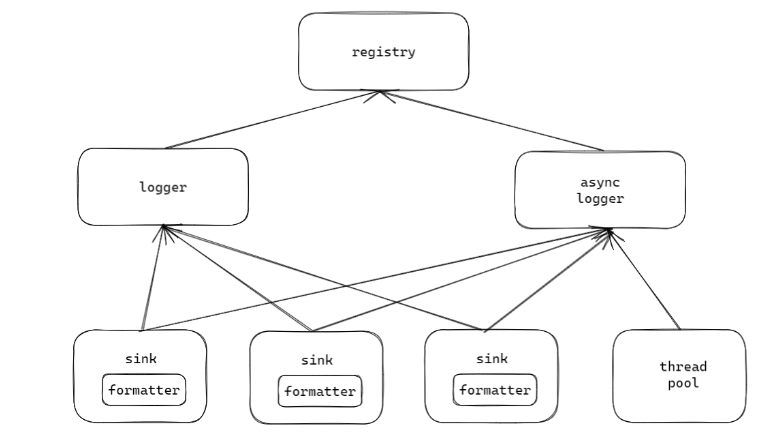
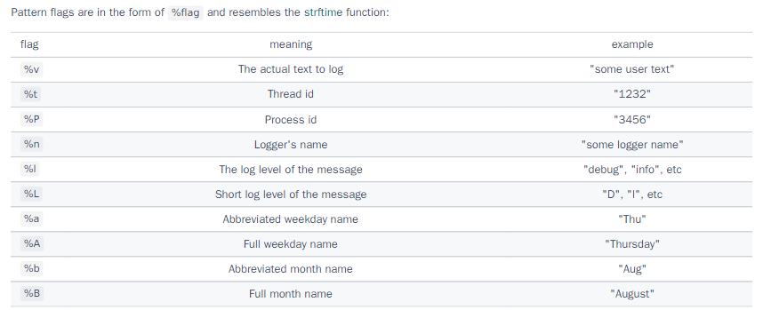

# SPDLOG 日志系统

## 日志的作用

日志在软件开发和维护中扮演着至关重要的角色。它不仅帮助开发者追踪程序运行状态，还能在出现问题时提供宝贵的调试信息。通过日志，我们能够了解软件在特定时间点的行为，分析性能瓶颈，甚至预测潜在的系统故障。日志的重要性不言而喻，它就像是软件世界中的“黑匣子”，记录着程序的每一个细微动作。

## spdlog 日志系统介绍

spdlog 是一款高效的 C++ 日志库，它以其**极高的性能**和零**成本的抽象**而著称。spdlog 支持异步和同步日志记录，提供多种日志级别，并允许用户将日志输出到控制台、文件或自定义的接收器。

```shell
# 项目下载
git clone https://github.com/gabime/spdlog.git
#编译
cd spdlog
mkdir build
cd build
cmake ..
make -j
#安装
sudo make install
```

## spdlog 的优势

spdlog 的设计哲学是尽量减少日志记录的开销，即使在高负载的情况下也能保持高性能。它通过以下几种方式实现这一点：

1. 零成本抽象。spdlog 通过模板和内联函数来实现零成本抽象，确保只有在真正需要时才进行日志记录。
2. 异步日志记录。spdlog 支持异步日志记录，这意味着它可以将日志消息发送到线程池进行处理，从而减少对主线程性能的影响。
3. 高效地格式化。spdlog 使用 fmt 库进行高效的字符串格式化，减少了格式化日志消息所需的时间，比C/C++自带的格式化快**30%**。

spdlog 的性能特点使其在高性能应用中非常受欢迎，spdlog 的优点有：

1. 极高的日志记录速度。spdlog 能够在每秒记录数百万条日志消息，这对于需要处理大量日志数据的应用来说是非常重要的。
2. 低内存占用。spdlog 的设计确保了即使在高负载下，它也能保持低内存占用。
3. 灵活的配置。用户可以根据需要配置 spdlog，选择异步或同步日志记录，以及选择不同的日志级别和输出目标。

spdlog 提供了丰富的输出控制选项，允许用户根据需要定制日志输出：

1. 多种日志级别。 spdlog 支持多种日志级别，包括 trace、debug、info、warn、error 和 critical，用户可以根据需要选择合适的日志级别。
2. 多种输出目标。用户可以将日志输出到控制台、文件或通过网络发送到远程服务器。
3. 格式化输出: spdlog 支持格式化输出，允许用户以结构化的方式输出日志消息。

## spdlog 使用流程

spdlog分为3层，第一层为Registry ，管理所有的日志组件；第二层为logger，负责负责记录日志消息，可以设置为同步或异步；第三层为Sinks ，决定了日志消息的输出位置。其中Sinks 里包含了Formatters ，负责将日志消息转换为特定格式。



> 同步日志和异步日志的区别在于，同步日志会使用当前线程的资源进行日志大于；异步日志仅仅发送消息，由线程池里的线程进行实际的日志的记录。

使用异步日志时，默认的消息队列长度是8192，默认的处理消息线程是1个，默认是阻塞的异步，如果队列长度已经写满8192，打印日志的线程（生产者）会被条件变量阻塞，直到日志处理线程（消费者）处理消息队列后，队列不满才能唤醒。

如果异步日志的线程池大于一个线程，就无法保证打印的顺序，无法按照进入消息队列的日志顺序进行打印输出。

- Registry：是一个单例，管理所有的logger，每一个logger都会注册到该单例中，可以通过logger的名字 找到这个唯一的logger。
- logger：实际打印日志的对象，可以设置为同步或异步，异步时需要指定一个线程池，也可以使用默认一个线程的线程池；可以设置日志打印级别、设置flush刷新策略。
- sink：日志接收器。可以绑定到多个logger上，每一个sink对应一种输出目标，例如控制台、文件、kafka等。也可以设置日志级别、设置日志组成格式（时间、文件名、代码行）、设置自定义格式化字符串。

## spdlog 使用例子

```c++
#include <chrono>
#include <memory>
#include <spdlog/async.h>
#include <spdlog/async_logger.h>
#include <spdlog/common.h>
#include <spdlog/logger.h>
#include <spdlog/spdlog.h>
#include <spdlog/sinks/stdout_color_sinks.h>
#include <spdlog/sinks/basic_file_sink.h>

class MyFormatterFlag : public spdlog::custom_flag_formatter
{
public:
    void format(const spdlog::details::log_msg &, const std::tm &, spdlog::memory_buf_t &dest) override
    {
        std::string userTxt = "yangshuangxin-flag";
        dest.append(userTxt.data(), userTxt.data() + userTxt.size());
    }
    std::unique_ptr<custom_flag_formatter> clone() const override
    {
        return spdlog::details::make_unique<MyFormatterFlag>();
    }
};

int main() {
    // 默认的logger，多线程异步打印到控制台
    spdlog::info("hello world !");
    // 第一种方式，使用工厂模式创建异步async_factory的控制台logger（工厂模式创建默认创建同步的），有默认的shink
    auto logger = spdlog::stdout_color_mt<spdlog::async_factory>("console");
    logger->info("hello world yangshuangxin!!");
    // 使用名字获取到logger
    spdlog::get("console")->info("hello world yangshuangxin !!!");
/* ********************************************************************************** */
    // 创建两个sink 日志接收器，打印到控制台和文件中
    auto sink1 = std::make_shared<spdlog::sinks::stdout_color_sink_mt>();
    auto sink2 = std::make_shared<spdlog::sinks::basic_file_sink_mt>("yangshuangxin.txt");

    // 创建sink的格式化器
    auto formatter = std::make_unique<spdlog::pattern_formatter>();
    // sink1 创建自定义的格式化字符打印，设置打印模式
    formatter->add_flag<MyFormatterFlag>('*').set_pattern("[%n] [%*] [%^%l%$] %v");
    sink1->set_formatter(std::move(formatter));

    // 设置sink2打印模式
    sink2->set_pattern("[%^%l%$] %v");
    // 第二种创建方式，不使用工厂模式，直接make_shared创建logger的对象
    auto logger1 = std::make_shared<spdlog::logger>(std::string("yangshuangin_logger"));
    // 设置logger的sink日志接收器
    logger1->sinks().push_back(sink1);
    logger1->sinks().push_back(sink2);
    // 进行注册到registry
    spdlog::register_logger(logger1);

    spdlog::get("yangshuangin_logger")->info("hello world too too too!!!!");


    // 默认携带文件名和行号的宏
    SPDLOG_INFO("hello mark too!");
    SPDLOG_LOGGER_INFO(spdlog::get("yangshuangin_logger"), "hello mark too too !!!");

/* ********************************************************************************** */

    // 第三种创建方式，使用create_async创建异步logger
    auto logger_yangshuangxin = spdlog::create_async<spdlog::sinks::basic_file_sink_mt>("yangshuangxin", "yangshuangxin2.txt");
    logger_yangshuangxin->info("hello logger_mark");

/* ********************************************************************************** */
    // 创建异步logger时，指定消息队列、线程池
    spdlog::init_thread_pool(8292, 8);
    std::vector<spdlog::sink_ptr> sinks;
    sinks.push_back(sink1);
    sinks.push_back(sink2);
    auto logger_xin = std::make_shared<spdlog::async_logger>("xin", sinks.begin(), sinks.end(), spdlog::thread_pool(), spdlog::async_overflow_policy::overrun_oldest);

    logger_xin->info("hello thread pool");

    // 手动刷新
    logger_xin->flush();
    // err日志触发刷新
    logger_xin->flush_on(spdlog::level::err);
    // 定时时间5秒刷新
    spdlog::flush_every(std::chrono::seconds(5));

    return 0;
}
```

## Pattern flags



