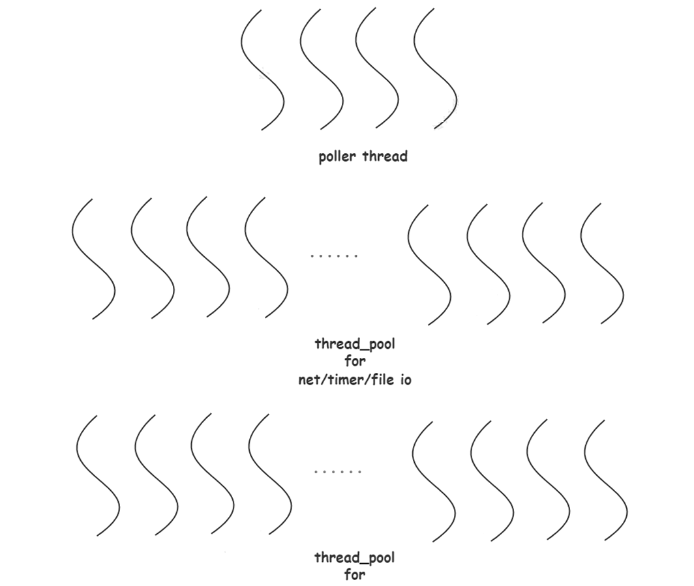

# Workflow的介绍和架构

## Workflow的介绍

workflow是搜狗公司C++服务器引擎，编程范式。workflow支撑搜狗几乎所有后端 C++在线服务，包括所有搜索服务，云输入法，在线广告等，每日处理数百亿请求。这是一个设计轻盈优雅的企业级程序引擎，可以满足**大多数后端**与**嵌入式**开发需求。

workflow的特征有：

1. 快速搭建 http 服务器。
2. 可异步访问常见第三方服务：http，redis，mysql 和  kafka。
3. 构建异步任务流，支持常用的串并联，也支持更加复杂的 DAG结构。
4. 作为并行计算工具使用。除了网络任务，也包含计算任务的调度。所有类型的任务都可以放入同一个流中。
5. 在Linux系统下作为文件异步IO工具使用，性能超过任何标准调用。磁盘IO也是一种任务。
6. 实现任何计算与通讯关系非常复杂的高性能高并发的后端服务。

### Workflow的应用场景

#### 高扇出场景

高扇出是指一个节点与许多其他节点存在大量连接的情况。高扇出的痛点：吞吐与长尾；提升吞吐需要提高单个请求的响应速度，所以需要尽量少切换网络收发线程，但是不切换容易导致处理的慢的资源堆积，长尾问题就很明显。搜索服务一般都是高扇出场景，它需要调用许多下游模块多，考验网络通信框架的调度能力。

#### 多 client 混用场景

同时访问 redis/mysql/kafka 的数据管理需求。workflow 实现了常见的网络协议，不同协议的任务可以在底层调度层无 缝打通。

#### SRPC

业务层协议 IDL 使用了 protobuf，需要对里边定义的  service 支持简单的计算功能，同 时支持可以异步执行，如何能够快速搭建这样的服务？

使用workflow，基于Workflow做底层调度的生态项目，拥有Workflow的网络性能优势，且自生成service  接口，因此可以让 service 接口底层打通 Workflow 底层的 异步 server 功能。

#### 自定义协议接入

场景：公网接入网需要 http 协议，但是后端服务是自定义 私有协议，接入层需要自己开发。

常见的办法是使用 nginx，开发 ngx_module_t，但 nginx  的网络有 11 个阶段，内部资源纯自行管理，模块代码与框架代码完全耦合到一起，开发起来非常困难，出了问题也很难排查。

使用workflow，workflow 可以派生基本网络层，实现消息的序列化/反序列 化接口，即得到自定义协议的任务。然后启动 http server， 创建自定义任务，再利用workflow的转发功能，即可得 到一个自定义协议接入层，转发性能无损耗

#### 其他领域

嵌入式领域、服务治理场景（服务发现）

## Workflow的编译安装

使用VSCode进行开发调试，需要安装clangd + CMake + CMake Tools + C/C++ 插件。cmake 通过编译时指定设置`CMAKE_EXPORT_COMPILE_COMMANDS=ON `来生成compile_commands.json。如果是 Makefile 组织项目代码，需要安装  bear，make 时需要使用 bear make，从而生成 compile_commands.json。

生成 compile_commands.json 的作用是 clangd 需要使用帮助 解析项目的代码从而实现精准跳转。需要设置`--compile-commands-dir = ${workspaceFolder}/build`。在 .vscode 目录下，新建 settings.json

```json
{
"clangd.fallbackFlags": [
 "-I${workspaceFolder}/_include/workflow",
 "-I${workspaceFolder}/_include"
    ],
 "clangd.arguments": [
 "--background-index",
 "--compile-commands-dir=${workspaceFolder}/build.cmake/"
    ],
 "cmake.buildDirectory": "${workspaceFolder}/build.cmake",
 "cmake.buildEnvironment": {"CMAKE_EXPORT_COMPILE_COMMANDS": "ON"}
 }
```

然后下载workflow进行编译安装

```shell
git clone https://github.com/sogou/workflow
cd workflow
make
cd tutorial
make
```

## workflow的架构

workflow 编程范式为程序 = 协议 + 算法 + 任务流。workflow 对程序运行的抽象是任务流，任务流可以增加任务、增加上下文整个流共享，可以设置回调。在WFTaskFactory中定义了基础的任务。

1. 协议。大多数情况下，用户使用的是内置的通用网络协议，例如 http，redis或各种rpc。用户也可以方便的自定义网络协议，只需提供序列化和反序列 化函数，就可以定义出自己的client/server。
2. 算法。在workflow 的设计里，算法是与协议对称的概念。如果说协议的调用是rpc，算法的调用就是一次apc（Async Procedure Call）。workflow 提供了一些通用算法，例如sort，merge，psort， reduce，可以直接使用。与自定义协议相比，自定义算法的使用要常见得多。任何一 次边界清晰的复杂计算，都应该包装成算法。
3. 任务流。任务流就是实际的业务逻辑，就是把开发好的协议与算法放在流程图里使用起来。典型的任务流是一个闭合的串并联图。复杂的业务逻辑，可能是一个非闭合的DAG。任务流图可以直接构建，也可以根据每一步的结果动态生 成。所有任务都是异步执行的。

workflow 中包含五种基础任务：通讯，计算，文件IO，定时器， 计数器。一切任务都由任务工厂产生，用户通过调用接口组织并发结构。 例如串联并联，DAG等。大多数情况下，用户通过任务工厂产生的任务，都隐藏了多个异步过程，但用户并不感知。例如：

- 一次http请求，可能包含许多次异步过程（DNS，重定向），但对用户来讲，就是一次通信任务。
- 文件排序，看起来就是一个算法，但其实包括复杂的文件IO 与CPU计算的交互过程。

如果把业务逻辑想象成用设计好的电子元件搭建电路，那么 每个电子元件内部可能又是一个复杂电路。任务隐藏机制大幅减少了用户需要创建的任务数量和回调深度。任何任务都运行在某个串行流（series）里，共享series上下 文，让异步任务之间数据传递变得简单。

### Workflow的回调和内存管理

在workflow中，一切调用都是异步执行，几乎不存在占着线程等待的操作。提供显式的回调机制。用户清楚自己在写异步程序。workflow通过一套对象生命周期机制，大幅简化异步程序的内存管理。其内存管理为：

1. 任何框架创建的任务，生命周期都是从创建到callback函数运行结束为止。没有泄漏风险。
2. 如果创建了任务之后不想运行，则需要通过dismiss()接口删除。不会泄露。
3. 任务中的数据，例如网络请求的resp，也会随着任务被回收。此时用户可通过 std::move()把需要的数据移走。
4. 项目中不使用任何智能指针来管理内存。代码观感清新。

在workflow中尽量避免用户级别派生，以 std::function封装用户行为，包括：

1. 任何任务的callback。
2. 任何server的process。符合 FaaS（Function as a Service）思想。
3. 一个算法的实现，简单来讲也是一个 std::function。

workflow处理线程如下所示，在网络任务、定时器、文件IO中的耗时等待，都负载均衡交给网络poller线程，当条件满足时，抛出任务给worker线程池。cpu耗时计算抛给go线程池，由go线程池调度。



## 总结

程序 = 协议 + 算法 + 任务流就是workflow解决问题的思路，并且每一个任务都是使用请求回应模式。在任务流中，每一个任务都是大粒度的异步执行，任务隐藏了多个内部的异步执行流。任务封装了网络、定时、文件IO、cpu 者几个基础任务：

1. 在网络任务的服务器端，发起一个获取客户请求的请求，然后处理请求；
2. 在网络任务的客户端，向远端发起请求，然后处理远端响应；
3. 定时任务中，首先发起一个延迟检测的请求（timefd+epoll）,然后处理延迟任务；
4. 在文件IO任务中，首先发起一个IO操作的请求，然后处理IO操作；
5. 在CPU任务中，首先发起执行耗时计算请求，然后处理耗时运算。

workflow将所有的耗时等待，耗时计算都转化为对系统资源的请求和响应。

所有的任务都可以使用串联、并联、DAG进行组织，按照用户的需求进行调度。