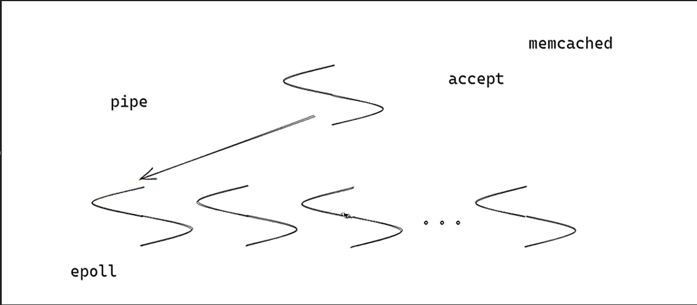
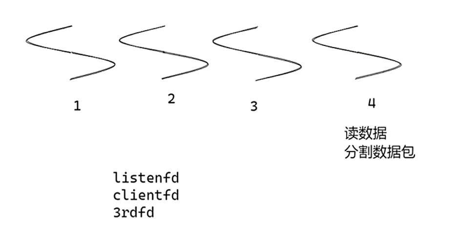
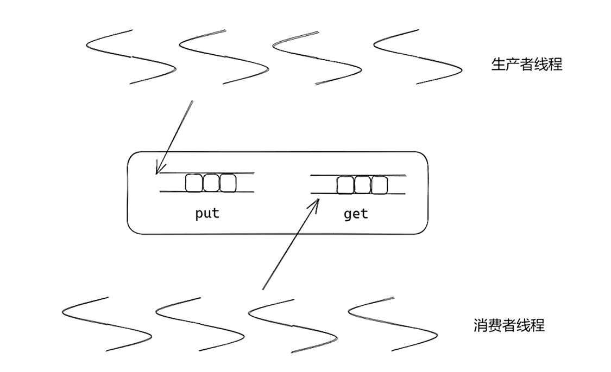
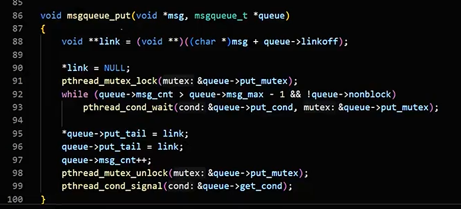
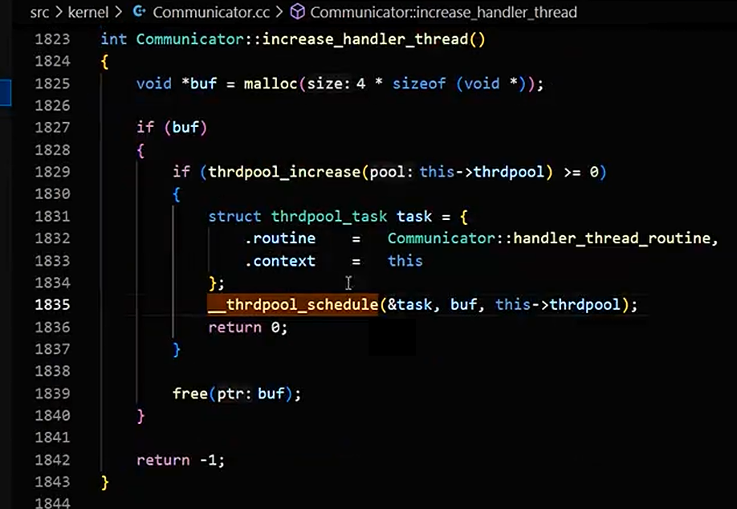

# Workflow的应用

在workflow中，对程序的执行抽象为许多异步任务的执行，通过"三板斧"实现整个框架。第一为抽象粒度合适的异步任务；第二是通过任务流组织任务，可以使用串联、并联和DAG；第三是不阻塞当前线程的异步协调任务。

在协调任务中，使用四种方式进行协调不同的异步任务：

1. counter , 递减的"信号量"；
2. conditional，条件变量；
3. resource pool，资源池，类似于信号量；
4. message queue， 消息队列。

## workflow的网络模块设计

不同于memcached等一般的网络线程设计，memcached的网络线程设计listenfd是一个单独的accept线程，当收到客户端连接后负载均衡使用管道pipe通知epoll线程池中的网络处理线程，网络处理线程进行客户端fd的接收数据、发送数据的管理。



workflow的网络线程把所有的listenfd、clientfd、3rdfd（例如redis的fd，mysql的fd）都负载均衡放入同一个poller网络数据接收线程池，该线程池读取数据并且分割数据包，当接收的数据是完整的数据包时，把数据分发到worker工作线程去处理。



接收数据在poller线程，处理数据在worker线程，这就涉及线程安全问题。epoll的3个系统调用epoll_create、epoll_wait、epoll_ctl，系统调用都是线程安全的，poller线程无论是epoll_wait还是正在处理事件是，worker工作线程都可以使用epoll_ctl对fd进行增加ADD、修改MOD的操作，但是不能直接使用DEL删除操作，只能pipe通知poller线程，由poller线程进行删除操作。

> 其他框架的线程安全解决方案是唤醒epoll_wait，然后在网络线程中执行epoll_ctl，这肯定是线程安全的。

## workflow的队列设计

workflow的队列是多生产者多消费者的模型，使用的有锁队列。

> 无锁队列适用于竞争不那么激烈的时候，并且任务执行时间比较短

workflow的队列有一个put队列和一个get队列，生产者向put队列中存入数据，生产者向get队列中取出数据，只有当get队列为空并且put队列中有数据时，会进行get队列和put队列交换，这样可以减少生产者和消费者线程的碰撞，提高整体的效率。



get队列和put队列，把多对多转换为两个多对一的问题，并且队列中使用把一级指针转换为二级指针的通用性设计，这样可以不限制节点的类型，对节点只有一个约束：节点偏移linkoff字节之后有一个指针用于链接下一个节点。



## workflow的线程池设计

workflow的线程池管理若干个线程，当消息为空时线程阻塞。其特色是线程任务可以由另一个线程任务调用。



## workflow的使用案例

### 计数器

计数器是框架中一种非常重要的基础任务，计数器本质上是一 个不占线程的递减的信号量。计数器主要用于工作流的控制，包括匿名计数器和命名计数器 两种，可以实现非常复杂的业务逻辑。

使用计数器的并行抓取案例，创建一个 ParallelWork 来实现多个 series 并行。

```c++
 void http_callback(WFHttpTask *task)
 {
 /* Save http page. */
    ...
 WFCounterTask *counter = (WFCounterTask *)task->user_data;
 counter->count();
 }
 std::mutex mutex;
 std::condition_variable cond;
 bool finished = false;
 void counter_callback(WFCounterTask *counter)
 {
 mutex.lock();
 finished = true;
 cond.notify_one();
 mutex.unlock();
}
 int main(int argc, char *argv[])
 {
    WFCounterTask *counter = 
create_counter_task(url_count, counter_callback);
    WFHttpTask *task;
    std::string url[url_count];
    /* init urls */
    ...
    for (int i = 0; i < url_count; i++)
    {
        task = create_http_task(url[i], http_callback);
        task->user_data = counter;
        task->start();
    }
    counter->start();
    std::unique_lock<std:mutex> lock(mutex);
    while (!finished)   
        cond.wait(lock);
    lock.unlock();
    return 0;
 }
```

> 匿名计数器的 count 次数不可以超过目标值，否则  counter 可能已经 callback 销毁了，程序行为无定义。

### 资源池

资源池解决以下的问题：

1. 任务运行时需要先从某个池子里获得一个资源。任务运行结 束，则会把资源放回池子，让下一个需要资源的任务运行。
2. 网络通信时需要对某一个或一些通信目标做总的并发度限制，但又不希望占用线程等待（不占用线程等待）。
3. 们有许多随机到达的任务，处在不同的series里。但这些 任务必须串行的运行。

使用资源池的控制并发度的抓取任务例子：

```c++
int fetch_with_max(std::vector<std::string>& url_list, size_t max_p)
{
    WFResourcePool pool(max_p);
    for (std::string& url : url_list)
    {
 		WFHttpTask *task = WFTaskFactory::create_http_task(url, [&pool] (WFHttpTask *task) {
 		pool.post(nullptr);
        });
 	WFConditional *cond = pool.get(task);  // 无需保存res，可以不传resbuf参数。
	cond->start();
    }
    // wait_here...
}
```

### 条件任务

条件任务是一种任务包装器，通过对条件任务发送信号来触发 被包装任务的执行。

```c++
int main()
 {
 WFGoTask *task = WFTaskFactory::create_go_task("test", [](){printf("Done\n"); });
WFConditional *cond = WFTaskFactory::create_conditional(task);
WFTimerTask *timer = WFTaskFactory::create_timer_task(1, 0, [cond]
 (void *){
 cond->signal(NULL);
    });
 timer->start();
 cond->start();
 getchar();
}
```

