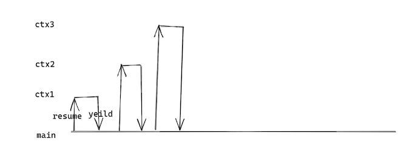

# 协程的原理和实现

## 协程的原因

​	在两个对象进行交互时，有同步和异步两种方式。同步会一直等待直到对方放回数据；异步会提供一个回调函数，当对方的数据放回时，自动调用回调函数进行处理。协程的目标就是**使用同步的编程方式**，**实现高效的异步的性能**。

## 同步和异步

​	在进行两个对象交互的代码编写时，可以使用同步和异步的方式。

​	比如：客户端向服务器请求数据，客户端如果使用**同步方式**，只有等一个请求发送，接收到服务器的数据后，才能继续发送第二个请求，**串行的处理方式**是十分慢的；客户端使用**异步的方式**，可以不需要等待客户端返回数据，一次性发送大量的请求消息，如果收到服务器的数据就调用回调函数进行处理，这样实现**并行的处理**，可以极大的提高数据处理的效率。

```c++
// 同步的处理
void func () {
    send(fd, buffer);
    recv(fd, buffer);
}
// 异步的处理
void callback() {
    recv(fd, buffer);
}

void func() {
    send(fd, callback);
}
```


​	比如：在服务器端进行网络IO读写时，检测网络IO是否就绪的epoll_wait和读写io的recv/send函数，如果把这两个放到同一个线程进行**同步**的数据处理，效率会比较缓慢，更好的做法是IO处理放入一个线程池中进行**异步**处理，可以提高服务器端的处理效率。

```c++
// 同步的处理
while(true) {
    int nready = epoll_wait();
    for (i = 0; i < nready; i++) {
        recv(event[i].fd, buffer);
        send(event[i].fd, buffer);
    }
}
// 异步的处理
void task_callback(void *args) {
    recv(event[i].fd, buffer);
    send(event[i].fd, buffer);
}

while(true) {
    int nready = epoll_wait();
    for (i = 0; i < nready; i++) {
        task.fd = event[i].fd;
        task.callback = task_callback;
        push_task_to_threadPool(&task);
    }
}
```


## 协程的实现

​	协程的目标是使用同步的编程方式，实现异步的性能。实现方式就需要在不同的函数之间跳转。

```c++
// 异步的实现方式
void callback() {
    recv(fd, buffer);
}

void func1() {
    send(fd1, callback);
}

void func2() {
     send(fd2, callback);
}

void func3() {
     send(fd3, callback);
}

// 协程的实现方式
void func1() {
    send(fd1, buffer);
    switch(func1, func2);
    recv(fd1, buffer);
}

void func2() {
    send(fd2, buffer);
    switch(func2, func3);
    recv(fd2, buffer);
}

void func3() {
    send(fd3, buffer);
    switch(func3, func1);
    recv(fd3, buffer);
}
```

## 函数的跳转

1. 函数的跳转可以使用setjmp/longjmp进行。

```c++
#include <stdio.h>
#include <setjmp.h>

jmp_buf env;
void func(int arg) {
    printf("func: %d", arg);
    longjmp(env, ++arg);
}

int main() {
    int ret = setjmp(env);
    if (ret == 0) {
        func(ret);
    } else if (ret == 1) {
        func(ret);
    } else if (ret == 2) {
        func(ret);
    }
    return 0;
}
/*
func: 0
func: 1
func: 2
*/
```

2. 函数可以使用ucontext 进行跳转

```c++
#include <stdio.h>
#include <ucontext.h>

ucontext_t ctx[2];
ucontext_t main_ctx;

int count = 0;
void func1(void) {
    while(count++ < 10) {
        printf("1\n");
        swapcontext(&ctx[0], &ctx[1]);
        printf("3\n");
    }
}

void func2(void) {
    printf("2\n");
    swapcontext(&ctx[1], &ctx[0]);
    printf("4\n");
}

int main() {
    char stack1[1024] = {0};
    char stack2[1024] = {0};
    
    getcontext(&ctx[0]);
    ctx[0].uc_stack.ss_sp = stack1;
    ctx[0].uc_stack.ss_size = sizeof(stack1);
    ctx[0].uc_link = &main_ctx;
    makecontext(&ctx[0], func1, 0);
    
    getcontext(&ctx[1]);
    ctx[1].uc_stack.ss_sp = stack2;
    ctx[1].uc_stack.ss_size = sizeof(stack2);
    ctx[1].uc_link = &main_ctx;
    makecontext(&ctx[1], func2, 0);
    
    printf("swap context\n");
    swapcontext(&main_ctx, &ctx[0]);
    printf("end\n");
}
```

## 协程的实现

协程就是利用了函数的跳转，进行同步的编程方式，实现异步的性能，由于使用setjmp/longjmp进行函数跳转时，无法处理函数栈，所以一般使用ucontext 进行函数的跳转。实现时每一个协程都跳回调度器，由调度器对每一个协程进行调度处理。



```c++
#include <stdio.h>
#include <ucontext.h>

ucontext_t ctx[2];
ucontext_t main_ctx;

int count = 0;
// coroutine1 协程1
void func1(void) {
    while(count++ < 10) {
        printf("1\n");
        swapcontext(&ctx[0], &main_ctx);
        printf("3\n");
    }
}

// coroutine2 协程2
void func2(void) {
    printf("2\n");
    swapcontext(&ctx[1], &main_ctx);
    printf("4\n");
}

// 协程调度器schedule
int main() {
    char stack1[1024] = {0};
    char stack2[1024] = {0};
    
    getcontext(&ctx[0]);
    ctx[0].uc_stack.ss_sp = stack1;
    ctx[0].uc_stack.ss_size = sizeof(stack1);
    ctx[0].uc_link = &main_ctx;
    makecontext(&ctx[0], func1, 0);
    
    getcontext(&ctx[1]);
    ctx[1].uc_stack.ss_sp = stack2;
    ctx[1].uc_stack.ss_size = sizeof(stack2);
    ctx[1].uc_link = &main_ctx;
    makecontext(&ctx[1], func2, 0);
    
    printf("swap context\n");
    // 调度协程
    int num = 2; // 协程数量2
    while(count <= 10) {
        swapcontext(&main_ctx, &ctx[count%num]);
    }
    printf("end\n");
}
```


