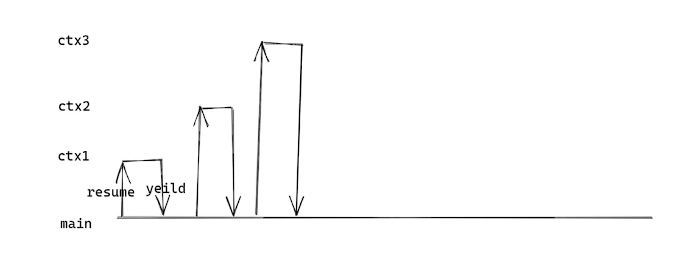

# 协程实现IO的HOOK

对于协程来来说，其原语操作有两个：resume（恢复）和yeild（让出）。通常由调度器切换到协程为resume，由协程切回调度器为yelid。yield是让出CPU，调度器统一选择resume，resume恢复协程的运行权，resume与yield是两个可逆过程的原语操作。



​	在一个网络服务器中，通常最消耗CPU时间的是进行**IO操作**，比如客户端进行注册请求时，服务器端收到客户端请求后，需要操作数据库后才能返回数据给客户端，如果串行处理会导致效率低下，更好的做法是在**IO操作没有就绪**的时候，进行协程的切换yeild 让出处理，在**IO就绪的时候**恢复resume。

## IO操作的协程HOOK

hook操作可以替代系统原有的流程，执行自己自定义的流程。在不改变原有的代码的情况下使用协程进行IO操作的处理，就需要对IO操作的函数进行HOOK。

读写IO的操作一般有4个：recv、send、write、read。

hook系统函数需要使用到dlsym函数，其第一个参数设置为 `RTLD_NEXT` 时，它会返回在当前进程后续动态链接库中首次找到的指定符号（函数或变量）的地址。这意味着可以在自己的动态链接库中寻找并替换或者hook系统函数。

```c++
#define _GNU_SOURCE

#include <dlfcn.h>

#include <stdio.h>
#include <ucontext.h>
#include <string.h>
#include <unistd.h>
#include <fcntl.h>

// hook函数的指针
typedef ssize_t (*read_t)(int fd, void *buf, size_t count);
read_t read_f = NULL;

typedef ssize_t (*write_t)(int fd, const void *buf, size_t count);
write_t write_f = NULL;

// 自定义hook函数
ssize_t read(int fd, void *buf, size_t count) {

	ssize_t ret = read_f(fd, buf, count);
	printf("read: %s\n", (char *)buf);
	return ret;
}

ssize_t write(int fd, const void *buf, size_t count) {

	printf("write: %s\n", (const char *)buf);

	return write_f(fd, buf, count);
}
// 对系统库函数进行hook
void init_hook(void) {

	if (!read_f) {
		read_f = dlsym(RTLD_NEXT, "read");
	}

	
	if (!write_f) {
		write_f = dlsym(RTLD_NEXT, "read");
	}
}

// 调用hook函数
#define MODE (S_IRUSR | S_IWUSR | S_IRGRP | S_IROTH) // 0644权限
int main() {

	init_hook();

	int fd = open("test.txt", O_CREAT | O_RDWR, MODE);
	if (fd < 0) {
		return -1;
	}

	char *str = "hello world!";
	write(fd, str, strlen(str));

	char buffer[128] = {0};
	read(fd, buffer, 128);

	printf("buffer: %s\n", buffer);
    close(fd);
}
```

## 协程的网络IO处理

在使用协程进行网络IO处理时，需要先检测网络IO是否可读，如果可读，就调用系统函数进行读写操作；如果不可读，就需要把该fd加入到检测队列，然后切换协程。

```c++
// hook recv函数
ssize_t recv(fd, buffer, length) {
    // 可以使用poll进行IO检测
    struct pollfd fds[1] = {0};
    fds[0].fd = fd;
    if (0 < poll(fd, 1, 0)) { // 可读
        ret = recv_f(fd, buffer, length); // 调用系统函数
        return ret;
    } else {	// 加入epoll检测队列
        epoll_ctl(epfd, EPOLL_CTL_ADD, fd, &ev);
        swapcontext();// 让出到调度器yeild
    }
    // 读取数据
    ssize_t ret = recv_f(fd, buffer, length);
    return ret;
}
```

## 协程的结构体

1. 定义协程的结构体。对于每一个协程来说，协程的状态有三个：就绪、等待、睡眠；协程的成员变量需要有读写的fd、协程上下文，调度的函数及其参数：

```c++
struct coroutine {
  	int fd;
    ucontext_t ctx; // stack、stack_size、func
    void *arg;
    
    // 保存当前协程的状态
    queue_node(coroutine) read_queue;// 就绪状态，使用队列
    rbtree_node(coroutine) wait_rb; // 等待状态，需要使用红黑树进行查找，key为超时时间
    retree_node(corountine) sleep_rb;// 休眠状态，需要使用红黑树查找，key为睡眠时间
};
```

2. 定义调度器的结构体

```c++
    struct scheduler {
      	int epfd;
        struct epoll_event events[];
        
        queue_node(coroutine) wead_head;// 头节点
        rbtree_node(coroutine) wait_root;//根节点
        retree_node(corountine) sleep_root;// 根节点
    };
    ```

## 协程的IO异步操作

在进行IO操作（recv，send）之前，先执行了 epoll_ctl的del操作，将相应的sockfd从epfd中删除掉，在执行完IO操作（recv，send）再进行epoll_ctl的add的动作。在多个上下文中，这能够保证sockfd只在一个上下文中能够操作IO的。不会出现在多个上下文同时对一个IO进行操作的。协程的IO异步操作正式是采用此模式进行的。

```c++
while (true) {
    int nready = epoll_wait(epfd, events, EVENT_SIZE, -1);

    for (i = 0;i < nready;i ++) {

        int sockfd = events[i].data.fd;
        if (sockfd == listenfd) {
            int connfd = accept(listenfd, xxx, xxxx);
            
            setnonblock(connfd);

            ev.events = EPOLLIN | EPOLLET;
            ev.data.fd = connfd;
            epoll_ctl(epfd, EPOLL_CTL_ADD, connfd, &ev);

        } else {
            
            epoll_ctl(epfd, EPOLL_CTL_DEL, sockfd, NULL);
            recv(sockfd, buffer, length, 0);

            parser_proto(buffer, length);

            send(sockfd, buffer, length, 0);
            epoll_ctl(epfd, EPOLL_CTL_ADD, sockfd, NULL);
        }
    }
}

```

> c协程库：https://github.com/wangbojing/NtyCo

---------

