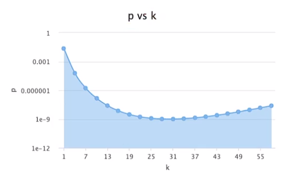

# 哈希/散列表-- 海量数据处理

## 技术场景：

- word文档中，判断单词是否拼写正确
- 网络爬虫，判断是否是相同的网页
- 垃圾邮件的关键词过滤
- 数据库的缓存穿透处理


## 二分查找与哈希的应用

1. 二分查找是有序的，通过**比较**保证有序，每次都可以**排除一半**的元素来快速索引到元素。其增删改查的时间复杂度为O($log_2 N $)，平衡二叉树就是使用的二分查找，平衡就是增散后，下一次搜索也能使用二分查找排除一半的数据。

   > O（$log_2 N$​） 100万个节点，最多比较20次。

   使用二分查找是数据结构一般有：有序数组、平衡二叉搜索树（红黑树）、平衡多路搜索树（B树/B+树）、多层级有序链表（跳表）。

   

2. 哈希是无序的，是通过映射函数`Hash(key) = addr` 把key映射为一个地址。而把两个或以上不同的key映射到同一个地址，就出现了哈希冲突（hash碰撞）。所以选择哈希函数是十分重要的，需要**计算速度快** 、 **强随机分布（等概率均匀的分布在整个地址空间）** 的要求。一般使用的hash函数有 murmurhash1、**murmurhash2**、 murmurhash3、 **siphash** 、**cityhash**等。

   > siphash 主要解决的是字符串相近的强随机分布性，Redis使用。

   哈希的主要应用是哈希表。哈希表是根据key计算出key在表中位置的数据结构。通过key可以映射其所在的存储地址。节点定义如下：

   ```c
   // ky存储在一起
   struct node {
       void *key;
       void *val;
       struct node *next;
   };
   ```

   

> 负载因子：用来形容算列表的存储密度 （数组的存储元素个数  /  数组长度）。一般负载因子越小，冲突越小；负载因子越大，冲突越大。

|  红黑树  |       哈希表       |
| :------: | :----------------: |
|   map    |   unordered_map    |
|   set    |   unordered_set    |
| multimap | unordered_multimap |
| multiset | unordered_multiset |


> STL 中为了实现迭代器，把具体的节点都串成了一个单链表

## Hash冲突处理

- 链表法

  将冲突的元素使用链表连接起来，是最常用的处理方式。但如果冲突元素较多，会导致链表过长，退化为O(n)的时间复杂度。解决方法是把链表转换为红黑树或最小堆的O($log_2 N$)。通常超过**256个** 就需要进行转换。

- 开放寻址法

  将所有的元素放入哈希表中，不需要使用其他的数据结构，使用线性探查的方法解决冲突。当在插入数据时，如果该位置出现了哈希冲突，则加入一定的步长在该位置附近找到可以插入的位置。这可能会导致同类hash聚集问题，可以使用**双重hash** 来解决。

- 负载因子不在合理范围，可以考虑对哈希表进行扩容和缩容，然后对所有的元素进行**rehash** 重新哈希。


## 布隆过滤器

在内存有限的情况下，只需要知道某个key是否存在而不需要知道具体的内容，就可以使用布隆过滤器这种**概率型** 的数据结构。可以高效的插入和查询某个key，确定key**一定不存在**和**可能存在**。

>  布隆过滤器由位图（BIT数组）+ n 个 hash函数构成。

布隆过滤器的插入是通过n个哈希函数，算出key对应的n个位置，并把位图中的该位置设置为1。查询时同样的操作获取n个位置对位图进行检测，如果位图中的位置有0，则一定不存在；如果全是1，则可能存在。

> m % n = m & (n - 1)


> 布隆过滤器是不支持删除的，因为不清楚该槽位的 1 被设置了多少次，也不知道多少key、多少哈希函数映射到这个槽位。


### 布隆过滤器应用场景

用于判断某个Key一定不存在的场景，并且允许判断存在误差的情况。如数据库的缓存穿透问题解决、热key限流。

> 缓存穿透，是指redis、mysql等数据库等都没有数据，攻击者利用此漏洞导致数据库压力过大，以此达成系统瘫痪的目的。

- 如何选择多少hash函数？
- 需要多大空间的位图？
- 预期存储多少元素？
- 如何控制误差？

```
n ----- 预期布隆过滤器中的元素
p ----- 假阳率，0~1之间
m ----- 位图所使用空间
k ----- hash 函数个数

计算公式如下：
n = ceil(m / (-k / log(1 - exp(log(p) / k)));
p = pow(1 - exp(-k / (m / n)), k);
m = ceil((n * log(p))) / log(1 / pow(2, log(2)));
k = round((m / n) * log(2))
```

*确认 n （预期元素个数）和 p（假阳率），通过上面的的运算公式算出m(位图使用空间)和k（hash函数个数）*

n （预期元素个数）越多，P假阳率）越大：


m(位图使用空间)越多，P （假阳率）越小：


**31个** 哈希函数，假阳率越低：




### 多个哈希函数的构建

先选择一个固定的hash函数，然后给hash传递不同的种子作为偏移值，采用线性探寻的方式来构造多个hash函数。

```c
#define MIX_UINT64(v) ((uint32_t)((v>>32) ^ (v)))
uint64_t hash1 = hashFun(key, len, seed);
uint64_t hash2 = hashFun(key, len, MIX_UINT64(hash1));

for (int i = 0; i < k; i++) { // k是 hash函数的个数
    Pos[i] = (hash1 + i * hash2) % m; // 位图的大小
}
```


### 真实场景问题处理

- 只用2GB内存，找出20亿个整数中出现次数最多的数如何解决？

1.  使用哈希表，key存储整数，value存储出现的次数，key是4字节，value也是4个字节，共8个字节。
2. 把29亿个整数的大文件进行拆分，使用hash函数尽量把相同的整数放入同一个文件。
3. 加入分为10个文件，每个文件处理2亿个数据，需要1.6GB的内存，满足需求，依次处理每一个文件，找出最大值。

- 分布式一致性hash增加或者删除节点如何进行数据迁移？

  > 如果n个节点 使用 hash(key) % n，增加和删除节点，都会导致缓存大面积失效。

1. 固定哈希函数，如:  `index =  hash(key) % 2^32` 。

2. 把node节点也进行哈希映射，映射到哈希环上。
3. key映射到哈希环上后，按照顺时针查找，存入最近的node中了。
4. 增加节点时，同样进行节点的hash映射，于是只有局部的缓存失效需要hash迁移。

- 分布式一致性的hash偏移如何解决？

  > 出现hash偏移，原因与哈希函数的概率稳定和样本数量有关。

  1. 增加很多虚拟节点，虚拟节点均匀分布在哈希环上。
  2. 通过虚拟节点，定位到真实的节点，存入数据。
  3. 增加新节点时，需要hash迁移的数量也会变少。

  ```c++
  map<int, string> mm; //有序的红黑树
  virNode = mm.up_bound(hash(key)); // 找到虚拟节点
  node = virNode.substr(0,n); // 找到真实的节点
  ```

  

## 总结

处理海量数据时，需要使用hash的方法，把大文件拆分为小文件，单台机器分流到多台机器进行处理。
