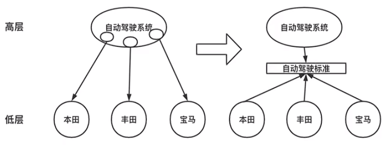
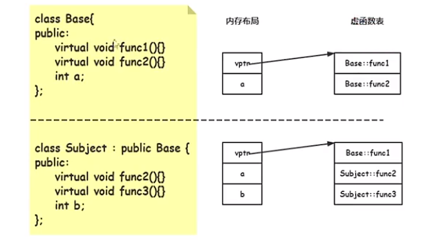
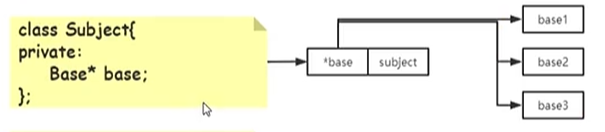

# 设计模式之创建型（模板方法、观察者模式、策略模式）

## 设计模式介绍

1. 什么是设计模式？

   ​	设计模式是在软件开发中，经过长期验证的，用于解决特定环境下，重复出现的特定问题的解决方案。是一种解决问题的思路。

2. 怎么来的设计模式？ 

   ​	满足**面向对象的设计原则**后，逐步迭代出来的。

3. 设计模式解决了哪些问题？什么情况下使用设计模式？

   ​	设计模式解决了软件开发中的具体需求既有**稳定点**，又有**变化点**的问题。（全是稳定点可以使用配置文件；全是变化点如游戏开发，可以选择脚本语言）。期望是修改少量的代码，就可以适应需求的变化。

   > 比喻：设计模式解决的场景就好像在整洁的房间中，有一只好动的猫。设计模式的目的是保证房间的整洁，把好动的猫关进笼子里。

4. 设计模式的基础是什么？

   ​	面向对象的思想。包括了：

   - 封装。隐藏实现细节，实现模块化。
   - 继承。无需修改原有的类，通过继承实现对功能的扩展。
   - 多态。静态多态：函数重载、模板函数；动态多态：继承中虚函数重写。

5. 面向对象的设计原则有哪些？

   - 依赖倒置。具体实现依赖接口。
   - 开闭原则。对扩展开发，对修改封闭。
   - 面向接口编程。对行为进行抽象成接口。
   - 封装变化。使用多态对变化的地方进行封装。
   - 单一职责。函数的职责单一。
   - 里氏替换。子类可以互相替换。
   - 接口隔离。使用方和实现方通过接口进行解耦合。
   - 组合由于继承。优先使用组合。
   - 最小知道原则。只提供必要的接口。

6. 设计原则的核心？

   - 高层模块不依赖底层模块，两者都依赖抽象。

   - 抽象不依赖具体实现，具体实现依赖抽象。

     > 例子：
     >
     > 
     >
     > 自动驾驶是高层模块，汽车生产商为底层模块。
     >
     > 他们不应该互相依赖，一方变动会影响另一方。
     >
     > 抽象一个自动驾驶标准，高层和底层都依赖它，对双方进行隔离，解耦了两方的变动。
     >
     > 高层模块和底层模块都是具体的实现，都依赖标准（抽象）。

     

7. 面向对象的内存结构？

   对象的前面有虚函数指针表，记录了虚函数。

   

## 创建型设计模式之模板方法

​	模板方法是先定义一个操作中的算法的骨架，而将一些步骤延迟到子类中实现。这样可以让子类不改变算法的结构，重新定义算法的某些特定步骤。

​	是最常用的设计模式，子类复写父类的函数，使父类的骨架流程丰富。通常父类`protected` 保护子类需要复写的**虚函数**，子类进行实现后父类来调用。

​	**稳定点**：父类定义的算法骨架。提供骨架流程的接口，子流程为虚函数并且对子类开发。

​	**变化点**：子类的实现。使用多态的方式


### 模板方法使用例子

> ​	动物园中有一套固定的表演流程，但是其中的部分表演子流程可以根据需求的变化，创新的替换、迭代成新的表演流程。

​	使用设计模式之前的代码：

```c++
class ZooShow {
public:
    // 构造函数，指定迭代版本
    ZooShow(int type_ = 0): type(type_) {} 
    // 骨架代码
    void Show() {
        if (show0()) {
            PlayGame();
        }
        show1();
        show2();
    }
private:
    void show1() {
        if (type == 0) {
            cout << "版本0" << endl;
        } else if (type == 1) {
            cout << "版本1" << endl;
        } else {
            return;
        }
    }
    
    void show2() {
        if (type == 0) {
            cout << "版本0" << endl;
        } else if (type == 1) {
            cout << "版本1" << endl;
        } else {
            return;
        }
    }
    void PlayGame() {
        cout << "playing" << endl;
    }
    int type; // 迭代版本
};

// 使用
ZooShow *zoom = new ZooShow(1); // 版本1
zoom->Show();

ZooShow *zoom = new ZooShow(2); // 版本2
zoom->Show();
```

​	**使用设计模式改良的代码**:

1. 实现子类继承基类，复写子流程。
2. 多态方式调用。

```c++
class ZooShow {
public:
    // 构造函数，指定迭代版本
    ZooShow(int type_ = 0): type(type_) {} 
    // 骨架代码
    void Show() {
        if (show0()) {
            PlayGame();
        }
        show1();
        show2();
    }
// 保护模式，虚函数，对子类开放
protected:
    virtual void show1() {
        cout << "原始版本" << endl;
    }
    virtual void show2() {
        cout << "原始版本" << endl;
    }
    virtual void PlayGame() {
        cout << "原始版本" << endl;
    }
};
// 版本1 
class ZooShow1 : public ZooShow {
    void show1() override {
        cout << "版本1 " << endl;
    }
}

// 版本2
class ZooShow2 : public ZooShow {
    void show2() override {
        cout << "版本2 " << endl;
    }
}

// 使用
ZooShow *zoom = new ZooShow1(); // 版本1
zoom->Show();
zoom = new ZooShow2(); // 版本2
zoom->Show();
```

符合的设计原则有：单一职责、开闭、依赖倒置、封装变化、接口隔离、最小知道原则。

## 创建型设计模式之观察者模式

​	观察者模式定义对象间的一种一对多（变化）的依赖关系。当一个对象的状态发生变化时，所有依赖它的对象都可以收到通知并自动更新。

​	观察者模式可以使我们可以独立的改变目标对象和观察者对象，使二者的关系松耦合。观察者对象可以自己决定是否订阅通知，目标对象并不关心谁订阅了。观察者不依赖通知顺序，目标对象也不知道通知顺序。

​	观察者模式常用在事件驱动的UI 框架中，是MVC的组成部分；也常用在分布式系统中、actor框架中。

​	**稳定点**："一" 对 "多" 的依赖关系，"一" 变化，"多" 也跟着变化。

​	**变化点**：观察者对象的增加和减少。

### 观察者模式使用例子

> ​	气象站**定时**发布气象资料给数据中心，数据中心进行处理后，将更新气象信息给多个订阅了该信息的显示终端（A和 B）。


​	使用设计模式之前的代码：

```c++
class WeatherData {
public:
    double getWeatherData() {
        srand(time(nullptr));
        return rand();
    }
};

class DisplayA {
public:
    void Show(float temp) {
        cout << "show A"<< temp << endl;
    }
};

class DisplayB {
public:
    void Show(float temp) {
        cout << "show B" << temp << endl;
    }
};

class DataCenter {
public:
    DataCenter() {
        da = new DisplayA();
    	db = new DisplayB();
    }
    // 数据中心获取气象数据进行计算
    float CalcTemperature() {
        double data = weather.getWeatherData();
        return data % 100.0f;
    }
    // 通知每一个显示端
    void TempNotify() {
        float temper = this.CalcTemperature();
        da->Show(temper);
        db->Show(temper);
    }
private:
    WeatherData weather;
    // 显示终端
    DisplayA *da {nullptr};
    DisplayB *db {nullptr};
};

// 使用
DataCenter *center = new DataCenter();
center->TempNotify()
```

**符合设计模式的改造：**

```c++
class WeatherData {
public:
    double getWeatherData() {
        srand(time(nullptr));
        return rand();
    }
};

class IDisplay{
public:
    virtual void Show(double temperture) = 0;
    virtual ~IDisplay() {}
};

class DisplayA : public IDisplay{
public:
    void Show(float temp) override {
        cout << "show A"<< temp << endl;
    }
};

class DisplayB : public IDisplay{
public:
    void Show(float temp) override {
        cout << "show B" << temp << endl;
    }
};

class DataCenter {
public:
    void Attach (IDisplay *ob) {
        obs.emplace(ob);
    }
    
    void Deach (IDisplay *ob) {
        obs.erase(ob);
    }
    // 数据中心获取气象数据进行计算
    float CalcTemperature() {
        double data = weather.getWeatherData();
        return data % 100.0f;
    }
    // 通知每一个显示端
    void TempNotify() {
        float temper = this.CalcTemperature();
        for (auto iter : obs) {
            iter->Show(temper);
        }
    }
private:
    WeatherData weather;
    // 显示终端
    std::set<IDisplay* > obs;
};

// 使用方法：
DataCenter *center = new DataCenter();

IDisplay *da = new DisplayA();
center->attach(da);

IDisplay *db = new DisplayB();
center->attach(db);

center->TempNotify();
```

**开放封闭原则**：一个类应该对扩展（组合和继承）开发，对修改封闭。

> ​	修改之前的**DataCenter** 类每次增加新的观察者对象，都需要修改**DataCenter** 类。

**面向接口编程**：

- 不将变量类型申明为某个特定的具体类，而是申明为某个接口。
- 客户端程序无需获知对象的具体类型，只需要知道对象所具有的接口。
- 减少系统中各部分的依赖关系，从而实现"高内聚，松耦合" 的设计。

> ​	修改后的**DataCenter** 类，使用 `std::set<IDisplay* >` 仅仅保存了接口。



**封装变化点**：将稳定点和变化点分离，可以扩展变化点。让稳定点和变化点实现层次分离。

> ​	修改后的封装了变化点，提供**attach**和 **detach** 方法用于扩展，扩展只需要继承实现接口，调用这两个方法。


## 创建型设计模式之策略模式

​	测试模式定义了一系列**算法**，把它们一个个的封装起来，并且使它们可以互相替换。算法可独立于它的客户端程序进行变化。

​	提供一系列可重用的算法，从而可以使类型在运行时方便的根据需要各个算法之间切换。该模式消除了条件判断语句，从而让类解耦合。

**稳定点：** 客户端程序与算法的调用关系。

**变化点：** 新增、修改算法内容。


### 使用策略模式的例子

> 某网店在节假日有固定的促销活动，为了加大促销活动，提高国庆节的打折力度。


使用设计模式之前的代码：

```c++
enum VacationEnum{
    Spring,
    Qixi,
    Wuyi,
    Guoqing
};

class Promotion {
    VacationEnum vac;
public:
    Promotion(VacationEnum vac_): vac(vac_){}
    
    double CalcPromotion() {
        if (vac == Spring) {
            // 春节
        } else if (vac == Qixi) {
            // 七夕
        } else if (vac == Wuyi) {
            // 五一
        } else if (vac == Guoqing) {
            // 国庆
        }
    }
};

// 使用
Promotion p = new Promotion(Guoqing);
p->CalcPromotion();
```

**使用设计模式改造：**

```c++
class Context {
    // 计算需要的参数
};

class Prostrategy {
public:
    virtual double CalcPro(const Context &ctx) = 0;
    virtual ~Prostrategy();
};

class VAC_Spring: public Prostrategy {
public:
    double CalcPro(const Context &ctx) override {
        // 春节计算
    }
};

class VAC_Qixi: public Prostrategy {
public:
    double CalcPro(const Context &ctx) override {
        // 七夕计算
    }
};

class VAC_Wuyi: public Prostrategy {
public:
    double CalcPro(const Context &ctx) override {
        // 五一计算
    }
};

class VAC_Guoqing: public Prostrategy {
public:
    double CalcPro(const Context &ctx) override {
        // 国庆计算
    }
};

class Promotion {
public:
    Promotion(Prostrategy *s_): s(s_) {}
    
    double CalcPromotion(const Context &ctx) {
        return s->CalcPro(ctx);
    }
private:
    Prostrategy s;
};

// 使用方式
Context ctx;
Prostrategy *s = new VAC_Guoqing();
Promotion *p = new Promotion(s);
p->CalcPromotion(ctx);
```

设计原则：接口隔离原则、面向接口编程、开闭原则。

## 总结

​	设计模式对于**稳定点**，使用抽象进行解决；对于**变化点**，使用拓展（继承和组合）进行解决。
